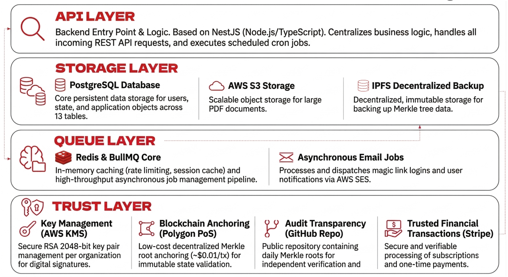
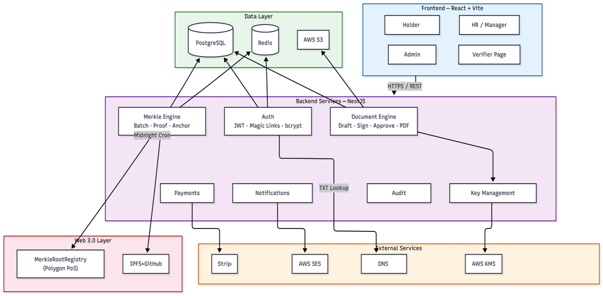

# CareerVault

A **Web 2.5 career-document verification platform** — organizations issue cryptographically signed, dual-approved career documents (experience letters, salary proofs, recommendations); employees hold them in a lifelong wallet; anyone can verify authenticity in seconds via a six-step cryptographic check, with daily Merkle roots anchored on a public ledger for tamper-evidence.

> Final-year project · KJ Somaiya School of Engineering. Full SRS, system design, and data model live in [`documentation/`](documentation/).

## Monorepo layout
| Path | Stack | Purpose |
|---|---|---|
| [`client/`](client/) | React 19 · Vite · Tailwind 4 · shadcn/ui · RTK Query | Web app — 5 role portals + public verifier |
| [`server/`](server/) | NestJS 11 · Prisma 7 · PostgreSQL + pgvector | API, document lifecycle, crypto, jobs |
| [`ai-service/`](ai-service/) | Python · FastAPI | Skill extraction, embeddings, explainable (SHAP) talent ranking |
| [`contracts/`](contracts/) | Hardhat · Solidity | `AnchorRegistry` — Merkle-root anchoring on Polygon |
| [`e2e/`](e2e/README.md) | Playwright | Browser tests for the whole org → request → sign → issue → verify chain |
| [`tools/verify-credential/`](tools/verify-credential/README.md) | Node · `canonicalize` · `ethers` | Standalone offline verifier for a downloaded credential (imports nothing from `server/`) |

Per-package engineering rules live in each `Claude.md`. Heavy external integrations (KMS, blockchain, payments, email, storage) sit behind swappable adapters — local/mock by default, so the whole stack runs with no cloud accounts.

## Architecture

### Component-level design



### Hybrid web design



These diagrams show the system from two angles: the implementation-oriented component view and the higher-level web/data-flow view. See [`documentation/`](documentation/) for detailed system design and UML assets.

## Prerequisites
- Node.js 20+
- Local **PostgreSQL** (14/16/17) with the **pgvector** extension
  (e.g. `brew install pgvector`, or build from source for an EnterpriseDB install)
- Python 3.11+ (only for `ai-service`)
- Redis (optional; dev falls back to in-memory)

## Setup

### 1. Database
```bash
psql -h localhost -U postgres -d careervault -c "CREATE EXTENSION IF NOT EXISTS vector;"
```

### 2. Server — http://localhost:9900/api/v1 (Swagger at `/api/docs`)
```bash
cd server
cp .env.example .env            # set DATABASE_URL
npm install
npx prisma migrate dev
npx prisma generate
npm run db:seed
npm run start:dev
```

### 3. Client — http://localhost:5173
```bash
cd client
npm install
npm run dev
```

### 4. AI service (optional, Phase 5) — http://localhost:9910
```bash
cd ai-service
python3 -m venv .venv && source .venv/bin/activate
pip install fastapi "uvicorn[standard]" pydantic pydantic-settings
uvicorn app.main:app --reload --port 9910
```

### 5. Contracts (optional)
```bash
cd contracts && npm install && npm test
```

## Tests
```bash
cd server && npm test && npm run test:e2e   # unit + Supertest (needs Postgres)
cd client && npm run lint && npm run build
cd e2e && npm install && npm run install:browsers && npm test
```
The browser suite starts its own API and client on 9901/5273 against a separate
`careervault_e2e` database, so it can run while the dev stack is up and never touches your
data — see [`e2e/README.md`](e2e/README.md).

## Verification & offline proof
A document's authenticity is proven from its **Verifiable Credential**, a standalone JSON-LD payload fetched from `GET /api/v1/documents/:id/credential`. That file embeds everything a third party needs to verify **offline, without CareerVault online**: the
canonical `credentialSubject`, the `proof.salt` and `proof.documentHash` (R4: `SHA-256( JCS(content) ++ salt )`), both RS256 co-signatures, the issuer's public key, and the Merkle proof once anchored.

**Dual signatures are two distinct signed statements, made with one organisation key.** The manager and HR
do *not* sign the bare document hash. RS256 (PKCS#1 v1.5) is deterministic, so that would produce two
byte-identical signatures that prove nothing about who approved what. Each signs a role- and
identity-bound statement:

```
statement = SHA-256( JCS({ v: 1, documentHash, role, memberId }) )
```

- `proof.managerSignature` is over the statement with `role: "MANAGER"` and `proof.signerMemberId`.
- `proof.hrSignature` is over the statement with `role: "HR"` and `proof.approverMemberId`.

Verification recomputes each statement and checks its RS256 signature against `issuer.publicKeyPem`.

**What that proves:** the organisation's key signed two distinct, role-bound statements, MANAGER and
then HR, each naming a membership. **What it doesn't:** both signatures are made with the
organisation's **single custodial key**, not a key per person. Separation of duties is *enforced* by
the application: only the assigned manager can sign, only HR can approve, and the manager who signed
can't also approve. It is *recorded* immutably inside the signed statements. Two independent personal
keys don't prove it; per-member keys are on the roadmap. Bulk issuance signs both statements with the
acting HR member's id.

`proof.statementScheme` in every credential documents this, and `verificationInstructions` spells out
the full offline procedure.

**Document content is server-validated per type** against India-first schemas (experience/relieving
letter, salary certificate with a reconciling CTC breakdown in integer paise, recommender-bound
letter of recommendation). The signed `credentialSubject` is a flat object; the server injects
`schemaVersion`, `issueDate`, and `referenceNumber`, computes salary totals authoritatively, and
normalizes the subject (dropping empty values) *before* hashing so the signed bytes are deterministic.

**Public verification does not disclose private content.** An anonymous `GET /api/v1/verify/hash/:hash`
proves a document is genuine, issued, and unrevoked while withholding salary figures, PAN/UAN, and —
for salary certificates — the holder's name. A holder who deliberately shares a document via a share
link opts into full disclosure for that link. A freshly issued document verifies as
`VERIFIED_PENDING_ANCHOR` (valid, awaiting the daily Merkle batch) and becomes `VERIFIED` once anchored.

**On-chain anchoring.** Issued documents are batched into a SHA-256 Merkle tree: sorted pairs, the
raw document hashes as leaves, and an odd node promoted rather than duplicated. A batch runs on a
midnight (Asia/Kolkata) cron on the worker, or on demand when an org admin clicks **Anchor now** on
the Analytics page (`POST /api/v1/merkle/run`). Only the 32-byte root goes on-chain, via
`anchorRoot(bytes32 root, uint256 count)` on the [`AnchorRegistry`](contracts/contracts/AnchorRegistry.sol)
contract. Each document stores its Merkle proof, and the credential's `anchor` block names the chain,
contract and transaction.

| | |
|---|---|
| Network | Polygon Amoy testnet, chain id `80002` (`BLOCKCHAIN_DRIVER=amoy`) |
| Contract | `<AMOY_REGISTRY_ADDRESS>`, filled in after deployment (`contracts/deployments/amoy.json`) |
| Anchor wallet | `0x955cE8960A1Fb6fCCd9e5F42D81a844dEDf5056e` (it will be the deployer, and so the contract owner and first authorized anchor, once the registry is deployed) |
| Explorer | [amoy.polygonscan.com](https://amoy.polygonscan.com). The verify page links the transaction and the contract; the admin's anchoring card links each batch's transaction. |

The database stays authoritative for revocation (R7):
- an unreachable RPC degrades verification to `VERIFIED_PENDING_ANCHOR`, because the proof is still checked locally, instead of failing it;
- on-chain revocation is recorded fire-and-forget.

`BLOCKCHAIN_DRIVER=local`, the dev default, anchors into a JSON-ledger simulator. Its anchors carry
`chainId: null` and can't be checked independently.

**Offline verifier.** [`tools/verify-credential`](tools/verify-credential/README.md) re-checks a
downloaded credential with its own code; it imports nothing from `server/`:

```bash
cd tools/verify-credential && npm install
node verify-credential.mjs --selftest                     # known-answer vectors, no network
node verify-credential.mjs careervault-credential-<id>.jsonld --explain
node verify-credential.mjs <file> --rpc <amoy-rpc-url> --registry <AMOY_REGISTRY_ADDRESS>
```

It does five things:
1. recomputes the hash;
2. verifies both statements;
3. folds the Merkle proof;
4. checks that `anchor.contractAddress` is CareerVault's pinned registry (`KNOWN_REGISTRIES`, or
   `--registry`; the Amoy pin is filled in at deployment);
5. calls `verifyRoot`/`isRevoked` and confirms the anchoring transaction's `RootAnchored` log.

That proves integrity, the two signatures, Merkle inclusion and on-chain anchoring. It does **not**
prove that the embedded issuer key belongs to the named organisation. The verifier prints the key's
SHA-256 SPKI fingerprint so you can check it out of band. Read its final summary line, not just the
exit code.

> The issued **PDF is a human-readable artifact only** — it shows the document hash in its footer but intentionally does **not** carry the JSON-LD or the salt in its metadata. The salt is kept out of the PDF so it stays portable through the credential file; never rely on PDF metadata for verification. (PDF metadata is used solely to stamp the Merkle anchor for archival once a root is on-chain.) **Note:** this supersedes the older design-doc claim that a PDF alone is independently verifiable — the offline proof is the credential file, not the PDF.

## Data protection
Three layers, each with a different job. Details and evidence are in §4 of
[`documentation/Crypto_Pipeline_Viva_Guide.md`](documentation/Crypto_Pipeline_Viva_Guide.md).

1. **Storage.** Supabase encrypts its disks and backups (AES-256, provider-managed). This is
   transparent to every SQL session, so it protects the media, not the data, from anyone who can query.
2. **Transport.** HTTPS to the client and the API. The API↔Postgres leg uses TLS only if `DATABASE_URL`
   asks for it. Pinning Supabase's CA (`sslmode=verify-full`) and enforcing SSL is a pending deployment step.
3. **Application envelope encryption (R10).** The server encrypts before it writes:
   - Every value written to
     `documents.{content_json, salt, manager_signature, hr_signature, revocation_reason_text}` and
     `document_versions.{content_json, change_summary}` is stored as a `cvenc:v1:…` envelope.
   - Issued PDFs are encrypted on disk the same way.
   - Key hierarchy: `KMS_MASTER_KEY` → HKDF-SHA256 field KEK → a fresh AES-256 data key per row payload →
     AES-256-GCM, with the field name as AAD.
   - `npm run db:audit-encryption` (in `server/`) proves no plaintext remains; it reports any row
     written before R10 as plaintext.
   - **Strict reads.** With `FIELD_ENCRYPTION_STRICT=true`, which `render.yaml` sets for production, a
     non-envelope value in an encrypted column is refused on read instead of being returned as legacy
     plaintext. The Merkle batch also skips any document whose fields don't decrypt or no longer
     recompute its hash. So a row planted directly in the database by someone without the master
     key can't verify or get anchored. That doesn't cover a database writer who grants themselves
     manager and HR memberships and issues through the app, which signs with the real org key
     (viva guide, L15). Dev defaults to `false`, so a database seeded before R10 still reads.

**Plaintext by design:**
- `document_hash`: it's the public lookup key and the Merkle leaf, and it's salted and one-way;
- `signing_public_key_pem`: a public key, pinned per document. Verification trusts it, and strict
  reads are what stop a database writer pairing a swapped key with planted content;
- user emails and names: login looks them up (a blind index is on the roadmap);
- embeddings;
- audit and notification text.

The master key is an environment secret; an AWS KMS driver is on the roadmap.

## Demo accounts
After `npm run db:seed` on your own machine, sign in with password `Password123@`, the local-dev
default. The seed uses `SEED_DEMO_PASSWORD` instead when it is set. The deployed demo is seeded with
a non-public `SEED_DEMO_PASSWORD` that the team shares privately
([deploy runbook](documentation/Deploy_Runbook.md), step 6), so the published password doesn't
open these accounts there.

| Email | Role | Organization |
|---|---|---|
| `admin@techcorp.example.com` | Org Admin | TechCorp |
| `marcus@techcorp.example.com` | Manager | TechCorp |
| `hr@techcorp.example.com` | HR | TechCorp |
| `gabriel@globalsolutions.example.com` | Manager | GlobalSolutions |
| `alice@holder.example.com` | Holder | — |
| `bob@holder.example.com` | Holder | — |

TechCorp and GlobalSolutions are seeded pre-verified. Holders have no org membership (every authenticated user is implicitly a holder).

## Status
Feature-complete across all four packages: auth, org/membership, the full document lifecycle (request → sign → HR approval → issuance → Merkle anchoring → revoke/expire), bulk issuance, public verification, verifier API keys (Bulk API), sharing & payments, subscriptions, notifications & audit logging, recruiter talent matching (AI service, tested and hardened), skills extraction, and analytics. See [`documentation/FeatureAudit.md`](documentation/FeatureAudit.md) for the full route-by-route breakdown.

Partial/upcoming: usage-based Stripe metering for the Bulk Verification API, and a verifier usage/analytics dashboard.
