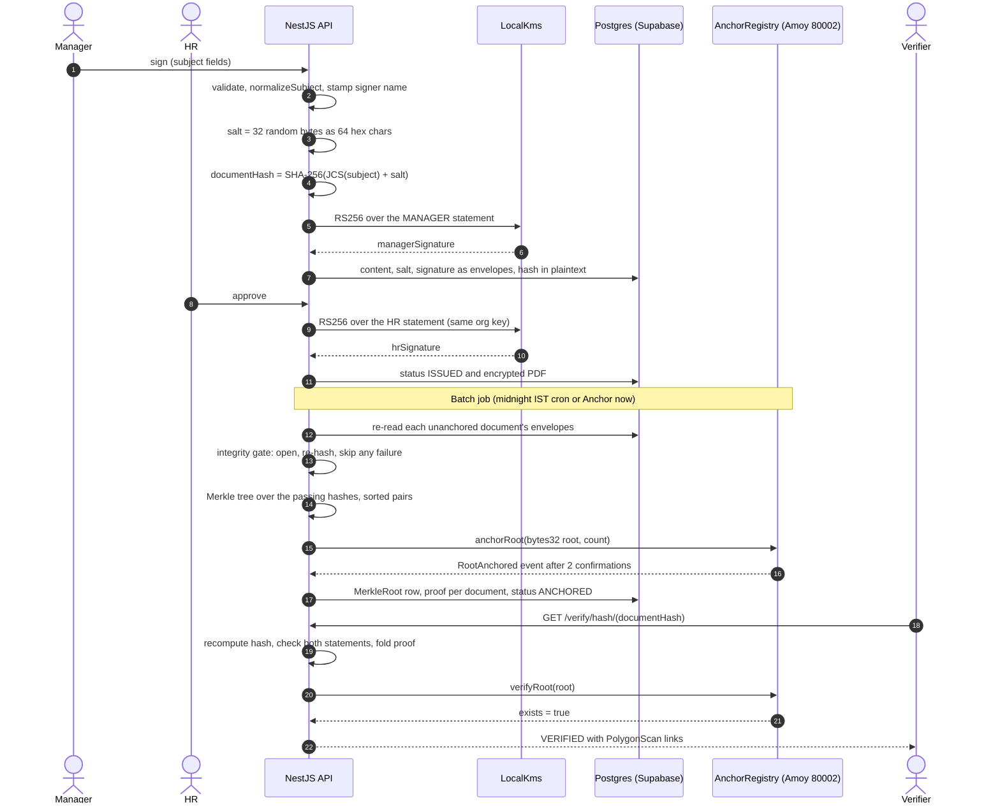
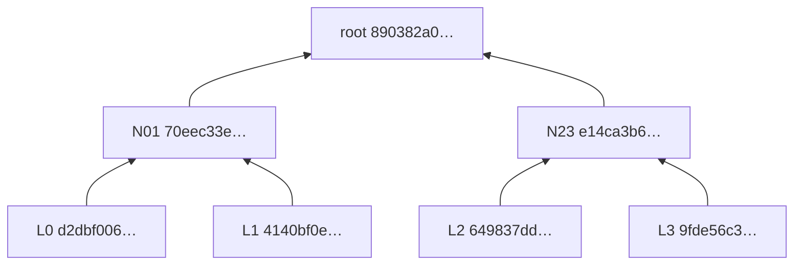
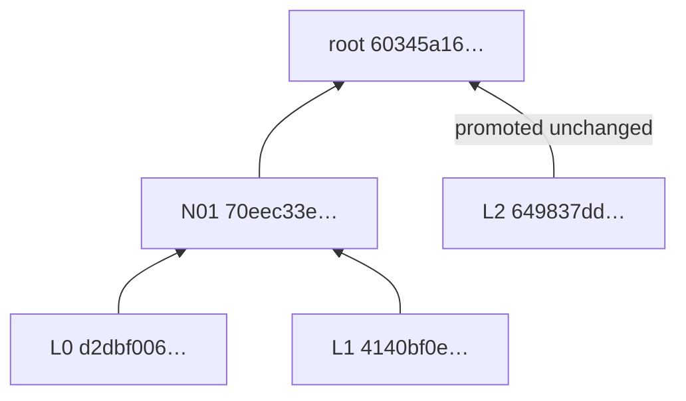
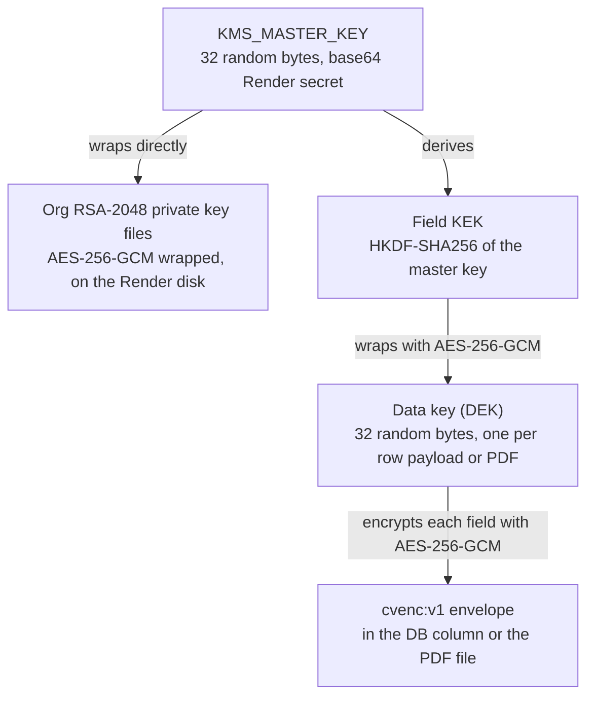

# CareerVault — Crypto Pipeline Viva Guide

> **For:** the four presenters, for the LY final evaluation (demo + viva).
> **Branch:** `ly-final-hardening`. Every `file:line` link points at the code as of commit `400957f`, the end of the final-review fix wave. That wave came after Task 9's strict R10 reads, batch integrity gate and complete GDPR erasure. It fixed unreadable-record handling in public verification, revocation in the offline verifier, recovery of a retried batch's transaction hash, and the seeded demo password. The docs commits after it change no code, so the links still hold.
> **Not deployed yet:** the Polygon Amoy `AnchorRegistry` goes live in a later, human-gated step. Until then, every contract address in this guide reads `<AMOY_REGISTRY_ADDRESS>`. The ordered deploy steps are in [Deploy_Runbook.md](Deploy_Runbook.md); section 10 lists what to fill in after the contract deploy.

**How to use this guide.** Sections 1–3 are the pipeline: learn them until you can say them without looking. Section 4 covers encryption, 5 the design reasons, and 6 the threat model. Section 7 is the question bank. Section 8 lists what we **say honestly before anyone asks**. Section 9 is the demo. Every claim links to the code that makes it true. When a question goes deeper than your answer, open the link.

---

## 0. The 60-second answer

"When a manager signs, the server validates the document, drops empty fields, and canonicalizes the claims with JCS (RFC 8785). It appends a fresh 256-bit random salt, written as 64 hex characters, and SHA-256 of that string is the document hash. The manager doesn't sign that bare hash. They sign a small role statement (the hash, the role `MANAGER`, their membership id) with the organisation's RSA-2048 key. At approval, HR signs a second statement with role `HR`. Both signatures use the same org key: they're two distinct signed records, not two people's keys. A batch job then re-opens every issued document not yet anchored, and puts each hash its stored content and salt still reproduce into a SHA-256 Merkle tree with sorted pairs. It writes only the 32-byte root to our `AnchorRegistry` contract on Polygon Amoy. Each document keeps its Merkle proof. To verify, anyone recomputes the hash, checks both signatures, folds the proof up to the root, and asks the contract whether that root exists. Our server does this, and so does an offline verifier that imports nothing from our code. Separately, the document content, salt, signatures and PDFs are encrypted at the application layer with AES-256-GCM, so a live SQL view shows ciphertext in those columns."

---

## 1. The pipeline, byte-exact

### 1.1 Diagram



### 1.2 Step by step

Signing happens in `DocumentService.sign`, [document.service.ts:148-253](../server/src/modules/document/document.service.ts#L148-L253). Only the manager assigned at request time may sign ([document.service.ts:156-161](../server/src/modules/document/document.service.ts#L156-L161)).

**Step 1: validate and normalize the subject.**
- `validateAndNormalizeSubject` checks the subject against a per-type DTO. `whitelist` and `forbidNonWhitelisted` reject unknown keys.
- It injects `schemaVersion` and `issueDate` (plus `referenceNumber` for experience letters and salary proofs) and recomputes salary totals on the server ([content-validation.ts:59-116](../server/src/modules/document/content-validation.ts#L59-L116)).
- It then calls `normalizeSubject` ([crypto.util.ts:47-70](../server/src/common/utils/crypto.util.ts#L47-L70)). That recursively **drops** `undefined`, `null`, `''`, empty arrays and empty objects, and **keeps** `0` and `false`. Two logically equal subjects, one with `field: null` and one without it, therefore serialize identically.
- Last, `stampSignerIdentity` overwrites the signer-name fields from the logged-in session ([document.service.ts:191](../server/src/modules/document/document.service.ts#L191), [signer-identity.ts:31-40](../server/src/modules/document/signer-identity.ts#L31-L40)). A manager can't sign as a colleague.
- The result is the flat `credentialSubject`. **Only this object is hashed.** The JSON-LD wrapper (`@context`, `issuer`, `proof`, `anchor`) is not.

**Step 2: canonicalize with JCS (RFC 8785).**
- `canonicalizeJson` uses `canonicalize@3.0.0` ([crypto.util.ts:20-26](../server/src/common/utils/crypto.util.ts#L20-L26)).
- Keys are sorted by UTF-16 code unit, numbers are printed in the ECMAScript shortest form (`4.50` becomes `4.5`, `1e30` becomes `1e+30`), and there is no whitespace.

**Step 3: salt.** `generateSalt()` is `randomBytes(32).toString('hex')`. That is **32 random bytes, stored as 64 lowercase hex characters** ([crypto.util.ts:16-18](../server/src/common/utils/crypto.util.ts#L16-L18)).

**Step 4: document hash (R4).**
- `hashDocument` computes `SHA-256( UTF-8( JCS(subject) + saltHex ) )` and outputs lowercase hex ([crypto.util.ts:28-32](../server/src/common/utils/crypto.util.ts#L28-L32)).
- The salt is appended **as its 64 hex characters of text**, not as 32 raw bytes.
- Call sites: [document.service.ts:193-194](../server/src/modules/document/document.service.ts#L193-L194), and bulk issuance at [bulk-issuance.service.ts:303-304](../server/src/modules/bulk-issuance/bulk-issuance.service.ts#L303-L304).

**Step 5: role statements.**
- `signingStatementHash(documentHash, role, memberId)` is `SHA-256(JCS({ v: 1, documentHash, role, memberId }))` in hex ([crypto.util.ts:81-87](../server/src/common/utils/crypto.util.ts#L81-L87)).
- `role` is `"MANAGER"` or `"HR"`. `memberId` is the signer's `organization_members` row id (their membership), not their user id. `v: 1` versions the format.
- JCS sorts the keys, so the signed bytes always look like `{"documentHash":…,"memberId":…,"role":…,"v":1}`.

**Step 6: RS256 signatures.**
- `LocalKmsService.sign` calls `crypto.sign('sha256', Buffer.from(statementHex, 'hex'), orgPrivateKey)` ([local-kms.service.ts:87-96](../server/src/services/key-management/local-kms.service.ts#L87-L96)). The input is the **32 raw bytes** of the statement hash, and the output is base64.
- This is RSASSA-PKCS1-v1_5 with SHA-256, i.e. RS256. The algorithm hashes its 32-byte input once more before the RSA step. The offline verifier does the same ([verify-credential.mjs:58-66](../tools/verify-credential/verify-credential.mjs#L58-L66)).
- The key is the organisation's RSA-2048 key, generated in [local-kms.service.ts:59-76](../server/src/services/key-management/local-kms.service.ts#L59-L76).
- **The manager signs at `sign`** ([document.service.ts:195-201](../server/src/modules/document/document.service.ts#L195-L201)). The same status-guarded transaction stores the signature, the salt, the hash and the signing public key ([document.service.ts:203-240](../server/src/modules/document/document.service.ts#L203-L240)). The public key is pinned per document ([document.service.ts:213-216](../server/src/modules/document/document.service.ts#L213-L216)).
- **HR signs at `approve`** ([document.service.ts:307-312](../server/src/modules/document/document.service.ts#L307-L312)). Before that, `approve` refuses in two cases:
  - if the approving HR person is the manager who signed ([document.service.ts:274-287](../server/src/modules/document/document.service.ts#L274-L287));
  - if the org key changed since the manager signed ([document.service.ts:294-305](../server/src/modules/document/document.service.ts#L294-L305)).
- **Bulk issuance** signs both statements with the acting HR member's id ([bulk-issuance.service.ts:305-315](../server/src/modules/bulk-issuance/bulk-issuance.service.ts#L305-L315)).

**Step 7: batch Merkle tree.**
- `MerkleService.runBatch` ([merkle.service.ts:66-173](../server/src/modules/merkle/merkle.service.ts#L66-L173)) selects documents that are `ISSUED`, have a hash, still have a salt (so an erased document is never a candidate), and have no proof yet ([merkle.service.ts:75-86](../server/src/modules/merkle/merkle.service.ts#L75-L86)). They are ordered by `issuedAt`, then `id`.
- **The integrity gate** runs before any tree is built ([merkle.service.ts:87](../server/src/modules/merkle/merkle.service.ts#L87), [integrity-gate.ts:27-63](../server/src/modules/merkle/integrity-gate.ts#L27-L63)):
  - Each candidate's encrypted fields are re-read through the extended client, where strict mode applies.
  - `hashDocument(content, salt)` must still equal its `documentHash`.
  - A document that fails to decrypt, is refused as plaintext, or no longer matches is **skipped**. It's logged at error level without values and left `ISSUED` and un-anchored, and the rest of the batch goes ahead.
  - The batch result counts it as `skipped`, and says `busy` when another batch was already running. The admin's Anchor now toast words each case, so neither reads as "everything is on-chain" ([merkle.service.ts:27-43](../server/src/modules/merkle/merkle.service.ts#L27-L43), [AnchoringCard.tsx:16-30](../client/src/features/anchoring/components/AnchoringCard.tsx#L16-L30)).
  - Every root is sent by our own wallet, so this gate is what stops our wallet anchoring a planted row (adversary 3).
- `buildMerkleTree` ([merkle.util.ts:14-17](../server/src/common/utils/merkle.util.ts#L14-L17)) uses `merkletreejs@0.6.0` with `sortPairs: true`. Three rules:
  - **Leaves are the raw 32-byte document hashes.** They are not re-hashed; `hashLeaves` defaults to false.
  - Each parent is `SHA-256(min(a,b) ‖ max(a,b))`, with the pair **sorted bytewise**.
  - An odd node at the end of a level is **promoted unchanged, not duplicated**; `duplicateOdd` defaults to false. A single-leaf tree's root is the leaf.
- The batch runs on a midnight Asia/Kolkata cron gated by `WORKER` ([merkle.cron.ts:20-29](../server/src/modules/merkle/merkle.cron.ts#L20-L29)), or when an org admin clicks "Anchor now". That calls `POST /merkle/run`, scoped to the admin's own org ([merkle.controller.ts:22-27](../server/src/modules/merkle/merkle.controller.ts#L22-L27)).
- An in-process flag stops the cron and a manual run overlapping ([merkle.service.ts:48-51](../server/src/modules/merkle/merkle.service.ts#L48-L51)).

**Step 8: anchor on Polygon Amoy.**
- **Idempotency first.** The batch asks the chain whether this root already exists, and only sends a transaction if it doesn't ([merkle.service.ts:98-110](../server/src/modules/merkle/merkle.service.ts#L98-L110)).
- **The call.** `PolygonAnchorService.anchorRoot` hex-encodes the root as `0x…` (`toBytes32`, [anchor-chain.util.ts:102-106](../server/src/services/blockchain/anchor-chain.util.ts#L102-L106)) and calls `anchorRoot(bytes32 rootHash, uint256 documentCount)` ([polygon-anchor.service.ts:90-99](../server/src/services/blockchain/polygon-anchor.service.ts#L90-L99)).
- **What the contract stores.** `{rootHash, documentCount, anchoredAt = block.timestamp, anchoredBy = msg.sender}`. It rejects a zero root or a root that already exists, and emits `RootAnchored` ([AnchorRegistry.sol:79-85](../contracts/contracts/AnchorRegistry.sol#L79-L85)). Only authorized anchors may call it ([AnchorRegistry.sol:59-63](../contracts/contracts/AnchorRegistry.sol#L59-L63)).
- **Fee strategy.**
  - The tip is `max(the RPC's suggested tip, ANCHOR_MIN_PRIORITY_FEE_GWEI = 30 gwei)`.
  - `maxFeePerGas` is `(maxFeePerGas − maxPriorityFeePerGas)` from the RPC, i.e. the base-fee headroom, plus that tip.
  - Both fields are always set ([anchor-chain.util.ts:50-64](../server/src/services/blockchain/anchor-chain.util.ts#L50-L64); defaults at [env.validation.ts:195-200](../server/src/config/env.validation.ts#L195-L200)).
  - Why: ethers falls back to a 1 gwei tip on Amoy, and Polygon PoS nodes reject tips below 25 gwei (Polygon PoS policy at the time of writing; our floor is configurable).
- **One write at a time.** A promise chain serializes writes: one wallet, one nonce sequence. ethers' `NonceManager` is deliberately avoided, because a failed gas estimate would leave a permanent nonce gap ([polygon-anchor.service.ts:23-29](../server/src/services/blockchain/polygon-anchor.service.ts#L23-L29), [polygon-anchor.service.ts:160-193](../server/src/services/blockchain/polygon-anchor.service.ts#L160-L193)).
- **Confirmation loop.**
  - `waitForConfirmations` polls `getTransactionReceipt` every 3 s ([polygon-anchor.service.ts:34-36](../server/src/services/blockchain/polygon-anchor.service.ts#L34-L36)). It returns once `head − receiptBlock + 1 ≥ ANCHOR_CONFIRMATIONS` (default 2), and gives up after `ANCHOR_TX_TIMEOUT_MS` (default 120 s). A failed poll is retried, not thrown ([anchor-chain.util.ts:72-100](../server/src/services/blockchain/anchor-chain.util.ts#L72-L100)).
  - A reverted receipt throws ([polygon-anchor.service.ts:180](../server/src/services/blockchain/polygon-anchor.service.ts#L180)).
  - The adapter remembers every `anchorRoot` transaction it sent ([polygon-anchor.service.ts:160-171](../server/src/services/blockchain/polygon-anchor.service.ts#L160-L171)). If a retry finds the root already on-chain, it records the transaction that actually landed ([polygon-anchor.service.ts:210-220](../server/src/services/blockchain/polygon-anchor.service.ts#L210-L220)).
  - That memory doesn't survive a restart, for example a Render deploy during the confirmation wait. So when the batch finds its root on-chain with no remembered transaction, it looks the transaction up from the root's `RootAnchored` event, scanning from `ANCHOR_REGISTRY_DEPLOY_BLOCK` ([merkle.service.ts:102-110](../server/src/modules/merkle/merkle.service.ts#L102-L110), [polygon-anchor.service.ts:122-144](../server/src/services/blockchain/polygon-anchor.service.ts#L122-L144)). With that setting unset, or the lookup failing, it records no transaction hash and logs a warning. It never scans from block 0. The offline verifier then shows ⚠ for the receipt, not ✗ (1.4).
- **Bounded RPC calls.** Every RPC request times out after 10 s ([anchor-chain.util.ts:23-25](../server/src/services/blockchain/anchor-chain.util.ts#L23-L25)).

**Step 9: store the per-document proof.** A single DB transaction ([merkle.service.ts:112-148](../server/src/modules/merkle/merkle.service.ts#L112-L148)):
- writes one `merkle_roots` row: root, tx hash, block, `chainId`, contract address, count and `anchoredAt`;
- writes one `document_merkle_proofs` row per document: `proofPath` and `leafIndex`;
- flips each document to `ANCHORED`. The status guard means a document revoked in the meantime stays `REVOKED`.

**Step 10: the six-step verification.** See 1.3 for the server and 1.4 for the offline verifier.

### 1.3 The server's six checks (`GET /api/v1/verify/hash/:hash`)

Every check recomputes from scratch. No stored "is valid" flag is trusted ([verification.service.ts:70-72](../server/src/modules/verification/verification.service.ts#L70-L72)). These stored values *are* trusted:
- the document's pinned `signingPublicKeyPem`, a plaintext column;
- the organisation's `publicKeyPem`, also plaintext, as the fallback when a row has no pinned key ([verification.service.ts:383-384](../server/src/modules/verification/verification.service.ts#L383-L384));
- the DB `status` and `revokedAt`, which decide revocation (R7, [verification.service.ts:250](../server/src/modules/verification/verification.service.ts#L250)).

See Q14 for what that means for a tampered database.

| # | Check (`key`) | What it recomputes | Code |
|---|---|---|---|
| 1 | Document on record (`exists`) | Status is `ISSUED`, `ANCHORED`, `REVOKED` or `EXPIRED`. A rejected draft's stale hash doesn't pass. | [verification.service.ts:169-181](../server/src/modules/verification/verification.service.ts#L169-L181) |
| 2 | Content integrity (`integrity`) | `hashDocument(contentJson, salt) === documentHash`. After GDPR erasure, an issued document has no salt and its content is `{}`. The check then fails with "The holder exercised their right to erasure; the original content no longer exists.", and the response carries `erased: true` and no document (Q22). | [verification.service.ts:183-199](../server/src/modules/verification/verification.service.ts#L183-L199), [is-erased.ts:8-23](../server/src/modules/verification/is-erased.ts#L8-L23) |
| 3 | Issuer signature (`issuerSignature`) | RS256 over the MANAGER statement, rebuilt from the stored `signerMemberId`. Checked against the document's pinned `signingPublicKeyPem`, falling back to the org key. | [verification.service.ts:201-217](../server/src/modules/verification/verification.service.ts#L201-L217), [verification.service.ts:371-396](../server/src/modules/verification/verification.service.ts#L371-L396) |
| 4 | Approver signature (`approverSignature`) | The same, with role `HR` and `approverMemberId`. | [verification.service.ts:218-231](../server/src/modules/verification/verification.service.ts#L218-L231) |
| 5 | Blockchain anchor (`anchor`) | First, the Merkle proof must fold to the stored root, checked locally; a bad proof is `fail`. Then `verifyRoot(root)` on-chain: the root must exist, otherwise `fail`. No proof yet, or an unreachable chain, is `pending`. | [anchor-check.ts:42-82](../server/src/modules/verification/anchor-check.ts#L42-L82) |
| 6 | Revocation status (`status`) | DB status and `revokedAt` (authoritative, R7), then `expiresAt`. The on-chain `isRevoked` is only a note, and is skipped when step 5 found the chain down. | [verification.service.ts:247-273](../server/src/modules/verification/verification.service.ts#L247-L273) |

**Verdict** ([verification.service.ts:275-285](../server/src/modules/verification/verification.service.ts#L275-L285)): `REVOKED` wins over `EXPIRED`. Next comes `VERIFIED` (checks 1–4 pass and the anchor passes), then `VERIFIED_PENDING_ANCHOR` (checks 1–4 pass and the anchor is pending), then `INVALID`. An unknown or malformed hash is `NOT_FOUND` ([verification.service.ts:84-102](../server/src/modules/verification/verification.service.ts#L84-L102)). An erased document goes through the same verdict logic, so it reads `INVALID` (or `REVOKED`/`EXPIRED`); `erased: true` is what tells a verifier why.

**A record whose stored fields can't be read** as R10 data also reads `INVALID`, with no document and one integrity check saying so. That covers an envelope that fails authentication (an edited IV, ciphertext or tag), a wrapped data key that fails to unwrap under our own key id, and plaintext that strict mode refuses. It applies to a lookup by hash and to a share link ([verification.service.ts:84-102](../server/src/modules/verification/verification.service.ts#L84-L102), [verification.service.ts:123-141](../server/src/modules/verification/verification.service.ts#L123-L141), [verification.service.ts:422-445](../server/src/modules/verification/verification.service.ts#L422-L445), [field-encryption.extension.ts:45-61](../server/src/prisma/encryption/field-encryption.extension.ts#L45-L61)).
- An envelope naming a **different key id** is what a wrong `KMS_MASTER_KEY` looks like on every row, so it isn't called tampered. The request fails with a 503, `ENCRYPTION_KEY_UNAVAILABLE`, whose message names no key ([http-exception.filter.ts:41-51](../server/src/common/filters/http-exception.filter.ts#L41-L51)). One row edited that way looks the same, which is a denial of service for that record (L16).
- A **bulk request** settles each hash on its own. An unreadable one reads `INVALID`, and one whose lookup throws for any other reason gets an error entry, so the call still answers for the rest ([verification.service.ts:104-121](../server/src/modules/verification/verification.service.ts#L104-L121)).

Every public verification writes a COMPLIANCE-tier audit row ([verification.service.ts:398-420](../server/src/modules/verification/verification.service.ts#L398-L420)). The anonymous view shows only a per-type allow-list of fields. A salary lookup, for example, hides every amount, the PAN/UAN and the holder's name ([verification.service.ts:333-369](../server/src/modules/verification/verification.service.ts#L333-L369), [public-fields.ts:10-60](../server/src/modules/document/public-fields.ts#L10-L60)). For an erased document, the lookup shows nothing about the holder: `document` is `null` and a revocation's free-text reason is withheld ([verification.service.ts:252-253](../server/src/modules/verification/verification.service.ts#L252-L253), [verification.service.ts:290-328](../server/src/modules/verification/verification.service.ts#L290-L328)).

> The design docs list the six steps as "hash, manager signature, HR signature, Merkle proof, on-chain root, revocation". The code folds Merkle proof and on-chain root into check 5, and adds "Document on record" as check 1. State the six **as the code has them** (above).

### 1.4 The offline verifier (`tools/verify-credential`)

It takes the credential file a holder downloads from `GET /api/v1/documents/:id/credential` (built by [credential.builder.ts:42-121](../server/src/modules/document/credential.builder.ts#L42-L121)). The verifier **imports nothing from `server/`** ([verify-credential.mjs:1-8](../tools/verify-credential/verify-credential.mjs#L1-L8)). It prints one ✓/✗/⚠ line per check:

| Line | What it does | Code |
|---|---|---|
| Headline | Prints the claimed `issuer.name` and the **issuer key fingerprint**, SHA-256 of the SPKI DER. | [verify-credential.mjs:68-73](../tools/verify-credential/verify-credential.mjs#L68-L73), [verify-credential.mjs:337-349](../tools/verify-credential/verify-credential.mjs#L337-L349) |
| Integrity | `SHA-256(JCS(credentialSubject) + proof.salt) === proof.documentHash` | [verify-credential.mjs:148-157](../tools/verify-credential/verify-credential.mjs#L148-L157) |
| Manager signature / HR signature | Rebuilds each statement and verifies RS256 under `issuer.publicKeyPem`. The same key verifies both. | [verify-credential.mjs:159-175](../tools/verify-credential/verify-credential.mjs#L159-L175) |
| Revocation | Printed only when the file's own `revocation` block is filled in, which the server does once the document is `REVOKED`. It's then always ✗: a credential that says it was revoked never passes. | [verify-credential.mjs:177-184](../tools/verify-credential/verify-credential.mjs#L177-L184) |
| Merkle | Folds `anchor.proofPath` from the hash with sorted pairs and compares to `anchor.merkleRoot`. **The stored `position` is ignored.** | [verify-credential.mjs:75-86](../tools/verify-credential/verify-credential.mjs#L75-L86), [verify-credential.mjs:186-196](../tools/verify-credential/verify-credential.mjs#L186-L196) |
| Registry | Compares `anchor.contractAddress` to a pin **the script holds** (`KNOWN_REGISTRIES`, or `--registry`), never to the file. On a mismatch it prints ✗ and makes no RPC calls. | [verify-credential.mjs:102-127](../tools/verify-credential/verify-credential.mjs#L102-L127), [verify-credential.mjs:210-222](../tools/verify-credential/verify-credential.mjs#L210-L222) |
| On-chain root | `verifyRoot(0x<root>)` must return `exists`. Prints `anchoredAt` and the on-chain `anchoredBy` address. | [verify-credential.mjs:233-248](../tools/verify-credential/verify-credential.mjs#L233-L248) |
| On-chain revocation | `isRevoked(0x<hash>)`. In a pinned registry a revocation is ✗: only CareerVault's wallet can write that flag and nothing can clear it, so it's conclusive. At an unpinned address it's ⚠, and the summary starts `REVOKED ON-CHAIN`. | [verify-credential.mjs:250-256](../tools/verify-credential/verify-credential.mjs#L250-L256) |
| On-chain receipt | The file's `txHash` must have a receipt containing a `RootAnchored` log for this root **from this contract**. A missing `txHash` is ⚠ once `verifyRoot` has confirmed the root, never ✗ on its own (Step 8). | [verify-credential.mjs:258-277](../tools/verify-credential/verify-credential.mjs#L258-L277) |
| Summary | One sentence saying exactly what this run proved and what it didn't. A revoked credential's summary is `✗ REVOKED … Do not accept it.` | [verify-credential.mjs:283-335](../tools/verify-credential/verify-credential.mjs#L283-L335) |

The exit code is `0` if no line printed ✗ and `1` if any did, counted as the lines are printed ([verify-credential.mjs:131-139](../tools/verify-credential/verify-credential.mjs#L131-L139), [verify-credential.mjs:360](../tools/verify-credential/verify-credential.mjs#L360)). So a revoked credential exits `1`, whether the file says so or the pinned registry does. A missing or invalid `--registry` value is a usage error and exits `2`. A missing credential-file argument prints the usage and exits `1` ([verify-credential.mjs:413-433](../tools/verify-credential/verify-credential.mjs#L413-L433), [verify-credential.mjs:435-439](../tools/verify-credential/verify-credential.mjs#L435-L439)). `--selftest` recomputes every known-answer vector with the verifier's own code ([verify-credential.mjs:367-396](../tools/verify-credential/verify-credential.mjs#L367-L396)). **Always read the summary line, not just the exit code** (see Q20).

---

## 2. Worked example (real known-answer values)

Every value below comes from [`tools/verify-credential/test-vectors.json`](../tools/verify-credential/test-vectors.json), or was derived by running the server's own `crypto.util.ts` and `merkle.util.ts` on those vectors. Both the server's Jest specs and the verifier's `--selftest` reproduce these values byte for byte.

### 2.1 Content → document hash (`pipeline.documentHash[0]`)

| | Value |
|---|---|
| content | `{"holderName":"Ada Lovelace","role":"Engineer","years":3}` |
| JCS(content) | `{"holderName":"Ada Lovelace","role":"Engineer","years":3}` (already key-sorted, no whitespace) |
| salt (64 hex) | `3f9a7c2b1e6d4a8f5c0b9e2d7a1f4c6b8e3d0a5f7c2b9e4d1a6f8c3b0e5d2a7f` |
| **documentHash** | `03d514df97f72b82067128a2c79c3684eb51797447e37da2a7399929a4d09141` |

JCS reordering in action (`pipeline.documentHash[1]`): the input `{"nested":{"a":1,"b":[1,2,3]},"unicode":"café","flag":false,"zero":0}` canonicalizes to `{"flag":false,"nested":{"a":1,"b":[1,2,3]},"unicode":"café","zero":0}`. Only the key order changed: JCS never adds or drops a value. With salt `9c1f6b3e8a2d5c7f0b4e9a1d6c8f3b5e7a0d2c9f4b6e1a8d3c5f7b9e2a4d6c8f` the hash is `4db84be29ab4cc569934cefda9b6cc624970586806936705ec9547883defac05`.

RFC 8785 number vectors (`rfc8785.numbers`): `1e30` → `1e+30`, `4.50` → `4.5`, `2e-3` → `0.002`, `1e-7` → `1e-7`, `-0` → `0`. `rfc8785.keySortingRfc` is the RFC's own §3.2.3 example. It proves key order is by UTF-16 code unit, which a naive code-point sort gets wrong.

### 2.2 Document hash → the two role statements (`pipeline.statementHash`)

| Role | JCS(statement), i.e. the exact bytes hashed | statement hash |
|---|---|---|
| MANAGER | `{"documentHash":"03d514df97f72b82067128a2c79c3684eb51797447e37da2a7399929a4d09141","memberId":"mgr-member-001","role":"MANAGER","v":1}` | `0251d33dfd3c51a1d187ac63e95bfb689728ba31320b4f361e4606f381ee7e5d` |
| HR | `{"documentHash":"03d514df97f72b82067128a2c79c3684eb51797447e37da2a7399929a4d09141","memberId":"hr-member-002","role":"HR","v":1}` | `a231b82729f8b6ac0a3df7f05ca585588223db1a74b98f21d26c7a74dbdaf9ed` |

RS256 then signs the **32 raw bytes** of each statement hash, and PKCS#1 v1.5 embeds `SHA-256` of those bytes. For MANAGER that digest is `487565efbd3c1c6abba7da512e6d4aa317bc5e0f6d2a89d68f2f9ba844c3b80e` (derived). The signatures themselves aren't in the vector file, because every org has its own random RSA key. See [tools/verify-credential/README.md:170-172](../tools/verify-credential/README.md#L170-L172).

### 2.3 Hashes → Merkle root (`pipeline.merkle`)

**4 leaves** (`L0 … L3` = `d2dbf006…`, `4140bf0e…`, `649837dd…`, `9fde56c3…`):



Proof for `L2` (stored path: `9fde56c3…` "right", then `70eec33e…` "left"):

| Fold step | Sorted concatenation | Result |
|---|---|---|
| start | leaf `649837ddcb7e1967086d7d35aaef7b975c513815d96fc6e70015e93a2bfe0f9a` | |
| sibling `9fde56c3…` | `64…` < `9f…`, so SHA-256(L2 ‖ L3) | `e14ca3b6f61e59b3412e24e7661ee39b0d3ef34fa3aff8497ae8c2897fd8f2d5` |
| sibling `70eec33e…` | `70…` < `e1…`, so SHA-256(N01 ‖ N23) | **root** `890382a01ba99b6bfad46faabc8d50e1311842a628f5df55ed86e895ea8672c5` |

**3 leaves**: odd-node promotion, and why `position` is ignored.



The proof for `L0` stores both siblings as position "right". The bytewise sort still puts each sibling **first**:
- `4140bf0e…` < `d2dbf006…`, so N01 = SHA-256(L1 ‖ L0) = `70eec33ec1e55edcf6150a2d90fc8f3e8441ebbecbcf9afb84fcb7a8b512a72e`.
- `649837dd…` < `70eec33e…`, so root = SHA-256(L2 ‖ N01) = `60345a16e6d540ff9fd0af2163bc0692e7bcfd09d06aaa5dca143be9bc0b8e1c`.

The ordering comes from the sort, never from the stored flag. Both implementations do this: [merkle.util.ts:33-51](../server/src/common/utils/merkle.util.ts#L33-L51) runs merkletreejs with `sortPairs`, and [verify-credential.mjs:75-86](../tools/verify-credential/verify-credential.mjs#L75-L86) does the same.

**1 leaf:** root = leaf = `920a7c3107d4a2fbdbcfd658e237ad1e50ce7d618aa0da44757ee6e5979b51e2`. The proof path is empty.

### 2.4 Reproduce it live, with no library at all

```bash
# documentHash[0]: JCS text + salt text, SHA-256
printf '%s' '{"holderName":"Ada Lovelace","role":"Engineer","years":3}3f9a7c2b1e6d4a8f5c0b9e2d7a1f4c6b8e3d0a5f7c2b9e4d1a6f8c3b0e5d2a7f' | shasum -a 256
# -> 03d514df97f72b82067128a2c79c3684eb51797447e37da2a7399929a4d09141

# MANAGER statement
printf '%s' '{"documentHash":"03d514df97f72b82067128a2c79c3684eb51797447e37da2a7399929a4d09141","memberId":"mgr-member-001","role":"MANAGER","v":1}' | shasum -a 256
# -> 0251d33dfd3c51a1d187ac63e95bfb689728ba31320b4f361e4606f381ee7e5d

# Merkle node: raw bytes of the sorted pair (N01 ‖ N23), SHA-256
printf '%s' '70eec33ec1e55edcf6150a2d90fc8f3e8441ebbecbcf9afb84fcb7a8b512a72ee14ca3b6f61e59b3412e24e7661ee39b0d3ef34fa3aff8497ae8c2897fd8f2d5' | xxd -r -p | shasum -a 256
# -> 890382a01ba99b6bfad46faabc8d50e1311842a628f5df55ed86e895ea8672c5

# The whole vector file, through the independent verifier
cd tools/verify-credential && node verify-credential.mjs --selftest
```

---

## 3. The mentor's five steps vs. what the code does

The mentor's checklist is **JCS → 32-byte salt → SHA-256 → Merkle root → RSA-2048 sign the leaf**. The code implements every ingredient. **Three things differ**, and you must state them correctly:

1. **What is canonicalized.** It's the *normalized `credentialSubject`*, not the whole JSON-LD payload.
2. **The salt's form.** It's 32 random bytes appended as **64 hex characters of text**.
3. **What RSA signs, and when.** RSA signs *role statements at issuance*. It never signs the leaf or the root, and the tree is built *later*, at batch time.

| # | Mentor's step | What the code does | Code | Say it like this |
|---|---|---|---|---|
| 1 | JCS on the JSON-LD payload | JCS (RFC 8785, `canonicalize@3.0.0`) over the **normalized `credentialSubject`** only. Before that, the server validates it per type, injects `schemaVersion` and `issueDate`, drops null and empty values (`normalizeSubject`), and stamps the signer's own name. The JSON-LD wrapper (`@context`, `issuer`, `proof`, `anchor`) is **not** hashed. | [content-validation.ts:59-116](../server/src/modules/document/content-validation.ts#L59-L116), [crypto.util.ts:20-26](../server/src/common/utils/crypto.util.ts#L20-L26), [crypto.util.ts:47-70](../server/src/common/utils/crypto.util.ts#L47-L70) | "We canonicalize the signed claims, so logically equal payloads always produce identical bytes." |
| 2 | Append a 32-byte salt | `randomBytes(32)` gives **64 lowercase hex chars**, appended to the JCS string **as UTF-8 text**. A fresh salt per document, generated at signing. | [crypto.util.ts:16-18](../server/src/common/utils/crypto.util.ts#L16-L18) | "A 256-bit salt stops dictionary attacks on low-entropy fields. GDPR erasure deletes it along with the content, so nobody can recompute or prove the hash any more, and the public lookup says nothing about the person (Q22)." |
| 3 | SHA-256 | `documentHash = SHA-256(JCS ‖ saltHex)`, lowercase hex (R4). It stays plaintext in the DB: it's the public lookup key and the Merkle leaf. | [crypto.util.ts:28-32](../server/src/common/utils/crypto.util.ts#L28-L32) | "The hash is a salted one-way commitment: it proves the content without revealing it." |
| 4 | Merkle root | Built **at batch time** (midnight IST cron or "Anchor now") over every issued, not-yet-anchored hash that passes the integrity gate. Leaves are the raw 32-byte hashes, not re-hashed. Nodes are SHA-256 of **sorted** pairs. An odd node is **promoted, not duplicated**. | [merkle.util.ts:14-17](../server/src/common/utils/merkle.util.ts#L14-L17), [merkle.service.ts:75-96](../server/src/modules/merkle/merkle.service.ts#L75-L96) | "Sorted pairs mean a proof needs no left/right flags. Promotion avoids Bitcoin's duplicate-leaf ambiguity. An internal node can't pose as a document, because the verifier recomputes the leaf from content and salt." |
| 5 | RSA-2048 sign the leaf | Signing happens **at issuance, before batching**, and never over the leaf or root. RS256 (RSASSA-PKCS1-v1_5 + SHA-256) over `SHA-256(JCS({v:1, documentHash, role, memberId}))`. The manager signs at `sign`, HR at `approve`, **both with the organisation's one custodial RSA-2048 key**. The root is authorized differently: the anchor wallet's own transaction signature, plus the contract's `onlyAuthorized` check. | [crypto.util.ts:81-87](../server/src/common/utils/crypto.util.ts#L81-L87), [local-kms.service.ts:87-96](../server/src/services/key-management/local-kms.service.ts#L87-L96), [document.service.ts:195-201](../server/src/modules/document/document.service.ts#L195-L201), [document.service.ts:307-312](../server/src/modules/document/document.service.ts#L307-L312) | "PKCS#1 v1.5 is deterministic, so two signatures over the bare hash would be byte-identical and prove nothing. Each approval is its own role-bound signed statement. Both are made with the organisation's single key: RBAC enforces who may sign, and the statements record it immutably." |
| (6) | Anchor | `anchorRoot(bytes32 root, count)` on the `AnchorRegistry` on Polygon Amoy (chain 80002). Verification calls `verifyRoot(root)`. | [polygon-anchor.service.ts:90-99](../server/src/services/blockchain/polygon-anchor.service.ts#L90-L99), [AnchorRegistry.sol:79-85](../contracts/contracts/AnchorRegistry.sol#L79-L85) | "32 bytes per batch on-chain, no PII. Anyone can check it without asking us." |
| (7) | Verify | Six server checks (1.3) and the independent offline verifier (1.4). Neither trusts a stored "valid" flag. The server does trust some stored values: the pinned signing key, the org-key fallback, and the DB status and `revokedAt` (1.3, Q14). The offline verifier leaves the key ↔ organisation binding to an out-of-band check (Q20). | [verification.service.ts:165-288](../server/src/modules/verification/verification.service.ts#L165-L288), [verify-credential.mjs:337-364](../tools/verify-credential/verify-credential.mjs#L337-L364) | "Verification recomputes everything from the document and the chain. It takes two things on trust: which key belongs to the organisation, and the database's word on revocation (R7)." |

> **Correction to the approved plan's step-5 wording.** The plan's original line said "role-bound statements make the dual approval cryptographic". Say the version above instead. Two distinct statements are signed, but **with one org key**, so separation of duties is *enforced* by the application and *recorded* by the signatures. Two keys don't *prove* it. See limitation L1 in section 8.

---

## 4. Encryption: three layers

"Is the database encrypted?" has three different honest answers, one per layer. Know which layer each claim belongs to.

### 4.1 Layer 1: storage (Supabase, provider-managed AES-256 at rest)

- Supabase encrypts its disks and backups with AES-256. This comes with the platform, not our code. The evidence is the Supabase dashboard (a screenshot for the report is a pending human step).
- **It protects** the physical media and backups at the provider: a stolen disk or a discarded drive.
- **It is transparent to every SQL session.** Postgres decrypts pages as it reads them, so the Supabase Table Editor, `psql` with the `DATABASE_URL`, a `pg_dump`, and the REST Data API all see **plaintext** under this layer alone.
- On the local-laptop fallback the equivalent is FileVault. Community Postgres has no built-in TDE, and we say so rather than bolt one on.

### 4.2 Layer 2: transport (TLS). The honest status

- **Browser ↔ client (Vercel) and browser ↔ API (Render)** use HTTPS. The platforms terminate TLS.
- **API ↔ Polygon RPC** is an `https` JSON-RPC URL. Hosted RPC URLs carry an API key, which the adapter keeps out of logs and errors ([anchor-chain.util.ts:115-127](../server/src/services/blockchain/anchor-chain.util.ts#L115-L127)).
- **API ↔ Supabase Postgres**: whether this leg is TLS depends on `sslmode` in `DATABASE_URL`, a Render secret that isn't in the repo. `PrismaService` passes the URL straight to `@prisma/adapter-pg` ([prisma.service.ts:13-19](../server/src/prisma/prisma.service.ts#L13-L19)).
- **Not yet done:** pinning Supabase's CA (`sslmode=verify-full` + `sslrootcert`), then switching on Supabase "Enforce SSL" and turning off the auto-generated Data API. That step is **still pending and human-gated** ([Deploy_Runbook.md](Deploy_Runbook.md), step 8 and the optional last step). The code side is ready: `server/certs/` exists with instructions, and the Dockerfile copies it into the image ([Dockerfile:43-46](../Dockerfile#L43-L46)). No CA certificate is committed yet, though, and no connection string uses one. Confirm it before the demo (section 9). Until then, don't claim "TLS everywhere".

### 4.3 Layer 3: R10 application envelope encryption (our code)

This is the layer that makes **a live SQL view show ciphertext**. The Node process encrypts a value **before** the `INSERT`, so Postgres only ever receives `cvenc:v1:…`, and the key is never in the database.

**Key hierarchy**



| Level | Exact construction | Code |
|---|---|---|
| Master key | `KMS_MASTER_KEY` is base64 that must decode to exactly 32 bytes, and it's required in production. A corrupt key file is **never** regenerated over, since that would orphan every wrapped key. | [master-key.ts:9-53](../server/src/services/key-management/master-key.ts#L9-L53), [env.validation.ts:130-163](../server/src/config/env.validation.ts#L130-L163) |
| Org signing keys | Each org's RSA-2048 private key is AES-256-GCM-encrypted directly under the master key and stored as a file `base64(iv ‖ tag ‖ ciphertext)`. The DB holds only a pointer (`kms_key_id`) and the public key. | [local-kms.service.ts:150-164](../server/src/services/key-management/local-kms.service.ts#L150-L164), [local-kms.service.ts:201-206](../server/src/services/key-management/local-kms.service.ts#L201-L206) |
| Field KEK | `HKDF-SHA256(masterKey, salt = empty, info = "careervault/field-kek/v1", 32 bytes)`. `keyId` = the first 16 hex chars of SHA-256(KEK). The KEK is a separate derived key, so no single key serves both purposes. | [local-kms.service.ts:26-32](../server/src/services/key-management/local-kms.service.ts#L26-L32), [local-kms.service.ts:52-56](../server/src/services/key-management/local-kms.service.ts#L52-L56) |
| DEK | `generateDataKey()` makes 32 random bytes, wrapped with AES-256-GCM under the KEK: a 12-byte IV and AAD `careervault\|dek\|v1`. `wrapped = base64url(iv ‖ ct ‖ tag)`. `decryptDataKey` refuses a `keyId` it doesn't hold, which names the wrong-master-key fault. | [local-kms.service.ts:113-148](../server/src/services/key-management/local-kms.service.ts#L113-L148) |
| Field value | AES-256-GCM under the DEK, with a **fresh 12-byte IV per field** and **AAD `careervault\|<field>\|v1`**. A 16-byte tag is appended. | [field-cipher.ts:23-24](../server/src/services/key-management/field-cipher.ts#L23-L24), [field-cipher.ts:93-125](../server/src/services/key-management/field-cipher.ts#L93-L125) |

- **One data key per row payload.** Each `encrypt()` call makes one KMS call, however many fields that payload seals ([field-cipher.ts:65-74](../server/src/services/key-management/field-cipher.ts#L65-L74), [field-encryption.extension.ts:182-205](../server/src/prisma/encryption/field-encryption.extension.ts#L182-L205)). A `create`/`update` payload gets its own key, and so does each entry of a `createMany`. An `updateMany` seals its single payload once, so every row it matches gets the *same* envelope. GDPR erasure's document and version scrubs are examples ([user.service.ts:96-107](../server/src/modules/user/user.service.ts#L96-L107)).
- **Mirrors AWS KMS.** `generateDataKey` and `decryptDataKey` copy AWS KMS `GenerateDataKey`/`Decrypt`, so moving to AWS KMS changes the driver and **not the envelope format** ([key-management.service.ts:87-92](../server/src/services/key-management/key-management.service.ts#L87-L92)). The DEKs already stored are wrapped under the local KEK, though, so a switch must re-wrap them under AWS KMS. That's the same procedure as a master-key rotation (Q26). Today only the `local` driver exists ([key-management.module.ts:16-20](../server/src/services/key-management/key-management.module.ts#L16-L20)).

**Envelope format** ([field-cipher.ts:5-17](../server/src/services/key-management/field-cipher.ts#L5-L17)):

```
cvenc:v1:<keyId 16 hex>:<wrappedDek base64url>:<iv base64url, 12 bytes>:<ciphertext‖tag base64url>
```

The envelope is self-contained: everything needed to open it except the master key. Json columns store it as a JSON *string* value ([encrypted-fields.ts:18-19](../server/src/prisma/encryption/encrypted-fields.ts#L18-L19)), so no column type changed and no migration was needed.

**AAD, precisely.** The AAD is the **field name**: `careervault|contentJson|v1`, `careervault|salt|v1`, and so on. A ciphertext pasted into a *different field* fails GCM authentication instead of decrypting as the wrong value. The label is the bare field name, not model-qualified, so `Document.contentJson` and `DocumentVersion.contentJson` share `careervault|contentJson|v1`. The AAD does **not** include the row id. Per-row integrity comes from the hash and signature checks, because every row has its own salt and hash. That doesn't stop disclosure, though: a DB writer can copy a real envelope into another row, and the app decrypts it for that row's holder (L14).

**What is encrypted, and why** ([encrypted-fields.ts:7-16](../server/src/prisma/encryption/encrypted-fields.ts#L7-L16)):

| Field | Why |
|---|---|
| `Document.contentJson` | The personal data itself: names, salary in paise, PAN/UAN, conduct text. |
| `Document.salt` | The hash is public (PDF footer, `/verify/hash`). If the salt were plaintext, anyone reading the DB could brute-force the encrypted, low-entropy content from that public hash. Sealed, the hash stays one-way even to a DB reader. |
| `Document.managerSignature`, `Document.hrSignature` | Named in the mentor's brief (content + signatures). Nothing queries them, so sealing costs nothing, and a dump reveals only the hash. |
| `Document.revocationReasonText` | Free text that can name a person or misconduct. |
| `DocumentVersion.contentJson` | A full copy of every version's content. Before R10 this was a second plaintext copy. |
| `DocumentVersion.changeSummary` | Free text, e.g. HR's approval note. |

**What is not encrypted, by design:**

| Data | Why it stays plaintext |
|---|---|
| `documentHash` | The public `/verify/hash/:hash` looks it up by equality, and the Merkle batch uses it as the leaf. Ciphertext can't serve either: the extension refuses any filter on an encrypted field ([field-encryption.extension.ts:282-297](../server/src/prisma/encryption/field-encryption.extension.ts#L282-L297)). It is salted and one-way, and printed on the PDF anyway. |
| `signingPublicKeyPem` | A public key. Verification trusts it, which is why a DB writer who swaps it matters (Q14). |
| `users.email`, `users.full_name` | Login looks users up by email equality, and lists sort by name. Encrypting them needs an HMAC **blind index**, which is roadmap. |
| pgvector embeddings | Similarity search must read the vectors. |
| Audit logs, notifications | Revocation and rejection reason text is copied there in plaintext ([document.service.ts:404-418](../server/src/modules/document/document.service.ts#L404-L418), [document.service.ts:453-457](../server/src/modules/document/document.service.ts#L453-L457)). This is a known gap (L5). |

**How it's wired.**
- Prisma 7 removed `$use` middleware. The supported replacement is a **query extension**, `$extends({ query })`, and `PrismaService` is provided already extended ([prisma.module.ts:12-24](../server/src/prisma/prisma.module.ts#L12-L24)). Every service keeps reading and writing plaintext.
- The read walk never enters a **non-encrypted Json column** (`PLAIN_JSON_FIELDS`, pinned to the schema by its spec). A key inside one, such as an AI-extracted skill named `salt`, is caller data and never taken for a field, in either mode ([encrypted-fields.ts:25-41](../server/src/prisma/encryption/encrypted-fields.ts#L25-L41), [field-encryption.extension.ts:347](../server/src/prisma/encryption/field-encryption.extension.ts#L347)).
- Query extensions don't see nested reads, so the extension keys on **field names**, which are unique to these two models. A `Document` returned inside an `include` is therefore still decrypted ([field-encryption.extension.ts:15-24](../server/src/prisma/encryption/field-encryption.extension.ts#L15-L24), [field-encryption.extension.ts:328-364](../server/src/prisma/encryption/field-encryption.extension.ts#L328-L364)).
- Nested writes of encrypted fields are refused ([field-encryption.extension.ts:243-263](../server/src/prisma/encryption/field-encryption.extension.ts#L243-L263)).
- A value that is already an envelope isn't sealed twice ([field-encryption.extension.ts:207-225](../server/src/prisma/encryption/field-encryption.extension.ts#L207-L225)).
- Raw SQL returns ciphertext.
- **Strict reads (`FIELD_ENCRYPTION_STRICT`).**
  - On: an encrypted field holding any non-null value that isn't an envelope makes the read throw `PlaintextFieldError`. The error names the field, never the value ([field-encryption.extension.ts:28-43](../server/src/prisma/encryption/field-encryption.extension.ts#L28-L43), [field-encryption.extension.ts:357-363](../server/src/prisma/encryption/field-encryption.extension.ts#L357-L363)).
  - Off: such a value is returned as legacy plaintext, exactly as before, which dev databases with pre-R10 rows need.
  - The flag is a Joi boolean defaulting to `false` ([env.validation.ts:165-168](../server/src/config/env.validation.ts#L165-L168)). `render.yaml` sets it to `true` for production ([render.yaml:32-38](../render.yaml#L32-L38)). A production boot with it off prints a warning ([env.validation.ts:59-64](../server/src/config/env.validation.ts#L59-L64)).
  - It reaches the extension through `fieldEncryption(cipher, { strict })` ([prisma.module.ts:18-23](../server/src/prisma/prisma.module.ts#L18-L23)). `seed.ts` keeps the non-strict default, since it only writes, and the audit script uses a plain client.

**PDFs.** `EncryptedStorageService` wraps whichever storage driver is selected. Each file is sealed with AAD label `file:<storage key>` and opened on download ([encrypted-storage.service.ts:19-33](../server/src/services/storage/encrypted-storage.service.ts#L19-L33), [storage.module.ts:17-31](../server/src/services/storage/storage.module.ts#L17-L31)).

**Safety nets.**
- A boot canary encrypts and decrypts a test value, and refuses to start if the KMS can mint data keys it can't open ([field-cipher.ts:48-63](../server/src/services/key-management/field-cipher.ts#L48-L63)).
- `npm run db:audit-encryption` reads every encrypted column through a **plain client without the extension**, which is exactly what a dump sees. It also reads every stored PDF, prints counts of `encrypted` / `null` / `plaintext` / `undecryptable`, and exits 1 on anything but encrypted or null ([audit-encryption.ts:1-9](../server/prisma/audit-encryption.ts#L1-L9), [audit-encryption.ts:39-43](../server/prisma/audit-encryption.ts#L39-L43), [audit-encryption.ts:191-198](../server/prisma/audit-encryption.ts#L191-L198)).
- The e2e test asserts with raw SQL that the stored row holds envelopes while the API serves plaintext ([encryption.e2e-spec.ts:185-232](../server/test/encryption.e2e-spec.ts#L185-L232)). It also edits a copied row's envelope in place, as an examiner could in the Table Editor: an edited wrapped data key reads `INVALID` by hash and by share link, and an edited key id is a 503 ([encryption.e2e-spec.ts:271-350](../server/test/encryption.e2e-spec.ts#L271-L350)).
- The strict-mode e2e plants a self-signed plaintext row with raw SQL. It asserts that the row is refused on read, that its public lookup fails closed, and that `/merkle/run` skips it, and counts it as `skipped`, while the genuine document anchors ([strict-encryption.e2e-spec.ts:211-291](../server/test/strict-encryption.e2e-spec.ts#L211-L291)).

### 4.4 Shared responsibility, in one breath

"The cloud provider secures the infrastructure: disks, backups, the machines. Supabase encrypts storage for us. Protecting the *data* from anyone who can *query* it (a leaked connection string, a SQL console, a backup restore, an exposed REST API) is the customer's job. That is exactly what R10 does. Disk encryption can never show ciphertext in a live SQL view, because the database decrypts transparently for anyone logged in. Only encryption applied before the data reaches the database can."

---

## 5. "Why this choice"

| Decision | Alternative | Why we chose it | Code |
|---|---|---|---|
| **JCS (RFC 8785)** | `JSON.stringify` | `JSON.stringify` keeps insertion order and prints numbers however the engine holds them. The same logical document built by two code paths (interactive vs. bulk) would hash differently. JCS fixes key order (UTF-16 code units), number form and escaping. `canonicalize@3.0.0` comes from Samuel Erdtman's repository (`erdtman/canonicalize`); he co-authored RFC 8785. Our vectors include the RFC's own §3.2.3 example. | [crypto.util.ts:20-26](../server/src/common/utils/crypto.util.ts#L20-L26) |
| **256-bit random salt** | No salt, or a short one | The hash is public: it's on the PDF and at `/verify/hash`. Without a salt, low-entropy content (a template plus a few fields) can be brute-forced from it. 2^256 guesses is infeasible. GDPR erasure deletes the salt and scrubs the content, so nobody can recompute or prove the hash from content, and the public lookup discloses nothing about the person (Q22). | [crypto.util.ts:16-18](../server/src/common/utils/crypto.util.ts#L16-L18) |
| **SHA-256** | MD5/SHA-1 (broken); Keccak | Standard (FIPS 180-4), 128-bit collision resistance, native in Node. It's the same hash used inside RS256, HKDF and our Merkle tree. The contract never hashes; it only stores `bytes32`. | [crypto.util.ts:28-36](../server/src/common/utils/crypto.util.ts#L28-L36) |
| **Sorted-pair Merkle, raw leaves, odd node promoted** | Positional proofs; duplicate-last-node (Bitcoin) | Proofs need no trusted left/right flag. Promotion avoids the duplicate-leaf ambiguity (the CVE-2012-2459 class). Raw leaves keep "leaf = the public document hash". Leaf and node domains are separated by leaf recomputation (Q8). | [merkle.util.ts:14-17](../server/src/common/utils/merkle.util.ts#L14-L17) |
| **RS256 over role statements** | RS256 over the bare hash | PKCS#1 v1.5 is deterministic: two signatures over the same bytes with the same key are identical. Signing distinct `{documentHash, role, memberId}` statements gives two different, verifiable records of *which role, which member*. | [crypto.util.ts:81-87](../server/src/common/utils/crypto.util.ts#L81-L87) |
| **RSA-2048 / RS256** | ECDSA, Ed25519 | RS256 is the JWS/JWT default, deterministic (no per-signature nonce to get wrong), and supported by AWS KMS asymmetric keys, so new org keys could live in AWS KMS behind the same interface. Documents already issued keep verifying, because each pins its own signing public key. | [local-kms.service.ts:59-96](../server/src/services/key-management/local-kms.service.ts#L59-L96) |
| **Polygon PoS, Amoy testnet** | Ethereum mainnet; a private chain | Polygon PoS is an EVM chain: standard tooling, public explorers, low fees, ~2 s blocks ([polygon-anchor.service.ts:35](../server/src/services/blockchain/polygon-anchor.service.ts#L35)). A private chain would only be "our database with extra steps". Amoy (80002) is Polygon's official testnet, with free faucet POL and the same bytecode and code path as mainnet (137 is already mapped). | [chain-explorer.ts:5-15](../server/src/services/blockchain/chain-explorer.ts#L5-L15) |
| **Envelope encryption** | Encrypt every value directly with the master key | The master key never touches bulk data; it only wraps small DEKs. Rotating it means re-wrapping DEKs, not re-encrypting data. It mirrors AWS KMS `GenerateDataKey`/`Decrypt`, so a KMS/HSM swap keeps the envelope format; the stored DEKs are re-wrapped once, like a rotation. HKDF gives key separation between signing-key wrapping and field encryption. | [local-kms.service.ts:113-148](../server/src/services/key-management/local-kms.service.ts#L113-L148), [key-management.service.ts:87-92](../server/src/services/key-management/key-management.service.ts#L87-L92) |
| **AES-256-GCM + AAD** | AES-CBC (+ HMAC); GCM without AAD | Authenticated encryption. Only a bit flip inside the IV, ciphertext or tag fails the 16-byte tag (`FieldDecryptionError`). An edit to the key id or wrapped data key fails the key unwrap instead (`DataKeyUnavailableError`). Public verification reads a failed field, or a failed unwrap under our own key id, as `INVALID`; a key id this deployment doesn't hold is a 503 (1.3, L16). The AAD binds each ciphertext to its field, so a value moved to another field fails. A value that isn't an envelope at all is never opened: it reads back as legacy plaintext with strict mode off, and is refused with it on (4.3). A fresh random 96-bit IV per value, under a fresh key per row payload. | [field-cipher.ts:93-125](../server/src/services/key-management/field-cipher.ts#L93-L125) |
| **Batch anchoring** | One transaction per document | Constant cost per batch (one `anchorRoot`), proofs of at most `⌈log2 N⌉` hashes, and no individual document hash published by the batch. | [merkle.service.ts:66-173](../server/src/modules/merkle/merkle.service.ts#L66-L173) |

---

## 6. Threat model

| Layer | Protects against | Does **not** protect against |
|---|---|---|
| Supabase AES-256 at rest | Stolen or decommissioned provider disks; leaked provider backups | Anyone who can query: a leaked `DATABASE_URL`, the SQL console, `pg_dump`, the Data API |
| TLS | Eavesdropping on the wire (browser↔API, API↔RPC; API↔DB only once `sslmode` is enforced, see 4.2) | Anything at either endpoint |
| R10 envelope encryption | DB dumps, backups, SQL consoles, a leaked `DATABASE_URL`, the Supabase Data API, and a curious DBA, **for the R10 fields and PDFs**. Edits to ciphertext (GCM tag). With `FIELD_ENCRYPTION_STRICT=true` (production), plaintext planted in an encrypted column: it's refused on read. | The app server itself (it holds the master key); plaintext columns (email, names, hash, `signingPublicKeyPem`, embeddings, audit/notification text); with strict mode off (dev), plaintext written straight into an encrypted column, which reads back as legacy plaintext (L13); a real envelope copied into another row (L14); a single row's key id edited to make its lookup a 503 (L16) |
| Hash + RS256 statements | Edits to an existing document's content, salt, hash or member ids while its pinned signing key is left intact (Q14) | A party holding the org private key: it can sign *new* statements. So can a DB writer who grants themselves memberships, by issuing through the app (L15). **A DB writer who replaces the pinned `signingPublicKeyPem`** and plants a self-consistent plaintext row signed with their own key. This layer can't tell. With strict mode off (dev) the row verifies as pending and the next batch anchors it (L13). With strict mode on (production) R10 refuses the plaintext and the batch gate skips the row (Q14, adversary 3). |
| Merkle + anchoring | Back-dating a document, or making altered content verify under an existing anchor. Anchors are append-only (`Root exists`) and publicly timestamped, so the old hash stays on-chain. Deleting our DB rows can't erase the evidence either: the root stays on-chain and the holder's credential still verifies. | A *new* forged document from anyone who can sign and seal: the next batch anchors it. With strict mode off (dev) that includes a DB writer's planted row (L13). In either mode it includes a DB writer who grants themselves memberships and issues through the app (L15). Proving the content is true. |
| Offline verifier + registry pin | CareerVault going offline; a forged look-alike registry (Q20) | The key ↔ organisation binding (checked online or out of band) |

**Adversary 1: a compromised app server that holds `KMS_MASTER_KEY`.**
- **What it gets.** It can decrypt every R10 field and PDF, unwrap every org signing key and so **sign new documents as any org**, and use the anchor key to anchor their roots.
- **What it can't do.** It can't alter or delete a past anchor, back-date a document into an old root, or change a credential a holder already downloaded. The chain and the offline verifier expose all of those.
- **Mitigations (roadmap).** A KMS/HSM so key material never sits in process memory or env vars, a multisig registry owner, and per-member keys.

**Adversary 2: a malicious issuer.**
- The cryptography proves **who signed** (the org's key) and that **nothing changed since**. It never proves the content is **true**. A dishonest employer can issue a false letter.
- The controls are organisational: domain verification binds an org to its domain (only with `DNS_DRIVER=real`; the demo runs `local`, see L3), revocation, and the COMPLIANCE audit trail.
- CareerVault is also **custodial**: the platform operator holds the org keys. Anchoring prevents rewriting history; it doesn't prevent a malicious operator issuing new documents.

**Adversary 3: someone with write access to the database only** (a leaked `DATABASE_URL`, not the app server).
- **What they'd try.** They can't read R10 fields, and the org's private key isn't in the database, so they can't sign anything with it directly. But verification trusts the pinned public key stored in the row ([verification.service.ts:383-384](../server/src/modules/verification/verification.service.ts#L383-L384)). So they build a **self-consistent forged document**: plaintext content and salt, a matching hash, their own public key and their own signatures, in an `ISSUED` row with no proof, which the batch selects ([merkle.service.ts:75-86](../server/src/modules/merkle/merkle.service.ts#L75-L86)).
- **Production (`FIELD_ENCRYPTION_STRICT=true`, set in `render.yaml`).**
  - Without the KEK they can't make an envelope, so the planted content can only be plaintext, and strict reads refuse it ([field-encryption.extension.ts:357-363](../server/src/prisma/encryption/field-encryption.extension.ts#L357-L363)).
  - Every read of the row is refused. Its public lookup fails closed as `INVALID`, with no document and a check saying the stored content failed integrity checks, and it writes a `DOCUMENT_CHECK_FAILED` audit row ([verification.service.ts:84-102](../server/src/modules/verification/verification.service.ts#L84-L102), [verification.service.ts:422-445](../server/src/modules/verification/verification.service.ts#L422-L445)). A share link to it fails the same way, and a bulk request answers for its other hashes as normal.
  - The batch integrity gate skips the row, logs it and leaves it `ISSUED`, so our wallet never anchors it ([integrity-gate.ts:27-63](../server/src/modules/merkle/integrity-gate.ts#L27-L63)).
  - The strict-mode e2e proves each step ([strict-encryption.e2e-spec.ts:211-291](../server/test/strict-encryption.e2e-spec.ts#L211-L291)).
- **Dev (strict mode off, the default).** The extension returns the plaintext unchanged ([field-encryption.extension.ts:346-358](../server/src/prisma/encryption/field-encryption.extension.ts#L346-L358)). The row verifies as `VERIFIED_PENDING_ANCHOR`, and the next batch anchors it (L13).
- **What they can still do, even in production.**
  - **Grant themselves a role and issue through the app (L15).** `organization_members` is a plaintext table, and every request reloads the caller's memberships from it ([jwt.strategy.ts:30-39](../server/src/modules/auth/strategies/jwt.strategy.ts#L30-L39)). Signing needs only an active `MANAGER` membership matching the document's `signerMemberId` ([document.service.ts:152-161](../server/src/modules/document/document.service.ts#L152-L161)). Approving needs an `HR` membership held by a different user ([document.service.ts:258-287](../server/src/modules/document/document.service.ts#L258-L287)), and bulk issuance needs `HR` alone ([bulk-issuance.service.ts:66-70](../server/src/modules/bulk-issuance/bulk-issuance.service.ts#L66-L70)). So membership rows for their own accounts let them issue through the app. The app seals every field and signs with the genuine org key, strict mode and the gate pass it, our wallet anchors it, and the offline verifier shows the organisation's real fingerprint. Strict mode doesn't stop this; it stops only rows planted directly in the database.
  - Copy a real envelope into another row, e.g. their own account's document. The app decrypts it for that row's holder (L14). The copy carries the original content, so it can't make new content verify.
  - Delete rows. The chain and the holder's credential keep the evidence.
  - Flip a revoked document back to active. If the fire-and-forget on-chain revocation landed, the flag still shows, and the offline verifier fails the credential against the pinned registry (Q14). Nothing retries a chain write that failed, so without it the chain shows nothing.
  - Edit one row's envelope key id. Its lookup then fails with a 503 instead of `INVALID`: denial of service for that record, not forgery (L16).
  - Swap a genuine document's pinned key. Its signatures then fail and it reads `INVALID`: denial of service, not forgery.
- **What exposes it.**
  - `npm run db:audit-encryption` reports planted values as plaintext.
  - The issuer-key fingerprint in the credential differs from the organisation's real key.
- **What they can't do.** Make altered content verify under the existing anchor: the old hash stays on-chain, and the holder's downloaded copy still verifies. They could delete the proof row and re-queue changed content. Strict mode and the integrity gate block doing that directly in the database unless they hold the KEK; doing it through the app needs the role escalation above (L15).
- **Roadmap.** Check the pinned key against the organisation's key history, bind the AAD to the row id (L14), and audit or sign membership grants (L15).

---

## 7. Examiner Q&A

**Q1. Walk me through what happens when a manager clicks Sign.**
Validate and normalize the subject. Canonicalize it with JCS. Append a fresh 64-hex salt. SHA-256 gives the document hash. The manager's role statement `{v:1, documentHash, role:"MANAGER", memberId}` is canonicalized, hashed and RS256-signed with the org key. Content, salt and signature are stored as AES-256-GCM envelopes; the hash is stored in plaintext ([document.service.ts:173-240](../server/src/modules/document/document.service.ts#L173-L240)). The document then waits for HR (`PENDING_HR`).

**Q2. Is this zero-knowledge?**
**No. There are no zero-knowledge proofs anywhere in the system.** It is privacy-preserving *verification* plus *encryption*:
- the public hash lookup discloses only an allow-list of fields ([public-fields.ts:10-60](../server/src/modules/document/public-fields.ts#L10-L60)). For a revoked document it also returns the revocation reason, as HR typed it, unless the holder has since erased their account (Q22) ([verification.service.ts:256-258](../server/src/modules/verification/verification.service.ts#L256-L258), [verification.service.ts:322-328](../server/src/modules/verification/verification.service.ts#L322-L328));
- the chain holds only Merkle roots and revoked document hashes; each document hash is public anyway, since it's printed on the PDF;
- the database fields are encrypted.

A verifier who checks the hash must see the full `credentialSubject` and the salt. Avoid the term "zero-knowledge".

**Q3. Why JCS? Isn't `JSON.stringify` enough?**
No. `JSON.stringify` is order-sensitive and engine-dependent, and a hash is only useful if every party produces the same bytes. JCS is a published standard (RFC 8785). Our verifier, written separately, reproduces the server's bytes, and `--selftest` proves it on the RFC's own vectors.

**Q4. What does the salt do, and why 32 bytes?**
The hash is public, so without a salt anyone could guess a salary letter's few variable fields and test each guess against it. 256 random bits make guessing infeasible. The salt is also the GDPR lever: erasure deletes it along with the content, so nobody can recompute or prove the hash, and the public lookup says nothing about the person (Q22).

**Q5. Why do the manager and HR sign "statements" instead of the hash?**
RS256 (PKCS#1 v1.5) is deterministic. The same key over the same hash gives byte-identical signatures, which would make "two signatures" one fact recorded twice. Each statement binds the hash to a role and a membership id, so the signatures differ and each records who approved in which capacity ([crypto.util.ts:81-87](../server/src/common/utils/crypto.util.ts#L81-L87)).

**Q6. So the two signatures come from two different keys?**
**No. Both are made with the organisation's single custodial key.** What the cryptography proves is that the org key signed two distinct, role-bound statements, MANAGER and then HR, each naming a membership id.
- Separation of duties is **enforced** by the application: only the assigned manager can sign, only HR can approve, and the manager who signed can't approve ([document.service.ts:274-287](../server/src/modules/document/document.service.ts#L274-L287)).
- It is **recorded** immutably inside the signed statements.
- It is **not** proven by two independent personal keys. Per-member keys are roadmap.
- Bulk issuance uses the HR member's id in both statements.

**Q7. Why isn't the Merkle leaf or root RSA-signed, as the classic pipeline says?**
Signing is an issuance decision made by people, at sign time. The tree is a batching step that happens later and is identical for everyone. The root is authorized differently: the anchor wallet signs the Ethereum transaction (secp256k1), and the contract accepts it only from an authorized anchor ([AnchorRegistry.sol:59-63](../contracts/contracts/AnchorRegistry.sol#L59-L63)).

**Q8. What about a Merkle second-preimage attack?**
The classic attack presents an internal node as a leaf. It fails here for two reasons:
1. **Nobody hands the verifier a leaf.** Both verifiers recompute it: `leaf = SHA-256(JCS(credentialSubject) ‖ salt)`.
2. **The input lengths can never match.** Every leaf's input is at least 66 bytes: at least `{}` plus 64 salt characters. Every internal node's input is exactly 64 bytes: two 32-byte hashes. So a leaf can equal an internal node only through a SHA-256 collision or preimage.

The same argument covers "a 2-leaf tree `[N01, L2]` has the same root as the 3-leaf tree": `N01` has no content and salt that hash to it.

**Q9. Why sorted pairs, and why promote the odd node?**
Sorted pairs make a proof a plain list of sibling hashes. The verifier orders each pair bytewise and ignores any stored left/right flag (see 2.3, where the flags and the actual order disagree). Duplicating an odd last node, as Bitcoin does, makes `[A,B,C]` and `[A,B,C,C]` share a root, which is the CVE-2012-2459 class of bug. Promotion avoids that.

**Q10. What exactly is on-chain?**
- Per batch: `rootHash`, `documentCount`, `anchoredAt` (block timestamp) and `anchoredBy` ([AnchorRegistry.sol:14-20](../contracts/contracts/AnchorRegistry.sol#L14-L20)).
- Per revocation: `documentHash → revokedAt` ([AnchorRegistry.sol:109-116](../contracts/contracts/AnchorRegistry.sol#L109-L116)).
- No names, no content, no PII.

**Q11. What does one anchor cost?**
`anchorRoot` uses about **137,520 gas** for the first anchor on a fresh registry, measured by `REPORT_GAS=true npx hardhat test` in `contracts/`. Deploying the registry uses about 702,424 gas.
- At our 30 gwei tip floor that is roughly 137,520 × 30 gwei ≈ **0.0041 POL**, plus the variable base fee, **per batch, regardless of how many documents it covers**.
- On Amoy it is test POL with no monetary value.

**Q12. Why batch instead of anchoring each document?**
- **Cost:** one transaction per batch instead of one per document.
- **Proof size:** at most ⌈log2 N⌉ hashes per proof, e.g. 10 for 1,000 documents.
- **Privacy:** the chain sees only the root, not each document's hash.
- **Trade-off:** latency. A new document is `VERIFIED_PENDING_ANCHOR`, which still passes, until the next batch or "Anchor now".

**Q13. What if Polygon or the RPC is down?**
- **Verification** degrades, it doesn't fail. The Merkle proof is still checked locally, and only the on-chain lookup becomes `pending` ("On-chain check temporarily unavailable — the Merkle proof itself is valid"), so the verdict is `VERIFIED_PENDING_ANCHOR`, not `INVALID` ([anchor-check.ts:63-74](../server/src/modules/verification/anchor-check.ts#L63-L74)).
- **RPC calls** are bounded at 10 s.
- **Anchoring** simply retries next run. The batch writes nothing to the DB until the chain answers ([merkle.service.ts:98-112](../server/src/modules/merkle/merkle.service.ts#L98-L112)).
- **Revocation** is DB-first; the chain write is fire-and-forget ([document.service.ts:458-469](../server/src/modules/document/document.service.ts#L458-L469)).
- **The offline verifier** accepts `--rpc <any Amoy RPC>`.

**Q14. What if someone tampers with our database?**
- **Editing an envelope.** Only a bit flip inside the IV, ciphertext or tag fails the GCM tag, so the read throws `FieldDecryptionError`. An edit to the key id or wrapped data key fails the key unwrap instead. A value that isn't an envelope at all reads back as legacy plaintext with strict mode off, and is refused (`PlaintextFieldError`) with it on.
  - **What the public lookup says.** A failed field, a wrapped data key that fails under our own key id, or refused plaintext: `INVALID`, by hash, by share link and inside a bulk request. A key id this deployment doesn't hold: a 503, because that's also what a wrong master key looks like (1.3, L16).
- **Replacing the content** makes the recomputed hash stop matching `documentHash`, so integrity fails.
- **Changing the hash too** breaks both RS256 signatures, since each statement contains the hash. The org private key isn't in the DB; it's a wrapped file on the server disk.
- **But the pinned public key is itself a DB column** ([verification.service.ts:383-384](../server/src/modules/verification/verification.service.ts#L383-L384)). So a DB writer can build a forged document signed with **their own** key, with plaintext content and salt.
  - **Production (strict mode on):** the plaintext is refused at read time, and the batch integrity gate skips the row. It never verifies, and our wallet never anchors it.
  - **The exception is role escalation (L15):** a DB writer who grants themselves `MANAGER` and `HR` memberships can issue through the app, which seals the fields and signs with the genuine org key.
  - **Dev (strict mode off):** R10 reads it as legacy plaintext ([field-encryption.extension.ts:346-358](../server/src/prisma/encryption/field-encryption.extension.ts#L346-L358)). It verifies as pending, and the next batch anchors it (L13).
  - **What exposes it:** `db:audit-encryption` flags the plaintext values, and the issuer-key fingerprint differs from the organisation's key.
  - **What they can't do:** make altered content verify under the existing anchor. The old hash stays on-chain, and the holder's downloaded copy still verifies.
  - Details are in adversary 3 (§6), L13 and L14.
- **Once anchored**, the stored hash must also still fold to the on-chain root, which nobody can change.
- **Flipping a revoked document back to active in the DB:** the verdict follows the DB (R7). The on-chain flag is the evidence, **if the revocation's chain write landed**: it's fire-and-forget after the DB change, and nothing retries it ([document.service.ts:458-469](../server/src/modules/document/document.service.ts#L458-L469)). When it did land, the flag still shows as a note on the public page, and the offline verifier fails the credential against the pinned registry (✗, exit 1).

**Q15. What if CareerVault itself is compromised or malicious?**
See section 6, adversary 1. The operator could sign new documents, because the keys are custodial. It could not rewrite or back-date anchored history, or invalidate a credential a holder already downloaded. Roadmap: HSM-backed KMS, a multisig contract owner, per-member keys.

**Q16. Why not store the documents on-chain?**
- **Privacy:** a chain is public and permanent. Personal data there can never be erased, which is a direct GDPR conflict. The salt-deletion trick only works *because* the content isn't on-chain.
- **Cost:** a new storage slot costs ~20k gas per 32 bytes, so a 2 KB letter would cost more than a whole batch anchor.
- **Enough:** a 32-byte commitment already proves integrity and time.

**Q17. Why a testnet?**
- It's an academic project: Amoy is Polygon's official PoS testnet (chain 80002), with the same EVM, contract bytecode, tooling and explorer as mainnet, and free test POL.
- Moving to mainnet is a deploy plus env vars. Chain 137 is already mapped for names and explorer links ([chain-explorer.ts:5-15](../server/src/services/blockchain/chain-explorer.ts#L5-L15)).
- The honest caveat: testnets aren't permanent (Polygon retired its previous testnet, Mumbai, in 2024), so a production deployment must anchor on mainnet.

**Q18. Who is allowed to anchor?**
- Only addresses in `authorizedAnchors` (`onlyAuthorized`).
- The deployer becomes the owner and first authorized anchor ([AnchorRegistry.sol:65-71](../contracts/contracts/AnchorRegistry.sol#L65-L71)). The owner can add or remove anchors ([AnchorRegistry.sol:160-172](../contracts/contracts/AnchorRegistry.sol#L160-L172)).
- Our anchor wallet is `0x955cE8960A1Fb6fCCd9e5F42D81a844dEDf5056e`. The deploy script signs with the same `ANCHOR_PRIVATE_KEY` ([hardhat.config.ts:12-16](../contracts/hardhat.config.ts#L12-L16)), so this wallet will also be the owner: a single key, with a multisig owner on the roadmap.
- The server checks at boot that its wallet is authorized, and logs the result without crashing ([anchor-self-check.ts:12-43](../server/src/services/blockchain/anchor-self-check.ts#L12-L43)).
- The private key lives only in `.env` files and Render secrets. The wallet script prints just the address ([new-wallet.ts:81-88](../contracts/scripts/new-wallet.ts#L81-L88)).

**Q19. How does offline verification work?**
1. The holder downloads the credential (`.jsonld`). It carries the subject, salt, hash, both signatures, the member ids, the issuer public key, the Merkle proof, the chain id, the contract, the tx hash and, once the document is revoked, a revocation block ([credential.builder.ts:57-120](../server/src/modules/document/credential.builder.ts#L57-L120)).
2. `node tools/verify-credential/verify-credential.mjs <file> --explain` re-derives every value with its own code (Node crypto + `canonicalize` + `ethers`), talks only to a public RPC, and never contacts CareerVault. See 1.4.

**Q20. Can someone forge a credential that passes your offline verifier?**
Not by planting a row in our database, as long as production keeps strict mode on. The exception is role escalation (L15), below.
- **Check the key fingerprint first.** What is *not* proven offline is the key ↔ organisation binding. That's the classic trust-anchor (PKI) problem: anyone can put any `issuer.name` next to their own key. The verifier prints the issuer key's SHA-256 SPKI fingerprint and the on-chain `anchoredBy` address. Compare the fingerprint out of band with the organisation or CareerVault. `/verify/hash/<hash>` doesn't expose the key fingerprint, so it can't stand in for that comparison.
- **The registry is pinned.** The verifier pins CareerVault's official `AnchorRegistry` per chain (`KNOWN_REGISTRIES`, or `--registry`) ([verify-credential.mjs:102-127](../tools/verify-credential/verify-credential.mjs#L102-L127)).
- **Only our wallet can write to it** (`onlyAuthorized`), so a forger can't anchor a root of their own there.
- **Our own batch won't anchor a planted forgery in production.** With `FIELD_ENCRYPTION_STRICT=true`, a plaintext row planted in the DB is refused at read time and skipped by the batch integrity gate, so our wallet never anchors it (adversary 3). With strict mode off (dev), L13 applies: the batch would anchor the row, and its credential would then pass every line, with a fingerprint that isn't the organisation's.
- **A real root doesn't help.** A proof can't fold a forged hash onto a real root without a SHA-256 preimage.
- **The exception: role escalation (L15).** A DB writer who inserts `MANAGER` and `HR` membership rows for their own accounts can issue through the app. That document is sealed, signed with the organisation's **real** key and anchored by our wallet, so it passes every line of the offline verifier with the organisation's real fingerprint. The fingerprint check can't catch it. What can is the organisation's member list, which would show members nobody added, and the member ids named in its signed statements.
- **The exact Task 7 result.** A from-scratch forgery can never get a *passing* run with an "anchored" summary on a pinned chain.
  - If it names our registry, it gets ✓ Registry, but then ✗ On-chain root and exit 1.
  - If it names any other contract, it gets ✗ Registry ([verify-credential.mjs:210-235](../tools/verify-credential/verify-credential.mjs#L210-L235)).
  - If it claims `anchor: null` or the local simulator, it can still exit 0, but the summary says explicitly that there is no on-chain evidence ([verify-credential.mjs:314-329](../tools/verify-credential/verify-credential.mjs#L314-L329)). **That's why a verifier must read the summary, not just the exit code.**
- **Until the deploy step fills `KNOWN_REGISTRIES[80002]`** (now `null`, [verify-credential.mjs:109-113](../tools/verify-credential/verify-credential.mjs#L109-L113)), Amoy is unpinned. Pass `--registry <AMOY_REGISTRY_ADDRESS>`.

**Q21. How long is RSA-2048 safe?**
- NIST SP 800-57 rates RSA-2048 at 112-bit security, acceptable for new signatures **through 2030**. After that, checking existing signatures counts as legacy use.
- The upgrade path isn't only a KMS driver change. The statement format doesn't change either way.
  - **RSA-3072** changes only the key size at key generation ([local-kms.service.ts:59-76](../server/src/services/key-management/local-kms.service.ts#L59-L76)).
  - **ECDSA P-256** needs more. Node's `crypto.verify('sha256', …)` picks the algorithm from the key, so the server's and the offline verifier's verify calls would accept a P-256 key as they stand ([local-kms.service.ts:98-111](../server/src/services/key-management/local-kms.service.ts#L98-L111), [verify-credential.mjs:60-66](../tools/verify-credential/verify-credential.mjs#L60-L66)). But key generation is RSA-only, the credential hard-codes `signatureAlgorithm: 'RS256'` ([credential.builder.ts:87](../server/src/modules/document/credential.builder.ts#L87)), and the offline verifier reports every signature as RS256 without reading that field ([verify-credential.mjs:170-171](../tools/verify-credential/verify-credential.mjs#L170-L171)). All three change.
- The anchor adds a timestamp: even if RSA-2048 falls later, no one can insert a document into a root anchored before then.

**Q22. GDPR vs. an immutable chain: how do you erase someone?**
`DELETE /users/me` ([user.service.ts:60-143](../server/src/modules/user/user.service.ts#L60-L143)) does the following:
- On **every** one of the holder's documents, issued, anchored, revoked and expired ones included, it nulls the **salt**, scrubs the content to `{}` and nulls the PDF link ([user.service.ts:96-103](../server/src/modules/user/user.service.ts#L96-L103)).
- It scrubs **every version snapshot**, and nulls each version's free-text change summary, which can carry HR's note naming the holder ([user.service.ts:104-107](../server/src/modules/user/user.service.ts#L104-L107)).
- It revokes API keys and deactivates share links.
- It anonymizes the user row.
- It writes a `USER_ERASED` audit row, holding ids only, in the same transaction ([user.service.ts:130-139](../server/src/modules/user/user.service.ts#L130-L139)).
- After the commit, it deletes every stored PDF. That's best effort: a failed delete is logged for manual removal and never undoes the erasure ([user.service.ts:141-157](../server/src/modules/user/user.service.ts#L141-L157)).

**The anchored hash is now a dead hash.** With no content and no salt, nobody can recompute or prove it from content, and the chain only ever held it inside a root. What stays in the row is the issuer's record (R7): type, status, dates, any revocation code and reason, the hash, both signatures, the Merkle proof, and the link to the now-anonymized user row.

**The public lookup discloses nothing about the person.**
- For an erased document, `/verify/hash/<hash>` returns `erased: true` and `document: null`, and withholds a revocation's free-text reason.
- Its integrity check reads "The holder exercised their right to erasure; the original content no longer exists." ([verification.service.ts:173](../server/src/modules/verification/verification.service.ts#L173), [is-erased.ts:8-23](../server/src/modules/verification/is-erased.ts#L8-L23)).
- The verdict mechanics are unchanged, so it reads `INVALID` (or `REVOKED`/`EXPIRED`).
- The issuer can't download a credential for it any more: the request returns 410 Gone, saying the holder exercised their right to erasure ([credential.builder.ts:43-49](../server/src/modules/document/credential.builder.ts#L43-L49)).
- The e2e checks all of this on an anchored document ([erasure.e2e-spec.ts:190-297](../server/test/erasure.e2e-spec.ts#L190-L297)).

**Still honest about what remains:**
- The lookup still says which organisation issued the hash, and shows its anchor. That's issuer and chain data, not the holder's.
- Audit rows keep the hash with member ids (`DOCUMENT_SIGNED`, `DOCUMENT_ISSUED`) and HR's reason text (L5), as the compliance trail ([document.service.ts:241-244](../server/src/modules/document/document.service.ts#L241-L244), [document.service.ts:347-350](../server/src/modules/document/document.service.ts#L347-L350)).
- A credential or PDF the holder already downloaded still has the content and salt. That's the holder's own copy.

**Q23. Everything else is encrypted. Why is `documentHash` plaintext?**
It's the **public lookup key** (`/verify/hash/:hash`, an equality query ciphertext can't serve) and the **Merkle leaf**, and it's printed on the PDF. It's a salted one-way value, and the salt that could open it *is* encrypted.

**Q24. Why aren't emails and names encrypted?**
Login finds a user by exact email, and lists sort by name. Random-IV ciphertext supports neither. The standard fix is an HMAC **blind index** next to the ciphertext, which is on the roadmap. We don't claim these are encrypted.

**Q25. Supabase already encrypts at rest. Why add your own encryption?**
Disk encryption is transparent to every logged-in session, so it never protects data from someone who can query it. Supabase's shared-responsibility model leaves application data protection to us. R10 encrypts before the data reaches Postgres, so the SQL console, dumps and the REST API see only `cvenc:v1:…`.

**Q26. How do you rotate keys?**
- **Master key:** envelope encryption makes rotation cheap by design. Re-wrap each DEK under the new KEK and rewrite `keyId` and `wrappedDek`; the data ciphertext is untouched. The org key files, which are wrapped directly under the master key, would be re-wrapped the same way. **The rotation tool isn't built**, and today `decryptDataKey` rejects a foreign `keyId` ([local-kms.service.ts:129-132](../server/src/services/key-management/local-kms.service.ts#L129-L132)). It's roadmap, and until then the master key is treated as permanent ([render.yaml:89-91](../render.yaml#L89-L91)).
- **Org signing keys:** each document pins the key it was signed under (`signingPublicKeyPem`), so replacing an org key never invalidates history ([document.service.ts:805-844](../server/src/modules/document/document.service.ts#L805-L844)).

**Q27. What if the master key leaks, or is lost?**
- **Leaked:** everything R10 protects, and every org signing key, is exposed. See adversary 1.
- **Lost:** every encrypted field, PDF and org key is unreadable. That's why it **must** be backed up offline, and the team should confirm a backup exists. The loader refuses a corrupt key file rather than silently generating a new one ([master-key.ts:24-35](../server/src/services/key-management/master-key.ts#L24-L35)). A wrong key fails loudly with a named key-id mismatch.

**Q28. How do you prove there is no plaintext left in the database?**
`npm run db:audit-encryption` reads each R10 column the way a dump sees it, and every stored PDF off disk. It prints counts only and must end in `PASS: every value is encrypted or null.` It exits 1 otherwise ([audit-encryption.ts:180-199](../server/prisma/audit-encryption.ts#L180-L199)). The e2e suite asserts the same with raw SQL. Strict mode needs this to pass first: in production, any row it reports as plaintext is refused at read time.

**Q29. What happens when a document is revoked?**
In one transaction, the DB status becomes `REVOKED` and share links are deactivated. Then `revokeDocument(hash)` goes on-chain, fire-and-forget ([document.service.ts:424-477](../server/src/modules/document/document.service.ts#L424-L477)). Public verification returns `REVOKED` immediately, because the DB is authoritative (R7). If the chain write lands, the chain adds a public, timestamped `DocumentRevoked` event, and the offline verifier then fails the credential against the pinned registry. Nothing retries a failed write, so confirm the event on PolygonScan before relying on it in the demo.

---

## 8. Honest known limitations: say these before you are asked

| # | Limitation | Status |
|---|---|---|
| L1 | **Dual signatures ≠ two keys.** Both RS256 signatures are made with the org's single custodial key. The cryptography proves the org key signed two distinct role-bound statements, MANAGER then HR. Separation of duties is *enforced* by RBAC and *recorded* in the statements, not proven by two personal keys. | Per-member keys: roadmap |
| L2 | **Bulk issuance** uses one HR member for both statements. Honest in the record, since both statements name the same `memberId` ([bulk-issuance.service.ts:37-42](../server/src/modules/bulk-issuance/bulk-issuance.service.ts#L37-L42)). | By design (CSV path) |
| L3 | **`DNS_DRIVER=local` is demo mode.** Every domain "verifies", so org ↔ domain binding is not real in the demo deploy ([env.validation.ts:18-23](../server/src/config/env.validation.ts#L18-L23)). | Set `DNS_DRIVER=real` for production |
| L4 | **The master key is an env var** (Render secret), not an HSM. The AWS KMS driver isn't implemented; the factory throws for anything but `local`. | AWS KMS: roadmap |
| L5 | **Emails and names are plaintext.** Reason text is plaintext in audit logs and notifications. | Blind index / reason codes: roadmap |
| L6 | **The anchor wallet is a single hot key**, and it's also the registry owner. | Multisig owner: roadmap |
| L7 | **The `issuer` block (org name) is outside the hashed `credentialSubject`.** Attribution rests on the signing key. Offline, its binding to the organisation is checked out of band, by comparing the fingerprint the verifier prints; `/verify/hash` doesn't expose the fingerprint. Online, `/verify/hash` checks the signatures against the key CareerVault stores for that document, which is a DB value. With `FIELD_ENCRYPTION_STRICT=true` (production), a planted plaintext row is refused at read time and skipped by the batch gate, so our wallet can't anchor it. With strict mode off (dev), L13 applies. Role escalation (L15) gets a forgery signed with the real key in either mode, so its fingerprint matches. | Issuer DID / key registry: roadmap |
| L8 | **`KNOWN_REGISTRIES[80002]` is `null`** until the Amoy deploy. Until then the offline verifier needs `--registry`. | Filled at deploy (section 10) |
| L9 | **The DB-leg TLS pinning and the Supabase Data API shutdown aren't done yet** (4.2). `server/certs/` and the Dockerfile copy are ready; no CA is committed and no URL uses one. | Pending, human-gated ([Deploy_Runbook.md](Deploy_Runbook.md)) |
| L10 | **Fixed in code (Task 9, finished in the final fix wave): GDPR erasure is complete for documents.** It scrubs the content and salt of every one of the holder's documents, whatever their status, scrubs every version snapshot and its change summary, deletes stored PDFs after the commit, and writes a `USER_ERASED` audit row. The public lookup of the dead hash returns no content and no name, and says the holder exercised erasure; a credential download for it returns 410 Gone, saying the same (Q22). What remains is the issuer's record and the audit trail (L5). | Done. PDF deletion is best effort: a failure is logged for manual removal |
| L11 | **There's no master-key rotation tooling.** The design supports it (Q26). | Roadmap |
| L12 | **The AAD binds the field, not the row.** Row *integrity* still rests on the hash and signatures, so a moved envelope can't make other content verify (4.3). For disclosure, see L14. | By design, for integrity |
| L13 | **With strict mode off (dev), a DB writer can plant a forged document.** Verification trusts the plaintext `signingPublicKeyPem` column. With `FIELD_ENCRYPTION_STRICT=false`, R10 reads plaintext in encrypted columns as legacy data. So someone with DB write access can plant a self-consistent row signed with their own key: it verifies as pending, and the next batch anchors it. `db:audit-encryption` and the issuer-key fingerprint expose it (Q14, adversary 3). | **Fixed for production, for rows planted directly in the database (Task 9).** `render.yaml` turns strict mode on, which refuses the plaintext at read time, and the batch integrity gate skips the row. Dev stays non-strict for pre-R10 rows. Issuing through the app after role escalation is a separate gap (L15). A key-history check is roadmap |
| L14 | **Envelopes are bound to the field, not the row** (AAD `careervault\|<field>\|v1`). A DB writer can copy a real envelope into another row, for example their own account's document, and the app will decrypt it for that row's holder. Strict mode doesn't catch this: the value *is* an envelope. | Binding the AAD to the row id: roadmap |
| L15 | **Membership grants aren't signed or tamper-evident.** `organization_members` is plaintext, and each request reloads memberships from it ([jwt.strategy.ts:30-39](../server/src/modules/auth/strategies/jwt.strategy.ts#L30-L39)). So a DB writer can insert `MANAGER` and `HR` rows for their own accounts and issue through the app. The app seals every field and signs with the genuine org key, strict mode and the batch gate pass it, our wallet anchors it, and the offline verifier shows the organisation's real fingerprint (adversary 3, Q20). Member additions write no audit row and record no inviter ([member.service.ts:46-137](../server/src/modules/member/member.service.ts#L46-L137)), so nothing in the database marks a planted membership. It shows only in the organisation's member list and in the member ids its signed statements name. | Auditing or signing membership grants: roadmap |
| L16 | **A DB writer can make one record's public lookup fail with a 503.** An envelope whose key id differs from this deployment's reads as `ENCRYPTION_KEY_UNAVAILABLE`, not `INVALID`, because a wrong `KMS_MASTER_KEY` looks exactly the same on every row, and calling genuine documents tampered would be worse (1.3). So editing one row's key id denies service for that record. It forges nothing, the error names no key, and a bulk request still answers for its other hashes. | By design. Telling the two apart needs a record of every key id the deployment has used: roadmap |

---

## 9. Demo script and fallback ladder

### 9.1 Pre-flight (T−60 min)

The deploy itself comes first, days before: fund the wallet, deploy the contract, reset and re-seed Supabase, set Render, merge. It's a separate, ordered checklist with a go/no-go line per step: [Deploy_Runbook.md](Deploy_Runbook.md). This pre-flight assumes every box in it is ticked.

1. `cd tools/verify-credential && npm install && node verify-credential.mjs --selftest`: 14 ✓ lines, exit 0.
2. **Reset and re-seed Supabase under Render's master key.** This is destructive, user-approved and human-gated, and it's runbook steps 5–7 and 11; redo them if the database has been re-seeded since.
   - From `server/`, in a shell that exports Supabase's `DATABASE_URL` **and** `DIRECT_URL` plus **Render's** `KMS_MASTER_KEY` and the team's non-public `SEED_DEMO_PASSWORD`, run `npx prisma migrate reset --force`, then `npm run db:seed`. Prisma 7's reset doesn't run the seed itself.
   - **Check both URLs first.** `prisma.config.ts` connects the CLI with `DIRECT_URL ?? DATABASE_URL` ([prisma.config.ts:13](../server/prisma.config.ts#L13)), while the seed writes through `DATABASE_URL`. A `DIRECT_URL` left over from another database, in the shell or in `server/.env`, would reset *that* database. Both must point at the intended Supabase project.
   - Rows sealed under any other key are undecryptable on Render ([seed.ts:30-33](../server/prisma/seed.ts#L30-L33)).
   - Without the reset, pre-R10 rows are still plaintext. Step 11 of the click path would show plaintext, and with strict mode on each such row fails to read: a 500 in the app, and `INVALID` on its public lookup.
   - Then clear the stale Render-disk artefacts: pre-R10 plaintext PDFs, orphaned `kms/*.key` files and `chain/ledger.json`.
3. **Rehearse once.** Make 3–4 requests and take each through sign and approve. Click Anchor now, then revoke one. That leaves 2–3 anchored documents and 1 revoked one. The seed itself creates only requested and draft documents.
4. Render logs show the anchor self-check:
   - `Self-check OK — RPC chainId 80002, ANCHOR_CHAIN_ID 80002`;
   - contract code present;
   - wallet authorized;
   - balance at or above 0.05 POL (it warns below that, [anchor-self-check.ts:6](../server/src/services/blockchain/anchor-self-check.ts#L6)).
5. PolygonScan shows the registry at `<AMOY_REGISTRY_ADDRESS>` as **verified source**.
6. **Run `cd server && npm run db:audit-encryption` from the laptop,** against Supabase, with Render's `KMS_MASTER_KEY` exported. It must print `PASS`, which is also the precondition for Render's strict mode.
   - Its **database** section audits Supabase.
   - Its **storage** section scans the *laptop's* `STORAGE_LOCAL_DIR/objects` ([audit-encryption.ts:91-94](../server/prisma/audit-encryption.ts#L91-L94)), not Render's disk. Point `STORAGE_LOCAL_DIR` at an empty directory for this run, so local PDFs sealed under a different key don't show up as undecryptable.
   - **This pre-flight does not audit Render's disk.** The Render runtime image has no `tsx` (a dev dependency, left out by `npm ci --omit=dev`) and none of the TypeScript sources the script imports. It holds only `dist/`, `src/generated/`, `prisma/` and `certs/` ([Dockerfile:34-46](../Dockerfile#L34-L46)). So the script can't run there, and Render's PDFs go unaudited.
7. Confirm Render has `BLOCKCHAIN_DRIVER=amoy`, `FIELD_ENCRYPTION_STRICT=true` ([render.yaml:37-38](../render.yaml#L37-L38)) and `DEMO_MASTER_PASSWORD_ENABLED` unset, which means false ([env.validation.ts:121](../server/src/config/env.validation.ts#L121)). The seeded accounts use the team's non-public `SEED_DEMO_PASSWORD`, not the `Password123@` the README publishes ([seed.ts:39-43](../server/prisma/seed.ts#L39-L43)). So check that signing in as `admin@techcorp.example.com` with `Password123@` fails with "Invalid credentials": that proves the master password is off. Or register a fresh account with any other password, and check that `Password123@` doesn't open it either.
8. Confirm the DB TLS setting (4.2; the runbook's optional last step) and screenshot Supabase's encryption and SSL settings.
9. **Prepare the laptop fallback.** From `server/`, run `npx prisma migrate reset --force` against the local DB, with `DIRECT_URL` unset or pointing at that same DB. Empty the local `storage/objects` at the same time, then run `npm run db:seed`. The laptop's rows and PDFs must be sealed under the master key the laptop runs with. Otherwise the local audit shows undecryptable values, and old local PDFs won't open. Once reset, every row is sealed, so the laptop can run `FIELD_ENCRYPTION_STRICT=true` like Render.
10. Bookmark a confirmed anchor transaction and the contract page, and keep a credential downloaded for an already-anchored document. These are the fallbacks.

### 9.2 Click path (deployed stack)

Every seeded account signs in with the team's `SEED_DEMO_PASSWORD` (runbook step 6), not `Password123@`.

| # | Who (seeded account) | Action | What to say |
|---|---|---|---|
| 1 | Holder `alice@holder.example.com` | Request an experience letter from TechCorp | "The holder asks; the organisation authors and signs." |
| 2 | Manager `marcus@techcorp.example.com` | Inbox, open the request, fill it in, **Sign** | Pipeline steps 1–6 (section 1.2) |
| 3 | HR `hr@techcorp.example.com` | Approvals, **Approve** | "HR signs a second, distinct statement. The same org key, a different role. The PDF is sealed before it hits disk." |
| 4 | Anyone | `/verify/hash/<hash>` | `VERIFIED_PENDING_ANCHOR`: "valid, awaiting its batch" |
| 5 | Admin `admin@techcorp.example.com` | Analytics, "Blockchain anchoring" card, **Anchor now** | The toast shows the tx. Open **View**: PolygonScan shows Success and `RootAnchored`. |
| 6 | Anyone, on PolygonScan | Contract, Read Contract, `verifyRoot(0x<root>)` | "`exists = true`, straight from the chain, not from us" |
| 7 | Anyone | Refresh `/verify/hash/<hash>` | `VERIFIED`, with "View on PolygonScan" and "View contract on PolygonScan" |
| 8 | Holder | Document, **Download proof file** | "The holder owns an offline-verifiable file." |
| 9 | Terminal | `node verify-credential.mjs careervault-credential-<id>.jsonld --explain` (plus `--registry <AMOY_REGISTRY_ADDRESS>` until the pin is filled) | Read out each ✓ **and the summary line** |
| 10 | Terminal | Change one character of `credentialSubject` and run again | `✗ Integrity`, exit 1 |
| 11 | Supabase | Table Editor, `documents` | `content_json`, `salt`, `manager_signature` and `hr_signature` start with `cvenc:v1:`; `document_hash` is plaintext (Q23) |
| 12 | HR (optional) | Issued, **Revoke** | Public verify shows `REVOKED`; a `DocumentRevoked` event follows on PolygonScan |
| 13 | Holder (optional, last; re-seed afterwards) | Profile, **Delete account**, then refresh `/verify/hash/<hash>` | `INVALID`, with the erasure notice and no content. The anchor still shows, but the hash is now dead (Q22) |

### 9.3 Fallback ladder (drop one rung at a time; never improvise)

1. **The deployed stack**: Vercel + Render + Supabase + Amoy.
2. **The laptop stack against the same Amoy contract**: local server and client, `BLOCKCHAIN_DRIVER=amoy` with the same registry. Only one stack may click "Anchor now" at a time: one wallet, one nonce sequence.
3. **Already-confirmed PolygonScan pages plus the offline verifier**, on the pre-downloaded credential, with `--rpc <alternate Amoy RPC>`.
4. **The screen recording** of a clean live run, captured at rehearsal.

If only the RPC is flaky mid-demo, that isn't a failure: public verification shows `VERIFIED_PENDING_ANCHOR` with "On-chain check temporarily unavailable". Explain R7 and move on.

---

## 10. After the Amoy deploy: fill these in

The deploy step (`cd contracts && npm run deploy:amoy`, then `npm run verify:amoy`) writes `contracts/deployments/amoy.json` ([deploy.ts:33-46](../contracts/scripts/deploy.ts#L33-L46)). Copy its `address` into:

- `KNOWN_REGISTRIES[80002]` in [verify-credential.mjs:109-113](../tools/verify-credential/verify-credential.mjs#L109-L113);
- Render's `ANCHOR_REGISTRY_ADDRESS`, exactly as `amoy.json` writes it (the boot rejects a mixed-case address with a bad checksum, [env.validation.ts:90-106](../server/src/config/env.validation.ts#L90-L106));
- every `<AMOY_REGISTRY_ADDRESS>` placeholder: `grep -rn "<AMOY_REGISTRY_ADDRESS>" README.md documentation server/CLAUDE.md`.

Also copy its `blockNumber` into Render's `ANCHOR_REGISTRY_DEPLOY_BLOCK`, which lets a retried batch recover its transaction hash (Step 8). [Deploy_Runbook.md](Deploy_Runbook.md), steps 3 and 4, has the commands.
