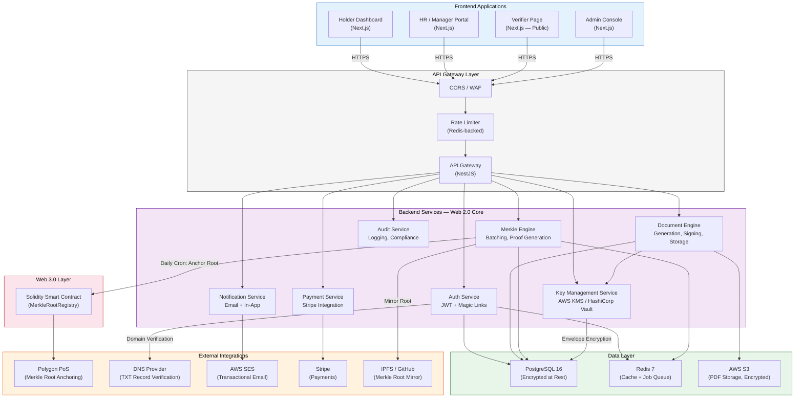
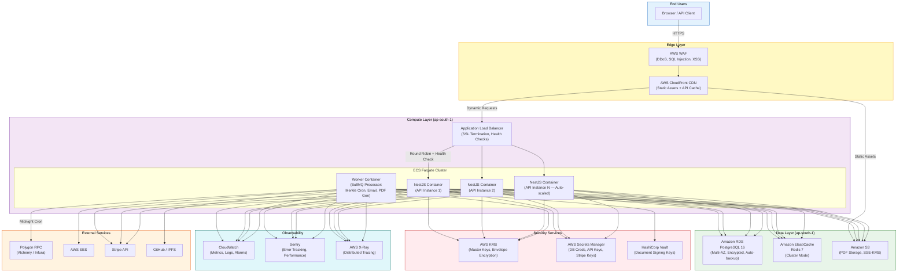
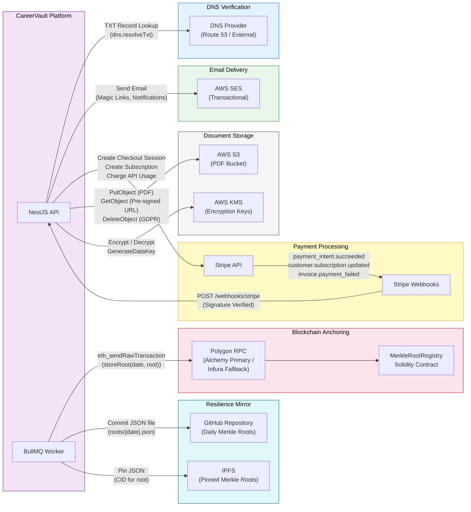
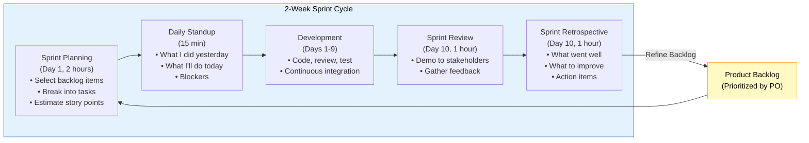
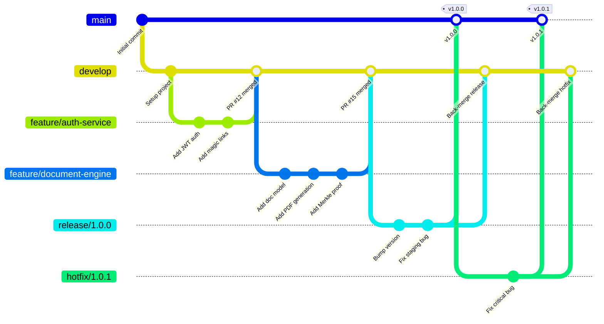
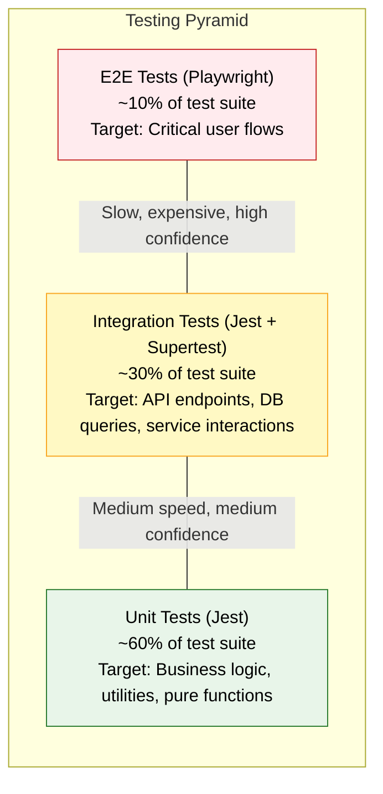
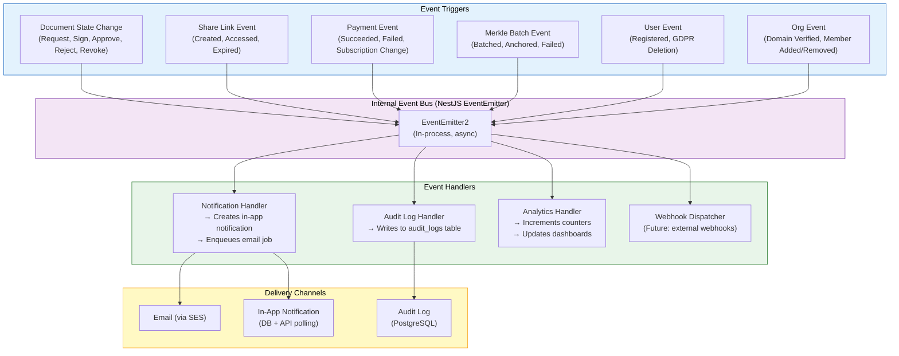
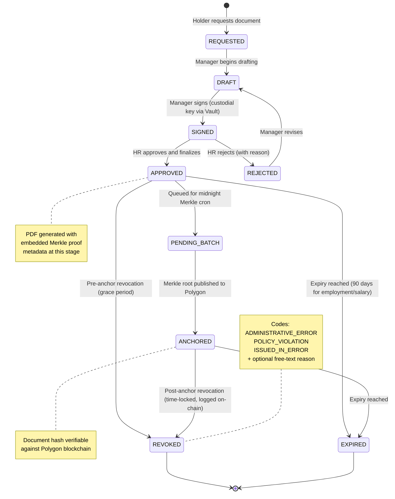
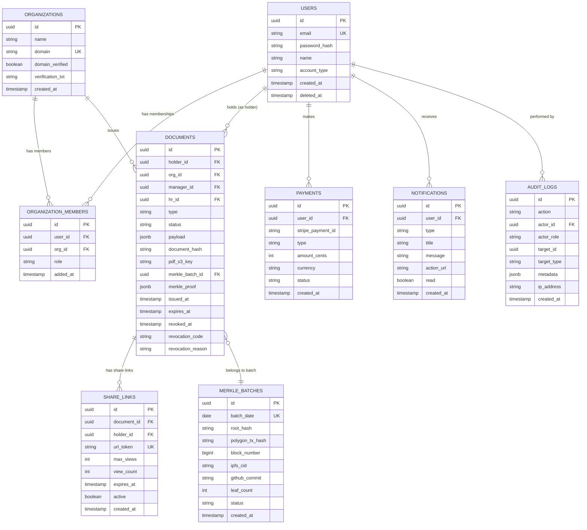

# CareerVault — Proposed System Model & Technology Stack

> **Version:** 1.0.0
> **Last Updated:** 2026-03-22
> **Status:** Production Specification (Locked)
> **Classification:** Internal — Engineering & Architecture

---

## Table of Contents

1. [Executive Summary](#1-executive-summary)
2. [Proposed System Model](#2-proposed-system-model)
   - 2.1 [High-Level System Architecture](#21-high-level-system-architecture)
   - 2.2 [Deployment Architecture](#22-deployment-architecture)
   - 2.3 [Security Architecture](#23-security-architecture)
   - 2.4 [Integration Architecture](#24-integration-architecture)
3. [Technology Stack](#3-technology-stack)
4. [Development Methodology](#4-development-methodology)
   - 4.1 [Agile Scrum](#41-agile-scrum)
   - 4.2 [Git Workflow](#42-git-workflow)
   - 4.3 [Testing Strategy](#43-testing-strategy)
   - 4.4 [Release Strategy](#44-release-strategy)
5. [API Architecture](#5-api-architecture)
   - 5.1 [RESTful API Design](#51-restful-api-design)
   - 5.2 [Webhook & Event Architecture](#52-webhook--event-architecture)
6. [Non-Functional Requirements](#6-non-functional-requirements)

---

## 1. Executive Summary

### What is CareerVault?

CareerVault is a **Career Verification Platform** that enables employers to issue tamper-evident career documents — experience letters, salary proofs, and letters of recommendation — while giving employees (Holders) a lifelong digital wallet to store, manage, and share those credentials with future employers and background-check firms.

### The Web 2.5 Philosophy

CareerVault operates on a **Web 2.5 hybrid architecture**: the platform's core logic, user management, document generation, and access control run on a conventional SQL-backed Web 2.0 stack (PostgreSQL, NestJS, Next.js), while cryptographic integrity is anchored to a public blockchain (Polygon PoS) via daily Merkle root publications. This hybrid approach delivers:

| Concern | Web 2.0 Layer (SQL + APIs) | Web 3.0 Layer (Merkle + Polygon) |
|---|---|---|
| **User experience** | Familiar dashboards, email auth, instant response times | Transparent, auditable proof of document existence |
| **Data storage** | PostgreSQL for structured data, S3 for PDFs | On-chain: only 32-byte Merkle roots (cost-efficient) |
| **Trust model** | Platform-managed keys, RBAC, encrypted storage | Immutable public record — survives platform shutdown |
| **Cost** | Standard AWS infrastructure pricing | ~$0.01 per daily anchor transaction on Polygon |

### Resilience Guarantee

Every issued document gets a Merkle proof embedded directly into its PDF metadata. Daily Merkle roots are published to both the Polygon blockchain and mirrored to GitHub/IPFS. If CareerVault ceases to exist, **any developer can verify a document's authenticity with a 10-line script** by re-hashing the document, reconstructing the Merkle path from the embedded proof, and checking the root against the public on-chain record.

### Value Proposition by Actor

| Actor | Value |
|---|---|
| **Org Admin** | One-time domain verification establishes organizational identity. Full control over who can issue documents on behalf of the company. |
| **Issuer (Manager)** | Lightweight magic-link auth. Draft and sign LORs without navigating complex systems. Cannot finalize alone — HR approval ensures institutional checks. |
| **Approver (HR)** | Cross-check records before finalizing. Bulk-issue experience/salary letters. Revoke documents with auditable reason codes. Single gatekeeper role. |
| **Holder (Employee)** | Free lifetime storage. Career wallet that persists beyond any single employer. Pay-per-link or subscription sharing. GDPR-compliant deletion on demand. |
| **Verifier** | Instant cryptographic verification. Paid API for bulk checks. 50% discount for organizations that also issue through CareerVault. |

### Monetization Model

- **Holders:** Free storage, $5/month subscription or per-link pricing for sharing documents with verifiers.
- **Verifiers:** Paid API access for bulk verification. 50% discount if the verifier is also an onboarded issuer on the platform.
- **Issuers/Organizations:** Free to onboard and issue. Revenue comes from the verification and sharing sides of the marketplace.

---

## 2. Proposed System Model

### 2.1 High-Level System Architecture



#### Explanation

**Frontend Applications** — Four distinct Next.js views, all served from a single Next.js 14+ App Router application with route-based code splitting:

- **Holder Dashboard:** The career wallet. Holders see their issued documents, request new ones, generate share links, manage their subscription, and exercise GDPR deletion. Authentication is standard email/password + JWT.
- **HR / Manager Portal:** Managers access via magic links (15-minute expiry JWT emailed to their allowlisted address). They draft LORs, sign documents, and trigger the 2-step issuance flow. HR users have additional capabilities: bulk issuance, approval/rejection, and revocation.
- **Verifier Page:** A public-facing page where a verifier pastes a share-link URL token. No authentication required for single-document checks. The paid API requires API key auth for bulk verification.
- **Admin Console:** Org Admins manage company settings, domain verification, manager allowlists, HR assignments, and view audit logs.

**API Gateway Layer** — The NestJS application itself acts as the gateway. Incoming requests pass through:

1. **WAF / CORS:** AWS WAF rules block known attack patterns. CORS is locked to the frontend domain.
2. **Rate Limiter:** Redis-backed sliding window rate limiting. Different limits per endpoint class (auth endpoints are stricter to prevent brute force).
3. **Route Dispatch:** NestJS controllers route to the appropriate service module.

**Backend Services** — Each service is a NestJS module with clear boundaries:

- **Auth Service:** Handles registration, login (email/password), magic link generation and verification, JWT issuance (access token: 15 min, refresh token: 7 days), and session management. Magic links are single-use tokens stored in Redis with 15-minute TTL.
- **Document Engine:** The core business logic. Manages the document lifecycle: request, draft, manager sign, HR approve, PDF generation (with embedded Merkle proof metadata), S3 storage, share link creation, revocation, and GDPR deletion.
- **Merkle Engine:** Runs as a midnight cron job (BullMQ scheduled job). Collects all documents finalized since the last batch, computes SHA-256 hashes (after JCS canonicalization of the JSON-LD payload), builds a Merkle tree, writes proofs back to each document record, anchors the root to Polygon via the smart contract, and mirrors the root to GitHub/IPFS.
- **Notification Service:** Dispatches email (via SES) and in-app notifications for document lifecycle events: issuance requests, approvals, rejections, revocations, share link access, and payment confirmations.
- **Payment Service:** Integrates with Stripe for holder subscriptions ($5/mo), per-link one-time payments, and verifier API billing. Manages webhook processing for payment status updates.
- **Key Management Service:** Wraps AWS KMS and/or HashiCorp Vault. The platform holds custodial keys — users never manage keys directly. Keys are used to digitally sign documents only when an authenticated user explicitly clicks "Approve." All key operations are audit-logged. Envelope encryption: data keys are encrypted by KMS master keys.
- **Audit Service:** Writes structured audit logs for all significant actions. Issuance logs retained for 7 years. System logs (IPs, logins, API calls) retained for 90 days. Feeds into CloudWatch for monitoring.

**Data Layer:**

- **PostgreSQL 16:** Primary data store. Stores users, organizations, organization_members (the join table implementing the unified identity model), documents, Merkle tree data, audit logs, payments, notifications. Encrypted at rest via AWS RDS encryption (AES-256).
- **Redis 7:** Multi-purpose — session cache, rate limiter state, BullMQ job queue backing store, magic link token store, and general application cache.
- **AWS S3:** Stores generated PDFs. Server-side encryption (SSE-S3 or SSE-KMS). Lifecycle policies for GDPR deletion. Versioning disabled (deletion means deletion).

**External Integrations:**

- **Polygon PoS:** Receives daily Merkle root anchors via a minimal Solidity smart contract. Chosen for low gas costs (~$0.01/tx) and EVM compatibility.
- **DNS:** Used during org onboarding. The Org Admin adds a platform-generated TXT record to their domain's DNS. The Auth Service verifies its presence to confirm domain ownership.
- **AWS SES:** Transactional email delivery for magic links, notifications, and receipts.
- **Stripe:** Payment processing for subscriptions and one-time charges. Stripe Checkout for holder payments, Stripe API keys for verifier billing.
- **IPFS / GitHub:** Redundant mirror for daily Merkle roots, ensuring resilience even if the Polygon RPC or the platform itself becomes unavailable.

---

### 2.2 Deployment Architecture



#### Explanation

**Edge Layer:**

- **AWS WAF** sits in front of CloudFront and filters malicious traffic: SQL injection attempts, XSS payloads, known bot signatures, and volumetric DDoS attacks. Rate-based rules cap requests per IP.
- **CloudFront CDN** serves static Next.js assets (JS bundles, CSS, images) from edge locations globally. Dynamic API requests are forwarded to the ALB. Cache-Control headers are set per route: static assets get long TTLs, API responses are never cached at the CDN layer.

**Compute Layer:**

- **Application Load Balancer (ALB):** Terminates TLS (ACM-managed certificates), performs health checks (`GET /health` every 30 seconds), and distributes traffic across ECS tasks using round-robin.
- **ECS Fargate Cluster:** Serverless container orchestration. No EC2 instances to manage. Each NestJS container runs the full API application. Auto-scaling policy: target 70% CPU utilization, minimum 2 tasks, maximum 10 tasks. Scale-out takes approximately 90 seconds.
- **Worker Container:** A separate ECS task running the same NestJS codebase but configured as a BullMQ worker. Processes background jobs: midnight Merkle batching cron, PDF generation (CPU-intensive Puppeteer rendering), email dispatch, and payment webhook processing. Scaled independently from API containers. Minimum 1 task, maximum 3 tasks.

**Data Layer:**

- **Amazon RDS PostgreSQL 16:** Multi-AZ deployment for high availability. Encrypted at rest (AES-256 via KMS). Automated daily backups with 7-day retention. Point-in-time recovery enabled. Instance type: db.r6g.large (starter), vertically scalable. Read replicas added when read traffic exceeds 70% of primary capacity.
- **Amazon ElastiCache Redis 7:** Cluster mode for horizontal scaling. Used for: session storage, BullMQ job queue, rate limiter counters, magic link tokens, and application-level cache (org settings, user profiles). Encrypted in transit and at rest.
- **Amazon S3:** Dedicated bucket for PDF storage. SSE-KMS encryption. Bucket policy restricts access to the ECS task role only. No public access. CORS disabled. Lifecycle rules support GDPR deletion workflows.

**Security Services:**

- **AWS KMS:** Manages master encryption keys. Used for RDS encryption, S3 encryption, and envelope encryption of sensitive fields in PostgreSQL (e.g., document signing key material). Automatic annual key rotation.
- **AWS Secrets Manager:** Stores database credentials, Stripe API keys, SES credentials, Polygon RPC API keys, and other secrets. Automatic rotation for database credentials every 30 days.
- **HashiCorp Vault:** Manages the custodial document signing keys. Keys are generated in Vault, never exported. Signing operations happen inside Vault via its Transit secrets engine. Audit log captures every key usage.

**Observability:**

- **CloudWatch:** Centralized log aggregation (structured JSON logs from Pino/Winston). Custom metrics for business KPIs (documents issued/day, verification requests/day). Alarms for: error rate > 1%, latency P99 > 2s, queue depth > 100, failed Merkle cron.
- **Sentry:** Real-time error tracking with stack traces, breadcrumbs, and user context. Performance monitoring for transaction tracing. Release tracking tied to SemVer tags.
- **AWS X-Ray:** Distributed tracing across API Gateway, NestJS services, RDS queries, Redis calls, and external HTTP requests (Stripe, Polygon RPC). Identifies latency bottlenecks.

**Deployment Strategy:**

- **Rolling deployments** via ECS service updates. New task definition is registered, ECS drains connections from old tasks (deregistration delay: 30s), starts new tasks, waits for health check pass, then terminates old tasks.
- **Zero-downtime deployments** guaranteed by ALB connection draining and ECS minimum healthy percent set to 100%.
- **Blue/green deployments** available for major releases via CodeDeploy integration.
- **Rollback:** Revert to previous task definition revision. Automated rollback if new tasks fail health checks within 5 minutes.

---

### 2.3 Security Architecture

```mermaid
flowchart TB
    subgraph Internet["Public Internet"]
        CLIENT["Client Browser / API Client"]
    end

    subgraph Edge["Perimeter Security"]
        WAF2["AWS WAF<br/>• IP Reputation Lists<br/>• SQL Injection Rules<br/>• XSS Rules<br/>• Rate-Based Rules"]
        CF2["CloudFront<br/>• TLS 1.3 Only<br/>• HSTS Headers<br/>• CSP Headers"]
    end

    subgraph RateLimit["Application Rate Limiting"]
        RL2["Redis-backed Rate Limiter<br/>• Auth endpoints: 5 req/min<br/>• API endpoints: 100 req/min<br/>• Verification: 30 req/min<br/>• Sliding window algorithm"]
    end

    subgraph AuthLayer["Authentication Layer"]
        direction TB
        STD_AUTH["Standard Auth Flow<br/>(Holders, Org Admins)"]
        MAGIC_AUTH["Magic Link Auth Flow<br/>(Managers)"]

        STD_AUTH -->|"1. Email + Password"| BCRYPT["bcrypt Hash Verification"]
        BCRYPT -->|"2. Success"| JWT_ISS["JWT Issuance<br/>Access: 15 min<br/>Refresh: 7 days"]

        MAGIC_AUTH -->|"1. Request Link"| ML_GEN["Generate Single-Use Token<br/>Store in Redis (15-min TTL)"]
        ML_GEN -->|"2. Email via SES"| ML_CLICK["Manager Clicks Link"]
        ML_CLICK -->|"3. Token Validated + Consumed"| JWT_ISS
    end

    subgraph RBAC["Role-Based Access Control"]
        JWT_VERIFY["JWT Verification Middleware"]
        ROLE_CHECK["Role Guard<br/>• ORG_ADMIN<br/>• HR (Approver)<br/>• MANAGER (Issuer)<br/>• HOLDER<br/>• VERIFIER"]
        ORG_SCOPE["Organization Scoping<br/>Users can only access<br/>their own org's data"]
    end

    subgraph ServiceLayer["Service Layer Security"]
        INPUT_VAL["Input Validation<br/>(class-validator, Zod)"]
        PARAMETERIZED["Parameterized Queries<br/>(Prisma ORM — No Raw SQL)"]
        SANITIZE["Output Sanitization<br/>(XSS prevention)"]
    end

    subgraph KeyMgmt["Key Management & Signing"]
        direction TB
        KMS2["AWS KMS<br/>(Master Keys)"]
        VAULT2["HashiCorp Vault<br/>(Transit Engine)"]

        KMS2 -->|"Envelope Encryption"| DATA_KEY["Data Encryption Key<br/>(Encrypts sensitive DB fields)"]
        VAULT2 -->|"Sign Operation"| DOC_SIGN["Document Signature<br/>(Only on authenticated<br/>user click of Approve)"]
    end

    subgraph EncryptedStorage["Encrypted Storage"]
        PG2["PostgreSQL<br/>• RDS Encryption (AES-256)<br/>• Sensitive fields: envelope-encrypted<br/>• Salted hashes for PII lookups"]
        S32["S3 PDFs<br/>• SSE-KMS Encryption<br/>• Bucket Policy: No Public Access<br/>• Pre-signed URLs (15-min expiry)"]
        REDIS2["Redis<br/>• Encryption in Transit (TLS)<br/>• Encryption at Rest<br/>• VPC-only Access"]
    end

    CLIENT -->|HTTPS Only| WAF2
    WAF2 --> CF2
    CF2 --> RL2
    RL2 --> AuthLayer
    AuthLayer --> JWT_VERIFY
    JWT_VERIFY --> ROLE_CHECK
    ROLE_CHECK --> ORG_SCOPE
    ORG_SCOPE --> INPUT_VAL
    INPUT_VAL --> PARAMETERIZED
    PARAMETERIZED --> SANITIZE
    SANITIZE --> KeyMgmt
    KeyMgmt --> EncryptedStorage

    style Internet fill:#ffebee,stroke:#c62828,color:#000
    style Edge fill:#fff9c4,stroke:#f9a825,color:#000
    style RateLimit fill:#e0f2f1,stroke:#004d40,color:#000
    style AuthLayer fill:#e3f2fd,stroke:#1565c0,color:#000
    style RBAC fill:#f3e5f5,stroke:#6a1b9a,color:#000
    style ServiceLayer fill:#e8f5e9,stroke:#2e7d32,color:#000
    style KeyMgmt fill:#fce4ec,stroke:#b71c1c,color:#000
    style EncryptedStorage fill:#f5f5f5,stroke:#424242,color:#000
```



#### Explanation

**Perimeter Security:**

- **AWS WAF** enforces managed rule sets (AWS Managed Rules for Common Threats, Known Bad Inputs, SQL Injection, and IP Reputation). Custom rules rate-limit by IP and block geographic regions if needed. All WAF logs stream to CloudWatch for security analysis.
- **CloudFront** enforces TLS 1.3 minimum. Security headers are injected via CloudFront Functions: `Strict-Transport-Security` (HSTS, max-age 1 year, includeSubDomains), `Content-Security-Policy` (strict CSP blocking inline scripts), `X-Content-Type-Options: nosniff`, `X-Frame-Options: DENY`, `Referrer-Policy: strict-origin-when-cross-origin`.

**Application Rate Limiting:**

Redis-backed sliding window rate limiter implemented as NestJS middleware. Rate limits are differentiated by endpoint sensitivity:

| Endpoint Category | Rate Limit | Window | Rationale |
|---|---|---|---|
| Auth (login, register, magic-link) | 5 requests | 1 minute | Prevent brute force and enumeration |
| Document operations | 100 requests | 1 minute | Normal usage headroom |
| Verification (public) | 30 requests | 1 minute | Prevent scraping |
| Payment webhooks (Stripe) | Unlimited | N/A | Validated by Stripe signature |

**Authentication Layer:**

Two authentication flows coexist:

1. **Standard Auth (Holders, Org Admins):** Email + password. Password hashed with bcrypt (cost factor 12). On success, JWT pair issued: access token (15-minute expiry, contains userId, orgId, role) and refresh token (7-day expiry, stored in HTTP-only secure cookie). Refresh tokens are rotated on each use (rotation invalidates the old token).
2. **Magic Link Auth (Managers):** Manager's email must be in the organization's allowlist. On request, a cryptographically random single-use token is generated, stored in Redis with a 15-minute TTL, and emailed via SES. When the manager clicks the link, the token is validated, consumed (deleted from Redis), and a JWT pair is issued. This removes password management burden from managers who interact infrequently.

**Role-Based Access Control (RBAC):**

- **JWT Verification Middleware:** Runs on every authenticated route. Verifies JWT signature, checks expiry, extracts claims (userId, orgId, roles).
- **Role Guard:** NestJS guards enforce role requirements per route. Roles are: `ORG_ADMIN`, `HR`, `MANAGER`, `HOLDER`, `VERIFIER`. A user can hold multiple roles across different organizations (via the `organization_members` join table), but each request is scoped to a single org context.
- **Organization Scoping:** Every database query is scoped to the authenticated user's orgId. A user in Org A cannot access Org B's documents, even if they manipulate request parameters. This is enforced at the service layer, not just the controller layer.

**Key Management & Document Signing:**

The platform uses a **custodial key model** — users never generate, store, or manage cryptographic keys. This is a deliberate decision: the target audience (HR managers, employees) should not need to understand key management.

- **AWS KMS** manages master encryption keys for envelope encryption. Sensitive database fields (e.g., salary figures in document payloads) are encrypted with a data encryption key (DEK), which is itself encrypted by the KMS master key. The encrypted DEK is stored alongside the ciphertext. Decryption requires a KMS API call, which is audit-logged.
- **HashiCorp Vault Transit Engine** handles document signing. When an authenticated user (Manager or HR) clicks "Approve," the backend sends the JCS-canonicalized JSON-LD payload to Vault's Transit engine, which signs it with the organization's signing key. The signature is stored with the document and embedded in the PDF. Keys never leave Vault. Key rotation is automatic (new key version created periodically; old versions retained for verification).

**Encrypted Storage:**

- **PostgreSQL:** AWS RDS encryption at rest (AES-256, KMS-managed key). Sensitive fields additionally envelope-encrypted at the application layer. PII fields used for lookups (e.g., email) are stored as salted hashes alongside the encrypted value.
- **S3 PDFs:** SSE-KMS encryption. Bucket policy enforces zero public access. Application generates pre-signed URLs with 15-minute expiry for authorized downloads. Pre-signed URL generation requires a valid JWT and role check.
- **Redis:** TLS encryption in transit. Encryption at rest via ElastiCache encryption. Access restricted to the VPC security group — no public endpoint.

**Key Rotation Schedule:**

| Key Type | Rotation Period | Method |
|---|---|---|
| KMS Master Key | Annually (automatic) | AWS automatic rotation |
| Vault Signing Keys | Quarterly | New version, old versions retained |
| JWT Signing Secret | Every 90 days | Manual rotation with grace period |
| Database Credentials | Every 30 days | Secrets Manager automatic rotation |

---

### 2.4 Integration Architecture



#### Explanation

**DNS Verification Integration:**

During org onboarding, the platform generates a unique verification string (e.g., `careervault-verify=abc123def456`). The Org Admin adds this as a TXT record to their domain's DNS. The API uses Node.js's `dns.resolveTxt()` to query the domain and confirm the record's presence. Verification is retried up to 3 times with exponential backoff (DNS propagation can take minutes to hours). Once verified, the organization's `domain_verified` flag is set to `true` and the TXT record can be removed.

**Email Delivery (AWS SES):**

All transactional emails are sent via AWS SES:

| Email Type | Trigger | Template |
|---|---|---|
| Magic Link | Manager requests login | Contains single-use link, 15-min expiry warning |
| Document Request | Holder requests a document | Notifies HR and the relevant manager |
| Document Issued | HR approves a document | Notifies the Holder with download link |
| Document Rejected | HR rejects a document | Notifies Manager and Holder with reason |
| Document Revoked | HR revokes a document | Notifies Holder with reason code |
| Share Link Accessed | Verifier opens a share link | Notifies Holder (transparency) |
| Payment Confirmation | Stripe webhook confirms payment | Receipt with amount and plan details |
| GDPR Deletion | User requests deletion | Confirmation of data removal |

SES is configured with DKIM signing, SPF records, and a custom MAIL FROM domain. Bounce and complaint notifications are routed to an SNS topic for monitoring.

**Payment Processing (Stripe):**

- **Holder Subscriptions:** Stripe Checkout creates a subscription ($5/mo). Managed via Stripe Customer Portal for upgrades, downgrades, and cancellations.
- **Per-Link Payments:** Stripe Payment Intents for one-time charges when a holder generates a share link (if not subscribed).
- **Verifier API Billing:** Usage-based billing via Stripe Metering. API calls are counted and billed monthly. 50% discount applied at the Stripe Coupon level if the verifier's organization is also an onboarded issuer.
- **Webhook Processing:** Stripe sends webhook events to `POST /webhooks/stripe`. The endpoint verifies the Stripe signature header before processing. Key events: `payment_intent.succeeded`, `customer.subscription.created`, `customer.subscription.updated`, `customer.subscription.deleted`, `invoice.payment_failed`.

**Blockchain Anchoring (Polygon PoS):**

The midnight cron job (BullMQ scheduled job) performs:

1. Query all documents with status `APPROVED` and `merkle_batch_id IS NULL` (not yet batched).
2. For each document, compute `SHA-256(JCS(json_ld_payload))`.
3. Build a Merkle tree using `merkletreejs` (SHA-256, sorted pairs).
4. Store the Merkle proof (array of sibling hashes + leaf index) in each document's record.
5. Call `MerkleRootRegistry.storeRoot(dateString, rootHash)` on Polygon via `ethers.js v6`.
6. The transaction is sent via Alchemy (primary RPC) with Infura as fallback.
7. Transaction hash is stored in the `merkle_batches` table.
8. On confirmation (1 block), the batch status is set to `ANCHORED`.

The Solidity contract is minimal:

```solidity
// SPDX-License-Identifier: MIT
pragma solidity ^0.8.20;

contract MerkleRootRegistry {
    mapping(string => bytes32) public roots;
    address public owner;

    event RootStored(string indexed date, bytes32 root);

    modifier onlyOwner() {
        require(msg.sender == owner, "Not authorized");
        _;
    }

    constructor() {
        owner = msg.sender;
    }

    function storeRoot(string calldata date, bytes32 root) external onlyOwner {
        require(roots[date] == bytes32(0), "Root already stored for this date");
        roots[date] = root;
        emit RootStored(date, root);
    }
}
```

**Resilience Mirror (GitHub / IPFS):**

After anchoring to Polygon, the worker:

1. Commits a JSON file (`roots/YYYY-MM-DD.json`) to a public GitHub repository via the GitHub API. The JSON contains: `{ date, root, txHash, blockNumber, leafCount }`.
2. Pins the same JSON to IPFS via a pinning service (Pinata or Infura IPFS). The CID is stored in the `merkle_batches` table.

This triple-redundancy (Polygon + GitHub + IPFS) ensures that Merkle roots are recoverable even if one or two systems become unavailable.

---

## 3. Technology Stack

### Frontend

| Technology | Version | Purpose | Why This Over Alternatives |
|---|---|---|---|
| **Next.js** | 14+ (App Router) | Full-stack React framework | App Router provides server components for faster initial loads, built-in API routes, and excellent SEO for the public verifier page. Chosen over Remix (smaller ecosystem) and plain React SPA (no SSR). |
| **React** | 18 | UI component library | Industry standard. Concurrent rendering for smooth interactions. Massive ecosystem of compatible libraries. |
| **TypeScript** | 5 | Type-safe development | Catches type errors at compile time. Shared types between frontend and backend (monorepo). Non-negotiable for production systems. |
| **TailwindCSS** | 3 | Utility-first CSS framework | Rapid UI development, small bundle size (purged unused classes), consistent design tokens. Chosen over styled-components (runtime overhead) and CSS Modules (slower development). |
| **shadcn/ui** | Latest | UI component library | Accessible, customizable components built on Radix UI primitives. Components are copied into the project (not a dependency), giving full control. Chosen over Material UI (opinionated styling, heavy) and Chakra UI (similar but larger bundle). |

### Backend

| Technology | Version | Purpose | Why This Over Alternatives |
|---|---|---|---|
| **NestJS** | 10+ | Backend framework | Opinionated, modular architecture with dependency injection. First-class TypeScript support. Built-in support for guards, interceptors, pipes, and middleware — ideal for RBAC and validation. Chosen over Express (no structure) and Fastify (less opinionated). |
| **Node.js** | 20 LTS | Runtime | LTS ensures long-term security patches. Excellent async I/O for a service that's mostly I/O bound (DB queries, S3 operations, HTTP calls to Stripe/Polygon). Chosen over Go (smaller TypeScript ecosystem) and Python (slower, no shared types with frontend). |
| **TypeScript** | 5 | Type-safe development | Shared type definitions with the frontend. Prisma generates TypeScript types from the database schema. End-to-end type safety from DB to UI. |

### Database & ORM

| Technology | Version | Purpose | Why This Over Alternatives |
|---|---|---|---|
| **PostgreSQL** | 16 | Primary relational database | ACID compliance for financial records (payments, document integrity). JSONB support for flexible document payloads. Row-level security capabilities. Mature, battle-tested. Chosen over MySQL (weaker JSONB, fewer index types) and MongoDB (not suitable for relational data with complex joins like org_members). |
| **Prisma** | 5+ | ORM and query builder | Auto-generates TypeScript types from schema. Migration management. Parameterized queries prevent SQL injection by default. Schema-as-code for version control. Chosen over TypeORM (less type-safe, more bugs) and Drizzle (newer, less mature ecosystem). |

### Caching & Job Queue

| Technology | Version | Purpose | Why This Over Alternatives |
|---|---|---|---|
| **Redis** | 7 | Cache, session store, rate limiter, queue backend | Sub-millisecond reads for session lookups and rate limiting. TTL support for magic link tokens. Pub/sub for real-time notification delivery. Chosen over Memcached (no persistence, no pub/sub, no data structures). |
| **BullMQ** | 5+ | Job queue and cron scheduler | Redis-backed, reliable job processing with retries, backoff, and dead-letter queues. Cron scheduling for midnight Merkle batching. Dashboard (Bull Board) for monitoring. Chosen over AWS SQS (higher latency, no cron) and Agenda (MongoDB-dependent). |

### Blockchain

| Technology | Version | Purpose | Why This Over Alternatives |
|---|---|---|---|
| **Polygon PoS** | Mainnet | Public blockchain for Merkle root anchoring | ~$0.01 per transaction (vs $5-50 on Ethereum mainnet). EVM-compatible (same Solidity tooling). 2-second block times for fast confirmation. Chosen over Ethereum L1 (too expensive for daily anchors), Arbitrum/Optimism (lower brand recognition for verification trust), and Solana (non-EVM, different tooling). |
| **Solidity** | 0.8+ | Smart contract language | The MerkleRootRegistry contract is minimal (~20 lines). Solidity 0.8+ has built-in overflow checks. Mature auditing toolchain (Slither, Mythril). |
| **ethers.js** | v6 | Blockchain interaction library | TypeScript-native. Cleaner API than web3.js. Better tree-shaking for smaller bundles. Provider abstraction supports Alchemy/Infura failover. |
| **merkletreejs** | Latest | Merkle tree construction | Well-tested library for building Merkle trees and generating proofs. Supports SHA-256 with sorted pairs (deterministic). |

### Cloud Infrastructure (AWS)

| Service | Purpose | Configuration |
|---|---|---|
| **ECS Fargate** | Container orchestration | Serverless containers — no EC2 management. Auto-scaling based on CPU/memory. |
| **RDS** | Managed PostgreSQL | Multi-AZ, encrypted, automated backups, point-in-time recovery. |
| **S3** | PDF and static asset storage | SSE-KMS encryption, versioning disabled, lifecycle policies for GDPR deletion. |
| **KMS** | Encryption key management | Automatic key rotation. Envelope encryption for sensitive DB fields. |
| **SES** | Transactional email | DKIM, SPF, custom MAIL FROM. Bounce/complaint monitoring. |
| **CloudFront** | CDN | Edge caching for static assets. Security headers via CloudFront Functions. |
| **CloudWatch** | Logging and monitoring | Structured JSON logs, custom metrics, alarms. |
| **Secrets Manager** | Secrets storage | Automatic rotation for DB credentials. Stores all API keys and secrets. |
| **ElastiCache** | Managed Redis | Cluster mode, encrypted, VPC-only access. |

**Why AWS over alternatives:** Comprehensive managed service ecosystem reduces operational burden. KMS + Secrets Manager + RDS encryption provide a cohesive security story. ECS Fargate eliminates EC2 management. GCP and Azure are viable but AWS has the largest enterprise adoption and talent pool.

### Authentication

| Technology | Purpose | Configuration |
|---|---|---|
| **JWT (Access Token)** | API authentication | 15-minute expiry. Contains userId, orgId, roles. Signed with RS256. |
| **JWT (Refresh Token)** | Session continuity | 7-day expiry. HTTP-only secure cookie. Rotated on each use. |
| **Magic Links** | Manager authentication | Single-use token in Redis (15-min TTL). Emailed via SES. Consumed on first use. |
| **bcrypt** | Password hashing | Cost factor 12. Used for Holder and Org Admin passwords. |

### PDF Generation

| Technology | Purpose | Why This Over Alternatives |
|---|---|---|
| **Puppeteer** | PDF rendering from HTML templates | Full Chrome rendering engine — supports complex layouts, custom fonts, and precise positioning. Merkle proof metadata is embedded in PDF properties via `pdf-lib` post-processing. Chosen over `@react-pdf/renderer` (limited layout capabilities, harder to match corporate letter styles) and `wkhtmltopdf` (deprecated, inconsistent rendering). |
| **pdf-lib** | PDF metadata embedding | Injects Merkle proof, document hash, batch date, and verification URL into PDF metadata fields. Lightweight, no external dependencies. |

### Cryptography

| Technology | Purpose | Details |
|---|---|---|
| **SHA-256** | Document hashing | Industry-standard, collision-resistant. Used for Merkle leaf computation. Node.js `crypto` module — no external dependency. |
| **JCS (RFC 8785)** | JSON canonicalization | Deterministic JSON serialization before hashing. Ensures the same logical document always produces the same hash regardless of key ordering. Library: `canonicalize` npm package. |
| **AES-256** | Encryption at rest | Via AWS KMS envelope encryption. Data keys encrypted by KMS master key. |
| **RS256** | JWT signing | RSA-based JWT signatures. Key pair managed in AWS Secrets Manager. |

### Payments

| Technology | Purpose | Details |
|---|---|---|
| **Stripe** | Payment processing | Checkout Sessions for subscriptions. Payment Intents for one-time charges. Usage-based metering for verifier API. Coupons for issuer-verifier discounts. Webhooks for async payment confirmation. Chosen over Razorpay (India-only), Paddle (less flexible API), and building custom payment flows (PCI compliance burden). |

### Monitoring & Observability

| Technology | Purpose | Why This Over Alternatives |
|---|---|---|
| **CloudWatch** | Infrastructure metrics, logs, alarms | Native AWS integration. No additional cost for basic metrics. Log Insights for querying structured logs. |
| **Sentry** | Error tracking, performance monitoring | Real-time error alerts with full stack traces. Release tracking. Performance transactions. Chosen over Datadog (more expensive for early stage) and Rollbar (less feature-rich). |
| **Pino** | Structured logging | JSON log output, extremely fast (10x faster than Winston). Low overhead in production. Integrates with CloudWatch via JSON parsing. Chosen over Winston (slower, more overhead) for production performance. |

### CI/CD

| Technology | Purpose | Details |
|---|---|---|
| **GitHub Actions** | CI/CD pipeline | Runs on every PR: lint, type-check, unit tests, integration tests. On merge to `main`: build Docker image, push to ECR, deploy to staging. Manual promotion to production. Chosen over Jenkins (self-hosted overhead), CircleCI (another vendor to manage), and AWS CodePipeline (less flexible). |

### Testing

| Technology | Purpose | Details |
|---|---|---|
| **Jest** | Unit and integration testing | TypeScript-native with `ts-jest`. Mocking support for service isolation. Coverage reporting. |
| **Supertest** | HTTP integration testing | Tests NestJS controllers with real HTTP requests against an in-memory app instance. |
| **Playwright** | End-to-end testing | Cross-browser testing (Chromium, Firefox, WebKit). Tests critical user flows: onboarding, document issuance, verification, payment. Chosen over Cypress (no cross-browser support in free tier, slower). |

---

## 4. Development Methodology

### 4.1 Agile Scrum



#### Explanation

**Sprint Duration:** 2 weeks. Short enough to maintain urgency and adapt to feedback, long enough to deliver meaningful increments.

**Team Roles:**

| Role | Responsibility |
|---|---|
| **Product Owner** | Owns the product backlog. Prioritizes features based on user value and business impact. Writes acceptance criteria for user stories. |
| **Scrum Master** | Facilitates ceremonies. Removes blockers. Ensures the team follows Scrum practices. Tracks velocity and burndown. |
| **Development Team** | Cross-functional: frontend, backend, DevOps, QA. Self-organizing. Collectively responsible for sprint deliverables. |

**Ceremonies:**

1. **Sprint Planning (Day 1, 2 hours):** The Product Owner presents the highest-priority backlog items. The team discusses, clarifies, and selects items for the sprint based on velocity (historical average story points completed per sprint). Each item is broken into technical tasks with hour estimates.

2. **Daily Standup (Every day, 15 minutes):** Timeboxed. Each team member answers three questions: what they completed since the last standup, what they plan to work on, and any blockers. Blockers are escalated to the Scrum Master immediately.

3. **Development (Days 1-9):** Active development with continuous integration. PRs are reviewed within 4 hours. Automated tests run on every PR. Feature branches are merged to `develop` daily.

4. **Sprint Review (Day 10, 1 hour):** Working software is demonstrated to stakeholders. Feedback is captured and fed back into the product backlog.

5. **Sprint Retrospective (Day 10, 1 hour):** The team reflects on the sprint process. Three categories: what went well, what needs improvement, and concrete action items. Action items are tracked and reviewed in the next retrospective.

**Estimation:** Fibonacci story points (1, 2, 3, 5, 8, 13). Items estimated at 13+ are split into smaller stories. Planning Poker for consensus.

---

### 4.2 Git Workflow



#### Explanation

**Branch Strategy: GitFlow**

| Branch | Purpose | Lifetime | Merges Into |
|---|---|---|---|
| `main` | Production-ready code. Every commit is a release. | Permanent | N/A |
| `develop` | Integration branch. Latest development state. | Permanent | `release/*` |
| `feature/*` | Individual features or user stories. | Temporary | `develop` |
| `release/*` | Release preparation. Version bumps, final fixes. | Temporary | `main` + `develop` |
| `hotfix/*` | Critical production fixes. | Temporary | `main` + `develop` |

**Branch Naming Convention:**

```
feature/CV-{ticket-number}-{short-description}
  e.g., feature/CV-42-magic-link-auth

bugfix/CV-{ticket-number}-{short-description}
  e.g., bugfix/CV-87-fix-merkle-proof-order

hotfix/CV-{ticket-number}-{short-description}
  e.g., hotfix/CV-101-fix-payment-webhook

release/{semver}
  e.g., release/1.2.0
```

**Pull Request Rules:**

1. Every PR must target `develop` (features/bugfixes) or `main` (hotfixes/releases).
2. Minimum 1 reviewer approval required. 2 reviewers for security-sensitive changes (auth, crypto, payments).
3. All CI checks must pass: lint, type-check, unit tests, integration tests, build.
4. PR description must include: what changed, why, how to test, and link to the ticket.
5. Squash merge for feature branches (clean history). Merge commit for release/hotfix branches (preserve history).

**CI Gates (GitHub Actions):**

| Gate | Trigger | Actions |
|---|---|---|
| **PR Check** | Every PR | Lint (ESLint + Prettier), TypeScript type-check, unit tests, integration tests, build verification |
| **Develop Build** | Merge to `develop` | All PR checks + Docker image build + push to ECR (tagged `develop-{sha}`) |
| **Release Deploy** | Merge to `main` | All checks + Docker image build + push to ECR (tagged `v{semver}`) + deploy to staging |
| **Production Promote** | Manual approval | Deploy staging image to production ECS service |

---

### 4.3 Testing Strategy



#### Explanation

**Coverage Targets:**

| Level | Coverage Target | Run Frequency | Execution Time |
|---|---|---|---|
| Unit Tests | 80% line coverage | Every PR, every commit | < 60 seconds |
| Integration Tests | 70% of API endpoints | Every PR | < 3 minutes |
| E2E Tests | All critical user flows | Nightly + pre-release | < 10 minutes |

**What Gets Tested at Each Level:**

**Unit Tests (Jest) — 60% of test suite:**

- Merkle tree construction and proof generation logic
- JCS canonicalization correctness
- JWT token generation and validation
- RBAC permission checks (guard logic)
- Document state machine transitions (DRAFT -> SIGNED -> APPROVED -> ANCHORED)
- Revocation code validation
- Payment amount calculations (subscription vs per-link, discount logic)
- Input validation schemas (class-validator decorators)
- Date/expiry calculations (90-day expiry for employment docs, permanent for LORs)
- Utility functions (hash computation, URL token generation)

**Integration Tests (Jest + Supertest) — 30% of test suite:**

- Full HTTP request/response cycle for every API endpoint
- Authentication flows (register, login, magic link, refresh, logout)
- Authorization checks (role-based access, org scoping)
- Database operations via Prisma (CRUD, transactions, cascading deletes)
- Document lifecycle: request -> draft -> sign -> approve -> anchor
- GDPR deletion: verify user row, S3 object, share links, and salt are all removed
- Revocation flow: pre-anchor grace period vs post-anchor time-locked
- Stripe webhook processing (using Stripe test events)
- Rate limiting behavior (verify 429 responses after threshold)

Test database: separate PostgreSQL instance (Docker container in CI) with migrations applied. Each test suite runs in a transaction that's rolled back after completion.

**E2E Tests (Playwright) — 10% of test suite:**

- Org onboarding: register Org Admin, set up company, verify domain (mocked DNS)
- Manager onboarding: Org Admin adds manager to allowlist, manager receives and uses magic link
- Document issuance: Manager drafts LOR, signs it, HR approves, Holder sees it in wallet
- Bulk issuance: HR uploads CSV, bulk-issues experience letters
- Verification: Holder generates share link, Verifier opens link and sees verification result
- Payment: Holder subscribes, generates share link, Holder unsubscribes
- GDPR deletion: Holder requests deletion, confirms, verifies all data is gone
- Revocation: HR revokes a document, Holder is notified, Verifier sees revocation status

---

### 4.4 Release Strategy

**Versioning: Semantic Versioning (SemVer)**

```
MAJOR.MINOR.PATCH
  |     |     |
  |     |     +-- Bug fixes, security patches (backward-compatible)
  |     +-------- New features (backward-compatible)
  +-------------- Breaking changes (API contract changes)
```

- **V1 Scope:** Experience/Relieving Letters, Letters of Recommendation, Income/Salary Proof. English only.
- **Version Examples:** `1.0.0` (initial release), `1.1.0` (add bulk issuance analytics), `1.0.1` (fix PDF rendering bug), `2.0.0` (multi-language support, breaking API changes).

**Release Pipeline:**

```
feature/* --> develop --> release/* --> staging --> [manual gate] --> production
                                                                        |
hotfix/*  -------------------------------------------------> production (fast-track)
```

| Stage | Environment | Purpose | Duration |
|---|---|---|---|
| **develop** | Development | Continuous integration, automated tests | Ongoing |
| **release/*** | Release branch | Version bump, changelog, final stabilization | 1-3 days |
| **staging** | Staging environment | Full production-mirror testing, QA sign-off | 1-2 days |
| **production** | Production | Live deployment | After manual approval |

**Feature Flags:**

Feature flags are implemented using environment variables and a simple in-database flag table for V1. Flags control:

- `FEATURE_BULK_ISSUANCE`: Enable/disable bulk issuance for HR
- `FEATURE_STRIPE_PAYMENTS`: Enable/disable payment flows (free during beta)
- `FEATURE_MERKLE_ANCHORING`: Enable/disable blockchain anchoring (can run in "dry run" mode)
- `FEATURE_GDPR_DELETION`: Enable/disable GDPR deletion flow

Flags are checked at the service layer. Disabled features return `403 Feature Not Available` responses.

**Rollback Procedures:**

1. **Automated Rollback:** If ECS health checks fail within 5 minutes of deployment, ECS automatically reverts to the previous task definition.
2. **Manual Rollback:** Update the ECS service to use the previous task definition revision. Takes effect within 60 seconds.
3. **Database Rollback:** Prisma migrations are designed to be reversible. Each migration has a `down` migration. In practice, rollbacks are applied manually after review to prevent data loss.
4. **Hotfix Path:** For critical production issues, a `hotfix/*` branch is created from `main`, fixed, tested (abbreviated test suite), and deployed directly to production. The fix is back-merged to `develop`.

---

## 5. API Architecture

### 5.1 RESTful API Design

**Base URL:** `https://api.careervault.io/v1`

**Common Headers:**

```
Authorization: Bearer <jwt_access_token>
Content-Type: application/json
X-Request-ID: <uuid>  (for tracing)
```

**Standard Response Format:**

```json
{
  "success": true,
  "data": { ... },
  "meta": {
    "page": 1,
    "limit": 20,
    "total": 45
  }
}
```

**Standard Error Format:**

```json
{
  "success": false,
  "error": {
    "code": "DOCUMENT_NOT_FOUND",
    "message": "The requested document does not exist.",
    "statusCode": 404
  }
}
```

---

#### Auth Module

| Method | Endpoint | Auth | Roles | Description |
|---|---|---|---|---|
| POST | `/auth/register` | None | N/A | Register a new Holder or Org Admin account |
| POST | `/auth/login` | None | N/A | Login with email/password |
| POST | `/auth/magic-link` | None | N/A | Request a magic link (Managers) |
| POST | `/auth/verify-magic-link` | None | N/A | Verify and consume a magic link token |
| POST | `/auth/refresh` | Refresh Token (Cookie) | Any | Refresh access token |
| POST | `/auth/logout` | JWT | Any | Invalidate refresh token |

**POST /auth/register**

```json
// Request
{
  "email": "jane@company.com",
  "password": "secureP@ssw0rd!",
  "name": "Jane Smith",
  "accountType": "HOLDER"  // or "ORG_ADMIN"
}

// Response (201 Created)
{
  "success": true,
  "data": {
    "userId": "usr_abc123",
    "email": "jane@company.com",
    "name": "Jane Smith",
    "accountType": "HOLDER",
    "accessToken": "eyJhbGciOi...",
    "expiresIn": 900
  }
}
```

**POST /auth/login**

```json
// Request
{
  "email": "jane@company.com",
  "password": "secureP@ssw0rd!"
}

// Response (200 OK)
{
  "success": true,
  "data": {
    "userId": "usr_abc123",
    "accessToken": "eyJhbGciOi...",
    "expiresIn": 900,
    "organizations": [
      {
        "orgId": "org_xyz789",
        "name": "Acme Corp",
        "role": "HOLDER"
      }
    ]
  }
}
// Refresh token set as HTTP-only cookie
```

**POST /auth/magic-link**

```json
// Request
{
  "email": "manager@company.com"
}

// Response (200 OK) — always returns success to prevent email enumeration
{
  "success": true,
  "data": {
    "message": "If this email is registered and allowlisted, a magic link has been sent."
  }
}
```

**POST /auth/verify-magic-link**

```json
// Request
{
  "token": "ml_randomToken123456"
}

// Response (200 OK)
{
  "success": true,
  "data": {
    "userId": "usr_mgr456",
    "accessToken": "eyJhbGciOi...",
    "expiresIn": 900,
    "organization": {
      "orgId": "org_xyz789",
      "name": "Acme Corp",
      "role": "MANAGER"
    }
  }
}
```

**POST /auth/refresh**

```json
// Request — refresh token sent via HTTP-only cookie

// Response (200 OK)
{
  "success": true,
  "data": {
    "accessToken": "eyJhbGciOi...",
    "expiresIn": 900
  }
}
// New refresh token set as HTTP-only cookie (rotation)
```

---

#### Organizations Module

| Method | Endpoint | Auth | Roles | Description |
|---|---|---|---|---|
| POST | `/orgs` | JWT | ORG_ADMIN | Create a new organization |
| POST | `/orgs/:id/verify-domain` | JWT | ORG_ADMIN | Trigger DNS TXT verification |
| GET | `/orgs/:id` | JWT | ORG_ADMIN, HR | Get organization details |
| PUT | `/orgs/:id` | JWT | ORG_ADMIN | Update organization settings |
| POST | `/orgs/:id/members` | JWT | ORG_ADMIN | Add a member (Manager or HR) to the org |
| DELETE | `/orgs/:id/members/:memberId` | JWT | ORG_ADMIN | Remove a member from the org |
| GET | `/orgs/:id/members` | JWT | ORG_ADMIN, HR | List organization members |

**POST /orgs**

```json
// Request
{
  "name": "Acme Corporation",
  "domain": "acme.com",
  "industry": "Technology",
  "size": "100-500"
}

// Response (201 Created)
{
  "success": true,
  "data": {
    "orgId": "org_xyz789",
    "name": "Acme Corporation",
    "domain": "acme.com",
    "domainVerified": false,
    "verificationTxtRecord": "careervault-verify=v1_org_xyz789_a8f3e2",
    "createdAt": "2026-03-22T10:00:00Z"
  }
}
```

**POST /orgs/:id/verify-domain**

```json
// Request — no body needed

// Response (200 OK)
{
  "success": true,
  "data": {
    "orgId": "org_xyz789",
    "domain": "acme.com",
    "domainVerified": true,
    "verifiedAt": "2026-03-22T10:15:00Z"
  }
}

// Response (422 Unprocessable Entity) — if TXT record not found
{
  "success": false,
  "error": {
    "code": "DOMAIN_VERIFICATION_FAILED",
    "message": "DNS TXT record not found. Please add 'careervault-verify=v1_org_xyz789_a8f3e2' to your domain's DNS records.",
    "statusCode": 422
  }
}
```

**POST /orgs/:id/members**

```json
// Request
{
  "email": "manager@acme.com",
  "role": "MANAGER",   // or "HR"
  "name": "John Manager"
}

// Response (201 Created)
{
  "success": true,
  "data": {
    "memberId": "mem_def456",
    "userId": "usr_mgr456",
    "orgId": "org_xyz789",
    "role": "MANAGER",
    "email": "manager@acme.com",
    "name": "John Manager",
    "addedAt": "2026-03-22T11:00:00Z"
  }
}
// If user doesn't exist, an account is created and an invitation email is sent
```

**GET /orgs/:id/members**

```json
// Response (200 OK)
{
  "success": true,
  "data": [
    {
      "memberId": "mem_def456",
      "userId": "usr_mgr456",
      "role": "MANAGER",
      "email": "manager@acme.com",
      "name": "John Manager",
      "addedAt": "2026-03-22T11:00:00Z"
    },
    {
      "memberId": "mem_ghi789",
      "userId": "usr_hr789",
      "role": "HR",
      "email": "hr@acme.com",
      "name": "Sarah HR",
      "addedAt": "2026-03-22T11:05:00Z"
    }
  ],
  "meta": {
    "total": 2
  }
}
```

---

#### Documents Module

| Method | Endpoint | Auth | Roles | Description |
|---|---|---|---|---|
| POST | `/documents/request` | JWT | HOLDER | Request a document from an organization |
| GET | `/documents/:id` | JWT | HOLDER, MANAGER, HR | Get document details |
| PUT | `/documents/:id` | JWT | MANAGER, HR | Edit a draft document |
| POST | `/documents/:id/sign` | JWT | MANAGER | Manager signs a document |
| POST | `/documents/:id/approve` | JWT | HR | HR approves and finalizes a document |
| POST | `/documents/:id/reject` | JWT | HR | HR rejects a document |
| POST | `/documents/:id/revoke` | JWT | HR, ORG_ADMIN | Revoke an issued document |
| GET | `/documents` | JWT | HOLDER, MANAGER, HR | List documents (filtered by role) |
| POST | `/documents/bulk-issue` | JWT | HR | Bulk-issue experience/salary letters |

**POST /documents/request**

```json
// Request
{
  "orgId": "org_xyz789",
  "type": "EXPERIENCE_LETTER",   // EXPERIENCE_LETTER, LETTER_OF_RECOMMENDATION, SALARY_PROOF
  "managerId": "usr_mgr456",     // Optional: specify preferred manager
  "notes": "Requesting experience letter for visa application."
}

// Response (201 Created)
{
  "success": true,
  "data": {
    "documentId": "doc_abc123",
    "type": "EXPERIENCE_LETTER",
    "status": "REQUESTED",
    "holderId": "usr_abc123",
    "orgId": "org_xyz789",
    "assignedManagerId": "usr_mgr456",
    "createdAt": "2026-03-22T12:00:00Z"
  }
}
```

**POST /documents/:id/sign**

```json
// Request
{
  "payload": {
    "@context": ["https://www.w3.org/2018/credentials/v1"],
    "type": ["VerifiableCredential", "ExperienceLetter"],
    "issuer": {
      "id": "did:web:acme.com",
      "name": "Acme Corporation"
    },
    "credentialSubject": {
      "name": "Jane Smith",
      "employeeId": "EMP-1234",
      "designation": "Senior Software Engineer",
      "department": "Engineering",
      "dateOfJoining": "2022-01-15",
      "dateOfRelieving": "2026-03-15",
      "description": "Jane has been an exceptional team member..."
    },
    "issuanceDate": "2026-03-22"
  }
}

// Response (200 OK)
{
  "success": true,
  "data": {
    "documentId": "doc_abc123",
    "status": "SIGNED",
    "signedByManagerId": "usr_mgr456",
    "signedAt": "2026-03-22T12:30:00Z",
    "pendingApproval": true,
    "message": "Document signed. Awaiting HR approval."
  }
}
```

**POST /documents/:id/approve**

```json
// Request
{
  "notes": "Verified against internal records. Approved."
}

// Response (200 OK)
{
  "success": true,
  "data": {
    "documentId": "doc_abc123",
    "status": "APPROVED",
    "approvedByHrId": "usr_hr789",
    "approvedAt": "2026-03-22T13:00:00Z",
    "pdfUrl": "https://api.careervault.io/v1/documents/doc_abc123/download",
    "documentHash": "sha256:a1b2c3d4e5f6...",
    "expiresAt": "2026-06-20T13:00:00Z",
    "merkleStatus": "PENDING_BATCH"
  }
}
```

**POST /documents/:id/reject**

```json
// Request
{
  "reason": "Job title does not match internal records. Please correct to 'Software Engineer II'."
}

// Response (200 OK)
{
  "success": true,
  "data": {
    "documentId": "doc_abc123",
    "status": "REJECTED",
    "rejectedByHrId": "usr_hr789",
    "rejectedAt": "2026-03-22T13:00:00Z",
    "reason": "Job title does not match internal records. Please correct to 'Software Engineer II'."
  }
}
```

**POST /documents/:id/revoke**

```json
// Request
{
  "code": "ISSUED_IN_ERROR",   // ADMINISTRATIVE_ERROR | POLICY_VIOLATION | ISSUED_IN_ERROR
  "reason": "Employee ID was incorrect in the original document. A corrected version will be reissued."
}

// Response (200 OK)
{
  "success": true,
  "data": {
    "documentId": "doc_abc123",
    "status": "REVOKED",
    "revocationCode": "ISSUED_IN_ERROR",
    "revocationReason": "Employee ID was incorrect in the original document. A corrected version will be reissued.",
    "revokedByUserId": "usr_hr789",
    "revokedAt": "2026-03-22T14:00:00Z",
    "merkleStatus": "ANCHORED",
    "revocationType": "POST_ANCHOR"
  }
}
```

**POST /documents/bulk-issue**

```json
// Request
{
  "type": "EXPERIENCE_LETTER",   // or "SALARY_PROOF" — LORs are NOT bulk-issuable
  "employees": [
    {
      "holderId": "usr_abc123",
      "payload": {
        "@context": ["https://www.w3.org/2018/credentials/v1"],
        "type": ["VerifiableCredential", "ExperienceLetter"],
        "credentialSubject": {
          "name": "Jane Smith",
          "designation": "Senior Software Engineer",
          "dateOfJoining": "2022-01-15",
          "dateOfRelieving": "2026-03-15"
        }
      }
    },
    {
      "holderId": "usr_def456",
      "payload": { ... }
    }
  ]
}

// Response (202 Accepted) — processed asynchronously
{
  "success": true,
  "data": {
    "batchId": "batch_xyz789",
    "totalDocuments": 2,
    "status": "PROCESSING",
    "message": "Bulk issuance queued. You will be notified when complete."
  }
}
```

**GET /documents**

```json
// Query Parameters
// ?status=APPROVED&type=EXPERIENCE_LETTER&page=1&limit=20

// Response (200 OK) — Holder view
{
  "success": true,
  "data": [
    {
      "documentId": "doc_abc123",
      "type": "EXPERIENCE_LETTER",
      "status": "APPROVED",
      "orgName": "Acme Corporation",
      "issuedAt": "2026-03-22T13:00:00Z",
      "expiresAt": "2026-06-20T13:00:00Z",
      "merkleStatus": "ANCHORED",
      "hasShareLink": true
    }
  ],
  "meta": {
    "page": 1,
    "limit": 20,
    "total": 1
  }
}
```

---

#### Verification Module

| Method | Endpoint | Auth | Roles | Description |
|---|---|---|---|---|
| GET | `/verify/:urlToken` | None (Public) | N/A | Verify a document via share link |
| POST | `/verify/batch` | API Key | VERIFIER | Batch verify multiple documents |

**GET /verify/:urlToken**

```json
// Response (200 OK)
{
  "success": true,
  "data": {
    "verified": true,
    "document": {
      "type": "EXPERIENCE_LETTER",
      "issuerOrganization": "Acme Corporation",
      "issuerDomain": "acme.com",
      "domainVerified": true,
      "holderName": "Jane Smith",
      "issuedAt": "2026-03-22T13:00:00Z",
      "expiresAt": "2026-06-20T13:00:00Z",
      "revoked": false
    },
    "verification": {
      "documentHash": "sha256:a1b2c3d4e5f6...",
      "merkleRoot": "0xabcdef...",
      "merkleProofValid": true,
      "anchoredOnChain": true,
      "polygonTxHash": "0x123456...",
      "blockNumber": 54321000,
      "anchoredAt": "2026-03-23T00:05:00Z"
    }
  }
}

// Response (200 OK) — revoked document
{
  "success": true,
  "data": {
    "verified": false,
    "document": {
      "type": "EXPERIENCE_LETTER",
      "issuerOrganization": "Acme Corporation",
      "revoked": true,
      "revocationCode": "ISSUED_IN_ERROR",
      "revocationReason": "Employee ID was incorrect.",
      "revokedAt": "2026-03-22T14:00:00Z"
    }
  }
}

// Response (404)
{
  "success": false,
  "error": {
    "code": "SHARE_LINK_NOT_FOUND",
    "message": "This verification link is invalid or has expired.",
    "statusCode": 404
  }
}
```

---

#### Share Links Module

| Method | Endpoint | Auth | Roles | Description |
|---|---|---|---|---|
| POST | `/documents/:id/share` | JWT | HOLDER | Generate a share link for a document |
| GET | `/share-links` | JWT | HOLDER | List all share links for the authenticated holder |
| DELETE | `/share-links/:id` | JWT | HOLDER | Revoke (deactivate) a share link |

**POST /documents/:id/share**

```json
// Request
{
  "expiresInDays": 30,        // Optional, default 30
  "maxViews": 10,             // Optional, default unlimited
  "recipientEmail": "recruiter@company.com"  // Optional, for tracking
}

// Response (201 Created) — if holder has active subscription
{
  "success": true,
  "data": {
    "shareLinkId": "sl_abc123",
    "documentId": "doc_abc123",
    "urlToken": "tk_randomSecureToken",
    "fullUrl": "https://careervault.io/verify/tk_randomSecureToken",
    "expiresAt": "2026-04-21T12:00:00Z",
    "maxViews": 10,
    "viewCount": 0,
    "createdAt": "2026-03-22T12:00:00Z"
  }
}

// Response (402 Payment Required) — if holder has no subscription and no per-link payment
{
  "success": false,
  "error": {
    "code": "PAYMENT_REQUIRED",
    "message": "A subscription or per-link payment is required to generate share links.",
    "statusCode": 402,
    "paymentOptions": {
      "subscription": "$5/month",
      "perLink": "$1.00"
    }
  }
}
```

---

#### Payments Module

| Method | Endpoint | Auth | Roles | Description |
|---|---|---|---|---|
| POST | `/payments/subscribe` | JWT | HOLDER | Create a subscription checkout session |
| POST | `/payments/one-time` | JWT | HOLDER | Create a one-time payment for a share link |
| GET | `/payments/history` | JWT | HOLDER, VERIFIER | Get payment history |
| POST | `/webhooks/stripe` | Stripe Signature | N/A | Stripe webhook endpoint |

**POST /payments/subscribe**

```json
// Request
{
  "plan": "HOLDER_MONTHLY"   // $5/mo
}

// Response (200 OK)
{
  "success": true,
  "data": {
    "checkoutUrl": "https://checkout.stripe.com/c/pay/cs_abc123...",
    "sessionId": "cs_abc123"
  }
}
```

**POST /payments/one-time**

```json
// Request
{
  "documentId": "doc_abc123",
  "purpose": "SHARE_LINK"
}

// Response (200 OK)
{
  "success": true,
  "data": {
    "checkoutUrl": "https://checkout.stripe.com/c/pay/cs_def456...",
    "sessionId": "cs_def456",
    "amount": 100,
    "currency": "usd"
  }
}
```

---

#### Admin Module

| Method | Endpoint | Auth | Roles | Description |
|---|---|---|---|---|
| GET | `/admin/audit-logs` | JWT | ORG_ADMIN | Query audit logs for the organization |
| GET | `/admin/analytics` | JWT | ORG_ADMIN | Get organization analytics dashboard data |
| DELETE | `/admin/users/:id/gdpr` | JWT | HOLDER (self) | Request GDPR data deletion |

**GET /admin/audit-logs**

```json
// Query Parameters
// ?action=DOCUMENT_ISSUED&startDate=2026-01-01&endDate=2026-03-22&page=1&limit=50

// Response (200 OK)
{
  "success": true,
  "data": [
    {
      "logId": "log_abc123",
      "action": "DOCUMENT_ISSUED",
      "actorId": "usr_hr789",
      "actorRole": "HR",
      "targetId": "doc_abc123",
      "targetType": "DOCUMENT",
      "metadata": {
        "documentType": "EXPERIENCE_LETTER",
        "holderId": "usr_abc123"
      },
      "ipAddress": "203.0.113.42",
      "timestamp": "2026-03-22T13:00:00Z"
    }
  ],
  "meta": {
    "page": 1,
    "limit": 50,
    "total": 127,
    "retentionPolicy": "7 years for issuance logs, 90 days for system logs"
  }
}
```

**DELETE /admin/users/:id/gdpr**

```json
// Request — user can only delete their own account
// The :id must match the authenticated user's ID

// Response (200 OK)
{
  "success": true,
  "data": {
    "deletionId": "del_abc123",
    "status": "PROCESSING",
    "message": "Your account and all associated data will be permanently deleted within 24 hours.",
    "itemsToDelete": {
      "userProfile": true,
      "documents": 3,
      "pdfsFromS3": 3,
      "shareLinks": 5,
      "hashSalt": true,
      "note": "On-chain Merkle hashes will remain but become unresolvable (dead hashes)."
    }
  }
}
```

---

#### Notifications Module

| Method | Endpoint | Auth | Roles | Description |
|---|---|---|---|---|
| GET | `/notifications` | JWT | Any | Get notifications for the authenticated user |
| PUT | `/notifications/:id/read` | JWT | Any | Mark a notification as read |
| PUT | `/notifications/read-all` | JWT | Any | Mark all notifications as read |

**GET /notifications**

```json
// Query Parameters
// ?unreadOnly=true&page=1&limit=20

// Response (200 OK)
{
  "success": true,
  "data": [
    {
      "notificationId": "notif_abc123",
      "type": "DOCUMENT_ISSUED",
      "title": "New Document Available",
      "message": "Your experience letter from Acme Corporation has been issued.",
      "read": false,
      "actionUrl": "/documents/doc_abc123",
      "createdAt": "2026-03-22T13:00:00Z"
    },
    {
      "notificationId": "notif_def456",
      "type": "SHARE_LINK_ACCESSED",
      "title": "Document Viewed",
      "message": "Your experience letter was viewed by recruiter@company.com.",
      "read": false,
      "actionUrl": "/share-links",
      "createdAt": "2026-03-22T14:00:00Z"
    }
  ],
  "meta": {
    "page": 1,
    "limit": 20,
    "total": 2,
    "unreadCount": 2
  }
}
```

---

### 5.2 Webhook & Event Architecture



#### Explanation

**Event Architecture:**

CareerVault uses an internal event-driven architecture built on NestJS's `EventEmitter2` module. This is an in-process event bus — not a distributed message queue. This is appropriate for V1 because:

1. All services run in the same NestJS process.
2. Event handlers are lightweight (write a DB row, enqueue a BullMQ job).
3. If an event handler fails, it's caught and logged without affecting the main request.

**Event Types:**

| Event | Payload | Triggers |
|---|---|---|
| `document.requested` | `{ documentId, holderId, orgId, type }` | Email to HR + manager. In-app notification. Audit log. |
| `document.signed` | `{ documentId, managerId, orgId }` | Email to HR. In-app notification. Audit log. |
| `document.approved` | `{ documentId, hrId, holderId, orgId }` | Email to Holder. In-app notification. Audit log. Analytics counter. |
| `document.rejected` | `{ documentId, hrId, holderId, reason }` | Email to Holder + Manager. In-app notification. Audit log. |
| `document.revoked` | `{ documentId, revokedBy, code, reason }` | Email to Holder. In-app notification. Audit log. |
| `sharelink.created` | `{ shareLinkId, documentId, holderId }` | Audit log. Analytics counter. |
| `sharelink.accessed` | `{ shareLinkId, verifierIp, verifierEmail }` | Email to Holder (transparency). In-app notification. Audit log. |
| `payment.succeeded` | `{ userId, amount, type, stripePaymentId }` | Email receipt. Audit log. |
| `payment.failed` | `{ userId, type, stripePaymentId }` | Email alert. In-app notification. |
| `merkle.batched` | `{ batchId, leafCount, rootHash }` | Audit log. |
| `merkle.anchored` | `{ batchId, txHash, blockNumber }` | Audit log. Analytics. |
| `user.registered` | `{ userId, accountType }` | Welcome email. Audit log. |
| `user.gdpr_deleted` | `{ userId, deletionId }` | Confirmation email (sent before deletion). Audit log (retained per compliance). |
| `org.domain_verified` | `{ orgId, domain }` | Email to Org Admin. In-app notification. Audit log. |
| `org.member_added` | `{ orgId, memberId, role }` | Email to new member. In-app notification. Audit log. |

**Email Job Queue:**

Email sending is not done synchronously in event handlers. Instead, the Notification Handler enqueues a BullMQ job (`email.send`) with the recipient, template name, and template variables. The Worker container processes these jobs with retry logic (3 retries, exponential backoff). Failed emails after all retries are moved to a dead-letter queue for manual review.

**Future: External Webhooks (V2):**

The Webhook Dispatcher handler is a placeholder for V2, where organizations and verifiers can register webhook URLs to receive real-time notifications about document events (issuance, revocation) relevant to them. This will use a similar BullMQ queue with signature-verified HTTP POST delivery and retry logic.

---

## 6. Non-Functional Requirements

### Performance Targets

| Metric | Target | Measurement Method |
|---|---|---|
| **API Response Time (P50)** | < 200ms | AWS X-Ray / CloudWatch |
| **API Response Time (P95)** | < 500ms | AWS X-Ray / CloudWatch |
| **API Response Time (P99)** | < 2,000ms | AWS X-Ray / CloudWatch |
| **PDF Generation Time** | < 5 seconds | BullMQ job duration metric |
| **Verification Endpoint** | < 300ms | CloudWatch (critical path) |
| **Merkle Batch Processing** | < 10 minutes (for up to 10,000 documents) | BullMQ job duration |
| **Polygon Anchor Confirmation** | < 30 seconds (1 block) | Worker metric |
| **Page Load Time (LCP)** | < 2.5 seconds | Sentry Performance / Lighthouse |

### Availability

| Component | Target | Strategy |
|---|---|---|
| **API Service** | 99.9% (8.76 hours downtime/year) | Multi-AZ ECS deployment, ALB health checks, auto-scaling |
| **Database** | 99.95% | RDS Multi-AZ with automatic failover |
| **Verification Endpoint** | 99.99% | CloudFront caching for static verification pages, degraded mode (check PDF metadata directly) |
| **Merkle Anchoring** | Best-effort daily | If midnight cron fails, retry hourly. Documents remain valid (proof is embedded in PDF). |

### Scalability Plan

| Phase | Users | Documents/Month | Infrastructure |
|---|---|---|---|
| **V1 Launch** | 1,000 | 5,000 | 2 ECS tasks, db.r6g.large, single Redis node |
| **Growth (6 months)** | 10,000 | 50,000 | 4 ECS tasks, db.r6g.xlarge, Redis cluster (3 nodes) |
| **Scale (12 months)** | 100,000 | 500,000 | 8 ECS tasks, db.r6g.2xlarge, Redis cluster (6 nodes), read replicas |
| **Enterprise (24 months)** | 1,000,000+ | 5,000,000+ | Multiple ECS clusters, Aurora PostgreSQL, dedicated verification cache layer, EU data residency shard |

### Backup Strategy

| Data | Backup Method | Retention | RPO | RTO |
|---|---|---|---|---|
| **PostgreSQL** | RDS automated daily snapshots + continuous WAL archiving | 7 days (snapshots), 7 days (PITR) | 5 minutes (PITR) | 30 minutes |
| **S3 PDFs** | Cross-region replication to backup bucket | Lifecycle-matched to source | 15 minutes (replication lag) | Immediate (switch bucket) |
| **Redis** | ElastiCache daily snapshots | 3 days | 24 hours (acceptable: Redis is a cache) | 10 minutes |
| **Merkle Roots** | Triple-stored: Polygon (permanent), GitHub (permanent), IPFS (permanent) | Permanent | 0 (immutable) | 0 (always available) |
| **Secrets** | Secrets Manager versioning | 30 days | Immediate | Immediate |

### Disaster Recovery

**Scenario 1: Single AZ Failure**
- RDS automatically fails over to standby in another AZ (< 60 seconds).
- ECS tasks in the failed AZ are terminated; new tasks are launched in healthy AZs by the auto-scaling policy.
- Redis fails over to replica in another AZ.
- **Expected Recovery Time:** < 5 minutes.

**Scenario 2: Full Region Failure**
- DNS failover (Route 53 health check) redirects traffic to the backup region.
- RDS cross-region read replica is promoted to primary.
- S3 cross-region replication provides PDF access.
- ECS tasks launch in the backup region from the same ECR images.
- **Expected Recovery Time:** < 30 minutes.
- **Note:** This is a V2 capability. V1 accepts the risk of single-region failure.

**Scenario 3: Platform Shutdown (CareerVault ceases to exist)**
- Every issued document has a Merkle proof embedded in its PDF metadata.
- Daily Merkle roots are publicly available on Polygon blockchain, GitHub, and IPFS.
- **Any developer can verify a document** by:
  1. Extracting the JSON-LD payload and Merkle proof from the PDF metadata.
  2. Computing `SHA-256(JCS(payload))` to get the leaf hash.
  3. Walking the Merkle proof to reconstruct the root.
  4. Comparing the root against the on-chain value at `MerkleRootRegistry.roots(date)`.
- **This is the core resilience guarantee of CareerVault.**

### Data Retention & Compliance

| Data Category | Retention Period | Deletion Method | Legal Basis |
|---|---|---|---|
| **Issuance Audit Logs** | 7 years | Automatic purge after retention period | Legal compliance, dispute resolution |
| **System Logs (IPs, Logins)** | 90 days | Automatic purge via CloudWatch log group retention | Operational necessity |
| **User Profile Data** | Until GDPR deletion request | Full wipe: user row, S3 PDFs, share links, salt | User consent |
| **Document Data** | Until GDPR deletion or org-initiated purge | Full wipe from SQL and S3. On-chain hash becomes dead. | User consent + contractual |
| **Payment Records** | 7 years | Retained in Stripe (Stripe's retention policy) | Tax/legal compliance |
| **Merkle Roots (on-chain)** | Permanent (immutable) | Cannot be deleted from Polygon | Legitimate interest (verification integrity) |

### Security Compliance Checklist

| Requirement | Implementation | Status |
|---|---|---|
| **Encryption at Rest** | RDS (AES-256), S3 (SSE-KMS), Redis (ElastiCache encryption) | Planned for V1 |
| **Encryption in Transit** | TLS 1.3 everywhere, HSTS headers | Planned for V1 |
| **GDPR Right to Erasure** | Full wipe endpoint. User row, PDFs, share links, salt deleted. On-chain hash = dead. | Planned for V1 |
| **GDPR Data Portability** | Export endpoint: download all documents as ZIP | Planned for V1 |
| **Password Security** | bcrypt (cost 12), minimum 8 characters, no password reuse check (V1) | Planned for V1 |
| **Rate Limiting** | Redis sliding window, per-endpoint limits | Planned for V1 |
| **Input Validation** | class-validator on all DTOs, Prisma parameterized queries | Planned for V1 |
| **RBAC** | NestJS guards, organization-scoped queries | Planned for V1 |
| **Audit Trail** | All significant actions logged with actor, target, timestamp, IP | Planned for V1 |
| **Key Management** | AWS KMS + HashiCorp Vault, no keys in code or environment variables | Planned for V1 |
| **Dependency Scanning** | GitHub Dependabot, `npm audit` in CI | Planned for V1 |
| **SAST** | ESLint security plugins, SonarQube (V2) | Partial V1 |

---

## Appendix A: Document State Machine



## Appendix B: Entity Relationship Overview



---

> **End of Document**
> This specification represents the locked-in architectural decisions for CareerVault V1. Changes to any locked decision require a formal Architecture Decision Record (ADR) and team consensus.
