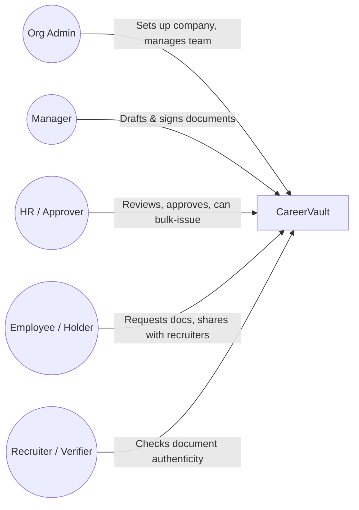
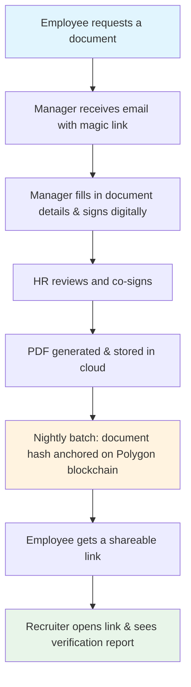
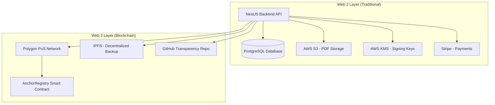
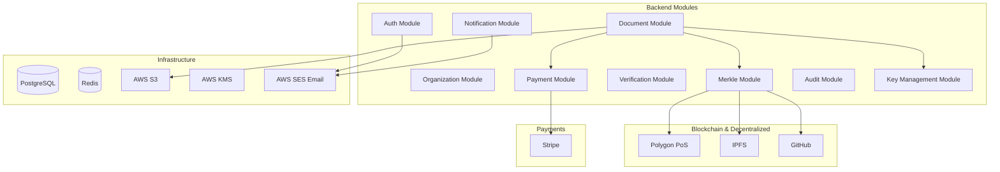
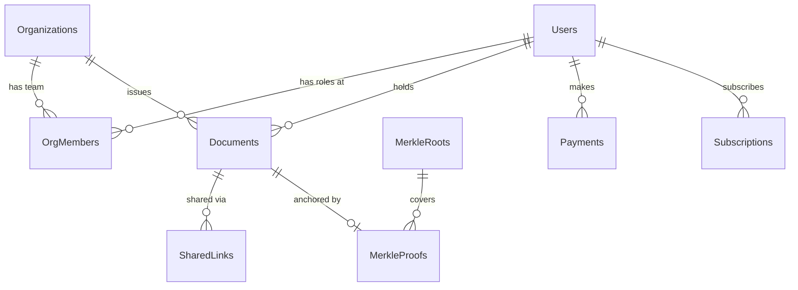
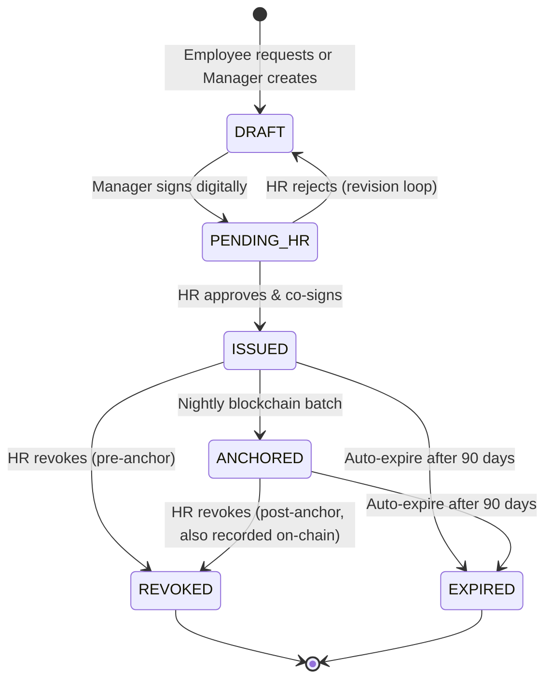
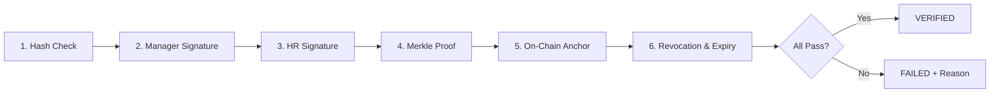

# CareerVault -- Technical Architecture Overview (Investor Edition)

> **Version:** 1.0.0
> **Last Updated:** 2026-03-25
> **One-liner:** A career document verification platform that combines a traditional database with blockchain anchoring for tamper-proof, verifiable experience letters, recommendations, and salary proofs.

---

## Table of Contents

1. [What CareerVault Does](#1-what-careervault-does)
2. [Who Uses It (User Roles)](#2-who-uses-it-user-roles)
3. [How a Document Gets Created & Verified](#3-how-a-document-gets-created--verified)
4. [The "Web 2.5" Architecture](#4-the-web-25-architecture)
5. [System Components & Tech Stack](#5-system-components--tech-stack)
6. [Data Model (Simplified)](#6-data-model-simplified)
7. [Document Lifecycle](#7-document-lifecycle)
8. [Verification -- The Six-Step Integrity Check](#8-verification----the-six-step-integrity-check)
9. [Revenue Model & Payment Flows](#9-revenue-model--payment-flows)
10. [Security, Privacy & Compliance](#10-security-privacy--compliance)
11. [Smart Contract (On-Chain)](#11-smart-contract-on-chain)
12. [Key Design Decisions](#12-key-design-decisions)

---

## 1. What CareerVault Does

CareerVault lets companies **issue cryptographically signed career documents** (experience letters, salary proofs, recommendation letters) to employees. These documents are:

- **Digitally signed** by both the issuing manager and an HR approver using cloud-based keys (AWS KMS).
- **Hashed and anchored on the Polygon blockchain** nightly, creating an immutable proof-of-existence.
- **Verifiable by anyone** (recruiters, background-check firms) through a simple link -- no account needed.

Think of it as a **digital notary for career documents**, where the "notary stamp" lives on a public blockchain.

---

## 2. Who Uses It (User Roles)

| Role | What They Do | Auth Method |
|---|---|---|
| **Org Admin** | Registers company, proves domain ownership via DNS, manages team roles, handles subscription tier | Email/password + JWT |
| **Manager / Issuer** | Drafts and cryptographically signs documents for employees | Magic link (passwordless, 15-min expiry) or email/password |
| **HR / Approver** | Reviews documents, co-signs, can revoke, and handles bulk issuance via CSV | Email/password + JWT |
| **Holder / Employee** | Requests documents, downloads PDFs, generates shareable links | Email/password + JWT |
| **Verifier / Recruiter** | Opens shared links to verify document authenticity -- no account needed | No auth required |

A single person can hold multiple roles (e.g., be a Manager at Company A and a Holder at Company B).

---

## 3. How a Document Gets Created & Verified

### The Happy Path (End-to-End)

**In plain English:**

1. An employee requests an experience letter from their company on CareerVault.
2. Their manager gets an email with a secure one-time link, fills in the letter content, and digitally signs it.
3. HR reviews the content against company records, approves it, and adds a second digital signature.
4. A professional PDF is generated and stored securely (AWS S3).
5. Every night at midnight, all newly issued documents are grouped into a **Merkle tree** (a cryptographic data structure), and the tree's "root hash" is recorded on the Polygon blockchain -- creating an immutable timestamp.
6. The employee generates a shareable link (free for premium users, small fee otherwise) and sends it to a recruiter.
7. The recruiter opens the link and instantly sees a **verification report**: is the content untampered? Are the signatures valid? Is it on the blockchain? Has it been revoked or expired?

---

## 4. The "Web 2.5" Architecture

CareerVault is **not a fully decentralized app**. It's a traditional web application (SQL database, REST API) that uses blockchain as a **trust anchor** -- we call this "Web 2.5."

**Why this approach?**

| Concern | Our Solution |
|---|---|
| Speed & cost | All reads/writes go through PostgreSQL (milliseconds, free). Blockchain is only used for the daily anchor (one transaction/day, ~$0.01 on Polygon). |
| User experience | Users interact with a normal web app. No wallets, no gas fees, no seed phrases. |
| Trust & tamper-proofing | The nightly blockchain anchor means that even if our database were compromised, anyone can independently verify a document against the public blockchain record. |
| Resilience | Merkle roots are published in **three places**: Polygon blockchain, IPFS, and a public GitHub repo. Even if two fail, the proof survives. |

---

## 5. System Components & Tech Stack

| Component | Technology | Purpose |
|---|---|---|
| Backend API | **NestJS** (Node.js/TypeScript) | REST API, business logic, cron jobs |
| Database | **PostgreSQL** | All application data (13 tables) |
| Cache & Queues | **Redis + BullMQ** | Rate limiting, session cache, async job processing (bulk issuance, Merkle batching) |
| File Storage | **AWS S3** | PDF document storage |
| Key Management | **AWS KMS** | RSA 2048-bit key pairs per organization, used for digital signatures |
| Payments | **Stripe** | Subscriptions and one-time payments |
| Email | **AWS SES** | Magic links, notifications |
| Blockchain | **Polygon PoS** | Low-cost Merkle root anchoring (~$0.01/tx) |
| Decentralized Storage | **IPFS** | Backup of Merkle tree data |
| Transparency | **GitHub** | Public repo of daily Merkle roots for independent audit |

---

## 6. Data Model (Simplified)

The platform has **13 database tables**. Here's the simplified view of the core entities:

### Core Tables at a Glance

| Table | What It Stores | Key Fields |
|---|---|---|
| **users** | Everyone on the platform (employees, managers, admins) | email, name, password hash, GDPR deletion timestamp |
| **organizations** | Companies using CareerVault | name, domain, DNS verification status, KMS key reference, subscription tier |
| **organization_members** | Who has what role at which company | user, org, role (ADMIN / MANAGER / HR), active status |
| **documents** | The core asset -- career documents | type, status, content (JSON-LD), hash, dual signatures, expiry, revocation info |
| **merkle_roots** | Daily blockchain anchoring batches | root hash, Polygon tx hash, IPFS CID, GitHub commit, document count |
| **document_merkle_proofs** | Individual proof that a document was in a batch | proof path (array of hashes), leaf index |
| **shared_links** | Shareable URLs for documents | token, view count, max views, expiry, payment reference |
| **subscriptions** | Recurring billing (Holder Premium, Verifier API) | tier, Stripe subscription ID, billing period |
| **payments** | All financial transactions | amount, type (subscription / one-time link / API access), Stripe reference |
| **magic_links** | Passwordless authentication tokens | hashed token, purpose, 15-min expiry, single-use |
| **notifications** | In-app + email notification log | type, read status, metadata for deep-linking |
| **audit_logs** | Compliance trail | actor, action, before/after snapshots, retention tier (90-day or 7-year) |
| **document_versions** | Edit history before issuance | version snapshots, who changed what |

---

## 7. Document Lifecycle

Every document goes through a clear state machine:

| State | Meaning |
|---|---|
| **DRAFT** | Document created, manager is filling in content |
| **PENDING_HR** | Manager has signed; waiting for HR review |
| **ISSUED** | HR approved & co-signed; PDF generated; waiting for nightly anchor |
| **ANCHORED** | Hash recorded on Polygon blockchain; fully verifiable |
| **REVOKED** | Organization withdrew the document (with reason code) |
| **EXPIRED** | Auto-expired after 90 days (experience letters & salary proofs only; recommendation letters never expire) |

**Document Types (V1):**
- Experience / Relieving Letter (expires in 90 days)
- Salary Proof (expires in 90 days)
- Letter of Recommendation (permanent, never expires)

---

## 8. Verification -- The Six-Step Integrity Check

When a recruiter opens a shared link, CareerVault runs **six automated checks** in sequence:

| Step | What It Checks | What a Failure Means |
|---|---|---|
| 1. **Hash Check** | Re-computes SHA-256 hash from document content + salt; compares to stored hash | Content has been tampered with |
| 2. **Manager Signature** | Verifies the manager's digital signature using the org's public key | Document wasn't signed by an authorized person |
| 3. **HR Signature** | Verifies HR's co-signature | HR never approved this document |
| 4. **Merkle Proof** | Recomputes the Merkle root from the document's proof path | Document wasn't part of the claimed batch |
| 5. **On-Chain Anchor** | Queries the Polygon smart contract to confirm the Merkle root exists | Blockchain record doesn't match |
| 6. **Revocation & Expiry** | Checks both database and on-chain revocation status; checks expiry date | Document has been withdrawn or has expired |

The recruiter sees a clear **Verification Report** with pass/fail for each step -- no technical knowledge required.

---

## 9. Revenue Model & Payment Flows

### Revenue Streams

| Stream | Who Pays | Price | How It Works |
|---|---|---|---|
| **Holder Premium** | Employees | $5/month | Unlimited shareable links (free-tier users pay per link) |
| **Per-Link Fee** | Free-tier employees | ~$2/link | One-time Stripe payment to generate a share link |
| **Verifier API** | Recruiters / BG-check firms | Tiered pricing | Paid API for bulk document verification |
| **Issuer-Verifier Discount** | Orgs that both issue & verify | 50% off | Incentivizes orgs to use both sides of the platform |
| **Org Subscriptions** | Companies | FREE / STARTER / ENTERPRISE | Tiered features and rate limits |

### Payment Architecture

- **Processor:** Stripe (subscriptions + one-time payments)
- **Webhooks:** All payment confirmations come via Stripe webhooks (not client-side) for reliability
- **Subscription lifecycle:** Managed entirely through Stripe -- creation, renewal, cancellation, and failed-payment handling

---

## 10. Security, Privacy & Compliance

### Cryptographic Security

| Layer | Mechanism |
|---|---|
| Document integrity | SHA-256 hash of canonicalized content (JCS/RFC 8785) + random salt |
| Digital signatures | RSA 2048-bit via AWS KMS (keys never leave AWS hardware security modules) |
| Dual-signature model | Every document requires both a manager signature and an HR co-signature |
| Blockchain anchoring | Merkle roots on Polygon -- publicly verifiable, immutable |
| Key rotation | Organizations can rotate KMS keys; old keys remain valid for previously signed documents |

### Privacy & GDPR

CareerVault implements **full GDPR Right to be Forgotten** compliance:

1. All PDFs deleted from cloud storage
2. All shareable links deactivated
3. **Salt removed from documents** -- this is the key mechanism: without the salt, the on-chain hash becomes a "dead hash" that can never be linked back to any person or content
4. All personal data (name, email, phone) replaced with anonymized placeholders
5. The deletion itself is logged for legal defensibility (7-year compliance retention)

**The blockchain hash remains** (it's immutable), but it becomes **cryptographically meaningless** without the salt -- satisfying GDPR requirements.

### Audit Trail

- **7-year retention** for critical events: document issuance, revocation, verification, blockchain anchoring, GDPR deletions, key rotations
- **90-day retention** for operational events: logins, profile updates, draft edits, link views
- Every action records: who did it, what changed (before/after snapshots), IP address, timestamp

### Organization Verification

Companies must **prove domain ownership** via DNS TXT record before they can issue any documents. This prevents impersonation -- only someone with admin access to `acme.com`'s DNS can register as Acme Corp on CareerVault.

---

## 11. Smart Contract (On-Chain)

The `AnchorRegistry` smart contract on Polygon is intentionally minimal:

| Function | What It Does |
|---|---|
| `anchorRoot(hash, count)` | Records a Merkle root hash and the number of documents it covers |
| `revokeDocument(hash)` | Marks a specific document hash as revoked on-chain |
| `verifyRoot(hash)` | Returns whether a Merkle root exists and when it was anchored |
| `isRevoked(hash)` | Returns whether a document hash has been revoked |

**Gas costs are negligible** (~$0.01 per daily anchor on Polygon PoS), regardless of how many documents are in the batch (thanks to Merkle trees -- 1,000 documents still produce a single 32-byte root hash).

The contract also supports batch operations (`batchAnchorRoots`, `batchRevokeDocuments`) for efficiency and emits events (`RootAnchored`, `DocumentRevoked`) for transparency.

---

## 12. Key Design Decisions

| Decision | What We Chose | Why |
|---|---|---|
| **Web 2.5, not full Web3** | SQL database + blockchain anchoring | Users don't need wallets or crypto knowledge; blockchain provides trust without the UX friction |
| **Custodial keys** | Platform manages signing keys via AWS KMS | Organizations don't manage their own keys; lowers onboarding barrier |
| **Merkle tree batching** | One blockchain transaction per day for all documents | Cost-efficient (~$0.01/day vs. $0.01 per document); same security guarantee |
| **Triple redundancy** | Polygon + IPFS + GitHub | If any two systems fail, proof can be reconstructed from the third |
| **Dual signatures** | Manager signs + HR co-signs | Two-person integrity; prevents any single individual from issuing fraudulent documents |
| **Salt-based GDPR** | Random salt mixed into hash; delete salt = dead hash | Achieves GDPR compliance without modifying the immutable blockchain |
| **No dispute mediation** | Organization has absolute authority over their documents | Simplifies the system; mirrors real-world employer authority |
| **Magic links for external managers** | 15-minute passwordless links | Professors writing recommendation letters don't need to create an account |
| **90-day document expiry** | Experience letters & salary proofs auto-expire | Encourages document freshness; recommendation letters are permanent |
| **English only (V1)** | Single language for launch | Simplifies content rendering and verification; multi-language is a V2 feature |

---

## Summary

CareerVault is a **career document verification platform** that combines the simplicity and performance of a traditional web application with the trust guarantees of blockchain technology. The architecture is designed to be:

- **Simple for users** -- no crypto wallets, no blockchain knowledge required
- **Trustworthy for verifiers** -- six-layer verification with on-chain proof
- **Compliant for enterprises** -- GDPR-ready with full audit trails
- **Cost-efficient to operate** -- one blockchain transaction per day, regardless of volume
- **Revenue-generating from day one** -- multiple monetization streams across all user types
