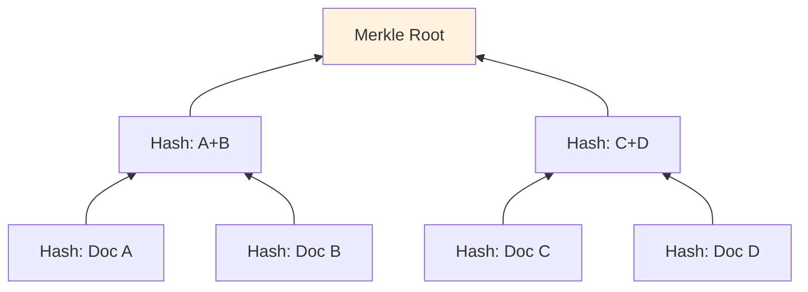
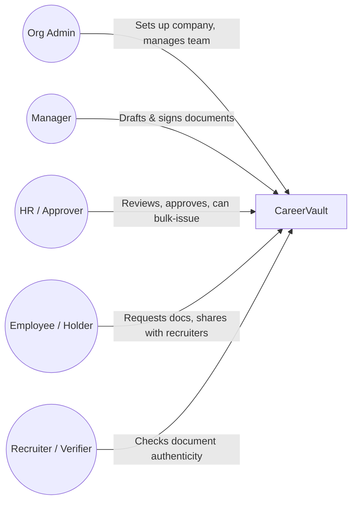
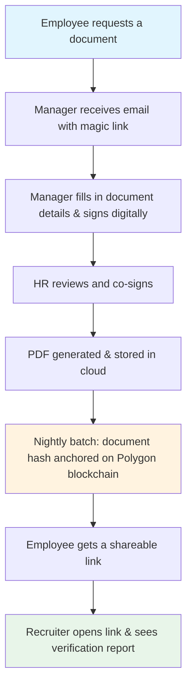
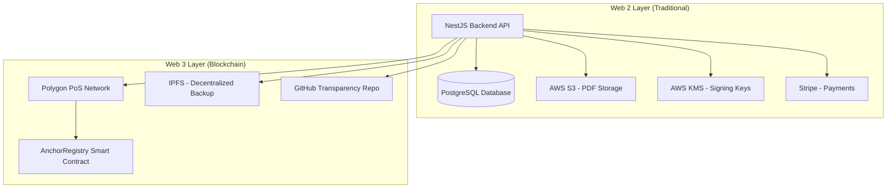
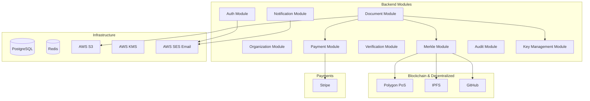
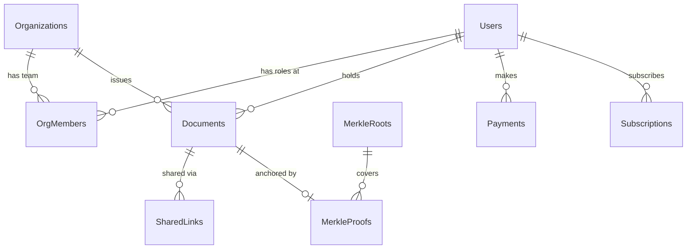
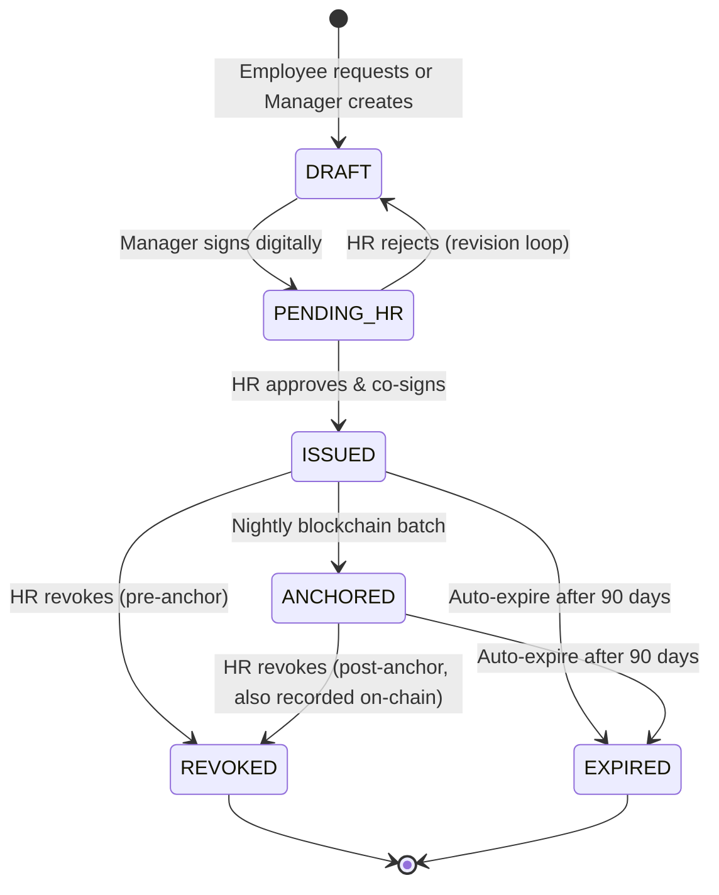
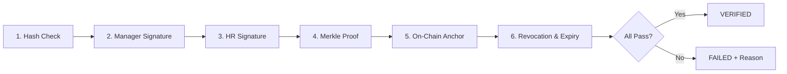

# CareerVault -- Technical Architecture Overview (Investor Edition)

> **Version:** 1.0.0
> **Last Updated:** 2026-03-25
> **One-liner:** A career document verification platform that combines a traditional database with blockchain anchoring for tamper-proof, verifiable experience letters, recommendations, and salary proofs.

> **Implementation status (September 2026, LY final hardening).** This investor edition (March 2026) describes the *target* architecture.
>
> **Implemented today:**
> - PostgreSQL (Supabase), with application-level envelope encryption of document fields and PDFs (R10);
> - custodial RSA-2048 org keys, generated and held by the server and wrapped under a master key held as an environment secret (`KMS_MASTER_KEY`);
> - Merkle anchoring on the **Polygon Amoy testnet** (the contract deploy is pending);
> - public and offline verification.
>
> **Roadmap (not implemented):**
> - AWS KMS/HSM key custody;
> - AWS S3 (PDFs are stored on the server disk, encrypted by the app);
> - AWS SES (Gmail SMTP is wired);
> - live Stripe billing (a mock driver today);
> - Redis/BullMQ queues;
> - the IPFS and GitHub Merkle-root mirrors.
>
> The diagrams show the target. Statements that differ from the code are annotated inline. The code-level spec is [`Crypto_Pipeline_Viva_Guide.md`](Crypto_Pipeline_Viva_Guide.md).

---

## Table of Contents

1. [Objective](#1-objective)
2. [Motivation](#2-motivation)
3. [Problem Statement](#3-problem-statement)
4. [Algorithm -- How Merkle Trees Work](#4-algorithm----how-merkle-trees-work)
5. [What CareerVault Does](#5-what-careervault-does)
6. [Who Uses It (User Roles)](#6-who-uses-it-user-roles)
7. [How a Document Gets Created & Verified](#7-how-a-document-gets-created--verified)
8. [The "Web 2.5" Architecture](#8-the-web-25-architecture)
9. [System Components & Tech Stack](#9-system-components--tech-stack)
10. [Data Model (Simplified)](#10-data-model-simplified)
11. [Document Lifecycle](#11-document-lifecycle)
12. [Verification -- The Six-Step Integrity Check](#12-verification----the-six-step-integrity-check)
13. [Revenue Model & Payment Flows](#13-revenue-model--payment-flows)
14. [Security, Privacy & Compliance](#14-security-privacy--compliance)
15. [Smart Contract (On-Chain)](#15-smart-contract-on-chain)
16. [Key Design Decisions](#16-key-design-decisions)

---

## 1. Objective

Build a **trusted, tamper-proof career document ecosystem** where companies can issue digitally signed experience letters, salary proofs, and recommendation letters, and any recruiter anywhere in the world can independently verify their authenticity in seconds -- without calling HR.

---

## 2. Motivation

Credential fraud is rampant. According to industry surveys, over **30% of job applicants misrepresent their employment history**. Background verification is slow (days to weeks), expensive ($30–$100 per check), and still fails when companies don't respond. Meanwhile, candidates carry no portable proof of their own work history.

CareerVault flips the model: **put the verified proof in the employee's hands**, cryptographically signed by their employer and immutably timestamped on a public blockchain.

---

## 3. Problem Statement

| Pain Point | Who Feels It | Current Workaround |
|---|---|---|
| Fake or inflated experience letters | Recruiters & companies | Slow manual background checks |
| No portable proof of employment | Employees / candidates | Hoping HR responds to verification calls |
| No way to prove a document is unaltered | Verifiers | Trust-based, no cryptographic guarantee |
| Revoked documents still circulating | Issuers (companies) | No mechanism to invalidate distributed copies |
| GDPR vs. immutable records conflict | Platform operators | Typically ignored or handled poorly |

CareerVault solves all five: digital signatures prove authenticity, blockchain anchoring proves integrity, share links give employees portability, revocation propagates instantly, and salt-based GDPR deletion makes on-chain hashes unlinkable without breaking the blockchain. *(As implemented, Sep 2026: deleting the salt stops anyone recomputing or proving the hash from content. However, an issued document's content, including the person's name, stays in our database next to the hash, and the public hash lookup still returns it. Full unlinkability is roadmap; see §14.)*

---

## 4. Algorithm -- How Merkle Trees Work

Instead of writing every document to the blockchain (costly), CareerVault batches documents daily using a **Merkle tree** -- a binary tree of cryptographic hashes.

```mermaid
graph BT
    L1[Hash: Doc A] --> N1[Hash: A+B]
    L2[Hash: Doc B] --> N1
    L3[Hash: Doc C] --> N2[Hash: C+D]
    L4[Hash: Doc D] --> N2
    N1 --> Root[Merkle Root]
    N2 --> Root

    style Root fill:#fff3e0
```

**How it works:**

1. Each issued document is hashed individually (SHA-256 of its content + a random salt).
2. Hashes are paired and hashed together, level by level, until a single **root hash** remains.
3. Only the root hash is written to the Polygon blockchain -- **one transaction for thousands of documents**.
4. Each document gets a **Merkle proof**: a small set of sibling hashes that lets anyone independently recompute the root and confirm inclusion.

**Why it matters:** To verify Document A, you only need its hash and 2–3 sibling hashes (not all documents). This is efficient, private, and independently verifiable by anyone with the public blockchain record.

---

## 5. What CareerVault Does

CareerVault lets companies **issue cryptographically signed career documents** (experience letters, salary proofs, recommendation letters) to employees. These documents are:

- **Digitally signed** by both the issuing manager and an HR approver using the organisation's custodial key. Today that is a server-held RSA-2048 key, wrapped under a master key held as an environment secret (`KMS_MASTER_KEY`); AWS KMS is **roadmap**. Both approvals are signed with the one org key.
- **Hashed and anchored on the Polygon blockchain** nightly (on the Amoy testnet today), creating an immutable proof-of-existence.
- **Verifiable by anyone** (recruiters, background-check firms) through a simple link -- no account needed.

Think of it as a **digital notary for career documents**, where the "notary stamp" lives on a public blockchain.

---

## 6. Who Uses It (User Roles)

```mermaid
graph LR
    OrgAdmin((Org Admin)) -->|Sets up company, manages team| Platform[CareerVault]
    Manager((Manager)) -->|Drafts & signs documents| Platform
    HR((HR / Approver)) -->|Reviews, approves, can bulk-issue| Platform
    Holder((Employee / Holder)) -->|Requests docs, shares with recruiters| Platform
    Verifier((Recruiter / Verifier)) -->|Checks document authenticity| Platform
```

| Role | What They Do | Auth Method |
|---|---|---|
| **Org Admin** | Registers company, proves domain ownership via DNS, manages team roles, handles subscription tier | Email/password + JWT |
| **Manager / Issuer** | Drafts and cryptographically signs documents for employees | Magic link (passwordless, 15-min expiry) or email/password |
| **HR / Approver** | Reviews documents, co-signs, can revoke, and handles bulk issuance via CSV | Email/password + JWT |
| **Holder / Employee** | Requests documents, downloads PDFs, generates shareable links | Email/password + JWT |
| **Verifier / Recruiter** | Opens shared links to verify document authenticity -- no account needed | No auth required |

A single person can hold multiple roles (e.g., be a Manager at Company A and a Holder at Company B).

---

## 7. How a Document Gets Created & Verified

### The Happy Path (End-to-End)

```mermaid
flowchart TD
    A[Employee requests a document] --> B[Manager receives email with magic link]
    B --> C[Manager fills in document details & signs digitally]
    C --> D[HR reviews and co-signs]
    D --> E[PDF generated & stored in cloud]
    E --> F[Nightly batch: document hash anchored on Polygon blockchain]
    F --> G[Employee gets a shareable link]
    G --> H[Recruiter opens link & sees verification report]

    style A fill:#e1f5fe
    style F fill:#fff3e0
    style H fill:#e8f5e9
```

**In plain English:**

1. An employee requests an experience letter from their company on CareerVault.
2. Their manager gets an email with a secure one-time link, fills in the letter content, and digitally signs it.
3. HR reviews the content against company records, approves it, and adds a second digital signature.
4. A professional PDF is generated and stored securely. Today it sits on the server's disk, encrypted by the application; AWS S3 is roadmap.
5. Every night at midnight, all newly issued documents are grouped into a **Merkle tree** (a cryptographic data structure), and the tree's "root hash" is recorded on the Polygon blockchain -- creating an immutable timestamp.
6. The employee generates a shareable link (free for premium users, small fee otherwise) and sends it to a recruiter.
7. The recruiter opens the link and instantly sees a **verification report**: is the content untampered? Are the signatures valid? Is it on the blockchain? Has it been revoked or expired?

---

## 8. The "Web 2.5" Architecture

CareerVault is **not a fully decentralized app**. It's a traditional web application (SQL database, REST API) that uses blockchain as a **trust anchor** -- we call this "Web 2.5."

```mermaid
graph TB
    subgraph "Web 2 Layer (Traditional)"
        API[NestJS Backend API]
        DB[(PostgreSQL Database)]
        S3[AWS S3 - PDF Storage]
        KMS[AWS KMS - Signing Keys]
        Stripe[Stripe - Payments]
    end

    subgraph "Web 3 Layer (Blockchain)"
        Polygon[Polygon PoS Network]
        Contract[AnchorRegistry Smart Contract]
        IPFS[IPFS - Decentralized Backup]
        GitHub[GitHub Transparency Repo]
    end

    API --> DB
    API --> S3
    API --> KMS
    API --> Stripe
    API --> Polygon
    API --> IPFS
    API --> GitHub
    Polygon --> Contract
```

**Why this approach?**

| Concern | Our Solution |
|---|---|
| Speed & cost | All reads/writes go through PostgreSQL (milliseconds, free). Blockchain is only used for the daily anchor (one transaction/day, ~$0.01 on Polygon). |
| User experience | Users interact with a normal web app. No wallets, no gas fees, no seed phrases. |
| Trust & tamper-proofing | The nightly blockchain anchor means that even if our database were compromised, anyone can independently verify a document against the public blockchain record. *(True for documents anchored before a compromise. Someone who can write to the database can still plant a new, self-signed document that verifies as pending and is anchored in the next batch. See the viva guide, limitation L13.)* |
| Resilience | Merkle roots are published in **three places**: Polygon blockchain, IPFS, and a public GitHub repo. Even if two fail, the proof survives. **Roadmap:** only the Polygon anchor is implemented; the IPFS and GitHub mirrors aren't built. Even so, a holder's downloaded credential plus the chain already verify without CareerVault. |

---

## 9. System Components & Tech Stack

```mermaid
graph TB
    subgraph "Backend Modules"
        Auth[Auth Module]
        Org[Organization Module]
        Doc[Document Module]
        Merkle[Merkle Module]
        Verify[Verification Module]
        Pay[Payment Module]
        Notif[Notification Module]
        Audit[Audit Module]
        KMSMod[Key Management Module]
    end

    subgraph "Infrastructure"
        PG[(PostgreSQL)]
        Redis[(Redis)]
        S3[AWS S3]
        KMS[AWS KMS]
        SES[AWS SES Email]
    end

    subgraph "Blockchain & Decentralized"
        Polygon[Polygon PoS]
        IPFS[IPFS]
        GH[GitHub]
    end

    subgraph "Payments"
        Stripe[Stripe]
    end

    Doc --> KMSMod
    Doc --> Merkle
    Doc --> Pay
    Merkle --> Polygon
    Merkle --> IPFS
    Merkle --> GH
    Pay --> Stripe
    Auth --> SES
    Notif --> SES
    Doc --> S3
```

| Component | Technology | Purpose | Status (Sep 2026) |
|---|---|---|---|
| Backend API | **NestJS** (Node.js/TypeScript) | REST API, business logic, cron jobs | Implemented |
| Database | **PostgreSQL** | All application data (21 tables in the implemented schema; the March design had 13) | Implemented (Supabase + pgvector; R10 field encryption) |
| Cache & Queues | **Redis + BullMQ** | Rate limiting, session cache, async job processing (bulk issuance, Merkle batching) | Roadmap (in-process today) |
| File Storage | **AWS S3** | PDF document storage | Roadmap (server disk, encrypted by the app) |
| Key Management | **AWS KMS** | RSA 2048-bit key pairs per organization, used for digital signatures | Roadmap (local RSA-2048 keys, wrapped under a master key held as an environment secret, `KMS_MASTER_KEY`) |
| Payments | **Stripe** | Subscriptions and one-time payments | Roadmap (mock driver) |
| Email | **AWS SES** | Magic links, notifications | Roadmap (Gmail SMTP / console) |
| Blockchain | **Polygon PoS** | Low-cost Merkle root anchoring (~$0.01/tx) | Implemented on the Amoy testnet (contract deploy pending) |
| Decentralized Storage | **IPFS** | Backup of Merkle tree data | Roadmap |
| Transparency | **GitHub** | Public repo of daily Merkle roots for independent audit | Roadmap |

---

## 10. Data Model (Simplified)

The platform has **21 database tables** in the implemented schema (the original design had 13). Here's the simplified view of the core entities:

```mermaid
erDiagram
    Users ||--o{ OrgMembers : "has roles at"
    Organizations ||--o{ OrgMembers : "has team"
    Users ||--o{ Documents : "holds"
    Organizations ||--o{ Documents : "issues"
    Documents ||--o{ SharedLinks : "shared via"
    Documents ||--o| MerkleProofs : "anchored by"
    MerkleRoots ||--o{ MerkleProofs : "covers"
    Users ||--o{ Payments : "makes"
    Users ||--o{ Subscriptions : "subscribes"
```

### Core Tables at a Glance

| Table | What It Stores | Key Fields |
|---|---|---|
| **users** | Everyone on the platform (employees, managers, admins) | email, name, password hash, GDPR deletion timestamp |
| **organizations** | Companies using CareerVault | name, domain, DNS verification status, KMS key reference, subscription tier |
| **organization_members** | Who has what role at which company | user, org, role (ADMIN / MANAGER / HR), active status |
| **documents** | The core asset -- career documents | type, status, content (JSON-LD), hash, dual signatures, expiry, revocation info |
| **merkle_roots** | Daily blockchain anchoring batches | root hash, Polygon tx hash and block, chain id, contract address, document count. The IPFS CID and GitHub commit columns exist but are never filled; the mirrors are roadmap. |
| **document_merkle_proofs** | Individual proof that a document was in a batch | proof path (array of hashes), leaf index |
| **shared_links** | Shareable URLs for documents | token, view count, max views, expiry, payment reference |
| **subscriptions** | Recurring billing (Holder Premium, Verifier API) | tier, Stripe subscription ID, billing period |
| **payments** | All financial transactions | amount, type (subscription / one-time link / API access), Stripe reference |
| **magic_links** | Passwordless authentication tokens | hashed token, purpose, 15-min expiry, single-use |
| **notifications** | In-app + email notification log | type, read status, metadata for deep-linking |
| **audit_logs** | Compliance trail | actor, action, before/after snapshots, retention tier (90-day or 7-year) |
| **document_versions** | Edit history before issuance | version snapshots, who changed what |

---

## 11. Document Lifecycle

Every document goes through a clear state machine:

```mermaid
stateDiagram-v2
    [*] --> DRAFT : Employee requests or Manager creates

    DRAFT --> PENDING_HR : Manager signs digitally
    PENDING_HR --> ISSUED : HR approves & co-signs
    PENDING_HR --> DRAFT : HR rejects (revision loop)

    ISSUED --> ANCHORED : Nightly blockchain batch
    ISSUED --> REVOKED : HR revokes (pre-anchor)
    ANCHORED --> REVOKED : HR revokes (post-anchor, also recorded on-chain)

    ISSUED --> EXPIRED : Auto-expire after 90 days
    ANCHORED --> EXPIRED : Auto-expire after 90 days

    REVOKED --> [*]
    EXPIRED --> [*]
```

| State | Meaning |
|---|---|
| **DRAFT** | Document created, manager is filling in content |
| **PENDING_HR** | Manager has signed; waiting for HR review |
| **ISSUED** | HR approved & co-signed; PDF generated; waiting for nightly anchor |
| **ANCHORED** | Hash recorded on Polygon blockchain; fully verifiable |
| **REVOKED** | Organization withdrew the document (with reason code) |
| **EXPIRED** | Auto-expired after 90 days (experience letters & salary proofs only; recommendation letters never expire) |

**Document Types (V1):**
- Experience / Relieving Letter (expires in 90 days)
- Salary Proof (expires in 90 days)
- Letter of Recommendation (permanent, never expires)

---

## 12. Verification -- The Six-Step Integrity Check

When a recruiter opens a shared link, CareerVault runs **six automated checks** in sequence:

```mermaid
flowchart LR
    A[1. Hash Check] --> B[2. Manager Signature]
    B --> C[3. HR Signature]
    C --> D[4. Merkle Proof]
    D --> E[5. On-Chain Anchor]
    E --> F[6. Revocation & Expiry]
    F --> G{All Pass?}
    G -->|Yes| H[VERIFIED]
    G -->|No| I[FAILED + Reason]
```

| Step | What It Checks | What a Failure Means |
|---|---|---|
| 1. **Hash Check** | Re-computes SHA-256 hash from document content + salt; compares to stored hash | Content has been tampered with |
| 2. **Manager Signature** | Verifies the manager's digital signature using the org's public key | Document wasn't signed by an authorized person |
| 3. **HR Signature** | Verifies HR's co-signature | HR never approved this document |
| 4. **Merkle Proof** | Recomputes the Merkle root from the document's proof path | Document wasn't part of the claimed batch |
| 5. **On-Chain Anchor** | Queries the Polygon smart contract to confirm the Merkle root exists | Blockchain record doesn't match |
| 6. **Revocation & Expiry** | Checks the database revocation status (authoritative) and the expiry date; the on-chain revocation flag is shown as a note | Document has been withdrawn or has expired |

The recruiter sees a clear **Verification Report** with pass/fail for each step -- no technical knowledge required.

> **As implemented (Sep 2026):** the server's six checks are 1. document on record, 2. content integrity, 3. manager signature, 4. HR signature, 5. blockchain anchor (Merkle proof checked locally, then the root on-chain), 6. revocation and expiry. An unreachable chain reads as `VERIFIED_PENDING_ANCHOR`, not as a failure. An independent offline verifier (`tools/verify-credential`) repeats the checks without CareerVault. See [`Crypto_Pipeline_Viva_Guide.md`](Crypto_Pipeline_Viva_Guide.md) §1.3–1.4.

---

## 13. Revenue Model & Payment Flows

### Revenue Streams

| Stream | Who Pays | Price | How It Works |
|---|---|---|---|
| **Holder Premium** | Employees | $5/month | Unlimited shareable links (free-tier users pay per link) |
| **Per-Link Fee** | Free-tier employees | ~$2/link | One-time Stripe payment to generate a share link |
| **Verifier API** | Recruiters / BG-check firms | Tiered pricing | Paid API for bulk document verification |
| **Issuer-Verifier Discount** | Orgs that both issue & verify | 50% off | Incentivizes orgs to use both sides of the platform |
| **Org Subscriptions** | Companies | FREE / STARTER / ENTERPRISE | Tiered features and rate limits |

### Payment Architecture

- **Processor:** Stripe (subscriptions + one-time payments)
- **Webhooks:** All payment confirmations come via Stripe webhooks (not client-side) for reliability
- **Subscription lifecycle:** Managed entirely through Stripe -- creation, renewal, cancellation, and failed-payment handling

---

## 14. Security, Privacy & Compliance

### Cryptographic Security

| Layer | Mechanism |
|---|---|
| Document integrity | SHA-256 hash of canonicalized content (JCS/RFC 8785) + a 256-bit random salt |
| Digital signatures | RSA-2048 / RS256. Each org's private key is generated and used by the server, and stored as a file, AES-256-GCM-wrapped under a master key held as an environment secret (`KMS_MASTER_KEY`). **Roadmap:** AWS KMS/HSM custody, where keys would never leave the HSM. |
| Dual-signature model | Every document requires both a manager signature and an HR co-signature. Each is over a distinct role-bound statement. Both are made with the organisation's single key: separation of duties is enforced by the application and recorded in the signed statements (per-member keys: roadmap). |
| Blockchain anchoring | Merkle roots on the **Polygon Amoy testnet** (`AnchorRegistry` at `<AMOY_REGISTRY_ADDRESS>` after deployment) -- publicly verifiable, immutable. Mainnet is a deploy plus a configuration change. |
| Key rotation | Each document records the public key it was signed under, so replacing an org key never invalidates issued documents; the server re-keys automatically if key material is lost. There is no admin "rotate key" action yet, and master-key (KEK) rotation tooling is **roadmap**. |
| Field encryption (R10) | Sensitive document fields, version history and PDFs are envelope-encrypted by the application (AES-256-GCM, a data key per row payload, field-bound AAD), so the database, its backups and a live SQL console hold ciphertext. |

### Privacy & GDPR

Account deletion (`DELETE /users/me`) implements the Right to be Forgotten as follows (status as of September 2026):

1. **Roadmap:** stored PDFs are **not yet deleted** on erasure. They remain on the server's disk, encrypted at rest by the application.
2. All shareable links deactivated.
3. **Salt removed from all of the holder's documents.** Without the salt, nobody can recompute or prove the anchored hash from content. On its own this does **not** make the hash unlinkable yet: see the note below.
4. The user's name, email and phone are replaced with anonymized placeholders.
   - Drafts and every version snapshot are scrubbed.
   - AI/discovery data, messages, notifications and sessions are deleted, and verifier API keys are revoked.
   - **Issued documents' content is retained** (encrypted) as the issuer's record.
5. **Roadmap:** the erasure itself is **not yet written to the audit log**.

**The blockchain hash remains** (it's immutable), and without the salt no one can recompute it from content. **Today, though, the link survives in our own database.** An issued document's content stays in the same row as the plaintext hash, and the public hash lookup (`/verify/hash/<hash>`) still returns its allow-listed fields, including the person's name on experience letters and recommendations. Since the hash is printed on the PDF, anyone holding an erased person's PDF can still read their name. Full unlinkability needs the roadmap issued-content scrub, or at least withholding content from the public lookup once the salt is gone (a pending code change). The retention of issued content (point 4) also still needs a legal answer.

### Audit Trail

- **COMPLIANCE tier (7-year policy; never auto-purged):**
  - audited today: document signing, issuance and revocation; every public verification (hash lookups and share-link views); bulk issuance; org signing-key replacement;
  - **not yet audited:** blockchain anchoring, GDPR deletions.
- **STANDARD tier (auto-purged after 90 days):**
  - audited today: document rejection only;
  - **not yet audited:** logins, profile updates, draft edits.
- **What each row records:** the actor, the action, the entity, the new values (`new_value`) and a timestamp. Before-snapshots (`old_value`), IP address and user agent have columns but **aren't populated yet**.

### Organization Verification

Companies must **prove domain ownership** via DNS TXT record before they can issue any documents. This prevents impersonation -- only someone with admin access to `acme.com`'s DNS can register as Acme Corp on CareerVault.

---

## 15. Smart Contract (On-Chain)

The `AnchorRegistry` smart contract on Polygon is intentionally minimal. It targets the Amoy testnet, at `<AMOY_REGISTRY_ADDRESS>` once the pending deploy runs, and only authorized anchor wallets can write to it:

| Function | What It Does |
|---|---|
| `anchorRoot(hash, count)` | Records a Merkle root hash and the number of documents it covers |
| `revokeDocument(hash)` | Marks a specific document hash as revoked on-chain |
| `verifyRoot(hash)` | Returns whether a Merkle root exists and when it was anchored |
| `isRevoked(hash)` | Returns whether a document hash has been revoked |

**Gas costs are negligible** (~$0.01 per daily anchor on Polygon PoS; measured at ~137.5k gas per `anchorRoot`), regardless of how many documents are in the batch (thanks to Merkle trees -- 1,000 documents still produce a single 32-byte root hash).

The contract also supports batch operations (`batchAnchorRoots`, `batchRevokeDocuments`) for efficiency and emits events (`RootAnchored`, `DocumentRevoked`) for transparency.

---

## 16. Key Design Decisions

| Decision | What We Chose | Why |
|---|---|---|
| **Web 2.5, not full Web3** | SQL database + blockchain anchoring | Users don't need wallets or crypto knowledge; blockchain provides trust without the UX friction |
| **Custodial keys** | Platform manages signing keys (today: server-held keys wrapped under a master key held as an environment secret, `KMS_MASTER_KEY`; AWS KMS is roadmap) | Organizations don't manage their own keys; lowers onboarding barrier |
| **Merkle tree batching** | One blockchain transaction per day for all documents | Cost-efficient (~$0.01/day vs. $0.01 per document); same security guarantee |
| **Triple redundancy** | Polygon + IPFS + GitHub (**roadmap:** only Polygon is implemented) | If any two systems fail, proof can be reconstructed from the third |
| **Dual signatures** | Manager signs + HR co-signs | Two-person integrity on the interactive path: the application enforces two different people. Both signatures use the organisation's single key, and bulk issuance lets one HR member issue directly. |
| **Salt-based GDPR** | Random salt mixed into hash; delete salt = dead hash | Achieves GDPR compliance without modifying the immutable blockchain. *(As implemented: deleting the salt stops recomputation, but issued content stays linked to the hash and the public lookup still returns the name. Full unlinkability is roadmap; see §14.)* |
| **No dispute mediation** | Organization has absolute authority over their documents | Simplifies the system; mirrors real-world employer authority |
| **Magic links for external managers** | 15-minute passwordless links | Professors writing recommendation letters don't need to create an account |
| **90-day document expiry** | Experience letters & salary proofs auto-expire | Encourages document freshness; recommendation letters are permanent |
| **English only (V1)** | Single language for launch | Simplifies content rendering and verification; multi-language is a V2 feature |

---

## Summary

CareerVault is a **career document verification platform** that combines the simplicity and performance of a traditional web application with the trust guarantees of blockchain technology. The architecture is designed to be:

- **Simple for users** -- no crypto wallets, no blockchain knowledge required
- **Trustworthy for verifiers** -- six-layer verification with on-chain proof
- **Compliant for enterprises** -- salt-based GDPR erasure and a compliance audit trail for the document lifecycle (full erasure and wider audit coverage are roadmap; see §14)
- **Cost-efficient to operate** -- one blockchain transaction per day, regardless of volume
- **Revenue-generating from day one** -- multiple monetization streams across all user types
