# CareerVault -- System Design, UML & Database Documentation

> **Version:** 1.0.0
> **Last Updated:** 2026-03-22
> **Platform:** Career Verification Platform (Web 2.5: SQL + Merkle Anchoring on Polygon)
> **Stack:** NestJS / PostgreSQL / AWS KMS / Polygon PoS / Stripe / S3

---

## Table of Contents

1. [Use Case Diagrams](#1-use-case-diagrams)
2. [Class Diagram](#2-class-diagram)
3. [Database Design](#3-database-design)
4. [Sequence Diagrams](#4-sequence-diagrams)
5. [State Diagrams](#5-state-diagrams)
6. [Activity Diagrams](#6-activity-diagrams)
7. [Component Diagram](#7-component-diagram)
8. [Data Flow Diagrams](#8-data-flow-diagrams)
9. [JSON-LD Schema](#9-json-ld-schema)
10. [Smart Contract Interface](#10-smart-contract-interface)

---

## Key Design Decisions (Locked-In)

| Decision | Choice |
|---|---|
| Identity model | One unified `users` table; `organization_members` join table (userId, orgId, role). A person can be Holder AND Manager at different orgs. |
| Key management | Custodial via AWS KMS / HashiCorp Vault. Platform holds keys on behalf of orgs. |
| Resilience | Merkle proof embedded in PDF metadata; daily roots published to GitHub and IPFS. |
| Canonicalization | JCS (RFC 8785) for deterministic JSON serialization before hashing. |
| Monetization | Holders: free storage, $5/mo premium or per-link fee. Verifiers: paid bulk API. 50% discount for issuer-verifiers. |
| Document expiry | Experience/Salary: 90 days. LOR: permanent (null `expires_at`). |
| Bulk issuance | HR only, for experience/salary letters. |
| Disputes | No mediation. Organization has absolute authority. |
| Revocation codes | Enum (`ADMINISTRATIVE_ERROR`, `POLICY_VIOLATION`, `ISSUED_IN_ERROR`) + optional free-text. |
| Document types (V1) | `EXPERIENCE_LETTER`, `LETTER_OF_RECOMMENDATION`, `SALARY_PROOF` |
| Language | English only (V1). |
| Notifications | Email + in-app. |
| GDPR deletion | Full wipe: user row, PDF, shared links, salt. Hash stays on-chain but is dead (unlinkable). |
| Audit retention | 7 years for issuance logs (`COMPLIANCE` tier), 90 days for system logs (`STANDARD` tier). |
| Auth | Magic links (JWT, 15-min) for external managers. Email/password + JWT for holders/admins/HR. |

---

## 1. Use Case Diagrams

### 1.1 Org Admin Use Cases

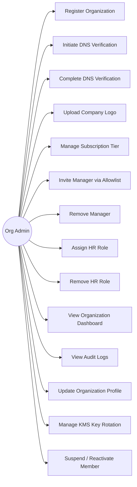

#### Explanation

The Org Admin is the highest-authority actor within an organization on CareerVault. Their responsibilities span the full lifecycle of the organization on the platform:

- **Register Organization:** Creates the organization entity, providing company name and domain. The system generates a DNS verification token (`dns_token`) and creates an initial `organizations` row with `is_verified = false`.
- **Initiate / Complete DNS Verification:** The admin places a TXT record containing `dns_token` on the company domain. The system queries DNS to confirm ownership. On success, `is_verified` flips to `true`, `verified_at` is stamped, and a DID (`root_did`) is minted for the org.
- **Upload Company Logo:** Sets `logo_url` on the organization record for branding on issued documents.
- **Manage Subscription Tier:** Upgrades or downgrades the org between `FREE`, `STARTER`, and `ENTERPRISE` tiers. This affects rate limits and feature availability.
- **Invite Manager / Assign HR:** Creates `organization_members` rows with the appropriate `role` enum. Manager invitations generate magic links; HR assignment is done for existing members.
- **Remove Manager / HR:** Soft-deletes by setting `is_active = false` on the `organization_members` row. Does not delete the underlying `users` row.
- **View Audit Logs:** Reads `audit_logs` filtered by `entity_type = 'ORGANIZATION'` and the org's `entity_id`.
- **Manage KMS Key Rotation:** Triggers key rotation in AWS KMS. The new `kms_key_id` ARN is stored on the `organizations` row. Old keys remain accessible for verification of previously signed documents.
- **Suspend / Reactivate Member:** Toggles `is_active` on `organization_members` without removing the row.

---

### 1.2 Manager Use Cases

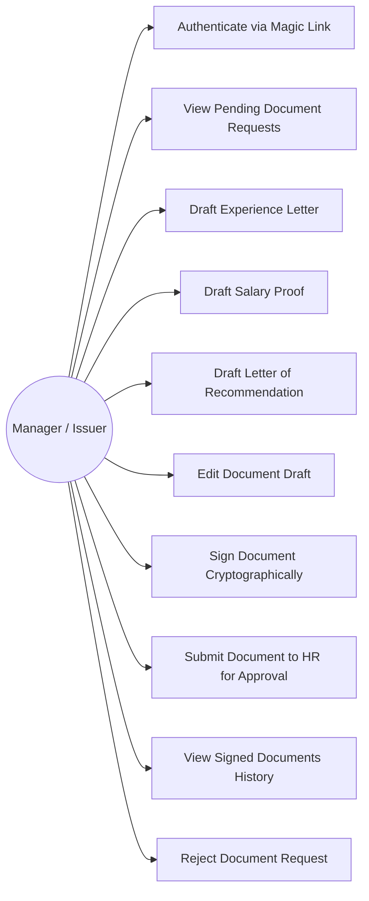

#### Explanation

The Manager (Issuer) is the person who drafts and signs career documents. They may be an internal employee or an external party (for LORs). Key points:

- **Magic Link Authentication:** External managers (e.g., a former professor writing a LOR) authenticate via a time-limited magic link (15-minute JWT). Internal managers who are also holders use email/password auth.
- **Draft Documents:** Managers create documents by populating `content_json` (JSON-LD, W3C Verifiable Credential format). For LORs, the flow is strictly 1-to-1 between the manager and the holder.
- **Sign Document Cryptographically:** The manager triggers signing. The system canonicalizes `content_json` via JCS (RFC 8785), appends the `salt`, computes SHA-256, and signs using the organization's KMS key. The signature is stored in `manager_signature`.
- **Submit to HR:** After signing, the document status transitions from `DRAFT` to `PENDING_HR`. This triggers a notification to the assigned HR member.
- **Reject Document Request:** The manager can decline a holder's request, providing a reason. This does not create a `documents` row (or deletes the draft if one exists).

---

### 1.3 HR (Approver) Use Cases

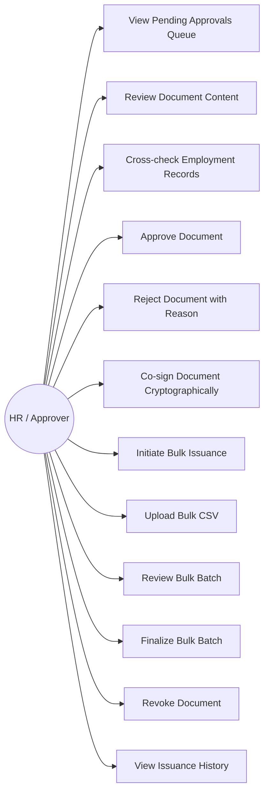

#### Explanation

The HR (Approver) is the organizational gatekeeper ensuring document accuracy and compliance:

- **View Pending Approvals Queue:** Lists all documents with `status = 'PENDING_HR'` for the HR member's organization.
- **Cross-check Employment Records:** HR verifies the data in `content_json` against internal records (dates of employment, designation, salary figures, etc.) before approving.
- **Approve & Co-sign:** On approval, HR triggers a second cryptographic signature (`hr_signature`) using the org's KMS key. The `approver_member_id` is set, status moves to `ISSUED`, and `issued_at` is stamped.
- **Reject with Reason:** Returns the document to `DRAFT` status with feedback. The manager receives a notification and can revise and resubmit.
- **Bulk Issuance:** HR can upload a CSV of employees and generate experience letters or salary proofs in batch. This is restricted to HR only and to `EXPERIENCE_LETTER` and `SALARY_PROOF` types. Each row in the CSV maps to a separate `documents` entry. The system auto-signs with the org's KMS key (manager signature is the HR member's own `organization_members.id` in this case).
- **Revoke Document:** HR can revoke any issued document from their org. They must select a `revocation_reason_code` and optionally provide `revocation_reason_text`. `revoked_at` and `revoked_by` are set.

---

### 1.4 Holder Use Cases

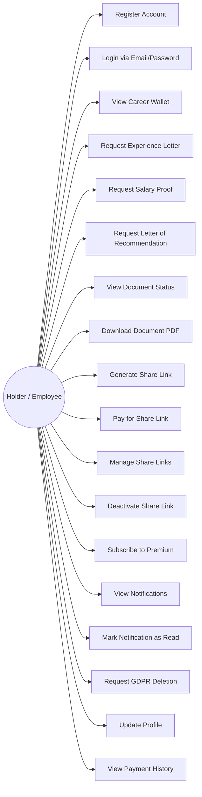

#### Explanation

The Holder (Employee) is the primary consumer of CareerVault. They accumulate verified career documents in a personal wallet:

- **Register / Login:** Standard email/password registration with JWT-based sessions. The `users` table stores credentials.
- **Career Wallet:** A dashboard listing all documents across all organizations where the holder has received documents. Documents are filtered by status and type.
- **Request Documents:** The holder initiates a request by specifying the type, the target organization, and optionally a specific manager (required for LORs). This creates a `documents` row with `status = 'DRAFT'` and sends a notification/magic-link to the manager.
- **Download PDF:** The holder can download the rendered PDF from S3 (`rendered_pdf_url`). The PDF contains the Merkle proof embedded in its metadata for offline verification.
- **Share Links:** The holder generates a unique URL (`url_token`) for a document. Free-tier holders pay a per-link fee; premium ($5/mo) holders get unlimited links. Links can have `max_views` and `expires_at` constraints.
- **GDPR Deletion:** The holder can invoke Right to be Forgotten. The system wipes: `users` row fields, all PDFs from S3, all `shared_links`, the `salt` from documents (rendering the on-chain hash unlinkable). The hash remains on-chain but is cryptographically dead.
- **Notifications:** Email and in-app notifications for every state change in document lifecycle, payment events, and link views.

---

### 1.5 Verifier Use Cases

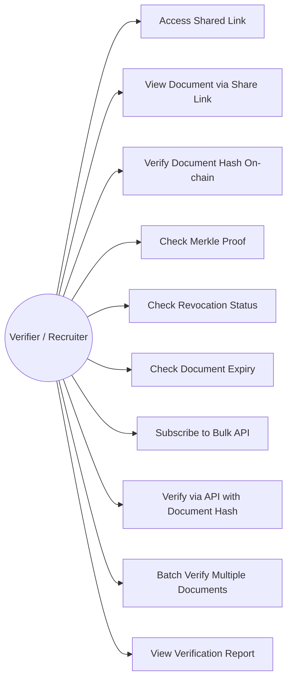

#### Explanation

Verifiers are external actors (recruiters, background-check firms) who consume CareerVault's verification capabilities:

- **Access Shared Link:** Verifiers receive a URL from holders. The system resolves `url_token`, checks `is_active`, `expires_at`, and `max_views`, then renders the document.
- **Verify Document Hash On-chain:** The verification flow recomputes `SHA-256(JCS(content_json) + salt)`, looks up the `document_merkle_proofs` entry, recomputes the Merkle path up to the root, and checks that root against the Polygon smart contract.
- **Check Revocation Status:** The system checks `documents.status` for `REVOKED` and returns revocation details if applicable.
- **Check Document Expiry:** For experience letters and salary proofs, the system checks if `expires_at` has passed and returns the expiry status.
- **Bulk API:** Enterprise verifiers subscribe to a paid API plan. The API accepts document hashes and returns verification results. The 50% discount applies to organizations that are also issuers on the platform.
- **Verification Report:** A structured JSON response containing: document metadata, hash match result, Merkle proof validity, on-chain anchor confirmation, revocation status, and expiry status.

---

### 1.6 System (Automated) Use Cases

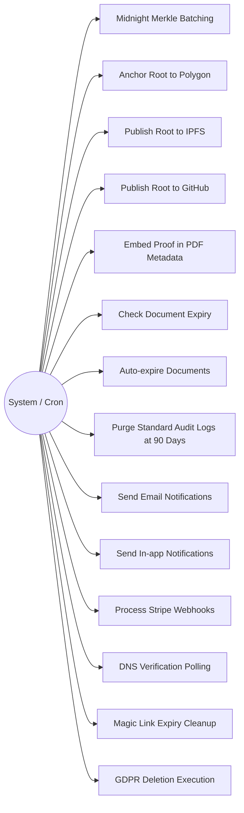

#### Explanation

System (automated) use cases represent background jobs and cron tasks:

- **Midnight Merkle Batching:** A daily cron job collects all documents with `status = 'ISSUED'` that have not yet been anchored. It builds a Merkle tree from their hashes, anchors the root on Polygon, publishes the root to IPFS and GitHub, and updates each document's status to `ANCHORED`. Individual proofs are stored in `document_merkle_proofs`.
- **Document Expiry Check:** A daily cron scans for documents where `expires_at < NOW()` and `status` is not already `EXPIRED` or `REVOKED`. Matching documents transition to `EXPIRED`.
- **Audit Log Purge:** A daily cron deletes `audit_logs` rows where `retention_tier = 'STANDARD'` and `created_at < NOW() - 90 days`. `COMPLIANCE` tier logs are retained for 7 years.
- **Stripe Webhooks:** Handles `payment_intent.succeeded`, `payment_intent.payment_failed`, `customer.subscription.updated`, `customer.subscription.deleted` events. Updates `payments` and `subscriptions` tables accordingly.
- **DNS Verification Polling:** Periodically re-checks DNS TXT records for organizations with `is_verified = false` that have initiated verification.
- **Magic Link Expiry Cleanup:** Purges expired magic link rows (where `expires_at < NOW()` and `used_at IS NULL`).
- **GDPR Deletion Execution:** When a holder requests deletion, a background job handles the cascade: nullifies user PII, deletes S3 objects, deactivates shared links, removes salts from documents, and sets `gdpr_deleted_at`.

---

## 2. Class Diagram

```mermaid
classDiagram
    class User {
        +UUID id
        +String email
        +String password_hash
        +String full_name
        +String phone
        +String avatar_url
        +Boolean is_active
        +DateTime gdpr_deleted_at
        +DateTime created_at
        +DateTime updated_at
        +register()
        +login()
        +updateProfile()
        +requestGDPRDeletion()
    }

    class Organization {
        +UUID id
        +String name
        +String domain
        +String dns_token
        +Boolean is_verified
        +DateTime verified_at
        +String root_did
        +String kms_key_id
        +SubscriptionTier subscription_tier
        +String logo_url
        +DateTime created_at
        +DateTime updated_at
        +initiateDNSVerification()
        +completeDNSVerification()
        +rotateKMSKey()
    }

    class OrganizationMember {
        +UUID id
        +UUID user_id
        +UUID organization_id
        +MemberRole role
        +String corporate_email
        +Boolean is_active
        +DateTime invited_at
        +DateTime joined_at
        +invite()
        +deactivate()
        +reactivate()
    }

    class Document {
        +UUID id
        +DocumentType type
        +DocumentStatus status
        +UUID holder_id
        +UUID organization_id
        +UUID signer_member_id
        +UUID approver_member_id
        +JSONB content_json
        +String rendered_pdf_url
        +String salt
        +String document_hash
        +String manager_signature
        +String hr_signature
        +Integer version
        +DateTime expires_at
        +RevocationCode revocation_reason_code
        +String revocation_reason_text
        +DateTime revoked_at
        +UUID revoked_by
        +DateTime issued_at
        +DateTime created_at
        +DateTime updated_at
        +draft()
        +submitForApproval()
        +approve()
        +reject()
        +issue()
        +revoke()
        +expire()
        +computeHash()
    }

    class DocumentVersion {
        +UUID id
        +UUID document_id
        +Integer version_number
        +JSONB content_json
        +UUID changed_by
        +String change_summary
        +DateTime created_at
    }

    class MerkleRoot {
        +UUID id
        +String root_hash
        +String polygon_tx_hash
        +BigInt polygon_block_number
        +Integer document_count
        +String ipfs_cid
        +String github_commit_url
        +DateTime anchored_at
        +DateTime created_at
    }

    class DocumentMerkleProof {
        +UUID id
        +UUID document_id
        +UUID merkle_root_id
        +JSONB proof_path
        +Integer leaf_index
        +DateTime created_at
        +verifyProof()
    }

    class SharedLink {
        +UUID id
        +UUID document_id
        +String url_token
        +Boolean is_paid
        +UUID payment_id
        +Integer views
        +Integer max_views
        +DateTime expires_at
        +Boolean is_active
        +DateTime created_at
        +incrementViews()
        +deactivate()
        +isExpired()
    }

    class Subscription {
        +UUID id
        +UUID user_id
        +SubscriptionTier tier
        +SubscriptionStatus status
        +String stripe_subscription_id
        +DateTime started_at
        +DateTime current_period_end
        +DateTime cancelled_at
        +DateTime created_at
        +activate()
        +cancel()
        +renew()
    }

    class Payment {
        +UUID id
        +UUID user_id
        +Decimal amount
        +String currency
        +PaymentType type
        +PaymentStatus status
        +String stripe_payment_intent_id
        +JSONB metadata
        +DateTime created_at
        +process()
        +refund()
    }

    class MagicLink {
        +UUID id
        +String email
        +String token_hash
        +MagicLinkPurpose purpose
        +UUID document_id
        +DateTime expires_at
        +DateTime used_at
        +DateTime created_at
        +generate()
        +validate()
        +markUsed()
    }

    class Notification {
        +UUID id
        +UUID user_id
        +NotificationType type
        +String title
        +String body
        +Boolean is_read
        +JSONB metadata
        +DateTime created_at
        +markAsRead()
    }

    class AuditLog {
        +UUID id
        +UUID actor_id
        +ActorType actor_type
        +String action
        +String entity_type
        +UUID entity_id
        +JSONB old_value
        +JSONB new_value
        +String ip_address
        +String user_agent
        +RetentionTier retention_tier
        +DateTime created_at
    }

    class AuthService {
        +register(email, password, fullName)
        +login(email, password)
        +generateJWT(userId)
        +validateJWT(token)
        +generateMagicLink(email, purpose, documentId)
        +validateMagicLink(token)
        +resetPassword(token, newPassword)
    }

    class DocumentService {
        +createDraft(holderId, type, orgId, signerMemberId)
        +updateDraft(documentId, contentJson)
        +submitForApproval(documentId)
        +approveDocument(documentId, approverMemberId)
        +rejectDocument(documentId, reason)
        +issueDocument(documentId)
        +revokeDocument(documentId, reasonCode, reasonText, revokedBy)
        +generatePDF(documentId)
        +bulkIssue(orgId, hrMemberId, csvData)
        +checkExpiry()
    }

    class MerkleService {
        +buildTree(documentHashes)
        +computeRoot(tree)
        +generateProof(tree, leafIndex)
        +verifyProof(leafHash, proof, root)
        +anchorToPolygon(rootHash)
        +publishToIPFS(tree)
        +publishToGitHub(rootHash, tree)
        +embedProofInPDF(documentId)
        +runDailyBatch()
    }

    class VerificationService {
        +verifyByShareLink(urlToken)
        +verifyByHash(documentHash)
        +verifyMerkleProof(documentId)
        +checkRevocationStatus(documentId)
        +checkExpiryStatus(documentId)
        +generateVerificationReport(documentId)
        +batchVerify(documentHashes)
    }

    class PaymentService {
        +createPaymentIntent(userId, amount, type)
        +processStripeWebhook(event)
        +createSubscription(userId, tier)
        +cancelSubscription(subscriptionId)
        +applyIssuerVerifierDiscount(userId)
        +refundPayment(paymentId)
    }

    class NotificationService {
        +sendEmail(userId, type, data)
        +createInAppNotification(userId, type, title, body, metadata)
        +markAsRead(notificationId)
        +getUnreadCount(userId)
        +sendBulkNotifications(userIds, type, data)
    }

    class OrganizationService {
        +createOrganization(name, domain, adminUserId)
        +verifyDNS(organizationId)
        +inviteMember(orgId, email, role)
        +removeMember(memberId)
        +updateOrganization(orgId, data)
        +getOrganizationMembers(orgId)
    }

    class KeyManagementService {
        +generateKeyPair(organizationId)
        +sign(data, kmsKeyId)
        +verify(data, signature, kmsKeyId)
        +rotateKey(organizationId)
        +getPublicKey(kmsKeyId)
    }

    User "1" --> "*" OrganizationMember : has memberships
    User "1" --> "*" Document : holds
    User "1" --> "*" Subscription : subscribes
    User "1" --> "*" Payment : makes
    User "1" --> "*" Notification : receives
    User "1" --> "*" AuditLog : generates

    Organization "1" --> "*" OrganizationMember : has members
    Organization "1" --> "*" Document : issues

    OrganizationMember "1" --> "*" Document : signs as signer
    OrganizationMember "1" --> "*" Document : approves as approver

    Document "1" --> "*" DocumentVersion : has versions
    Document "1" --> "0..1" DocumentMerkleProof : has proof
    Document "1" --> "*" SharedLink : shared via

    MerkleRoot "1" --> "*" DocumentMerkleProof : contains

    SharedLink "0..1" --> "0..1" Payment : paid by

    AuthService ..> User : manages auth
    AuthService ..> MagicLink : generates/validates
    DocumentService ..> Document : manages lifecycle
    DocumentService ..> DocumentVersion : creates versions
    DocumentService ..> KeyManagementService : signs documents
    MerkleService ..> MerkleRoot : creates roots
    MerkleService ..> DocumentMerkleProof : generates proofs
    VerificationService ..> DocumentMerkleProof : verifies proofs
    VerificationService ..> Document : checks status
    PaymentService ..> Payment : processes payments
    PaymentService ..> Subscription : manages subscriptions
    NotificationService ..> Notification : creates notifications
    OrganizationService ..> Organization : manages orgs
    OrganizationService ..> OrganizationMember : manages members
```

#### Explanation

The class diagram represents both the data model (entity classes mapping to database tables) and the service layer (business logic classes in the NestJS application).

**Entity Classes:**

- **User:** The unified identity. A single person has one `User` record regardless of how many roles they hold. The `password_hash` is nullable to support magic-link-only managers who never set a password. `gdpr_deleted_at` supports soft-delete semantics for GDPR compliance.
- **Organization:** Represents a company on the platform. The `dns_token` is used for domain ownership verification. `root_did` is the decentralized identifier minted after verification. `kms_key_id` stores the AWS KMS key ARN used for all cryptographic operations for that org.
- **OrganizationMember:** The join table implementing the many-to-many relationship between users and organizations with role context. The unique constraint on `(user_id, organization_id, role)` means a user can hold only one instance of each role per org but can be a Manager at Org A and a Holder at Org B.
- **Document:** The core entity. Tracks the full lifecycle from `DRAFT` through `ANCHORED`. Contains both the raw data (`content_json` in JSON-LD) and the computed artifacts (hash, signatures, PDF URL). The dual-signature model (manager + HR) ensures accountability.
- **DocumentVersion:** Provides an immutable audit trail of all changes to a document's content before issuance.
- **MerkleRoot:** Records each daily batch anchoring. Links to the Polygon transaction, IPFS CID, and GitHub commit for triple redundancy.
- **DocumentMerkleProof:** Stores the individual Merkle proof for each document, enabling O(log n) verification without reconstructing the full tree.
- **SharedLink:** Implements the share-link monetization model. Links can be time-limited, view-limited, or both.
- **Subscription / Payment:** Stripe-integrated billing. Subscriptions are recurring; payments can be one-time (for share links) or subscription-related.
- **MagicLink:** Stores hashed tokens for passwordless authentication. The `purpose` enum determines the flow after validation.
- **Notification:** In-app notification storage. Emails are sent externally but logged here for tracking.
- **AuditLog:** Comprehensive audit trail with tiered retention.

**Service Classes:**

- **AuthService:** Handles registration, login, JWT generation/validation, and magic link flows.
- **DocumentService:** Orchestrates the entire document lifecycle including bulk issuance.
- **MerkleService:** Builds Merkle trees, anchors to Polygon, publishes to IPFS/GitHub, and embeds proofs in PDFs.
- **VerificationService:** Provides both link-based and hash-based verification with full proof reconstruction.
- **PaymentService:** Integrates with Stripe for payments and subscriptions, including the 50% issuer-verifier discount.
- **NotificationService:** Dual-channel notification delivery (email + in-app).
- **OrganizationService:** Manages org lifecycle including DNS verification and member management.
- **KeyManagementService:** Abstracts AWS KMS operations including key generation, signing, verification, and rotation.

---

## 3. Database Design

### 3.1 Entity Relationship Diagram (ERD)

```mermaid
erDiagram
    users {
        UUID id PK
        VARCHAR_255 email UK "NOT NULL"
        VARCHAR_255 password_hash "nullable"
        VARCHAR_255 full_name "NOT NULL"
        VARCHAR_20 phone
        TEXT avatar_url
        BOOLEAN is_active "DEFAULT true"
        TIMESTAMP gdpr_deleted_at
        TIMESTAMP created_at
        TIMESTAMP updated_at
    }

    organizations {
        UUID id PK
        VARCHAR_255 name "NOT NULL"
        VARCHAR_255 domain UK "NOT NULL"
        VARCHAR_128 dns_token "NOT NULL"
        BOOLEAN is_verified "DEFAULT false"
        TIMESTAMP verified_at
        VARCHAR_255 root_did
        VARCHAR_255 kms_key_id
        ENUM subscription_tier "FREE STARTER ENTERPRISE"
        TEXT logo_url
        TIMESTAMP created_at
        TIMESTAMP updated_at
    }

    organization_members {
        UUID id PK
        UUID user_id FK
        UUID organization_id FK
        ENUM role "ORG_ADMIN MANAGER HR"
        VARCHAR_255 corporate_email "NOT NULL"
        BOOLEAN is_active "DEFAULT true"
        TIMESTAMP invited_at
        TIMESTAMP joined_at
    }

    documents {
        UUID id PK
        ENUM type "EXPERIENCE_LETTER LETTER_OF_RECOMMENDATION SALARY_PROOF"
        ENUM status "DRAFT PENDING_HR ISSUED ANCHORED REVOKED EXPIRED"
        UUID holder_id FK
        UUID organization_id FK
        UUID signer_member_id FK
        UUID approver_member_id FK "nullable"
        JSONB content_json "NOT NULL"
        TEXT rendered_pdf_url
        VARCHAR_64 salt
        VARCHAR_64 document_hash
        TEXT manager_signature
        TEXT hr_signature
        INTEGER version "DEFAULT 1"
        TIMESTAMP expires_at
        ENUM revocation_reason_code "nullable"
        TEXT revocation_reason_text "nullable"
        TIMESTAMP revoked_at
        UUID revoked_by FK "nullable"
        TIMESTAMP issued_at
        TIMESTAMP created_at
        TIMESTAMP updated_at
    }

    document_versions {
        UUID id PK
        UUID document_id FK
        INTEGER version_number "NOT NULL"
        JSONB content_json "NOT NULL"
        UUID changed_by FK
        TEXT change_summary
        TIMESTAMP created_at
    }

    merkle_roots {
        UUID id PK
        VARCHAR_64 root_hash UK "NOT NULL"
        VARCHAR_66 polygon_tx_hash UK "NOT NULL"
        BIGINT polygon_block_number
        INTEGER document_count "NOT NULL"
        VARCHAR_64 ipfs_cid
        TEXT github_commit_url
        TIMESTAMP anchored_at "NOT NULL"
        TIMESTAMP created_at
    }

    document_merkle_proofs {
        UUID id PK
        UUID document_id FK UK
        UUID merkle_root_id FK
        JSONB proof_path "NOT NULL"
        INTEGER leaf_index "NOT NULL"
        TIMESTAMP created_at
    }

    shared_links {
        UUID id PK
        UUID document_id FK
        VARCHAR_32 url_token UK "NOT NULL"
        BOOLEAN is_paid "DEFAULT false"
        UUID payment_id FK "nullable"
        INTEGER views "DEFAULT 0"
        INTEGER max_views "nullable"
        BOOLEAN is_active "DEFAULT true"
        TIMESTAMP expires_at "nullable"
        TIMESTAMP created_at
    }

    subscriptions {
        UUID id PK
        UUID user_id FK
        ENUM tier "HOLDER_PREMIUM VERIFIER_BASIC VERIFIER_ENTERPRISE"
        ENUM status "ACTIVE CANCELLED EXPIRED PAST_DUE"
        VARCHAR_255 stripe_subscription_id
        TIMESTAMP started_at
        TIMESTAMP current_period_end
        TIMESTAMP cancelled_at
        TIMESTAMP created_at
    }

    payments {
        UUID id PK
        UUID user_id FK
        DECIMAL amount "NOT NULL"
        VARCHAR_3 currency "DEFAULT USD"
        ENUM type "SUBSCRIPTION ONE_TIME_LINK API_ACCESS"
        ENUM status "PENDING COMPLETED FAILED REFUNDED"
        VARCHAR_255 stripe_payment_intent_id
        JSONB metadata
        TIMESTAMP created_at
    }

    magic_links {
        UUID id PK
        VARCHAR_255 email "NOT NULL"
        VARCHAR_64 token_hash "NOT NULL"
        ENUM purpose "MANAGER_SIGN EMAIL_VERIFY PASSWORD_RESET"
        UUID document_id FK "nullable"
        TIMESTAMP expires_at "NOT NULL"
        TIMESTAMP used_at
        TIMESTAMP created_at
    }

    notifications {
        UUID id PK
        UUID user_id FK
        ENUM type "DOCUMENT_REQUESTED PENDING_HR_REVIEW etc"
        VARCHAR_255 title "NOT NULL"
        TEXT body "NOT NULL"
        BOOLEAN is_read "DEFAULT false"
        JSONB metadata
        TIMESTAMP created_at
    }

    audit_logs {
        UUID id PK
        UUID actor_id FK "nullable"
        ENUM actor_type "USER SYSTEM CRON"
        VARCHAR_100 action "NOT NULL"
        VARCHAR_50 entity_type "NOT NULL"
        UUID entity_id "NOT NULL"
        JSONB old_value "nullable"
        JSONB new_value "nullable"
        INET ip_address
        TEXT user_agent
        ENUM retention_tier "STANDARD COMPLIANCE"
        TIMESTAMP created_at "NOT NULL"
    }

    users ||--o{ organization_members : "has memberships"
    organizations ||--o{ organization_members : "has members"
    users ||--o{ documents : "holds (holder_id)"
    organizations ||--o{ documents : "issues"
    organization_members ||--o{ documents : "signs (signer_member_id)"
    organization_members ||--o{ documents : "approves (approver_member_id)"
    organization_members ||--o{ documents : "revokes (revoked_by)"
    documents ||--o{ document_versions : "has versions"
    documents ||--o| document_merkle_proofs : "has proof"
    merkle_roots ||--o{ document_merkle_proofs : "contains proofs"
    documents ||--o{ shared_links : "shared via"
    users ||--o{ subscriptions : "subscribes"
    users ||--o{ payments : "makes"
    payments ||--o| shared_links : "pays for (payment_id)"
    users ||--o{ notifications : "receives"
    users ||--o{ audit_logs : "generates (actor_id)"
    documents ||--o{ magic_links : "linked to (document_id)"
    document_versions }o--|| users : "changed by"
```

#### Explanation

The ERD captures all 13 tables with their complete column definitions, primary keys, foreign keys, unique constraints, and inter-table relationships:

**Core Relationships:**

1. **users <-> organization_members <-> organizations:** The many-to-many join with role context. The `UNIQUE(user_id, organization_id, role)` constraint prevents duplicate role assignments.
2. **documents -> users (holder_id):** Each document belongs to exactly one holder.
3. **documents -> organizations:** Each document is issued by exactly one organization.
4. **documents -> organization_members (signer, approver, revoked_by):** Three separate FK references to the members table, capturing who signed, who approved, and who revoked.
5. **documents <-> document_merkle_proofs:** One-to-one (a document has at most one proof, enforced by UNIQUE on `document_id`).
6. **merkle_roots <-> document_merkle_proofs:** One-to-many (a root covers many documents).
7. **documents <-> shared_links:** One-to-many (a document can have multiple share links).
8. **shared_links -> payments:** Optional FK for paid links.

**Cardinality Summary:**
- A user can be a member of many organizations (via `organization_members`).
- An organization can have many members.
- A user can hold many documents.
- A document has zero or one Merkle proof (one after anchoring).
- A Merkle root covers many documents.
- A document can be shared via many links.
- A user can have many subscriptions (over time) and many payments.

---

### 3.2 Data Dictionary

#### Table: `users`

| Column | Data Type | Constraints | Description |
|---|---|---|---|
| `id` | `UUID` | PRIMARY KEY | Unique identifier for the user. Generated as UUIDv4. |
| `email` | `VARCHAR(255)` | UNIQUE, NOT NULL | Personal email address used for login and notifications. Must be unique across the platform. |
| `password_hash` | `VARCHAR(255)` | nullable | Bcrypt hash of the user's password. Null for users who only authenticate via magic links (external managers). |
| `full_name` | `VARCHAR(255)` | NOT NULL | User's full legal name as it appears on career documents. |
| `phone` | `VARCHAR(20)` | nullable | Optional phone number in E.164 format (e.g., +14155552671). |
| `avatar_url` | `TEXT` | nullable | URL to the user's profile avatar image. Stored in S3 or external provider. |
| `is_active` | `BOOLEAN` | DEFAULT true | Soft-delete flag. Set to false when the account is deactivated. Active users can log in and interact. |
| `gdpr_deleted_at` | `TIMESTAMP` | nullable | Timestamp when the user invoked GDPR Right to be Forgotten. Null for active users. When set, all PII fields are wiped. |
| `created_at` | `TIMESTAMP` | NOT NULL, DEFAULT NOW() | Record creation timestamp. |
| `updated_at` | `TIMESTAMP` | NOT NULL, DEFAULT NOW() | Last modification timestamp. Auto-updated by trigger. |

#### Table: `organizations`

| Column | Data Type | Constraints | Description |
|---|---|---|---|
| `id` | `UUID` | PRIMARY KEY | Unique identifier for the organization. |
| `name` | `VARCHAR(255)` | NOT NULL | Legal name of the company (e.g., "Acme Corp"). |
| `domain` | `VARCHAR(255)` | UNIQUE, NOT NULL | Primary domain (e.g., "acme.com"). Used for DNS verification and email domain matching. |
| `dns_token` | `VARCHAR(128)` | NOT NULL | Random token the org admin places in a DNS TXT record (e.g., `careervault-verify=abc123`) to prove domain ownership. |
| `is_verified` | `BOOLEAN` | DEFAULT false | Whether the organization has successfully completed DNS verification. Only verified orgs can issue documents. |
| `verified_at` | `TIMESTAMP` | nullable | Timestamp when DNS verification was completed. Null until verification. |
| `root_did` | `VARCHAR(255)` | nullable | Decentralized Identifier minted for the org after verification. Format: `did:careervault:polygon:<address>`. |
| `kms_key_id` | `VARCHAR(255)` | nullable | AWS KMS key ARN (e.g., `arn:aws:kms:us-east-1:123456789:key/abcd-1234`). Used for all signing operations. Created during org verification. |
| `subscription_tier` | `ENUM('FREE','STARTER','ENTERPRISE')` | DEFAULT 'FREE' | Organization's subscription level affecting features and rate limits. |
| `logo_url` | `TEXT` | nullable | URL to the company's logo. Embedded in issued documents and PDFs. |
| `created_at` | `TIMESTAMP` | NOT NULL, DEFAULT NOW() | Record creation timestamp. |
| `updated_at` | `TIMESTAMP` | NOT NULL, DEFAULT NOW() | Last modification timestamp. |

#### Table: `organization_members`

| Column | Data Type | Constraints | Description |
|---|---|---|---|
| `id` | `UUID` | PRIMARY KEY | Unique identifier for the membership record. |
| `user_id` | `UUID` | FK -> users.id, NOT NULL | Reference to the user who is a member of this organization. |
| `organization_id` | `UUID` | FK -> organizations.id, NOT NULL | Reference to the organization. |
| `role` | `ENUM('ORG_ADMIN','MANAGER','HR')` | NOT NULL | The role this user holds within this organization. A user can have multiple roles at different orgs. |
| `corporate_email` | `VARCHAR(255)` | NOT NULL | The user's work email at this organization (e.g., "john@acme.com"). Must match the org's domain for admins and HR. |
| `is_active` | `BOOLEAN` | DEFAULT true | Whether this membership is active. Deactivated members cannot perform role actions but their historical records remain. |
| `invited_at` | `TIMESTAMP` | nullable | When the invitation was sent. Null if the member was directly created (e.g., the founding admin). |
| `joined_at` | `TIMESTAMP` | nullable | When the user accepted the invitation and completed onboarding. Null until accepted. |
| **UNIQUE** | | `(user_id, organization_id, role)` | Prevents duplicate role assignments. A user can be ORG_ADMIN and MANAGER at the same org (two rows), but not ORG_ADMIN twice. |

#### Table: `documents`

| Column | Data Type | Constraints | Description |
|---|---|---|---|
| `id` | `UUID` | PRIMARY KEY | Unique identifier for the document. |
| `type` | `ENUM('EXPERIENCE_LETTER','LETTER_OF_RECOMMENDATION','SALARY_PROOF')` | NOT NULL | The category of career document. Determines the JSON-LD schema and expiry rules. |
| `status` | `ENUM('DRAFT','PENDING_HR','ISSUED','ANCHORED','REVOKED','EXPIRED')` | NOT NULL, DEFAULT 'DRAFT' | Current lifecycle state of the document. See State Diagram (Section 5.1) for transitions. |
| `holder_id` | `UUID` | FK -> users.id, NOT NULL | The employee/holder who this document is about. |
| `organization_id` | `UUID` | FK -> organizations.id, NOT NULL | The issuing organization. |
| `signer_member_id` | `UUID` | FK -> organization_members.id, NOT NULL | The manager who drafted and signed this document. |
| `approver_member_id` | `UUID` | FK -> organization_members.id, nullable | The HR person who approved and co-signed. Null until HR approval. |
| `content_json` | `JSONB` | NOT NULL | The document content in JSON-LD format following W3C Verifiable Credential spec. Canonicalized via JCS (RFC 8785) before hashing. |
| `rendered_pdf_url` | `TEXT` | nullable | S3 path to the rendered PDF (e.g., `s3://careervault-docs/org-id/doc-id.pdf`). Populated after issuance. Merkle proof is embedded in PDF metadata. |
| `salt` | `VARCHAR(64)` | nullable | Cryptographically random hex string mixed into the hash computation. Enables GDPR deletion: removing the salt makes the hash unverifiable without destroying the on-chain record. |
| `document_hash` | `VARCHAR(64)` | nullable | SHA-256 hex digest of `JCS(content_json) + salt`. Computed at signing time. This is the leaf value in the Merkle tree. |
| `manager_signature` | `TEXT` | nullable | Base64-encoded cryptographic signature of the document hash, created via the org's AWS KMS key by the manager. |
| `hr_signature` | `TEXT` | nullable | Base64-encoded cryptographic signature by the HR approver. Populated when HR approves the document. |
| `version` | `INTEGER` | DEFAULT 1 | Current version number. Incremented on each edit before issuance. |
| `expires_at` | `TIMESTAMP` | nullable | Expiry timestamp. Set to `issued_at + 90 days` for EXPERIENCE_LETTER and SALARY_PROOF. Null (permanent) for LETTER_OF_RECOMMENDATION. |
| `revocation_reason_code` | `ENUM('ADMINISTRATIVE_ERROR','POLICY_VIOLATION','ISSUED_IN_ERROR')` | nullable | Structured revocation reason. Set only when status is REVOKED. |
| `revocation_reason_text` | `TEXT` | nullable | Optional free-text explanation for the revocation. |
| `revoked_at` | `TIMESTAMP` | nullable | Timestamp when the document was revoked. |
| `revoked_by` | `UUID` | FK -> organization_members.id, nullable | The organization member who initiated the revocation. |
| `issued_at` | `TIMESTAMP` | nullable | Timestamp when the document transitioned to ISSUED status. |
| `created_at` | `TIMESTAMP` | NOT NULL, DEFAULT NOW() | Record creation timestamp. |
| `updated_at` | `TIMESTAMP` | NOT NULL, DEFAULT NOW() | Last modification timestamp. |

#### Table: `document_versions`

| Column | Data Type | Constraints | Description |
|---|---|---|---|
| `id` | `UUID` | PRIMARY KEY | Unique identifier for this version record. |
| `document_id` | `UUID` | FK -> documents.id, NOT NULL | The parent document this version belongs to. |
| `version_number` | `INTEGER` | NOT NULL | Sequential version number (1, 2, 3...). Matches `documents.version` at the time of snapshot. |
| `content_json` | `JSONB` | NOT NULL | Complete snapshot of the document content at this version. |
| `changed_by` | `UUID` | FK -> users.id, NOT NULL | The user who made this change. |
| `change_summary` | `TEXT` | nullable | Human-readable description of what changed (e.g., "Updated designation from Engineer to Senior Engineer"). |
| `created_at` | `TIMESTAMP` | NOT NULL, DEFAULT NOW() | When this version was created. |

#### Table: `merkle_roots`

| Column | Data Type | Constraints | Description |
|---|---|---|---|
| `id` | `UUID` | PRIMARY KEY | Unique identifier for this Merkle batch. |
| `root_hash` | `VARCHAR(64)` | UNIQUE, NOT NULL | SHA-256 hex digest of the Merkle tree root. Anchored on Polygon. |
| `polygon_tx_hash` | `VARCHAR(66)` | UNIQUE, NOT NULL | The Polygon transaction hash (0x-prefixed, 66 chars) where this root was recorded. |
| `polygon_block_number` | `BIGINT` | nullable | The Polygon block number containing the anchor transaction. |
| `document_count` | `INTEGER` | NOT NULL | Number of documents included in this batch. |
| `ipfs_cid` | `VARCHAR(64)` | nullable | IPFS Content Identifier for the published Merkle tree data. Provides decentralized backup. |
| `github_commit_url` | `TEXT` | nullable | URL to the GitHub commit in the public transparency repository containing the root. |
| `anchored_at` | `TIMESTAMP` | NOT NULL | Timestamp when the anchoring transaction was confirmed on Polygon. |
| `created_at` | `TIMESTAMP` | NOT NULL, DEFAULT NOW() | Record creation timestamp. |

#### Table: `document_merkle_proofs`

| Column | Data Type | Constraints | Description |
|---|---|---|---|
| `id` | `UUID` | PRIMARY KEY | Unique identifier for this proof record. |
| `document_id` | `UUID` | FK -> documents.id, UNIQUE, NOT NULL | The document this proof belongs to. UNIQUE constraint ensures one proof per document. |
| `merkle_root_id` | `UUID` | FK -> merkle_roots.id, NOT NULL | The Merkle root this proof verifies against. |
| `proof_path` | `JSONB` | NOT NULL | Array of objects `[{hash: "abc...", position: "left"}, ...]` representing the sibling hashes from leaf to root. |
| `leaf_index` | `INTEGER` | NOT NULL | Zero-based index of this document's leaf in the Merkle tree. |
| `created_at` | `TIMESTAMP` | NOT NULL, DEFAULT NOW() | Record creation timestamp. |

#### Table: `shared_links`

| Column | Data Type | Constraints | Description |
|---|---|---|---|
| `id` | `UUID` | PRIMARY KEY | Unique identifier for this share link. |
| `document_id` | `UUID` | FK -> documents.id, NOT NULL | The document being shared. |
| `url_token` | `VARCHAR(32)` | UNIQUE, NOT NULL | Cryptographically random URL-safe token. The share URL is `https://careervault.io/v/{url_token}`. |
| `is_paid` | `BOOLEAN` | DEFAULT false | Whether the holder paid for this link (true) or used a premium subscription allocation (false). |
| `payment_id` | `UUID` | FK -> payments.id, nullable | Reference to the payment record if this was a paid link. Null for premium subscribers. |
| `views` | `INTEGER` | DEFAULT 0 | Counter of how many times this link has been accessed. |
| `max_views` | `INTEGER` | nullable | Maximum allowed views. Null means unlimited. Link auto-deactivates when `views >= max_views`. |
| `expires_at` | `TIMESTAMP` | nullable | When this link expires. Null means no expiry. |
| `is_active` | `BOOLEAN` | DEFAULT true | Manual deactivation flag. Holder can deactivate links at any time. |
| `created_at` | `TIMESTAMP` | NOT NULL, DEFAULT NOW() | Record creation timestamp. |

#### Table: `subscriptions`

| Column | Data Type | Constraints | Description |
|---|---|---|---|
| `id` | `UUID` | PRIMARY KEY | Unique identifier for this subscription. |
| `user_id` | `UUID` | FK -> users.id, NOT NULL | The subscribing user. |
| `tier` | `ENUM('HOLDER_PREMIUM','VERIFIER_BASIC','VERIFIER_ENTERPRISE')` | NOT NULL | Subscription tier. HOLDER_PREMIUM = $5/mo unlimited links. VERIFIER tiers = paid API access. |
| `status` | `ENUM('ACTIVE','CANCELLED','EXPIRED','PAST_DUE')` | NOT NULL, DEFAULT 'ACTIVE' | Current subscription status. Managed via Stripe webhooks. |
| `stripe_subscription_id` | `VARCHAR(255)` | nullable | Stripe subscription ID (e.g., `sub_1234abcd`). Used for webhook correlation. |
| `started_at` | `TIMESTAMP` | nullable | When the subscription began. |
| `current_period_end` | `TIMESTAMP` | nullable | When the current billing period ends. Updated on each renewal. |
| `cancelled_at` | `TIMESTAMP` | nullable | When the subscription was cancelled. Null if active. |
| `created_at` | `TIMESTAMP` | NOT NULL, DEFAULT NOW() | Record creation timestamp. |

#### Table: `payments`

| Column | Data Type | Constraints | Description |
|---|---|---|---|
| `id` | `UUID` | PRIMARY KEY | Unique identifier for this payment. |
| `user_id` | `UUID` | FK -> users.id, NOT NULL | The paying user. |
| `amount` | `DECIMAL(10,2)` | NOT NULL | Payment amount in the specified currency. |
| `currency` | `VARCHAR(3)` | DEFAULT 'USD' | ISO 4217 currency code. |
| `type` | `ENUM('SUBSCRIPTION','ONE_TIME_LINK','API_ACCESS')` | NOT NULL | What the payment is for. SUBSCRIPTION = recurring, ONE_TIME_LINK = per-link fee, API_ACCESS = verifier API. |
| `status` | `ENUM('PENDING','COMPLETED','FAILED','REFUNDED')` | NOT NULL, DEFAULT 'PENDING' | Payment lifecycle status. Updated via Stripe webhooks. |
| `stripe_payment_intent_id` | `VARCHAR(255)` | nullable | Stripe PaymentIntent ID for tracking. |
| `metadata` | `JSONB` | nullable | Additional context (e.g., `{documentId, linkId, discountApplied: true}`). |
| `created_at` | `TIMESTAMP` | NOT NULL, DEFAULT NOW() | Record creation timestamp. |

#### Table: `magic_links`

| Column | Data Type | Constraints | Description |
|---|---|---|---|
| `id` | `UUID` | PRIMARY KEY | Unique identifier for this magic link. |
| `email` | `VARCHAR(255)` | NOT NULL | Email address the magic link was sent to. |
| `token_hash` | `VARCHAR(64)` | NOT NULL | SHA-256 hash of the magic link token. The raw token is sent via email; only the hash is stored. |
| `purpose` | `ENUM('MANAGER_SIGN','EMAIL_VERIFY','PASSWORD_RESET')` | NOT NULL | The intended use of this magic link. Determines which flow is triggered on validation. |
| `document_id` | `UUID` | FK -> documents.id, nullable | For `MANAGER_SIGN` purpose, the document the manager is being asked to sign. Null for other purposes. |
| `expires_at` | `TIMESTAMP` | NOT NULL | When this link expires. Set to `created_at + 15 minutes` for all purposes. |
| `used_at` | `TIMESTAMP` | nullable | When the link was consumed. Null if unused. A used link cannot be reused. |
| `created_at` | `TIMESTAMP` | NOT NULL, DEFAULT NOW() | Record creation timestamp. |

#### Table: `notifications`

| Column | Data Type | Constraints | Description |
|---|---|---|---|
| `id` | `UUID` | PRIMARY KEY | Unique identifier for this notification. |
| `user_id` | `UUID` | FK -> users.id, NOT NULL | The recipient user. |
| `type` | `ENUM(...)` | NOT NULL | Notification category. One of: `DOCUMENT_REQUESTED`, `PENDING_HR_REVIEW`, `DOCUMENT_APPROVED`, `DOCUMENT_REJECTED`, `DOCUMENT_ISSUED`, `DOCUMENT_ANCHORED`, `DOCUMENT_REVOKED`, `LINK_VIEWED`, `PAYMENT_SUCCESS`, `PAYMENT_FAILED`. |
| `title` | `VARCHAR(255)` | NOT NULL | Short notification title (e.g., "Document Issued"). |
| `body` | `TEXT` | NOT NULL | Detailed notification message (e.g., "Your experience letter from Acme Corp has been issued and is now available in your wallet."). |
| `is_read` | `BOOLEAN` | DEFAULT false | Whether the user has read/acknowledged this notification. |
| `metadata` | `JSONB` | nullable | Structured context data (e.g., `{documentId: "uuid", orgName: "Acme Corp"}`). Used by the frontend for deep-linking. |
| `created_at` | `TIMESTAMP` | NOT NULL, DEFAULT NOW() | Record creation timestamp. |

#### Table: `audit_logs`

| Column | Data Type | Constraints | Description |
|---|---|---|---|
| `id` | `UUID` | PRIMARY KEY | Unique identifier for this log entry. |
| `actor_id` | `UUID` | FK -> users.id, nullable | The user who performed the action. Null for system/cron actions. |
| `actor_type` | `ENUM('USER','SYSTEM','CRON')` | NOT NULL | Whether the action was performed by a human user, the system internally, or a scheduled cron job. |
| `action` | `VARCHAR(100)` | NOT NULL | Machine-readable action identifier (e.g., `DOCUMENT_ISSUED`, `DOMAIN_VERIFIED`, `GDPR_DELETION`, `MERKLE_ANCHORED`). |
| `entity_type` | `VARCHAR(50)` | NOT NULL | The type of entity affected (e.g., `DOCUMENT`, `ORGANIZATION`, `USER`, `SHARED_LINK`). |
| `entity_id` | `UUID` | NOT NULL | The ID of the affected entity. |
| `old_value` | `JSONB` | nullable | Snapshot of the entity's relevant fields before the change. Null for creation events. |
| `new_value` | `JSONB` | nullable | Snapshot of the entity's relevant fields after the change. Null for deletion events. |
| `ip_address` | `INET` | nullable | IP address of the actor's request. Null for system/cron actions. |
| `user_agent` | `TEXT` | nullable | Browser/client user agent string. Null for system/cron actions. |
| `retention_tier` | `ENUM('STANDARD','COMPLIANCE')` | DEFAULT 'STANDARD' | Determines retention policy. `STANDARD` = 90-day auto-purge. `COMPLIANCE` = 7-year retention for issuance, revocation, and verification events. |
| `created_at` | `TIMESTAMP` | NOT NULL | When the event occurred. No default -- must be explicitly set for accuracy. |

---

### 3.3 Indexes & Performance

| Table | Index | Columns | Type | Rationale |
|---|---|---|---|---|
| `users` | `idx_users_email` | `email` | UNIQUE B-tree | Login lookups by email. Already enforced by UNIQUE constraint. |
| `users` | `idx_users_is_active` | `is_active` | Partial (WHERE is_active = true) | Filter active users efficiently. |
| `organizations` | `idx_orgs_domain` | `domain` | UNIQUE B-tree | Domain lookup for DNS verification and member matching. |
| `organizations` | `idx_orgs_is_verified` | `is_verified` | Partial (WHERE is_verified = false) | Quickly find unverified orgs for DNS polling cron. |
| `organization_members` | `idx_orgmembers_user_org_role` | `(user_id, organization_id, role)` | UNIQUE B-tree | Enforces unique constraint and supports lookups. |
| `organization_members` | `idx_orgmembers_org_role` | `(organization_id, role)` | B-tree | List all managers or HR for an org. |
| `organization_members` | `idx_orgmembers_user_id` | `user_id` | B-tree | Find all orgs a user belongs to (career wallet context). |
| `documents` | `idx_docs_holder_id` | `holder_id` | B-tree | Career wallet query: all documents for a holder. |
| `documents` | `idx_docs_org_status` | `(organization_id, status)` | B-tree | HR approval queue: pending docs for an org. |
| `documents` | `idx_docs_status` | `status` | B-tree | Cron jobs: find all ISSUED (for anchoring) or check expiry. |
| `documents` | `idx_docs_hash` | `document_hash` | B-tree | Verification by hash lookups. |
| `documents` | `idx_docs_expires_at` | `expires_at` | B-tree (WHERE expires_at IS NOT NULL) | Expiry cron: find documents past expiry date. |
| `documents` | `idx_docs_signer` | `signer_member_id` | B-tree | Manager's signed documents history. |
| `documents` | `idx_docs_org_type` | `(organization_id, type)` | B-tree | Filtered queries by doc type within an org. |
| `document_versions` | `idx_docversions_doc_id` | `document_id` | B-tree | Version history for a document. |
| `document_merkle_proofs` | `idx_merkleproofs_doc_id` | `document_id` | UNIQUE B-tree | One-to-one lookup. Already enforced by UNIQUE. |
| `document_merkle_proofs` | `idx_merkleproofs_root_id` | `merkle_root_id` | B-tree | All proofs in a batch. |
| `merkle_roots` | `idx_merkle_root_hash` | `root_hash` | UNIQUE B-tree | On-chain verification lookup. |
| `merkle_roots` | `idx_merkle_tx_hash` | `polygon_tx_hash` | UNIQUE B-tree | Transaction tracking. |
| `shared_links` | `idx_sharedlinks_token` | `url_token` | UNIQUE B-tree | Primary lookup for share link resolution. |
| `shared_links` | `idx_sharedlinks_doc_id` | `document_id` | B-tree | Find all links for a document. |
| `shared_links` | `idx_sharedlinks_active` | `(is_active, expires_at)` | Partial (WHERE is_active = true) | Active link validation. |
| `subscriptions` | `idx_subs_user_status` | `(user_id, status)` | B-tree | Check if user has active subscription. |
| `subscriptions` | `idx_subs_stripe_id` | `stripe_subscription_id` | B-tree | Webhook correlation. |
| `payments` | `idx_payments_user_id` | `user_id` | B-tree | Payment history for a user. |
| `payments` | `idx_payments_stripe_id` | `stripe_payment_intent_id` | B-tree | Webhook correlation. |
| `magic_links` | `idx_magiclinks_token_hash` | `token_hash` | B-tree | Token validation lookup. |
| `magic_links` | `idx_magiclinks_email_purpose` | `(email, purpose)` | B-tree | Rate limiting: check recent links for same email/purpose. |
| `notifications` | `idx_notifs_user_unread` | `(user_id, is_read)` | Partial (WHERE is_read = false) | Unread notification count and listing. |
| `notifications` | `idx_notifs_user_created` | `(user_id, created_at DESC)` | B-tree | Notification feed with pagination. |
| `audit_logs` | `idx_audit_entity` | `(entity_type, entity_id)` | B-tree | View audit trail for a specific entity. |
| `audit_logs` | `idx_audit_actor` | `actor_id` | B-tree | View all actions by a specific user. |
| `audit_logs` | `idx_audit_retention_created` | `(retention_tier, created_at)` | B-tree | Auto-purge cron: find STANDARD logs older than 90 days. |
| `audit_logs` | `idx_audit_action` | `action` | B-tree | Filter by action type across all entities. |

**Additional Performance Considerations:**

- **Partitioning:** `audit_logs` should be range-partitioned by `created_at` (monthly partitions) for efficient purging and query performance.
- **JSONB GIN Indexes:** Consider GIN indexes on `documents.content_json` and `audit_logs.old_value`/`new_value` if JSON field queries become common.
- **Connection Pooling:** Use PgBouncer in transaction mode for the NestJS connection pool.
- **Read Replicas:** Route verification queries (`VerificationService`) to read replicas to isolate from write-heavy issuance workloads.

---

### 3.4 Data Retention Policies

CareerVault implements a two-tier retention model for audit logs:

#### COMPLIANCE Tier (7-Year Retention)

Applies to audit events with legal, regulatory, or evidentiary significance:

| Action | Description |
|---|---|
| `DOCUMENT_ISSUED` | A document was formally issued to a holder. |
| `DOCUMENT_REVOKED` | A document was revoked by the organization. |
| `DOCUMENT_VERIFIED` | A verifier checked a document's authenticity. |
| `MERKLE_ANCHORED` | A Merkle root was anchored to Polygon. |
| `GDPR_DELETION` | A user invoked Right to be Forgotten. |
| `ORGANIZATION_VERIFIED` | An organization completed DNS verification. |
| `KMS_KEY_ROTATED` | An organization's signing key was rotated. |
| `BULK_ISSUANCE` | HR performed a bulk document issuance. |

These records must survive for 7 years from `created_at` to comply with employment record retention requirements in most jurisdictions.

#### STANDARD Tier (90-Day Retention)

Applies to operational and system events:

| Action | Description |
|---|---|
| `USER_LOGIN` | A user logged into the platform. |
| `USER_LOGOUT` | A user logged out. |
| `DOCUMENT_DRAFTED` | A document was created as a draft. |
| `DOCUMENT_EDITED` | A draft was modified. |
| `LINK_CREATED` | A share link was generated. |
| `LINK_VIEWED` | A share link was accessed. |
| `NOTIFICATION_SENT` | A notification was dispatched. |
| `PROFILE_UPDATED` | A user updated their profile. |

These are purged after 90 days by a daily cron job.

#### Auto-Purge Strategy

```sql
-- Daily cron job (runs at 02:00 UTC)
DELETE FROM audit_logs
WHERE retention_tier = 'STANDARD'
  AND created_at < NOW() - INTERVAL '90 days';

-- Annual compliance review (manual trigger, no auto-delete)
-- COMPLIANCE tier logs are reviewed but NOT auto-deleted.
-- Deletion requires explicit administrative action after 7 years.
DELETE FROM audit_logs
WHERE retention_tier = 'COMPLIANCE'
  AND created_at < NOW() - INTERVAL '7 years';
```

The `audit_logs` table is partitioned by month on `created_at` to make purging efficient (drop entire partitions rather than row-by-row deletion for the STANDARD tier).

---

## 4. Sequence Diagrams

### 4.1 User Registration (Holder)

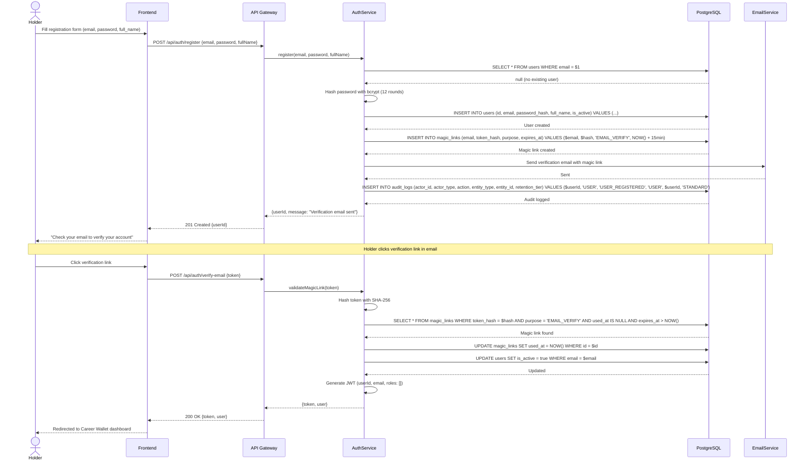

#### Explanation

The holder registration flow follows a standard email verification pattern with magic links:

1. The holder submits their personal email, password, and full name.
2. The system checks for email uniqueness, hashes the password with bcrypt (12 rounds), and creates the `users` row.
3. A magic link for email verification is generated: a random token is created, its SHA-256 hash stored in `magic_links`, and the raw token sent via email.
4. The magic link expires in 15 minutes. On click, the system validates the token hash, marks it as used, and activates the user.
5. A JWT is issued containing the user's ID, email, and roles (initially empty since they have no org memberships).
6. An audit log entry is created with `STANDARD` retention (90-day purge).

---

### 4.2 Organization Onboarding & DNS Verification

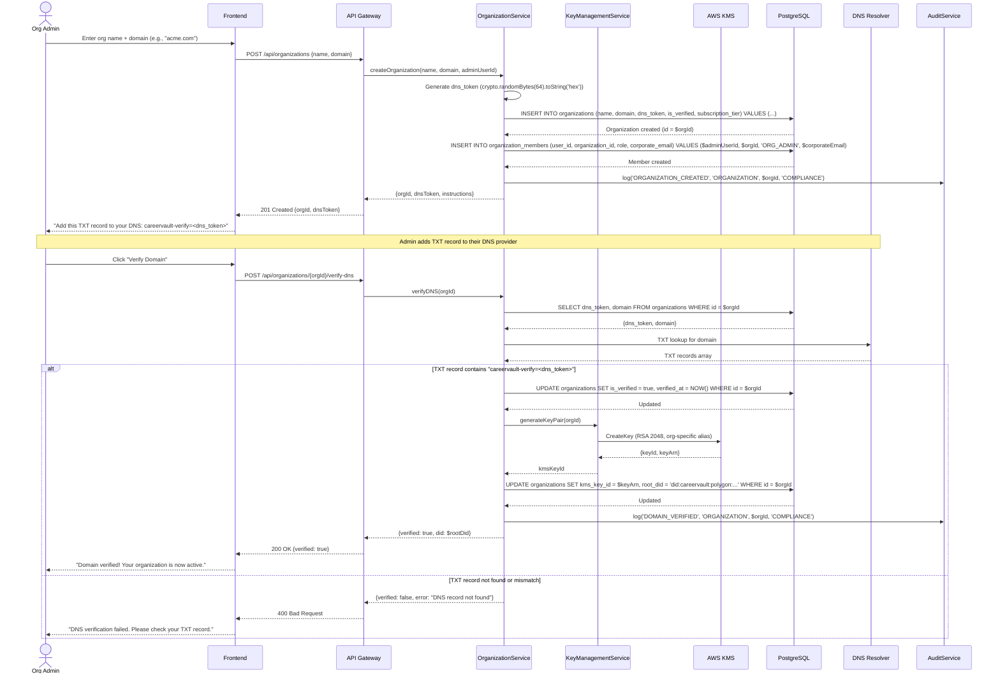

#### Explanation

Organization onboarding is a two-phase process:

1. **Registration Phase:** The admin provides the company name and domain. The system generates a random `dns_token` (128 hex characters), creates the `organizations` row with `is_verified = false`, and creates the admin's `organization_members` row with role `ORG_ADMIN`.

2. **DNS Verification Phase:** The admin places a TXT record (`careervault-verify=<token>`) on their domain. When they trigger verification, the system performs a DNS TXT lookup. On match:
   - `is_verified` is set to `true` and `verified_at` is stamped.
   - An AWS KMS asymmetric key (RSA 2048) is created for the organization, and its ARN is stored in `kms_key_id`.
   - A DID is minted in the format `did:careervault:polygon:<address>`.
   - A `COMPLIANCE`-tier audit log is created (7-year retention).

The DNS verification cron also periodically re-checks unverified orgs in case the admin doesn't manually trigger verification.

---

### 4.3 Manager Invitation & Role Binding

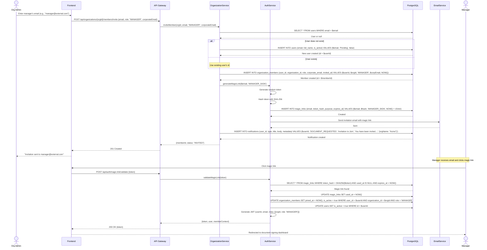

#### Explanation

Manager invitation supports both internal and external managers:

1. The Org Admin provides the manager's email and corporate email. If the email doesn't match an existing user, a placeholder `users` row is created with `is_active = false`.
2. An `organization_members` row is created with role `MANAGER` and `invited_at` timestamp, but `joined_at` remains null.
3. A magic link (15-minute expiry) is generated and emailed to the manager.
4. When the manager clicks the link, the system validates the token, activates the membership (sets `joined_at`), activates the user if needed, and issues a JWT.
5. The JWT includes the manager's role context so the frontend can render the appropriate dashboard.
6. External managers who only authenticate via magic links never set a password (`password_hash` remains null).

---

### 4.4 HR Assignment

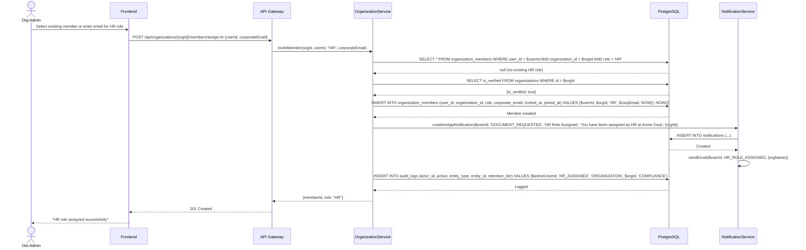

#### Explanation

HR assignment differs from Manager invitation in that it is typically done for existing users who already have a login:

1. The Org Admin selects an existing user (who may already be a member with a different role) and assigns them the HR role.
2. The system checks for duplicate role assignment using the unique constraint `(user_id, organization_id, role)`.
3. Since HR is an internal role, `joined_at` is set immediately (no invitation acceptance flow required).
4. The user receives both an email and in-app notification about their new HR responsibilities.
5. This is a `COMPLIANCE`-tier audit event because HR role changes affect document issuance authority.

---

### 4.5 Document Request (Holder to Manager for LOR)

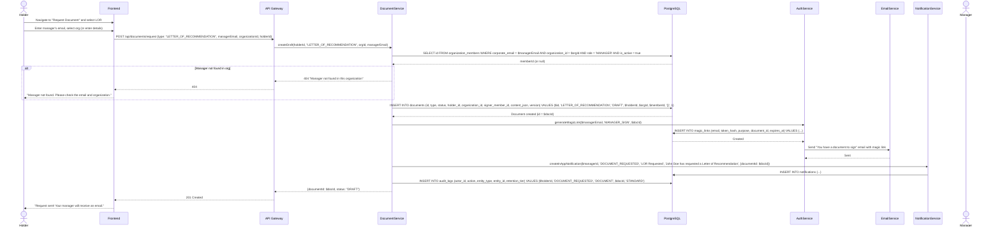

#### Explanation

The LOR request flow is holder-initiated and 1-to-1 between holder and manager:

1. The holder specifies the document type (LOR), the manager's corporate email, and the organization.
2. The system looks up the manager in `organization_members` to verify they exist and are active.
3. A `documents` row is created with `status = 'DRAFT'` and empty `content_json` (the manager will fill this in).
4. A magic link is generated specifically for this document (`document_id` is set on the magic link), enabling the manager to land directly on the document signing page.
5. Both email and in-app notifications are sent to the manager.
6. The `expires_at` for an LOR will be set to `null` (permanent) when issued, per the locked-in decision.

---

### 4.6 Manager Review & Signing (Magic Link Flow)

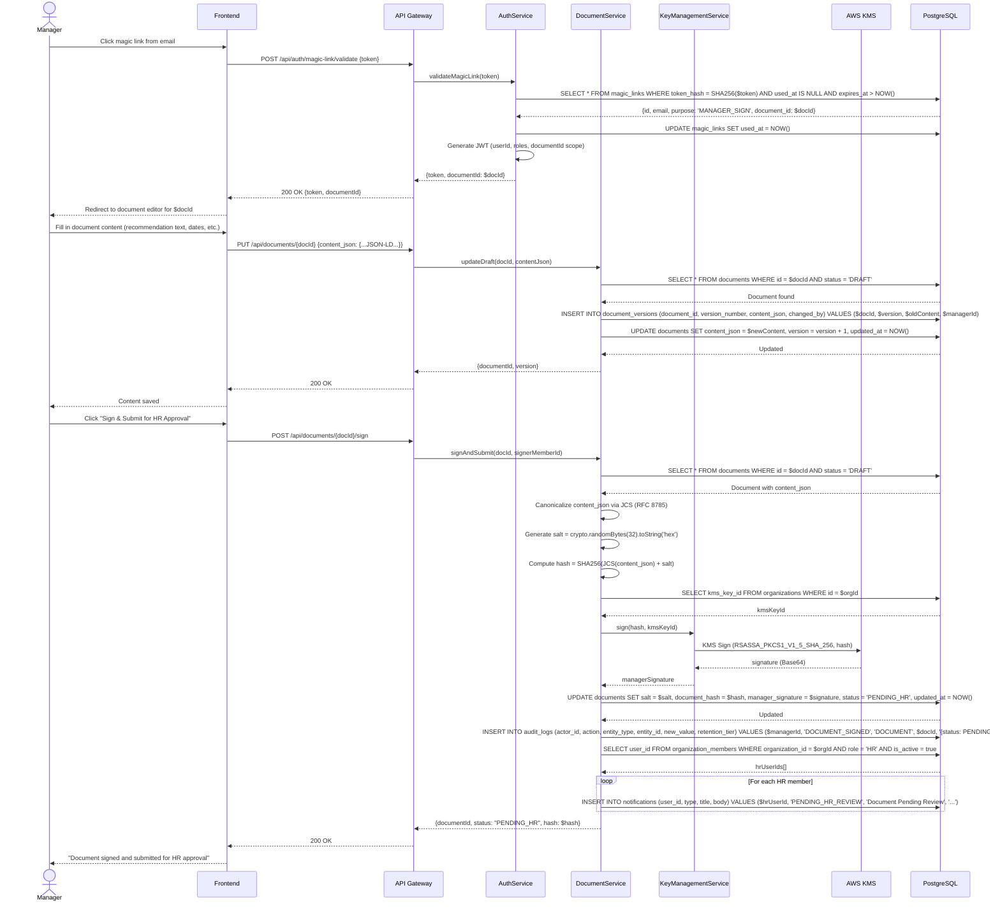

#### Explanation

The manager signing flow is the critical path for document integrity:

1. **Magic Link Authentication:** The manager clicks the email link. The system validates the token, marks it as used (preventing replay), and issues a scoped JWT that grants access only to the specific document.
2. **Content Editing:** The manager fills in the JSON-LD content (recommendation text, employment details, etc.). Each edit creates a `document_versions` snapshot for audit trail.
3. **Signing Process:**
   - The content is canonicalized using JCS (RFC 8785) to ensure deterministic serialization.
   - A random 32-byte salt is generated for GDPR compliance (salt deletion renders the hash unverifiable).
   - SHA-256 hash is computed over `JCS(content_json) + salt`.
   - The hash is signed using the organization's AWS KMS key (RSA PKCS#1 v1.5 with SHA-256).
   - The signature, salt, and hash are stored on the document.
4. **Status Transition:** The document moves from `DRAFT` to `PENDING_HR`.
5. **HR Notification:** All active HR members at the organization receive notifications.

---

### 4.7 HR Approval Flow

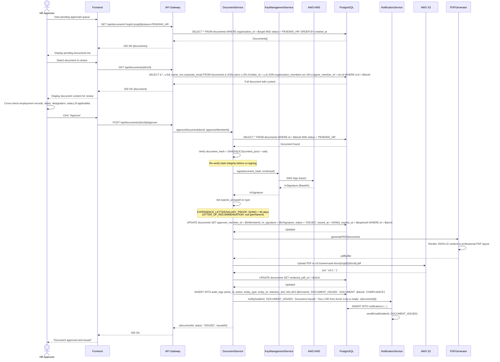

#### Explanation

The HR approval flow adds a second layer of verification and co-signing:

1. **Queue Review:** HR sees all `PENDING_HR` documents for their organization, sorted by creation date.
2. **Content Verification:** HR manually cross-checks the document content against internal employment records (dates, designation, salary, etc.).
3. **Hash Re-verification:** Before co-signing, the system re-computes `SHA256(JCS(content_json) + salt)` and verifies it matches `document_hash`. This detects any tampering after the manager signed.
4. **Co-signing:** HR triggers a second KMS signature (`hr_signature`) using the same org key. Both signatures provide non-repudiation.
5. **Expiry Setting:** Based on the document type, `expires_at` is computed:
   - `EXPERIENCE_LETTER` and `SALARY_PROOF`: `issued_at + 90 days`
   - `LETTER_OF_RECOMMENDATION`: `null` (permanent)
6. **PDF Generation:** The content is rendered into a professional PDF and uploaded to S3.
7. **Status Transition:** `PENDING_HR` -> `ISSUED`. The document is now eligible for the midnight Merkle batching job.
8. **Holder Notification:** The holder receives both email and in-app notification that their document is ready.

---

### 4.8 HR Rejection & Resubmission Flow

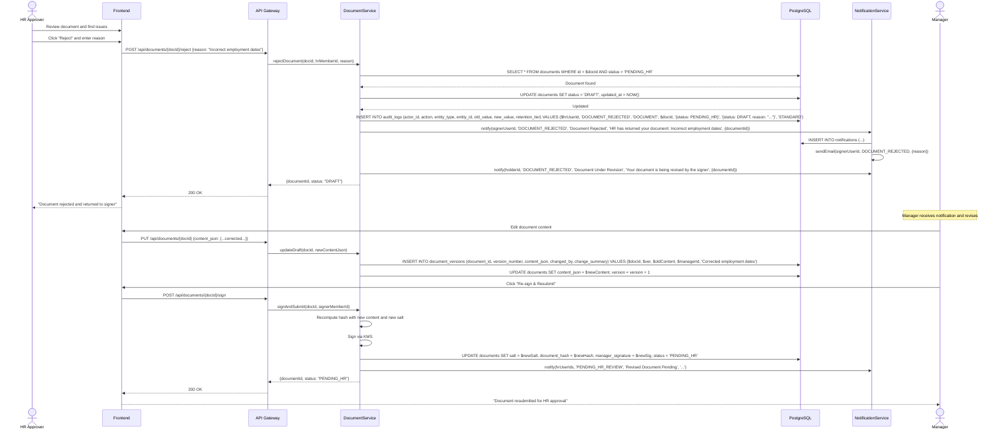

#### Explanation

The rejection flow provides a feedback loop between HR and the manager:

1. HR rejects the document with a specific reason. The document status reverts from `PENDING_HR` back to `DRAFT`.
2. Both the manager and the holder are notified -- the manager with the rejection reason, the holder with a general "under revision" message.
3. The manager edits the content, which creates a new version snapshot in `document_versions`.
4. On resubmission, a **new salt and hash** are computed (the old hash is overwritten since the content changed). A new manager signature is generated.
5. The document returns to `PENDING_HR` for another round of review.
6. There is no limit on rejection/resubmission cycles. The version history provides a complete audit trail.

---

### 4.9 Document Generation (JSON-LD + PDF)

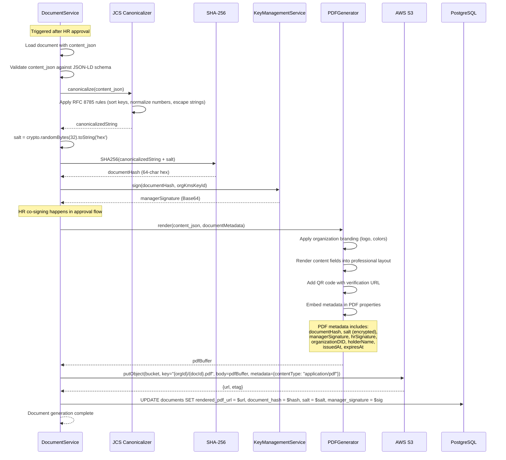

#### Explanation

Document generation is a multi-step process that produces both the cryptographic artifacts and the human-readable PDF:

1. **JSON-LD Validation:** The `content_json` is validated against the appropriate schema (see Section 9) to ensure it conforms to W3C Verifiable Credentials standards.
2. **JCS Canonicalization:** RFC 8785 is applied to produce a deterministic string representation. This ensures that logically identical JSON documents produce identical hashes regardless of key ordering or whitespace.
3. **Hash Computation:** SHA-256 is computed over the concatenation of the canonical string and the random salt. The salt serves dual purposes: it adds entropy and enables GDPR deletion (removing the salt makes the hash unverifiable without destroying the on-chain anchor).
4. **PDF Rendering:** The content is formatted into a professional PDF with:
   - Organization branding (logo, name)
   - Document content (employment dates, designation, recommendation text, etc.)
   - QR code linking to the verification URL
   - Embedded metadata containing the cryptographic proof (hash, signatures, Merkle proof after anchoring)
5. **S3 Upload:** The PDF is stored in an S3 bucket organized by organization ID and document ID.

---

### 4.10 Merkle Batching (Midnight Cron Job)

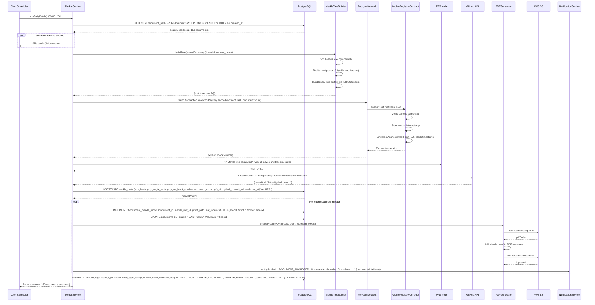

#### Explanation

The midnight Merkle batching job is the core Web 2.5 mechanism that bridges the SQL database to the Polygon blockchain:

1. **Document Collection:** All documents with `status = 'ISSUED'` are collected. These are documents that have been approved by HR but not yet anchored.
2. **Tree Construction:** Document hashes are sorted lexicographically and arranged as leaves in a binary Merkle tree. The tree is padded to the next power of 2 with zero hashes. Each level is computed by SHA-256 hashing pairs of sibling nodes.
3. **Polygon Anchoring:** The root hash and document count are submitted to the `AnchorRegistry` smart contract on Polygon. The contract stores the root with a timestamp and emits a `RootAnchored` event.
4. **IPFS Publication:** The full tree structure (all leaves and intermediate nodes) is pinned to IPFS for decentralized backup. This enables independent proof reconstruction.
5. **GitHub Publication:** The root hash and metadata are committed to a public transparency repository on GitHub, providing an additional verifiable timestamp.
6. **Proof Storage:** For each document, the individual Merkle proof (array of sibling hashes and positions) is stored in `document_merkle_proofs`.
7. **PDF Update:** Each document's PDF is re-downloaded from S3, the Merkle proof is embedded in the PDF metadata, and the updated PDF is re-uploaded.
8. **Status Update:** Each document transitions from `ISSUED` to `ANCHORED`.
9. **Notifications:** Each holder is notified that their document has been anchored on-chain.

The triple publication (Polygon + IPFS + GitHub) provides resilience: even if any two systems fail, the proof can be reconstructed from the third.

---

### 4.11 Verification Flow (Recruiter Checks Document)

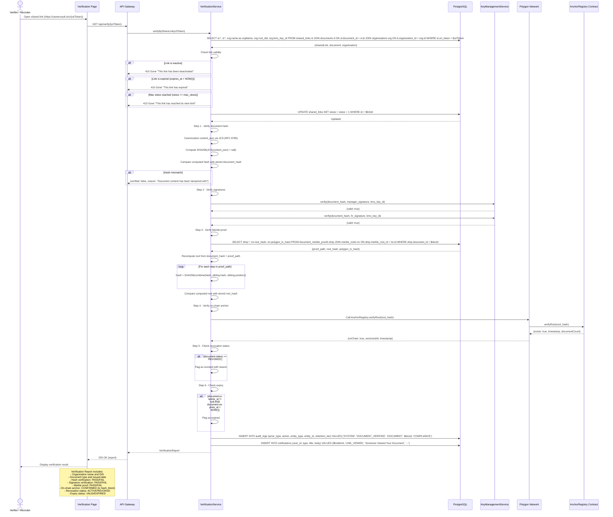

#### Explanation

The verification flow is a six-step integrity check that provides end-to-end tamper detection:

1. **Link Validation:** The system checks that the shared link is active, not expired, and within its view limit. The view counter is incremented.
2. **Hash Verification:** The system recomputes `SHA256(JCS(content_json) + salt)` and compares it to the stored `document_hash`. Any modification to the content (even a single character) would produce a different hash.
3. **Signature Verification:** Both the manager's and HR's cryptographic signatures are verified against the document hash using the organization's KMS public key. This proves the document was signed by authorized personnel.
4. **Merkle Proof Verification:** The system recomputes the Merkle root from the document hash and the stored proof path. This proves the document was included in a specific batch.
5. **On-chain Verification:** The computed Merkle root is checked against the Polygon smart contract. This proves the batch was anchored at a specific time on the blockchain.
6. **Status Checks:** Revocation and expiry status are checked to ensure the document is still valid.

The holder is notified whenever someone views their document via a shared link.

---

### 4.12 Share Link Generation & Payment

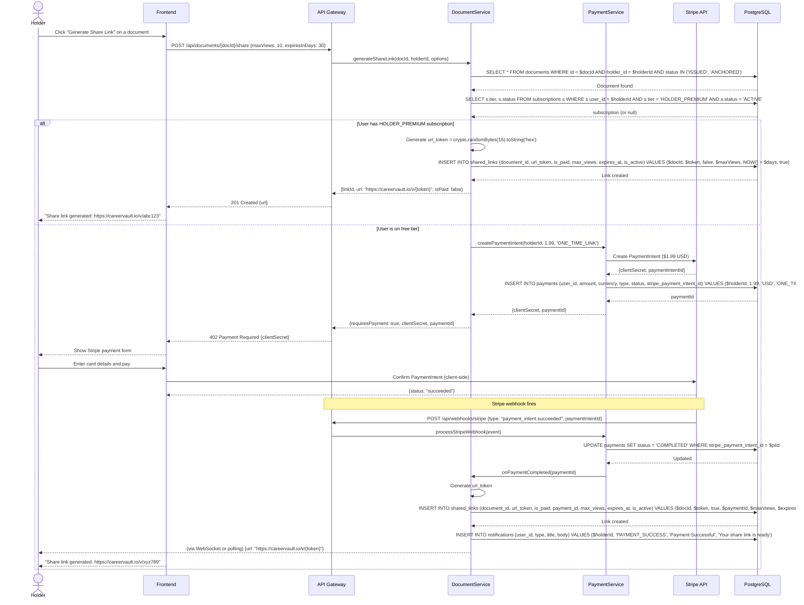

#### Explanation

Share link generation has two paths depending on the holder's subscription status:

1. **Premium Subscribers ($5/mo):** Links are generated instantly with no payment required. `is_paid` is set to `false` (covered by subscription).
2. **Free-tier Users:** A Stripe PaymentIntent is created for the per-link fee ($1.99). The client-side Stripe Elements form collects card details. On successful payment (confirmed via webhook), the link is generated and the holder is notified.

Link configuration options:
- `max_views`: Maximum number of views before the link auto-deactivates. `null` for unlimited.
- `expires_at`: Computed from the holder's requested duration. `null` for no expiry.

The `url_token` is a 32-character hex string (16 random bytes), providing 128 bits of entropy, which is sufficient to prevent brute-force enumeration.

---

### 4.13 Revocation (Pre-Anchor / Grace Period)

```mermaid
sequenceDiagram
    actor HR as HR Approver
    participant UI as Frontend
    participant API as API Gateway
    participant DocSvc as DocumentService
    participant DB as PostgreSQL
    participant S3 as AWS S3
    participant Notif as NotificationService

    HR->>UI: Select issued document (status = ISSUED, not yet anchored)
    HR->>UI: Click "Revoke" and select reason
    UI->>API: POST /api/documents/{docId}/revoke {reasonCode: "ADMINISTRATIVE_ERROR", reasonText: "Incorrect salary figures"}
    API->>DocSvc: revokeDocument(docId, 'ADMINISTRATIVE_ERROR', 'Incorrect salary figures', hrMemberId)

    DocSvc->>DB: SELECT * FROM documents WHERE id = $docId AND status = 'ISSUED'
    DB-->>DocSvc: Document found (status = ISSUED, not yet anchored)

    Note over DocSvc: Pre-anchor revocation is simpler because<br/>the hash has not been committed on-chain

    DocSvc->>DB: UPDATE documents SET status = 'REVOKED', revocation_reason_code = 'ADMINISTRATIVE_ERROR', revocation_reason_text = 'Incorrect salary figures', revoked_at = NOW(), revoked_by = $hrMemberId WHERE id = $docId
    DB-->>DocSvc: Updated

    DocSvc->>DB: UPDATE shared_links SET is_active = false WHERE document_id = $docId
    DB-->>DocSvc: Deactivated links

    DocSvc->>S3: deleteObject(rendered_pdf_url)
    S3-->>DocSvc: Deleted

    DocSvc->>DB: UPDATE documents SET rendered_pdf_url = NULL

    DocSvc->>DB: INSERT INTO audit_logs (actor_id, action, entity_type, entity_id, old_value, new_value, retention_tier) VALUES ($hrUserId, 'DOCUMENT_REVOKED', 'DOCUMENT', $docId, '{status: ISSUED}', '{status: REVOKED, reason: ADMINISTRATIVE_ERROR}', 'COMPLIANCE')

    DocSvc->>Notif: notify(holderId, 'DOCUMENT_REVOKED', 'Document Revoked', 'Your experience letter from Acme Corp has been revoked: Incorrect salary figures', {documentId, reasonCode, reasonText})
    Notif->>DB: INSERT INTO notifications (...)
    Notif->>Notif: sendEmail(holderId, DOCUMENT_REVOKED)

    DocSvc-->>API: {documentId, status: "REVOKED", revokedAt}
    API-->>UI: 200 OK
    UI-->>HR: "Document revoked successfully"
```

#### Explanation

Pre-anchor revocation occurs when a document has been issued (`ISSUED`) but has not yet been included in the nightly Merkle batch:

1. Since the hash is not yet on-chain, the revocation is straightforward: the document status moves to `REVOKED`, the PDF is deleted from S3, and all shared links are deactivated.
2. The organization has absolute authority over revocation (no mediation or disputes).
3. The HR must select a structured reason code (`ADMINISTRATIVE_ERROR`, `POLICY_VIOLATION`, or `ISSUED_IN_ERROR`) and can optionally provide free-text explanation.
4. This is a `COMPLIANCE`-tier audit event (7-year retention).
5. The holder is notified via both email and in-app notification with the revocation reason.

---

### 4.14 Revocation (Post-Anchor / Time-Locked)

```mermaid
sequenceDiagram
    actor HR as HR Approver
    participant UI as Frontend
    participant API as API Gateway
    participant DocSvc as DocumentService
    participant DB as PostgreSQL
    participant Polygon as Polygon Network
    participant Contract as AnchorRegistry Contract
    participant Notif as NotificationService

    HR->>UI: Select anchored document (status = ANCHORED)
    HR->>UI: Click "Revoke" and select reason
    UI->>API: POST /api/documents/{docId}/revoke {reasonCode: "POLICY_VIOLATION", reasonText: "Employee terminated for cause"}
    API->>DocSvc: revokeDocument(docId, 'POLICY_VIOLATION', 'Employee terminated for cause', hrMemberId)

    DocSvc->>DB: SELECT d.*, dmp.merkle_root_id FROM documents d LEFT JOIN document_merkle_proofs dmp ON d.id = dmp.document_id WHERE d.id = $docId AND d.status = 'ANCHORED'
    DB-->>DocSvc: Document found (status = ANCHORED, has merkle proof)

    Note over DocSvc: Post-anchor revocation: hash is on-chain.<br/>Cannot remove from blockchain, but mark as revoked<br/>in the off-chain database. Verifiers will see<br/>"REVOKED" status during verification.

    DocSvc->>DB: UPDATE documents SET status = 'REVOKED', revocation_reason_code = 'POLICY_VIOLATION', revocation_reason_text = 'Employee terminated for cause', revoked_at = NOW(), revoked_by = $hrMemberId WHERE id = $docId
    DB-->>DocSvc: Updated

    DocSvc->>DB: UPDATE shared_links SET is_active = false WHERE document_id = $docId
    DB-->>DocSvc: Links deactivated

    DocSvc->>Polygon: Call AnchorRegistry.revokeDocument(document_hash)
    Polygon->>Contract: revokeDocument(document_hash)
    Contract->>Contract: Mark hash as revoked on-chain
    Contract->>Contract: Emit DocumentRevoked(document_hash, block.timestamp)
    Contract-->>Polygon: Transaction receipt
    Polygon-->>DocSvc: {txHash}

    Note over DocSvc: The on-chain revocation allows verifiers to check<br/>revocation status even without querying the CareerVault API

    DocSvc->>DB: INSERT INTO audit_logs (actor_id, action, entity_type, entity_id, old_value, new_value, retention_tier) VALUES ($hrUserId, 'DOCUMENT_REVOKED', 'DOCUMENT', $docId, '{status: ANCHORED}', '{status: REVOKED, reason: POLICY_VIOLATION, onChainTxHash: "0x..."}', 'COMPLIANCE')

    DocSvc->>Notif: notify(holderId, 'DOCUMENT_REVOKED', 'Document Revoked', 'Your document has been revoked by Acme Corp', {documentId, reasonCode})
    Notif->>DB: INSERT INTO notifications (...)
    Notif->>Notif: sendEmail(holderId, DOCUMENT_REVOKED)

    DocSvc-->>API: {documentId, status: "REVOKED", onChainRevocationTx: $txHash}
    API-->>UI: 200 OK
    UI-->>HR: "Document revoked. On-chain revocation recorded."
```

#### Explanation

Post-anchor revocation is more involved because the document hash already exists on the Polygon blockchain:

1. The hash cannot be removed from the blockchain (immutability), but the document is marked as `REVOKED` in the off-chain database.
2. An on-chain revocation transaction is submitted to the `AnchorRegistry` contract, which maintains a mapping of revoked hashes. The `DocumentRevoked` event is emitted for transparency.
3. During verification (Section 4.11), the `VerificationService` checks both the off-chain status and the on-chain revocation registry. Either source confirming revocation is sufficient.
4. All shared links are deactivated. The PDF remains in S3 (it may be needed for legal disputes) but is no longer accessible via share links.
5. The audit log captures the on-chain transaction hash for the revocation.

---

### 4.15 Bulk Issuance (HR)

```mermaid
sequenceDiagram
    actor HR as HR Approver
    participant UI as Frontend
    participant API as API Gateway
    participant DocSvc as DocumentService
    participant KMS as KeyManagementService
    participant DB as PostgreSQL
    participant PDF as PDFGenerator
    participant S3 as AWS S3
    participant Notif as NotificationService
    participant Queue as Job Queue

    HR->>UI: Navigate to Bulk Issuance
    HR->>UI: Upload CSV file
    Note over UI: CSV columns: employee_email, full_name,<br/>designation, department, start_date,<br/>end_date, salary (for SALARY_PROOF)

    UI->>API: POST /api/documents/bulk-issue {orgId, type: "EXPERIENCE_LETTER", csvFile}
    API->>DocSvc: bulkIssue(orgId, hrMemberId, 'EXPERIENCE_LETTER', csvData)

    DocSvc->>DocSvc: Parse and validate CSV (max 500 rows)
    DocSvc->>DB: SELECT * FROM organization_members WHERE id = $hrMemberId AND role = 'HR' AND is_active = true
    DB-->>DocSvc: HR member verified

    alt CSV validation errors
        DocSvc-->>API: 400 {errors: [{row: 5, field: "email", error: "Invalid email"}]}
        API-->>UI: 400 Bad Request
        UI-->>HR: Display validation errors
    end

    DocSvc->>DocSvc: Create batch ID (UUID)
    DocSvc->>DB: INSERT INTO audit_logs (action, entity_type, entity_id, new_value, retention_tier) VALUES ('BULK_ISSUANCE_STARTED', 'ORGANIZATION', $orgId, '{batchId, rowCount: 200}', 'COMPLIANCE')

    DocSvc->>Queue: Enqueue bulk issuance job {batchId, orgId, hrMemberId, rows[]}
    DocSvc-->>API: {batchId, status: "PROCESSING", totalRows: 200}
    API-->>UI: 202 Accepted {batchId}
    UI-->>HR: "Bulk issuance started. Processing 200 documents..."

    Note over Queue,DocSvc: Background job processes each row

    loop For each CSV row
        Queue->>DocSvc: processRow(row, orgId, hrMemberId)

        DocSvc->>DB: SELECT id FROM users WHERE email = $employeeEmail
        DB-->>DocSvc: userId (or create new user)

        DocSvc->>DocSvc: Build content_json (JSON-LD) from CSV data
        DocSvc->>DocSvc: Generate salt
        DocSvc->>DocSvc: Canonicalize via JCS + compute SHA256 hash

        DocSvc->>KMS: sign(hash, orgKmsKeyId)
        KMS-->>DocSvc: signature

        DocSvc->>DB: INSERT INTO documents (type, status, holder_id, organization_id, signer_member_id, approver_member_id, content_json, salt, document_hash, manager_signature, hr_signature, status, issued_at, expires_at) VALUES ('EXPERIENCE_LETTER', 'ISSUED', $userId, $orgId, $hrMemberId, $hrMemberId, $json, $salt, $hash, $sig, $sig, 'ISSUED', NOW(), NOW() + 90 days)
        DB-->>DocSvc: Document created

        DocSvc->>PDF: generatePDF(document)
        PDF-->>DocSvc: pdfBuffer
        DocSvc->>S3: Upload PDF
        S3-->>DocSvc: url

        DocSvc->>DB: UPDATE documents SET rendered_pdf_url = $url

        DocSvc->>Notif: notify(userId, 'DOCUMENT_ISSUED', 'Experience Letter Issued', '...')
    end

    Queue->>DocSvc: Batch complete (200/200 processed, 0 errors)

    DocSvc->>DB: INSERT INTO audit_logs (action, entity_type, entity_id, new_value, retention_tier) VALUES ('BULK_ISSUANCE_COMPLETED', 'ORGANIZATION', $orgId, '{batchId, processed: 200, errors: 0}', 'COMPLIANCE')

    DocSvc->>Notif: notify(hrUserId, 'DOCUMENT_ISSUED', 'Bulk Issuance Complete', '200 documents issued successfully')

    Note over HR: HR can poll GET /api/documents/bulk-status/{batchId} for progress
```

#### Explanation

Bulk issuance is restricted to HR only and supports `EXPERIENCE_LETTER` and `SALARY_PROOF` types (not LORs, which are 1-to-1):

1. **CSV Upload:** HR uploads a CSV with employee data. The system validates format, required fields, and email uniqueness.
2. **Async Processing:** Bulk issuance is processed asynchronously via a job queue (e.g., BullMQ). The API returns a 202 with a batch ID for status polling.
3. **Per-row Processing:** For each row:
   - A `users` record is created if the employee doesn't exist.
   - JSON-LD content is generated from the CSV data.
   - The document is hashed, signed, and issued in a single step (HR acts as both signer and approver for bulk issuance, so `signer_member_id` and `approver_member_id` are both set to the HR member's ID, and both `manager_signature` and `hr_signature` are the same).
   - A PDF is generated and uploaded to S3.
   - The holder is notified.
4. **Expiry:** All bulk-issued documents get `expires_at = issued_at + 90 days`.
5. **Audit:** Both the start and completion of the bulk batch are logged as `COMPLIANCE`-tier events.

---

### 4.16 GDPR Deletion (Right to be Forgotten)

```mermaid
sequenceDiagram
    actor Holder
    participant UI as Frontend
    participant API as API Gateway
    participant Auth as AuthService
    participant GDPR as GDPRService
    participant DB as PostgreSQL
    participant S3 as AWS S3
    participant Notif as NotificationService

    Holder->>UI: Navigate to Settings > Privacy > Delete My Account
    UI->>UI: Show confirmation dialog with consequences
    Holder->>UI: Confirm deletion (enter password)
    UI->>API: POST /api/users/gdpr-delete {password}

    API->>Auth: validatePassword(userId, password)
    Auth->>DB: SELECT password_hash FROM users WHERE id = $userId
    DB-->>Auth: passwordHash
    Auth->>Auth: bcrypt.compare(password, passwordHash)
    Auth-->>API: {valid: true}

    API->>GDPR: executeGDPRDeletion(userId)

    GDPR->>DB: BEGIN TRANSACTION

    Note over GDPR: Step 1: Deactivate all shared links
    GDPR->>DB: UPDATE shared_links SET is_active = false WHERE document_id IN (SELECT id FROM documents WHERE holder_id = $userId)
    DB-->>GDPR: Links deactivated

    Note over GDPR: Step 2: Delete all PDFs from S3
    GDPR->>DB: SELECT rendered_pdf_url FROM documents WHERE holder_id = $userId AND rendered_pdf_url IS NOT NULL
    DB-->>GDPR: pdfUrls[]
    loop For each PDF URL
        GDPR->>S3: deleteObject(pdfUrl)
        S3-->>GDPR: Deleted
    end

    Note over GDPR: Step 3: Remove salt from documents (renders hash unlinkable)
    GDPR->>DB: UPDATE documents SET salt = NULL, rendered_pdf_url = NULL, content_json = '{"deleted": true}' WHERE holder_id = $userId
    DB-->>GDPR: Updated

    Note over GDPR: Step 4: Wipe user PII
    GDPR->>DB: UPDATE users SET email = 'deleted-{userId}@careervault.io', password_hash = NULL, full_name = 'DELETED USER', phone = NULL, avatar_url = NULL, is_active = false, gdpr_deleted_at = NOW() WHERE id = $userId
    DB-->>GDPR: Updated

    Note over GDPR: Step 5: Deactivate all org memberships
    GDPR->>DB: UPDATE organization_members SET is_active = false WHERE user_id = $userId
    DB-->>GDPR: Updated

    Note over GDPR: Step 6: Delete notifications
    GDPR->>DB: DELETE FROM notifications WHERE user_id = $userId
    DB-->>GDPR: Deleted

    Note over GDPR: Step 7: Cancel active subscriptions
    GDPR->>DB: UPDATE subscriptions SET status = 'CANCELLED', cancelled_at = NOW() WHERE user_id = $userId AND status = 'ACTIVE'
    DB-->>GDPR: Updated

    GDPR->>DB: COMMIT

    GDPR->>DB: INSERT INTO audit_logs (actor_type, action, entity_type, entity_id, retention_tier) VALUES ('SYSTEM', 'GDPR_DELETION', 'USER', $userId, 'COMPLIANCE')
    DB-->>GDPR: Logged (7-year retention)

    Note over GDPR: The on-chain hash remains but is now<br/>a dead hash: no salt means it cannot<br/>be linked back to any content

    GDPR-->>API: {deleted: true}
    API-->>UI: 200 OK
    UI-->>Holder: "Your account has been permanently deleted."
```

#### Explanation

GDPR deletion implements a comprehensive data wipe while preserving the integrity of the blockchain record:

1. **Shared Links:** All links are deactivated. Verifiers accessing old links will get a 410 Gone response.
2. **S3 Objects:** All PDFs are permanently deleted from S3.
3. **Salt Removal:** The `salt` is set to NULL on all documents. Since the hash was computed as `SHA256(JCS(content_json) + salt)`, removing the salt makes it impossible to recompute the hash from the content. The on-chain hash becomes a "dead hash" -- it exists but is unlinkable to any identity.
4. **Content Wipe:** `content_json` is replaced with `{"deleted": true}`, removing all PII from the document record.
5. **User PII Wipe:** The email is replaced with a non-identifying placeholder, the name becomes "DELETED USER", and all other PII fields are nulled.
6. **Org Memberships:** All memberships are deactivated.
7. **Notifications:** Completely deleted (not just deactivated).
8. **Subscriptions:** Active subscriptions are cancelled.
9. **Audit Log:** The deletion itself is logged as a `COMPLIANCE`-tier event (7-year retention) for legal defensibility.

The transaction ensures atomicity -- either all steps complete or none do.

---

### 4.17 Magic Link Authentication

```mermaid
sequenceDiagram
    actor User
    participant UI as Frontend
    participant API as API Gateway
    participant Auth as AuthService
    participant DB as PostgreSQL
    participant Email as EmailService

    User->>UI: Enter email for magic link login
    UI->>API: POST /api/auth/magic-link/request {email, purpose: "MANAGER_SIGN"}
    API->>Auth: generateMagicLink(email, 'MANAGER_SIGN', documentId)

    Auth->>DB: SELECT * FROM users WHERE email = $email
    DB-->>Auth: User found

    Auth->>DB: SELECT COUNT(*) FROM magic_links WHERE email = $email AND created_at > NOW() - INTERVAL '1 hour'
    DB-->>Auth: count

    alt Rate limit exceeded (> 5 per hour)
        Auth-->>API: 429 Too Many Requests
        API-->>UI: 429
        UI-->>User: "Too many requests. Please try again later."
    end

    Auth->>Auth: token = crypto.randomBytes(32).toString('hex')
    Auth->>Auth: tokenHash = SHA256(token)

    Auth->>DB: INSERT INTO magic_links (email, token_hash, purpose, document_id, expires_at) VALUES ($email, $tokenHash, 'MANAGER_SIGN', $docId, NOW() + INTERVAL '15 minutes')
    DB-->>Auth: Created

    Auth->>Email: Send email with link: https://careervault.io/auth/magic/{token}
    Email-->>Auth: Sent

    Auth-->>API: {message: "Magic link sent"}
    API-->>UI: 200 OK
    UI-->>User: "Check your email for the login link (expires in 15 minutes)"

    Note over User: User clicks link in email

    User->>UI: Click magic link
    UI->>API: POST /api/auth/magic-link/validate {token}
    API->>Auth: validateMagicLink(token)

    Auth->>Auth: tokenHash = SHA256(token)
    Auth->>DB: SELECT * FROM magic_links WHERE token_hash = $tokenHash AND used_at IS NULL AND expires_at > NOW()
    DB-->>Auth: Magic link found

    alt Token not found or expired
        Auth-->>API: 401 Unauthorized "Invalid or expired magic link"
        API-->>UI: 401
        UI-->>User: "This link is invalid or has expired. Please request a new one."
    end

    Auth->>DB: UPDATE magic_links SET used_at = NOW() WHERE id = $mlId
    DB-->>Auth: Marked as used

    Auth->>DB: SELECT u.*, om.organization_id, om.role FROM users u JOIN organization_members om ON u.id = om.user_id WHERE u.email = $email
    DB-->>Auth: User with roles

    Auth->>Auth: Generate JWT {sub: userId, email, roles: [{orgId, role}], documentId, exp: 1h}
    Auth-->>API: {token, user, documentId}
    API-->>UI: 200 OK {token}
    UI-->>User: Authenticated and redirected
```

#### Explanation

Magic link authentication provides passwordless access for external managers:

1. **Rate Limiting:** Maximum 5 magic links per email per hour to prevent abuse.
2. **Token Security:** A 32-byte random token is generated. Only the SHA-256 hash is stored in the database; the raw token is sent via email. This ensures that even if the database is compromised, tokens cannot be replayed.
3. **Expiry:** Magic links expire after 15 minutes. This is a deliberate trade-off between security and usability.
4. **Single Use:** The `used_at` timestamp prevents token reuse. Once clicked, the link is consumed.
5. **Scoped JWT:** The issued JWT includes the specific `documentId` (for `MANAGER_SIGN` purpose), restricting the session to that document.

---

### 4.18 Subscription Purchase

```mermaid
sequenceDiagram
    actor Holder
    participant UI as Frontend
    participant API as API Gateway
    participant PaySvc as PaymentService
    participant Stripe as Stripe API
    participant DB as PostgreSQL
    participant Notif as NotificationService

    Holder->>UI: Navigate to Pricing > Select "Premium" ($5/mo)
    UI->>API: POST /api/subscriptions {tier: "HOLDER_PREMIUM"}
    API->>PaySvc: createSubscription(userId, 'HOLDER_PREMIUM')

    PaySvc->>DB: SELECT * FROM subscriptions WHERE user_id = $userId AND status = 'ACTIVE'
    DB-->>PaySvc: null (no active subscription)

    PaySvc->>Stripe: Create Customer (if not exists)
    Stripe-->>PaySvc: {customerId}

    PaySvc->>Stripe: Create Subscription {customerId, priceId: 'price_holder_premium', paymentBehavior: 'default_incomplete'}
    Stripe-->>PaySvc: {subscriptionId, clientSecret, status: 'incomplete'}

    PaySvc->>DB: INSERT INTO subscriptions (user_id, tier, status, stripe_subscription_id, started_at) VALUES ($userId, 'HOLDER_PREMIUM', 'ACTIVE', $subId, NOW())
    DB-->>PaySvc: Created

    PaySvc->>DB: INSERT INTO payments (user_id, amount, currency, type, status, stripe_payment_intent_id) VALUES ($userId, 5.00, 'USD', 'SUBSCRIPTION', 'PENDING', $piId)

    PaySvc-->>API: {subscriptionId, clientSecret}
    API-->>UI: 200 OK {clientSecret}

    Holder->>UI: Enter payment details
    UI->>Stripe: Confirm payment (client-side)
    Stripe-->>UI: {status: "succeeded"}

    Note over Stripe,API: Stripe webhook fires

    Stripe->>API: POST /api/webhooks/stripe {type: "invoice.payment_succeeded"}
    API->>PaySvc: processStripeWebhook(event)

    PaySvc->>DB: UPDATE payments SET status = 'COMPLETED' WHERE stripe_payment_intent_id = $piId
    PaySvc->>DB: UPDATE subscriptions SET status = 'ACTIVE', current_period_end = $periodEnd WHERE stripe_subscription_id = $subId
    DB-->>PaySvc: Updated

    PaySvc->>Notif: notify(userId, 'PAYMENT_SUCCESS', 'Subscription Active', 'Welcome to CareerVault Premium! You now have unlimited share links.')
    Notif->>DB: INSERT INTO notifications (...)
    Notif->>Notif: sendEmail(userId, SUBSCRIPTION_ACTIVE)

    PaySvc-->>API: Webhook processed
    API-->>Stripe: 200 OK
```

#### Explanation

Subscription purchase integrates with Stripe's subscription lifecycle:

1. **Customer Creation:** A Stripe customer is created (or retrieved if existing) for the user.
2. **Subscription Creation:** A Stripe subscription is created with `default_incomplete` payment behavior, which returns a `clientSecret` for client-side payment confirmation.
3. **Client-side Payment:** The frontend uses Stripe Elements to collect card details and confirm the payment.
4. **Webhook Processing:** Stripe fires an `invoice.payment_succeeded` webhook. The system updates the `payments` and `subscriptions` tables.
5. **Notification:** The holder receives confirmation of their premium status.

The 50% discount for issuer-verifiers is applied by checking if the subscribing user has an active `organization_members` role at any verified organization, and using the discounted Stripe price ID accordingly.

---

### 4.19 Document Expiry Check (System Cron)

```mermaid
sequenceDiagram
    participant Cron as Cron Scheduler
    participant DocSvc as DocumentService
    participant DB as PostgreSQL
    participant Notif as NotificationService

    Cron->>DocSvc: checkExpiry() (runs daily at 01:00 UTC)

    DocSvc->>DB: SELECT id, holder_id, type, expires_at FROM documents WHERE expires_at IS NOT NULL AND expires_at < NOW() AND status IN ('ISSUED', 'ANCHORED')
    DB-->>DocSvc: expiredDocs[] (e.g., 25 documents)

    alt No expired documents
        DocSvc-->>Cron: Skip (0 expired)
    end

    loop For each expired document
        DocSvc->>DB: UPDATE documents SET status = 'EXPIRED', updated_at = NOW() WHERE id = $docId
        DB-->>DocSvc: Updated

        DocSvc->>DB: UPDATE shared_links SET is_active = false WHERE document_id = $docId AND is_active = true
        DB-->>DocSvc: Links deactivated

        DocSvc->>Notif: notify(holderId, 'DOCUMENT_REVOKED', 'Document Expired', 'Your experience letter from Acme Corp has expired. Contact the organization for renewal.', {documentId})
        Notif->>DB: INSERT INTO notifications (...)
        Notif->>Notif: sendEmail(holderId, DOCUMENT_EXPIRED)

        DocSvc->>DB: INSERT INTO audit_logs (actor_type, action, entity_type, entity_id, old_value, new_value, retention_tier) VALUES ('CRON', 'DOCUMENT_EXPIRED', 'DOCUMENT', $docId, '{status: ANCHORED}', '{status: EXPIRED}', 'STANDARD')
    end

    DocSvc-->>Cron: Expiry check complete (25 documents expired)
```

#### Explanation

The document expiry cron job runs daily and handles the automatic expiry of time-limited documents:

1. **Scope:** Only `EXPERIENCE_LETTER` and `SALARY_PROOF` documents have expiry dates (90 days from issuance). `LETTER_OF_RECOMMENDATION` documents have `expires_at = null` and are never expired.
2. **Query:** The job finds all documents where `expires_at < NOW()` and status is either `ISSUED` or `ANCHORED` (not already `REVOKED` or `EXPIRED`).
3. **Status Update:** Each expired document transitions to `EXPIRED` status.
4. **Link Deactivation:** All active shared links for expired documents are deactivated.
5. **Notification:** Holders are notified about expiry with instructions to contact the organization for renewal.
6. **Audit:** Expiry events are logged as `STANDARD` tier (90-day retention) since the expiry is a routine operational event.

---

## 5. State Diagrams

### 5.1 Document Lifecycle State Machine

```mermaid
stateDiagram-v2
    [*] --> DRAFT : Holder requests document OR\nManager creates draft OR\nHR initiates bulk

    DRAFT --> PENDING_HR : Manager signs & submits\n[manager_signature set,\nhash computed,\nstatus guard: signer_member_id != null]

    DRAFT --> DRAFT : Manager edits content\n[version incremented,\ndocument_versions row created]

    PENDING_HR --> ISSUED : HR approves & co-signs\n[hr_signature set,\napprover_member_id set,\nissued_at stamped,\nexpires_at computed,\nPDF generated]

    PENDING_HR --> DRAFT : HR rejects\n[reason sent to manager,\nnotification dispatched]

    ISSUED --> ANCHORED : Merkle batch cron\n[merkle proof stored,\nPDF updated with proof,\npolygon_tx_hash recorded]

    ISSUED --> REVOKED : Pre-anchor revocation by HR\n[revocation_reason_code set,\nrevoked_at stamped,\nPDF deleted,\nlinks deactivated]

    ANCHORED --> REVOKED : Post-anchor revocation by HR\n[on-chain revocation tx,\nrevocation_reason_code set,\nlinks deactivated]

    ISSUED --> EXPIRED : Expiry cron (expires_at < NOW())\n[only EXP_LETTER & SALARY_PROOF,\nlinks deactivated]

    ANCHORED --> EXPIRED : Expiry cron (expires_at < NOW())\n[only EXP_LETTER & SALARY_PROOF,\nlinks deactivated]

    REVOKED --> [*]
    EXPIRED --> [*]
```

#### Explanation

The document lifecycle is a finite state machine with six states and clear transition guards:

| Transition | From | To | Guard / Trigger | Side Effects |
|---|---|---|---|---|
| Create | [initial] | DRAFT | Holder request, manager draft, or HR bulk init | `documents` row created |
| Edit | DRAFT | DRAFT | Manager updates content | Version incremented, `document_versions` snapshot |
| Sign & Submit | DRAFT | PENDING_HR | Manager signs (KMS) | Hash computed, salt generated, `manager_signature` set |
| Approve | PENDING_HR | ISSUED | HR approves (KMS co-sign) | `hr_signature` set, `issued_at` stamped, PDF generated, `expires_at` set |
| Reject | PENDING_HR | DRAFT | HR finds issues | Notification to manager with reason |
| Anchor | ISSUED | ANCHORED | Midnight cron job | Merkle proof stored, PDF updated, on-chain tx |
| Pre-anchor Revoke | ISSUED | REVOKED | HR revokes before anchoring | PDF deleted, links deactivated |
| Post-anchor Revoke | ANCHORED | REVOKED | HR revokes after anchoring | On-chain revocation tx, links deactivated |
| Expire | ISSUED/ANCHORED | EXPIRED | Cron: `expires_at < NOW()` | Links deactivated, holder notified |

**Terminal States:** `REVOKED` and `EXPIRED` are terminal. Documents in these states cannot transition to any other state. A revoked document cannot be un-revoked; a new document must be issued instead.

**Guard: LOR Expiry Immunity:** Documents of type `LETTER_OF_RECOMMENDATION` have `expires_at = null`, so the expiry transition never fires for them.

---

### 5.2 Organization Verification State Machine

```mermaid
stateDiagram-v2
    [*] --> UNVERIFIED : Organization registered\n[dns_token generated,\nis_verified = false]

    UNVERIFIED --> PENDING : Admin initiates DNS check\n[TXT record lookup in progress]

    PENDING --> VERIFIED : DNS TXT record matches\n[is_verified = true,\nverified_at stamped,\nKMS key created,\nroot_did minted]

    PENDING --> UNVERIFIED : DNS check fails\n[TXT record not found or mismatch]

    VERIFIED --> SUSPENDED : Policy violation OR\npayment failure\n[is_verified = false,\nall issuance blocked]

    SUSPENDED --> VERIFIED : Issue resolved\n[is_verified = true restored]
```

#### Explanation

Organization verification tracks domain ownership:

- **UNVERIFIED:** Initial state after registration. The org has a `dns_token` but no DNS TXT record has been confirmed.
- **PENDING:** A DNS check has been initiated (either manually by the admin or by the polling cron). This is a transient state during DNS resolution.
- **VERIFIED:** DNS TXT record matches. The org gets a KMS key, a DID, and can begin issuing documents.
- **SUSPENDED:** An admin or system action has suspended the org (e.g., terms of service violation, payment failure). `is_verified` is set to false, blocking all document issuance. Existing documents remain valid.

---

### 5.3 Payment State Machine

```mermaid
stateDiagram-v2
    [*] --> PENDING : PaymentIntent created\n[Stripe client_secret returned]

    PENDING --> COMPLETED : Stripe webhook: payment_intent.succeeded\n[payment confirmed,\nservice delivered]

    PENDING --> FAILED : Stripe webhook: payment_intent.payment_failed\n[card declined or error,\nuser notified]

    COMPLETED --> REFUNDED : Admin initiates refund\n[Stripe refund processed,\nservice revoked if applicable]

    FAILED --> PENDING : User retries payment\n[new PaymentIntent or retry]

    FAILED --> [*] : Abandoned

    COMPLETED --> [*]
    REFUNDED --> [*]
```

#### Explanation

Payment states are driven by Stripe webhooks:

- **PENDING:** A PaymentIntent has been created and the client-side payment form is displayed. The user has not yet confirmed payment.
- **COMPLETED:** Stripe confirms the payment succeeded. For one-time link payments, the share link is generated. For subscriptions, the subscription is activated.
- **FAILED:** The payment failed (card declined, insufficient funds, etc.). The user receives a `PAYMENT_FAILED` notification and can retry.
- **REFUNDED:** An administrative refund has been processed. If the payment was for a share link, the link may be deactivated. Subscription refunds trigger cancellation.

---

### 5.4 Shared Link State Machine

```mermaid
stateDiagram-v2
    [*] --> ACTIVE : Link created\n[url_token generated,\nviews = 0]

    ACTIVE --> ACTIVE : Verifier accesses link\n[views incremented,\nholder notified]

    ACTIVE --> EXHAUSTED : views >= max_views\n[auto-deactivated]

    ACTIVE --> EXPIRED_LINK : expires_at < NOW()\n[auto-deactivated]

    ACTIVE --> DEACTIVATED : Holder manually deactivates\n[is_active = false]

    ACTIVE --> DEACTIVATED : Document revoked/expired\n[is_active = false,\ncascade from document status]

    ACTIVE --> DEACTIVATED : GDPR deletion\n[is_active = false]

    EXHAUSTED --> [*]
    EXPIRED_LINK --> [*]
    DEACTIVATED --> [*]
```

#### Explanation

Shared links have four terminal conditions:

1. **EXHAUSTED:** The view counter has reached `max_views`. This is checked on every access.
2. **EXPIRED_LINK:** The link's `expires_at` has passed. Checked on access.
3. **DEACTIVATED (manual):** The holder explicitly deactivates the link.
4. **DEACTIVATED (cascade):** The underlying document is revoked, expired, or the holder invokes GDPR deletion.

All terminal states result in `is_active = false`. Verifiers accessing a terminal link receive a 410 Gone response.

---

### 5.5 Magic Link State Machine

```mermaid
stateDiagram-v2
    [*] --> CREATED : Magic link generated\n[token_hash stored,\nexpires_at = NOW() + 15min]

    CREATED --> VALIDATED : User clicks link within 15 min\n[token hash matches,\nexpires_at > NOW(),\nused_at IS NULL]

    VALIDATED --> CONSUMED : JWT issued\n[used_at = NOW(),\nlink cannot be reused]

    CREATED --> EXPIRED_ML : expires_at < NOW()\n[15 minutes elapsed,\nlink is dead]

    EXPIRED_ML --> CLEANED : Cleanup cron\n[row deleted from magic_links]

    CONSUMED --> [*]
    CLEANED --> [*]
```

#### Explanation

Magic links follow a strict single-use, time-limited lifecycle:

1. **CREATED:** A token is generated, hashed (SHA-256), and the hash stored. The raw token is emailed. Expiry is 15 minutes.
2. **VALIDATED:** The user clicks the link. The system hashes the provided token, looks up the hash, and verifies `used_at IS NULL` and `expires_at > NOW()`.
3. **CONSUMED:** `used_at` is set to `NOW()`. The link can never be reused. A JWT is issued for the session.
4. **EXPIRED_ML:** The 15-minute window elapsed without the link being used. The link is dead.
5. **CLEANED:** A cleanup cron deletes old expired/consumed magic link rows to prevent table bloat.

---

## 6. Activity Diagrams

### 6.1 End-to-End Happy Path (Holder Request to Recruiter Verification)

```mermaid
flowchart TD
    A[Holder registers on CareerVault] --> B[Holder requests Experience Letter]
    B --> C[System creates DRAFT document]
    C --> D[Manager receives magic link via email]
    D --> E[Manager clicks magic link and authenticates]
    E --> F[Manager fills in document content JSON-LD]
    F --> G[Manager signs document via KMS]
    G --> H{Document hash computed?}
    H -->|Yes| I[Status: DRAFT -> PENDING_HR]
    I --> J[HR receives notification]
    J --> K[HR reviews document content]
    K --> L{Content correct?}
    L -->|No| M[HR rejects with reason]
    M --> F
    L -->|Yes| N[HR approves and co-signs via KMS]
    N --> O[Status: PENDING_HR -> ISSUED]
    O --> P[PDF generated and uploaded to S3]
    P --> Q[Holder receives DOCUMENT_ISSUED notification]
    Q --> R[Midnight cron: Merkle batch]
    R --> S[Build Merkle tree from all ISSUED docs]
    S --> T[Anchor root hash to Polygon]
    T --> U[Publish root to IPFS + GitHub]
    U --> V[Store individual proofs in DB]
    V --> W[Embed proof in PDF metadata]
    W --> X[Status: ISSUED -> ANCHORED]
    X --> Y[Holder receives DOCUMENT_ANCHORED notification]
    Y --> Z[Holder generates share link]
    Z --> AA{Premium subscriber?}
    AA -->|Yes| AB[Link generated instantly]
    AA -->|No| AC[Pay per-link fee via Stripe]
    AC --> AB
    AB --> AD[Holder sends link to Recruiter]
    AD --> AE[Recruiter opens share link]
    AE --> AF[System verifies hash integrity]
    AF --> AG[System verifies KMS signatures]
    AG --> AH[System verifies Merkle proof]
    AH --> AI[System checks on-chain anchor]
    AI --> AJ[System checks revocation status]
    AJ --> AK[System checks expiry status]
    AK --> AL[Verification Report displayed to Recruiter]
    AL --> AM{All checks pass?}
    AM -->|Yes| AN[VERIFIED - Document is authentic]
    AM -->|No| AO[FAILED - Specific failure reason shown]
```

#### Explanation

This activity diagram traces the complete happy-path flow from initial holder registration to recruiter verification:

1. **Request Phase (Steps A-C):** The holder initiates a document request, creating a draft.
2. **Drafting Phase (Steps D-G):** The manager authenticates via magic link, fills in the content, and signs cryptographically.
3. **Approval Phase (Steps I-P):** HR reviews, approves, co-signs, and the system generates a PDF.
4. **Anchoring Phase (Steps R-X):** The midnight cron batches the document into a Merkle tree, anchors on Polygon, and publishes to IPFS/GitHub.
5. **Sharing Phase (Steps Z-AD):** The holder generates a share link (paying if not premium) and sends it to a recruiter.
6. **Verification Phase (Steps AE-AN):** The recruiter opens the link and the system performs six integrity checks, producing a verification report.

The rejection loop (Steps L-M-F) shows how HR rejection cycles the document back to the manager for revision.

---

### 6.2 Verification Process (Detailed Decision Tree)

```mermaid
flowchart TD
    A[Verifier submits document hash or share link] --> B{Input type?}
    B -->|Share Link| C[Resolve url_token from shared_links]
    B -->|Document Hash| D[Lookup document by document_hash]

    C --> E{Link active?}
    E -->|No| F[Return: LINK_INACTIVE]
    E -->|Yes| G{Link expired?}
    G -->|Yes| H[Return: LINK_EXPIRED]
    G -->|No| I{Max views reached?}
    I -->|Yes| J[Return: LINK_EXHAUSTED]
    I -->|No| K[Increment view counter]

    D --> K
    K --> L[Load document with content_json and salt]

    L --> M{Salt present?}
    M -->|No| N[Return: GDPR_DELETED - Hash unlinkable]
    M -->|Yes| O[Canonicalize content_json via JCS RFC 8785]

    O --> P[Compute SHA256 of JCS output + salt]
    P --> Q{Computed hash == stored document_hash?}
    Q -->|No| R[Return: HASH_MISMATCH - Content tampered]
    Q -->|Yes| S[Verify manager_signature via KMS public key]

    S --> T{Manager signature valid?}
    T -->|No| U[Return: SIGNATURE_INVALID]
    T -->|Yes| V[Verify hr_signature via KMS public key]

    V --> W{HR signature valid?}
    W -->|No| X[Return: COSIGN_INVALID]
    W -->|Yes| Y{Merkle proof exists?}

    Y -->|No| Z[Return: NOT_ANCHORED - Valid but not yet on chain]
    Y -->|Yes| AA[Recompute Merkle root from hash + proof_path]

    AA --> AB{Computed root == stored root_hash?}
    AB -->|No| AC[Return: PROOF_INVALID]
    AB -->|Yes| AD[Query Polygon: AnchorRegistry.verifyRoot]

    AD --> AE{Root exists on-chain?}
    AE -->|No| AF[Return: NOT_ON_CHAIN - DB says anchored but chain disagrees]
    AE -->|Yes| AG[Check on-chain revocation registry]

    AG --> AH{Hash revoked on-chain?}
    AH -->|Yes| AI[Return: REVOKED_ON_CHAIN]
    AH -->|No| AJ{Document status == REVOKED?}

    AJ -->|Yes| AK[Return: REVOKED_OFF_CHAIN with reason]
    AJ -->|No| AL{Document expired?}

    AL -->|Yes| AM[Return: EXPIRED with expiry date]
    AL -->|No| AN[Return: FULLY_VERIFIED - All checks pass]
```

#### Explanation

The verification decision tree has 13 possible outcomes:

| Outcome | Severity | Description |
|---|---|---|
| `LINK_INACTIVE` | Soft | Share link has been manually deactivated |
| `LINK_EXPIRED` | Soft | Share link has passed its expiry date |
| `LINK_EXHAUSTED` | Soft | Share link has reached its max view count |
| `GDPR_DELETED` | Info | User exercised Right to be Forgotten; hash is unlinkable |
| `HASH_MISMATCH` | Critical | Document content has been tampered with |
| `SIGNATURE_INVALID` | Critical | Manager's cryptographic signature does not verify |
| `COSIGN_INVALID` | Critical | HR's cryptographic signature does not verify |
| `NOT_ANCHORED` | Info | Document is valid but not yet included in a Merkle batch |
| `PROOF_INVALID` | Critical | Merkle proof does not recompute to the stored root |
| `NOT_ON_CHAIN` | Critical | Database says anchored but the root is not on Polygon |
| `REVOKED_ON_CHAIN` | Warning | Document has been revoked via on-chain transaction |
| `REVOKED_OFF_CHAIN` | Warning | Document has been revoked in the database |
| `EXPIRED` | Warning | Document has passed its expiry date |
| `FULLY_VERIFIED` | Success | All six checks pass |

---

### 6.3 GDPR Deletion Process

```mermaid
flowchart TD
    A[Holder requests account deletion] --> B[Verify holder's password]
    B --> C{Password valid?}
    C -->|No| D[Return: UNAUTHORIZED]
    C -->|Yes| E[Begin database transaction]

    E --> F[Deactivate all shared links for holder's documents]
    F --> G[Collect all PDF URLs from documents]
    G --> H[Delete all PDFs from S3]
    H --> I[Remove salt from all documents]
    I --> J[Replace content_json with deletion marker]
    J --> K[Wipe user PII: email, name, phone, avatar]
    K --> L[Set is_active = false and gdpr_deleted_at = NOW]
    L --> M[Deactivate all organization memberships]
    M --> N[Delete all notifications]
    N --> O[Cancel active subscriptions]
    O --> P[Commit transaction]

    P --> Q[Log GDPR_DELETION audit event as COMPLIANCE tier]

    Q --> R{On-chain hashes?}
    R -->|Yes| S[Hashes remain on-chain but are now dead hashes]
    R -->|No| T[No on-chain cleanup needed]
    S --> U[Deletion complete]
    T --> U

    U --> V[Invalidate all active JWTs for this user]
    V --> W[Return confirmation to user]
```

#### Explanation

The GDPR deletion process ensures comprehensive data removal while preserving system integrity:

- **Transactional:** All database operations are wrapped in a single transaction for atomicity.
- **S3 Cleanup:** PDFs are permanently deleted from object storage.
- **Salt Removal:** This is the key GDPR mechanism -- without the salt, the on-chain hash cannot be linked back to the document content or the user.
- **PII Wipe:** All personally identifiable information is replaced with non-identifying placeholders.
- **JWT Invalidation:** All active sessions for the user are invalidated (via a token blacklist or short-lived JWTs with a user-level revocation timestamp).

---

### 6.4 Bulk Issuance Process

```mermaid
flowchart TD
    A[HR uploads CSV file] --> B[Validate CSV format and headers]
    B --> C{Valid format?}
    C -->|No| D[Return validation errors with row/field details]
    C -->|Yes| E[Parse CSV rows max 500]

    E --> F[Validate each row]
    F --> G{All rows valid?}
    G -->|No| H[Return per-row validation errors]
    G -->|Yes| I[Verify HR role and org verification status]

    I --> J{HR authorized and org verified?}
    J -->|No| K[Return: UNAUTHORIZED]
    J -->|Yes| L[Create batch ID]

    L --> M[Enqueue async job]
    M --> N[Return 202 Accepted with batchId]

    N --> O[Background worker picks up job]
    O --> P{Next row?}
    P -->|Yes| Q[Lookup or create user by email]
    Q --> R[Build JSON-LD content from row data]
    R --> S[Generate salt and compute hash]
    S --> T[Sign hash via KMS]
    T --> U[Create documents row with status ISSUED]
    U --> V[Generate PDF]
    V --> W[Upload PDF to S3]
    W --> X[Notify holder]
    X --> P

    P -->|No more rows| Y[Log BULK_ISSUANCE_COMPLETED]
    Y --> Z[Notify HR of completion]
    Z --> AA[Documents ready for nightly Merkle batch]
```

#### Explanation

Bulk issuance is designed for efficiency while maintaining security guarantees:

- **CSV Validation:** Headers must match expected columns. Each row is validated for email format, date formats, required fields, etc. The entire batch is rejected if any row fails validation (all-or-nothing at the validation stage).
- **Row Limit:** Maximum 500 rows per batch to prevent resource exhaustion.
- **Async Processing:** The job is enqueued and processed in the background. HR can poll for status.
- **Dual-role Signing:** In bulk issuance, HR acts as both signer and approver. Both `manager_signature` and `hr_signature` are set to the same KMS signature.
- **Direct to ISSUED:** Bulk-issued documents skip the `PENDING_HR` state since HR is the one issuing them.
- **Automatic Expiry:** All bulk-issued experience letters and salary proofs get `expires_at = issued_at + 90 days`.

---

## 7. Component Diagram

```mermaid
graph TB
    subgraph "NestJS Backend Application"
        subgraph "API Layer"
            GW[API Gateway / Guards]
        end

        subgraph "Feature Modules"
            AuthMod[AuthModule]
            OrgMod[OrganizationModule]
            DocMod[DocumentModule]
            MerkleMod[MerkleModule]
            VerifMod[VerificationModule]
            PayMod[PaymentModule]
            NotifMod[NotificationModule]
            AuditMod[AuditModule]
            KMSMod[KeyManagementModule]
        end

        subgraph "Shared Module"
            Config[ConfigModule]
            DB_Mod[DatabaseModule TypeORM]
            Queue[QueueModule BullMQ]
            Cache[CacheModule Redis]
        end
    end

    subgraph "External Services"
        PG[(PostgreSQL)]
        Redis[(Redis)]
        S3[AWS S3]
        KMS[AWS KMS]
        Stripe[Stripe API]
        SMTP[SMTP / SES]
        Polygon[Polygon RPC]
        IPFS[IPFS Node]
        GitHub[GitHub API]
        DNS[DNS Resolver]
    end

    GW --> AuthMod
    GW --> OrgMod
    GW --> DocMod
    GW --> VerifMod
    GW --> PayMod
    GW --> NotifMod

    AuthMod --> KMSMod
    AuthMod --> NotifMod
    AuthMod --> AuditMod

    OrgMod --> KMSMod
    OrgMod --> AuditMod
    OrgMod --> NotifMod

    DocMod --> KMSMod
    DocMod --> NotifMod
    DocMod --> AuditMod
    DocMod --> MerkleMod
    DocMod --> PayMod

    MerkleMod --> AuditMod

    VerifMod --> MerkleMod
    VerifMod --> KMSMod
    VerifMod --> AuditMod

    PayMod --> NotifMod
    PayMod --> AuditMod

    DB_Mod --> PG
    Cache --> Redis
    Queue --> Redis

    AuthMod --> SMTP
    NotifMod --> SMTP
    KMSMod --> KMS
    DocMod --> S3
    MerkleMod --> Polygon
    MerkleMod --> IPFS
    MerkleMod --> GitHub
    OrgMod --> DNS
    PayMod --> Stripe
```

#### Explanation

The NestJS backend is organized into feature modules following the modular architecture pattern:

**Feature Modules:**

| Module | Responsibility | Key Dependencies |
|---|---|---|
| **AuthModule** | Registration, login, JWT, magic links, password reset | KMSMod, NotifMod, AuditMod, SMTP |
| **OrganizationModule** | Org CRUD, DNS verification, member management | KMSMod, AuditMod, NotifMod, DNS |
| **DocumentModule** | Document lifecycle (CRUD, signing, approval, revocation, bulk) | KMSMod, NotifMod, AuditMod, MerkleMod, PayMod, S3 |
| **MerkleModule** | Tree construction, Polygon anchoring, IPFS/GitHub publication | AuditMod, Polygon, IPFS, GitHub |
| **VerificationModule** | Hash verification, signature verification, Merkle proof verification | MerkleMod, KMSMod, AuditMod |
| **PaymentModule** | Stripe integration, subscriptions, one-time payments | NotifMod, AuditMod, Stripe |
| **NotificationModule** | Email dispatch, in-app notification creation | SMTP |
| **AuditModule** | Audit log creation, retention management | (standalone, no module deps) |
| **KeyManagementModule** | KMS key lifecycle, signing, verification | AWS KMS |

**Shared Modules:**

| Module | Purpose |
|---|---|
| **ConfigModule** | Environment variables, secrets, feature flags |
| **DatabaseModule** | TypeORM configuration, connection pooling (PgBouncer) |
| **QueueModule** | BullMQ job queues for async processing (bulk issuance, Merkle batching) |
| **CacheModule** | Redis for session caching, rate limiting, job queue backend |

**Dependency Flow:** The dependency graph is acyclic. The `AuditModule` is a leaf dependency (many modules depend on it, but it depends on no other feature module). The `KeyManagementModule` is similarly a foundational service.

---

## 8. Data Flow Diagrams

### 8.1 Level 0: Context Diagram

```mermaid
graph LR
    Holder((Holder))
    Manager((Manager))
    HR((HR Approver))
    OrgAdmin((Org Admin))
    Verifier((Verifier))

    CareerVault[CareerVault Platform]

    Polygon((Polygon Blockchain))
    Stripe((Stripe Payments))
    AWS_KMS((AWS KMS))
    AWS_S3((AWS S3))
    IPFS_Node((IPFS))
    GitHub_Repo((GitHub Transparency Repo))
    DNS_Provider((DNS Provider))
    Email_Provider((Email / SES))

    Holder -->|Document requests, share links, payments| CareerVault
    CareerVault -->|Documents, notifications, wallet| Holder

    Manager -->|Drafts, signatures| CareerVault
    CareerVault -->|Magic links, signing requests| Manager

    HR -->|Approvals, rejections, bulk CSV| CareerVault
    CareerVault -->|Approval queue, notifications| HR

    OrgAdmin -->|Org setup, DNS config, member mgmt| CareerVault
    CareerVault -->|Verification status, dashboard| OrgAdmin

    Verifier -->|Share links, API queries| CareerVault
    CareerVault -->|Verification reports| Verifier

    CareerVault -->|Merkle roots| Polygon
    Polygon -->|TX confirmations, root verification| CareerVault

    CareerVault -->|Payment intents, subscriptions| Stripe
    Stripe -->|Webhooks, confirmations| CareerVault

    CareerVault -->|Sign/verify requests| AWS_KMS
    AWS_KMS -->|Signatures, public keys| CareerVault

    CareerVault -->|PDF upload/download| AWS_S3
    AWS_S3 -->|PDF files| CareerVault

    CareerVault -->|Merkle tree data| IPFS_Node
    IPFS_Node -->|CIDs| CareerVault

    CareerVault -->|Root commits| GitHub_Repo

    CareerVault -->|TXT lookups| DNS_Provider
    DNS_Provider -->|DNS records| CareerVault

    CareerVault -->|Emails| Email_Provider
```

#### Explanation

The Level 0 context diagram shows CareerVault as a single process with all external entities:

**Human Actors (5):**
- Holder: Primary consumer. Sends document requests and payments; receives documents and notifications.
- Manager: Creates and signs documents. Authenticates via magic links.
- HR: Approves/rejects documents, performs bulk issuance. Interacts with the approval queue.
- Org Admin: Sets up organizations, manages members, handles DNS verification.
- Verifier: Queries document authenticity via share links or API.

**External Systems (7):**
- Polygon: Receives Merkle roots; provides verification and revocation status.
- Stripe: Handles payment processing and subscription management.
- AWS KMS: Provides custodial key management for cryptographic signing.
- AWS S3: Stores rendered PDF documents.
- IPFS: Provides decentralized storage for Merkle tree data.
- GitHub: Hosts the transparency repository for published roots.
- DNS Provider: Used for domain ownership verification.
- Email Provider (SES): Sends transactional emails (magic links, notifications).

---

### 8.2 Level 1: Major Processes and Data Stores

```mermaid
graph TB
    subgraph External Actors
        Holder((Holder))
        Manager((Manager))
        HR((HR))
        Verifier((Verifier))
        Admin((Org Admin))
    end

    subgraph "P1: Authentication & Identity"
        P1[Manage Users & Auth]
    end

    subgraph "P2: Organization Management"
        P2[Manage Organizations]
    end

    subgraph "P3: Document Lifecycle"
        P3[Draft, Sign, Approve, Issue Documents]
    end

    subgraph "P4: Merkle Anchoring"
        P4[Batch, Anchor, Publish]
    end

    subgraph "P5: Verification"
        P5[Verify Documents]
    end

    subgraph "P6: Payments & Subscriptions"
        P6[Process Payments]
    end

    subgraph "P7: Notifications"
        P7[Dispatch Notifications]
    end

    subgraph Data Stores
        D1[(D1: Users)]
        D2[(D2: Organizations)]
        D3[(D3: Organization Members)]
        D4[(D4: Documents)]
        D5[(D5: Merkle Roots & Proofs)]
        D6[(D6: Shared Links)]
        D7[(D7: Payments & Subscriptions)]
        D8[(D8: Notifications)]
        D9[(D9: Audit Logs)]
        D10[(D10: Magic Links)]
    end

    Holder -->|Register/Login| P1
    Manager -->|Magic Link Auth| P1
    Admin -->|Setup Org| P2
    Holder -->|Request Doc| P3
    Manager -->|Draft & Sign| P3
    HR -->|Approve/Reject/Bulk| P3
    Verifier -->|Verify| P5
    Holder -->|Pay| P6

    P1 --> D1
    P1 --> D10
    P2 --> D2
    P2 --> D3
    P3 --> D4
    P3 --> D6
    P4 --> D5
    P4 --> D4
    P5 --> D4
    P5 --> D5
    P5 --> D6
    P6 --> D7
    P7 --> D8

    P3 --> P7
    P3 --> P6
    P4 --> P7
    P5 --> P7
    P6 --> P7

    P1 --> D9
    P2 --> D9
    P3 --> D9
    P4 --> D9
    P5 --> D9
    P6 --> D9
```

#### Explanation

The Level 1 DFD decomposes CareerVault into seven major processes:

| Process | Description | Data Stores |
|---|---|---|
| P1: Authentication & Identity | User registration, login, magic links, JWT management | D1 (Users), D10 (Magic Links) |
| P2: Organization Management | Org CRUD, DNS verification, member management | D2 (Organizations), D3 (Org Members) |
| P3: Document Lifecycle | Draft, sign, approve, reject, issue, revoke, expire, bulk | D4 (Documents), D6 (Shared Links) |
| P4: Merkle Anchoring | Daily batch, tree construction, Polygon TX, IPFS/GitHub publish | D5 (Merkle Roots & Proofs), D4 (Documents -- status update) |
| P5: Verification | Hash check, signature check, proof check, on-chain check | D4, D5, D6 |
| P6: Payments & Subscriptions | Stripe integration, subscription lifecycle | D7 (Payments & Subscriptions) |
| P7: Notifications | Email and in-app notification dispatch | D8 (Notifications) |

All processes write to D9 (Audit Logs). P7 (Notifications) is consumed by P3, P4, P5, and P6 for event-driven notification dispatch.

---

### 8.3 Level 2: Document Issuance Subprocess Detail

```mermaid
graph TB
    subgraph "P3: Document Lifecycle (Detailed)"
        P3_1[P3.1: Create Draft]
        P3_2[P3.2: Edit Content]
        P3_3[P3.3: Canonicalize & Hash JCS + SHA256]
        P3_4[P3.4: Sign via KMS]
        P3_5[P3.5: Submit for HR]
        P3_6[P3.6: HR Review]
        P3_7[P3.7: HR Co-sign]
        P3_8[P3.8: Compute Expiry]
        P3_9[P3.9: Generate PDF]
        P3_10[P3.10: Upload to S3]
        P3_11[P3.11: Issue Document]
    end

    Holder((Holder)) -->|Request type, manager, org| P3_1
    Manager((Manager)) -->|Content JSON-LD| P3_2
    HR((HR)) -->|Approve/Reject| P3_6

    P3_1 -->|Draft doc| D4[(D4: Documents)]
    P3_1 --> P3_2

    P3_2 -->|Version snapshot| D4_V[(D4a: Document Versions)]
    P3_2 --> P3_3

    P3_3 -->|Canonical string + salt| P3_4
    P3_4 -->|Hash + signature| D4

    P3_4 --> P3_5
    P3_5 -->|Status: PENDING_HR| D4
    P3_5 -->|Notify HR| P7[P7: Notifications]

    P3_6 -->|Rejection| P3_2
    P3_6 -->|Approval| P3_7

    P3_7 -->|HR signature| D4
    P3_7 --> P3_8

    P3_8 -->|expires_at| P3_9
    P3_9 -->|PDF buffer| P3_10
    P3_10 -->|S3 URL| D4

    P3_10 --> P3_11
    P3_11 -->|Status: ISSUED| D4
    P3_11 -->|Notify Holder| P7

    KMS((AWS KMS)) -.->|Sign| P3_4
    KMS -.->|Co-sign| P3_7
    S3((AWS S3)) -.->|Store| P3_10
```

#### Explanation

This Level 2 DFD breaks down the document issuance process (P3) into 11 sub-processes:

1. **P3.1 Create Draft:** Receives the holder's request and creates a `documents` row with `status = DRAFT`.
2. **P3.2 Edit Content:** Manager populates the JSON-LD content. Each edit creates a `document_versions` snapshot.
3. **P3.3 Canonicalize & Hash:** Applies JCS (RFC 8785) canonicalization and computes `SHA256(canonical + salt)`.
4. **P3.4 Sign via KMS:** Sends the hash to AWS KMS for cryptographic signing. Stores `manager_signature`.
5. **P3.5 Submit for HR:** Transitions status to `PENDING_HR` and notifies HR.
6. **P3.6 HR Review:** HR examines the content. Can reject (loops back to P3.2) or approve (continues to P3.7).
7. **P3.7 HR Co-sign:** Generates a second KMS signature (`hr_signature`).
8. **P3.8 Compute Expiry:** Sets `expires_at` based on document type (90 days for experience/salary, null for LOR).
9. **P3.9 Generate PDF:** Renders the JSON-LD content into a branded PDF.
10. **P3.10 Upload to S3:** Stores the PDF in S3 and records the URL.
11. **P3.11 Issue Document:** Sets `status = ISSUED`, stamps `issued_at`, and notifies the holder.

---

## 9. JSON-LD Schema

### 9.1 Experience / Relieving Letter

```json
{
  "@context": [
    "https://www.w3.org/2018/credentials/v1",
    "https://careervault.io/schemas/v1/experience"
  ],
  "type": ["VerifiableCredential", "ExperienceLetter"],
  "issuer": {
    "id": "did:careervault:polygon:0xABC123...",
    "name": "Acme Corporation",
    "domain": "acme.com",
    "logo": "https://careervault.io/logos/acme.png"
  },
  "issuanceDate": "2026-03-22T00:00:00Z",
  "expirationDate": "2026-06-20T00:00:00Z",
  "credentialSubject": {
    "id": "urn:careervault:holder:550e8400-e29b-41d4-a716-446655440000",
    "fullName": "Jane Doe",
    "employeeId": "ACM-12345",
    "designation": "Senior Software Engineer",
    "department": "Engineering",
    "employmentType": "FULL_TIME",
    "startDate": "2022-01-15",
    "endDate": "2026-03-01",
    "lastWorkingDay": "2026-03-01",
    "reasonForLeaving": "RESIGNATION",
    "performanceSummary": "Jane has been an exceptional contributor to the engineering team, consistently delivering high-quality work.",
    "responsibilities": [
      "Led a team of 5 engineers building microservices architecture",
      "Designed and implemented the payment processing pipeline",
      "Mentored junior developers and conducted code reviews"
    ],
    "location": "San Francisco, CA, USA"
  },
  "credentialStatus": {
    "id": "https://careervault.io/api/documents/550e8400.../status",
    "type": "CareerVaultRevocationStatus2026"
  },
  "proof": {
    "type": "RsaSignature2018",
    "created": "2026-03-22T00:00:00Z",
    "verificationMethod": "did:careervault:polygon:0xABC123...#key-1",
    "proofPurpose": "assertionMethod",
    "jws": "eyJhbGciOiJSUzI1NiIsImI2NCI6ZmFsc2UsImNyaXQiOlsiYjY0Il19..."
  }
}
```

### 9.2 Letter of Recommendation

```json
{
  "@context": [
    "https://www.w3.org/2018/credentials/v1",
    "https://careervault.io/schemas/v1/recommendation"
  ],
  "type": ["VerifiableCredential", "LetterOfRecommendation"],
  "issuer": {
    "id": "did:careervault:polygon:0xDEF456...",
    "name": "Tech Innovations Inc.",
    "domain": "techinnovations.com"
  },
  "issuanceDate": "2026-03-22T00:00:00Z",
  "expirationDate": null,
  "credentialSubject": {
    "id": "urn:careervault:holder:660e8400-e29b-41d4-a716-446655440000",
    "fullName": "John Smith",
    "relationship": {
      "recommenderName": "Dr. Sarah Chen",
      "recommenderTitle": "VP of Engineering",
      "recommenderEmail": "sarah.chen@techinnovations.com",
      "relationshipType": "DIRECT_SUPERVISOR",
      "durationOfRelationship": "3 years",
      "organizationContext": "Tech Innovations Inc., Engineering Department"
    },
    "recommendation": {
      "overallAssessment": "I wholeheartedly recommend John Smith for any senior engineering position. He is among the top 5% of engineers I have worked with in my 20-year career.",
      "technicalCompetence": "John demonstrates mastery in distributed systems, cloud architecture, and database optimization. He successfully led the migration of our monolith to microservices.",
      "leadershipQualities": "John naturally mentors junior team members and has a collaborative leadership style that elevates the entire team.",
      "areasOfStrength": [
        "System design and architecture",
        "Cross-team collaboration",
        "Technical mentorship",
        "Problem-solving under pressure"
      ],
      "projectHighlights": [
        {
          "name": "Payment Platform Rewrite",
          "role": "Technical Lead",
          "impact": "Reduced transaction processing time by 60%"
        },
        {
          "name": "Global CDN Deployment",
          "role": "Architect",
          "impact": "Improved page load times by 40% across 12 regions"
        }
      ]
    }
  },
  "credentialStatus": {
    "id": "https://careervault.io/api/documents/770e8400.../status",
    "type": "CareerVaultRevocationStatus2026"
  },
  "proof": {
    "type": "RsaSignature2018",
    "created": "2026-03-22T00:00:00Z",
    "verificationMethod": "did:careervault:polygon:0xDEF456...#key-1",
    "proofPurpose": "assertionMethod",
    "jws": "eyJhbGciOiJSUzI1NiIsImI2NCI6ZmFsc2UsImNyaXQiOlsiYjY0Il19..."
  }
}
```

### 9.3 Income / Salary Proof

```json
{
  "@context": [
    "https://www.w3.org/2018/credentials/v1",
    "https://careervault.io/schemas/v1/salary"
  ],
  "type": ["VerifiableCredential", "SalaryProof"],
  "issuer": {
    "id": "did:careervault:polygon:0xGHI789...",
    "name": "Global Finance Corp.",
    "domain": "globalfinance.com"
  },
  "issuanceDate": "2026-03-22T00:00:00Z",
  "expirationDate": "2026-06-20T00:00:00Z",
  "credentialSubject": {
    "id": "urn:careervault:holder:880e8400-e29b-41d4-a716-446655440000",
    "fullName": "Alice Johnson",
    "employeeId": "GFC-67890",
    "designation": "Product Manager",
    "department": "Product",
    "compensation": {
      "currency": "USD",
      "baseSalary": {
        "amount": 185000,
        "frequency": "ANNUAL"
      },
      "variablePay": {
        "amount": 37000,
        "frequency": "ANNUAL",
        "type": "PERFORMANCE_BONUS",
        "description": "Target bonus at 20% of base salary"
      },
      "stockOptions": {
        "grantValue": 50000,
        "vestingSchedule": "4 years with 1-year cliff",
        "grantDate": "2024-06-01"
      },
      "totalCompensation": {
        "amount": 272000,
        "frequency": "ANNUAL",
        "description": "Base + target bonus + annualized stock value"
      }
    },
    "verificationPeriod": {
      "startDate": "2025-01-01",
      "endDate": "2025-12-31"
    },
    "employmentStatus": "ACTIVE",
    "location": "New York, NY, USA"
  },
  "credentialStatus": {
    "id": "https://careervault.io/api/documents/990e8400.../status",
    "type": "CareerVaultRevocationStatus2026"
  },
  "proof": {
    "type": "RsaSignature2018",
    "created": "2026-03-22T00:00:00Z",
    "verificationMethod": "did:careervault:polygon:0xGHI789...#key-1",
    "proofPurpose": "assertionMethod",
    "jws": "eyJhbGciOiJSUzI1NiIsImI2NCI6ZmFsc2UsImNyaXQiOlsiYjY0Il19..."
  }
}
```

#### Explanation

All three document types follow the W3C Verifiable Credentials Data Model v1.0:

**Common Structure:**

| Field | Description |
|---|---|
| `@context` | JSON-LD context arrays. The first is always the W3C VC context. The second is a CareerVault-specific schema. |
| `type` | Array identifying the credential type. Always includes `VerifiableCredential` plus the specific type. |
| `issuer` | The organization issuing the credential, identified by its DID. |
| `issuanceDate` | ISO 8601 timestamp of issuance. |
| `expirationDate` | ISO 8601 timestamp of expiry. Null for LORs (permanent). 90 days from issuance for Experience Letters and Salary Proofs. |
| `credentialSubject` | The holder's data. Schema varies by document type. |
| `credentialStatus` | URL for checking revocation status. |
| `proof` | The cryptographic proof (RSA signature via KMS). |

**Type-specific Notes:**

- **Experience Letter:** Captures employment tenure, designation, department, and a performance summary. `reasonForLeaving` uses an enum (`RESIGNATION`, `TERMINATION`, `MUTUAL_SEPARATION`, `CONTRACT_END`).
- **Letter of Recommendation:** Rich recommender context and structured recommendation with project highlights. No expiry.
- **Salary Proof:** Detailed compensation breakdown including base salary, variable pay, stock options, and total compensation. Includes a verification period.

All schemas are canonicalized via JCS (RFC 8785) before hashing, ensuring deterministic serialization regardless of key ordering.

---

## 10. Smart Contract Interface

### Solidity Interface: AnchorRegistry

```solidity
// SPDX-License-Identifier: MIT
pragma solidity ^0.8.19;

/**
 * @title IAnchorRegistry
 * @notice Interface for the CareerVault Merkle root anchor registry on Polygon
 * @dev Deployed on Polygon PoS for low-cost, high-throughput anchoring
 */
interface IAnchorRegistry {
    // =========================================================================
    // Structs
    // =========================================================================

    struct AnchorRecord {
        bytes32 rootHash;          // Merkle root hash
        uint256 documentCount;     // Number of documents in this batch
        uint256 anchoredAt;        // Block timestamp when anchored
        address anchoredBy;        // Address that submitted the anchor
        bool exists;               // Whether this record exists
    }

    // =========================================================================
    // Events
    // =========================================================================

    /**
     * @notice Emitted when a new Merkle root is anchored
     * @param rootHash The Merkle root hash
     * @param documentCount Number of documents in the batch
     * @param anchoredAt Block timestamp
     * @param anchoredBy Address that submitted the anchor
     */
    event RootAnchored(
        bytes32 indexed rootHash,
        uint256 documentCount,
        uint256 anchoredAt,
        address indexed anchoredBy
    );

    /**
     * @notice Emitted when a document hash is revoked
     * @param documentHash The revoked document hash
     * @param revokedAt Block timestamp
     * @param revokedBy Address that submitted the revocation
     */
    event DocumentRevoked(
        bytes32 indexed documentHash,
        uint256 revokedAt,
        address indexed revokedBy
    );

    /**
     * @notice Emitted when an authorized anchor address is added or removed
     * @param account The address being modified
     * @param authorized Whether the address is now authorized
     */
    event AnchorAuthorization(
        address indexed account,
        bool authorized
    );

    /**
     * @notice Emitted when contract ownership is transferred
     * @param previousOwner The previous owner
     * @param newOwner The new owner
     */
    event OwnershipTransferred(
        address indexed previousOwner,
        address indexed newOwner
    );

    // =========================================================================
    // Anchoring Functions
    // =========================================================================

    /**
     * @notice Anchor a new Merkle root hash
     * @dev Only callable by authorized anchors. Reverts if root already exists.
     * @param rootHash The Merkle root hash (SHA-256, 32 bytes)
     * @param documentCount Number of documents in this batch
     */
    function anchorRoot(bytes32 rootHash, uint256 documentCount) external;

    /**
     * @notice Anchor multiple Merkle roots in a single transaction
     * @dev Gas-efficient batch anchoring. Only callable by authorized anchors.
     * @param rootHashes Array of Merkle root hashes
     * @param documentCounts Array of document counts (must match rootHashes length)
     */
    function batchAnchorRoots(
        bytes32[] calldata rootHashes,
        uint256[] calldata documentCounts
    ) external;

    // =========================================================================
    // Revocation Functions
    // =========================================================================

    /**
     * @notice Revoke a specific document hash
     * @dev Only callable by authorized anchors. The document hash is marked as
     *      revoked on-chain. This is complementary to off-chain revocation.
     * @param documentHash The SHA-256 hash of the revoked document
     */
    function revokeDocument(bytes32 documentHash) external;

    /**
     * @notice Batch revoke multiple document hashes
     * @dev Only callable by authorized anchors.
     * @param documentHashes Array of document hashes to revoke
     */
    function batchRevokeDocuments(bytes32[] calldata documentHashes) external;

    // =========================================================================
    // Verification Functions (View)
    // =========================================================================

    /**
     * @notice Verify whether a Merkle root exists on-chain
     * @param rootHash The Merkle root hash to verify
     * @return exists Whether the root has been anchored
     * @return record The full anchor record (if exists)
     */
    function verifyRoot(bytes32 rootHash)
        external
        view
        returns (bool exists, AnchorRecord memory record);

    /**
     * @notice Check whether a document hash has been revoked on-chain
     * @param documentHash The document hash to check
     * @return revoked Whether the hash has been revoked
     * @return revokedAt Timestamp of revocation (0 if not revoked)
     */
    function isRevoked(bytes32 documentHash)
        external
        view
        returns (bool revoked, uint256 revokedAt);

    /**
     * @notice Get the total number of anchored roots
     * @return count Total number of Merkle roots anchored
     */
    function getAnchorCount() external view returns (uint256 count);

    /**
     * @notice Get the total number of revoked documents
     * @return count Total number of revoked document hashes
     */
    function getRevokedCount() external view returns (uint256 count);

    // =========================================================================
    // Access Control Functions
    // =========================================================================

    /**
     * @notice Add an authorized anchor address
     * @dev Only callable by contract owner. Authorized addresses can anchor
     *      roots and revoke documents.
     * @param account The address to authorize
     */
    function addAuthorizedAnchor(address account) external;

    /**
     * @notice Remove an authorized anchor address
     * @dev Only callable by contract owner.
     * @param account The address to de-authorize
     */
    function removeAuthorizedAnchor(address account) external;

    /**
     * @notice Check whether an address is an authorized anchor
     * @param account The address to check
     * @return authorized Whether the address is authorized
     */
    function isAuthorizedAnchor(address account)
        external
        view
        returns (bool authorized);

    /**
     * @notice Transfer contract ownership
     * @dev Only callable by current owner. Emits OwnershipTransferred event.
     * @param newOwner The new owner address
     */
    function transferOwnership(address newOwner) external;
}
```

#### Explanation

The `AnchorRegistry` smart contract is deployed on Polygon PoS and serves as the immutable trust anchor for CareerVault:

**Design Principles:**

1. **Minimal On-chain Footprint:** Only root hashes and revocation flags are stored on-chain. Full document data stays off-chain in PostgreSQL/S3.
2. **Gas Efficiency:** Batch functions (`batchAnchorRoots`, `batchRevokeDocuments`) reduce per-operation gas costs for high-volume operations.
3. **Access Control:** A two-tier model:
   - **Owner:** Can add/remove authorized anchors and transfer ownership. This is the CareerVault platform's admin multisig.
   - **Authorized Anchors:** Can anchor roots and revoke documents. These are the platform's backend service accounts.

**Function Summary:**

| Function | Access | Gas Cost (approx) | Purpose |
|---|---|---|---|
| `anchorRoot` | Authorized Anchor | ~50,000 | Anchor a single Merkle root |
| `batchAnchorRoots` | Authorized Anchor | ~30,000 per root | Anchor multiple roots in one TX |
| `revokeDocument` | Authorized Anchor | ~45,000 | Revoke a single document hash |
| `batchRevokeDocuments` | Authorized Anchor | ~25,000 per hash | Batch revocation |
| `verifyRoot` | Anyone (view) | 0 (read) | Check if a root exists |
| `isRevoked` | Anyone (view) | 0 (read) | Check if a hash is revoked |
| `addAuthorizedAnchor` | Owner only | ~45,000 | Add an authorized anchor address |
| `removeAuthorizedAnchor` | Owner only | ~20,000 | Remove an authorized anchor |
| `transferOwnership` | Owner only | ~30,000 | Transfer contract ownership |

**Storage Layout:**

| Mapping | Type | Purpose |
|---|---|---|
| `anchors` | `mapping(bytes32 => AnchorRecord)` | Root hash to anchor record |
| `revokedDocuments` | `mapping(bytes32 => uint256)` | Document hash to revocation timestamp (0 = not revoked) |
| `authorizedAnchors` | `mapping(address => bool)` | Authorized anchor addresses |

**Events** are indexed for efficient log querying by block explorers and the CareerVault backend. The `rootHash` and `documentHash` fields are indexed to enable filtered event scanning.

**Security Considerations:**
- The contract uses the checks-effects-interactions pattern to prevent reentrancy.
- `anchorRoot` reverts if the root already exists (preventing replay/overwrite).
- `revokeDocument` is idempotent (revoking an already-revoked hash is a no-op).
- The owner should be a multisig (e.g., Gnosis Safe) for production deployment.

---

## Appendix A: Glossary

| Term | Definition |
|---|---|
| **JCS** | JSON Canonicalization Scheme (RFC 8785). Deterministic JSON serialization for consistent hashing. |
| **Merkle Tree** | Binary hash tree where each leaf is a document hash and the root summarizes all documents in a batch. |
| **DID** | Decentralized Identifier. A globally unique identifier for the organization on the CareerVault network. |
| **KMS** | Key Management Service (AWS). Provides hardware-backed key storage and cryptographic operations. |
| **IPFS** | InterPlanetary File System. Decentralized content-addressed storage. |
| **Polygon PoS** | Proof-of-Stake sidechain/L2 for Ethereum. Provides low-cost transactions for anchor operations. |
| **JWT** | JSON Web Token. Used for session management and magic link authentication. |
| **W3C VC** | World Wide Web Consortium Verifiable Credentials. Standard data model for tamper-evident credentials. |
| **GDPR** | General Data Protection Regulation. EU regulation governing personal data processing and the Right to be Forgotten. |
| **Salt** | Random data mixed into hash computation to enable GDPR deletion without destroying on-chain anchors. |

## Appendix B: Version History

| Version | Date | Author | Changes |
|---|---|---|---|
| 1.0.0 | 2026-03-22 | CareerVault Engineering | Initial comprehensive documentation |
