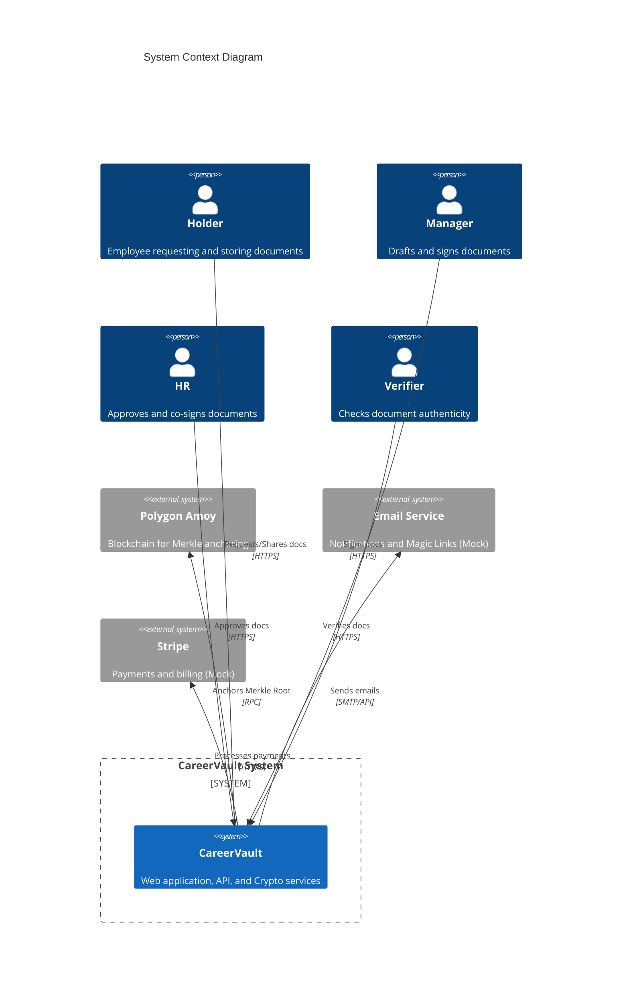
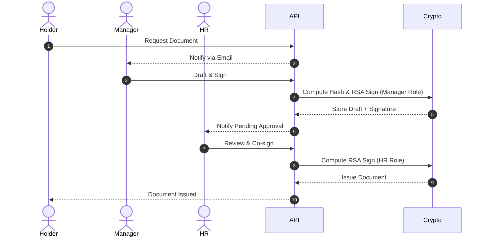
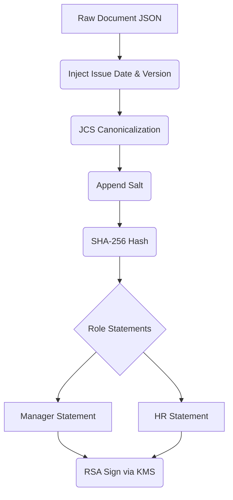
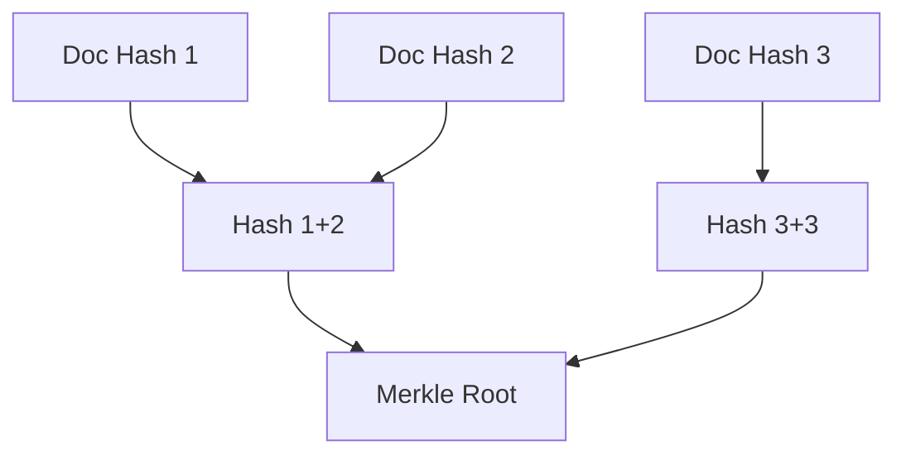
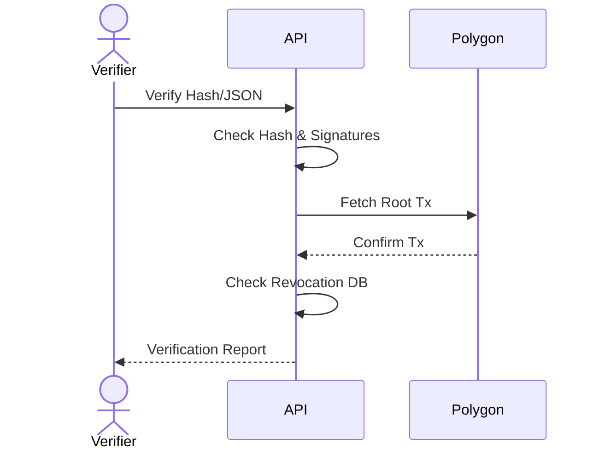
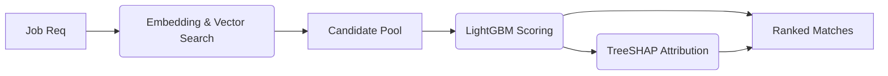
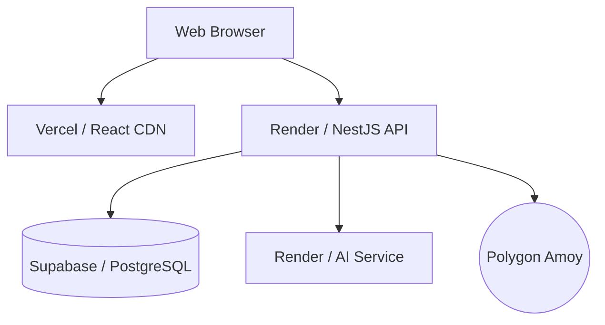

# CareerVault Architecture

This document describes the canonical technical architecture of CareerVault, differentiating the implemented systems from planned future capabilities.

## 1. System Overview
CareerVault is a Web 2.5 career-document verification platform. It allows organizations to issue cryptographically signed, dual-approved career documents. Holders receive a lifelong digital wallet, and third parties can mathematically verify document authenticity via cryptographic signatures and a daily Merkle root anchor on the Polygon blockchain.

## 2. Architectural Principles
- **Web 2.5 Pragmatism:** Keep sensitive data off-chain in a relational database, anchoring only 32-byte cryptographic proofs to the blockchain.
- **Permissionless Verification:** Anyone with the document file can verify its mathematical integrity offline, without relying on CareerVault's uptime.
- **GDPR Compliance by Design:** The cryptographic hashing incorporates a random salt. Deleting the salt instantly severs the link between the user and the immutable blockchain anchor.
- **Separation of Duties:** Issuance strictly requires distinct MANAGER and HR roles, bound cryptographically into the signed payload.

## 3. System Context

## 4. Logical Architecture
The architecture spans four domains:
1. **WEB APPLICATION:** The React SPA, standard REST API, Auth, and RBAC.
2. **CRYPTOGRAPHIC TRUST:** The deterministic hashing, RSA signing, and envelope encryption.
3. **BLOCKCHAIN TRUST:** The Merkle Tree generation and Polygon smart contract anchoring.
4. **AI/XAI:** The Python skill extraction and TreeSHAP ranking service.

## 5. Frontend Architecture
- **Framework:** React 19, Vite, Tailwind CSS 4.
- **State Management:** Redux Toolkit (RTK) + RTK Query for data fetching.
- **UI Components:** Radix UI / shadcn-ui.
- **Auth Flow:** Tri-state (Unauthenticated, Magic-Link JWT, Registered JWT). Access tokens live in memory to prevent XSS.

## 6. Backend Architecture
- **Framework:** NestJS 11 (Node.js/TypeScript).
- **Structure:** Modular architecture separating domains (Auth, Document, Merkle, Verification, AI).
- **Execution:** Stateless horizontal scaling (though rate-limits currently assume a single instance).
- **Data Access:** Prisma ORM generating strict TS types.

## 7. Authentication and Authorization
- **Auth:** JWT-based. `HttpOnly` Secure cookies hold the Refresh Token.
- **RBAC:** Centralized `@Roles` guard enforces `ORG_ADMIN`, `MANAGER`, `HR`, and `RECRUITER` checks against the `organization_members` join table.

## 8. Document Lifecycle

## 9. Cryptographic Architecture
- **Canonicalization:** JCS (RFC 8785) ensures deterministic JSON byte-ordering.
- **Hashing:** `SHA-256(JCS(content) + salt)`.
- **Signatures:** `SHA-256(JCS({v: 1, documentHash, role, memberId}))` signed with the Organization's RSA-2048 key.
- **Storage:** Application Envelope Encryption (R10) encrypts all sensitive DB fields using AES-256-GCM.

## 10. Integrity / Merkle Architecture
A midnight cron job aggregates all `ISSUED` documents, sorts their hashes, and computes a SHA-256 Merkle Tree.
- **Integrity Gate:** Before batching, the system attempts to decrypt and re-hash the document. If it fails (e.g., direct DB tampering), it is skipped.

## 11. Blockchain Architecture
- **Network:** Polygon Amoy testnet.
- **Smart Contract:** `AnchorRegistry.sol`. Exposes `anchorRoot(bytes32 root, uint256 count)`.
- **Mirroring:** (PLANNED) Publishing the root to IPFS and GitHub.

## 12. Verification Architecture
Public verification executes a six-step synchronous check:
1. Document exists in DB.
2. Content integrity (Hash matches).
3. Manager signature validates against `signing_public_key_pem`.
4. HR signature validates.
5. Merkle proof is folded to the root, and the root is confirmed on Polygon.
6. Check for `REVOKED` or `EXPIRED` status.

## 13. AI/XAI Architecture
- **Stack:** Python, FastAPI, LightGBM, TreeSHAP.
- **Extraction:** NLP extracts skills and generates 384-dimensional dense vectors.
- **Ranking:** pgvector fetches candidates; LightGBM scores them.
- **XAI:** TreeSHAP calculates deterministic feature attributions, explaining exactly *why* a candidate ranked high.

## 14. Data Architecture
- **Database:** PostgreSQL 16+.
- **Entities:** 21 tables encompassing Users, Organizations, Members, Documents, Roots, Proofs, Links, Payments, Extracted Skills, and Audit Logs.
- **Data Boundary:** Content lives off-chain. Only meaningless hashes touch the blockchain.

## 15. External Services
- **Polygon (RPC):** Synchronous read/write for anchors.
- **Stripe:** (Mock Driver) Async webhook processing for payments.
- **AWS KMS / Vault:** (Local Mock) Cryptographic signing.
- **AWS SES:** (Console Mock) Transactional emails.

## 16. Asynchronous Processing
- **Queueing:** Handled via `@nestjs/schedule` cron jobs (Midnight Merkle batch, subscription expiry).
- **Future:** BullMQ/Redis is planned for horizontal scaling.

## 17. Security Boundaries
- **Trust Boundary:** The verifier does *not* trust the application blindly for cryptographic integrity. The credential file provides cryptographic proof (signatures, hashes, and Merkle proofs) that the verifier can run locally using `tools/verify-credential`.
- **Web 2.0 Trust Boundary (Organization ↔ Key Binding):** A decentralized/public issuer-key registry is not currently implemented. The system relies on the application's trusted database record (or manual out-of-band verification) to prove that a given public key belongs to the claimed organization.
- **Key Access:** The application server requests signatures from the KMS boundary; it does not read the raw private keys into memory.

## 18. Failure Handling
- **Blockchain Unreachable:** Verification gracefully degrades to `VERIFIED_PENDING_ANCHOR` (checking local signatures but skipping on-chain confirmation).
- **Payment Webhook Failures:** Webhooks are idempotent.

## 19. Scalability Considerations
- **Current:** Single Node.js instance with in-memory rate limiting.
- **Future:** Stateless API servers behind a load balancer, utilizing Redis for distributed rate limits and BullMQ for async Merkle generation.

## 20. Deployment Architecture

## 21. Implemented vs Planned Components

**IMPLEMENTED:**
- Core UI, Auth, and RBAC
- Document Drafting, Signing, and Issuance
- R10 Envelope Encryption & Strict Reads
- JCS Canonicalization and Dual RSA Signatures
- Merkle Tree Generation
- Polygon Amoy Smart Contract Anchoring
- Public API and Offline Verification
- GDPR Salt Erasure
- AI Skill Extraction & LightGBM TreeSHAP

**PLANNED:**
- AWS KMS Integration (Replacing `LocalKmsService`)
- Stripe Integration (Replacing `MockStripeService`)
- Redis / BullMQ (Replacing `@nestjs/schedule` and in-memory limits)
- IPFS / GitHub Merkle Mirrors
- AWS SES Integration

## 22. Known Limitations
- Relying on `LocalKmsService` keeps encrypted private keys on the standard application disk (or Supabase Storage). An attacker compromising the backend could theoretically exfiltrate the keys if they also acquire the `KMS_MASTER_KEY` environment variable.
- Out-of-band verification is required to prove that an Organization's Public Key genuinely belongs to the legal entity.
